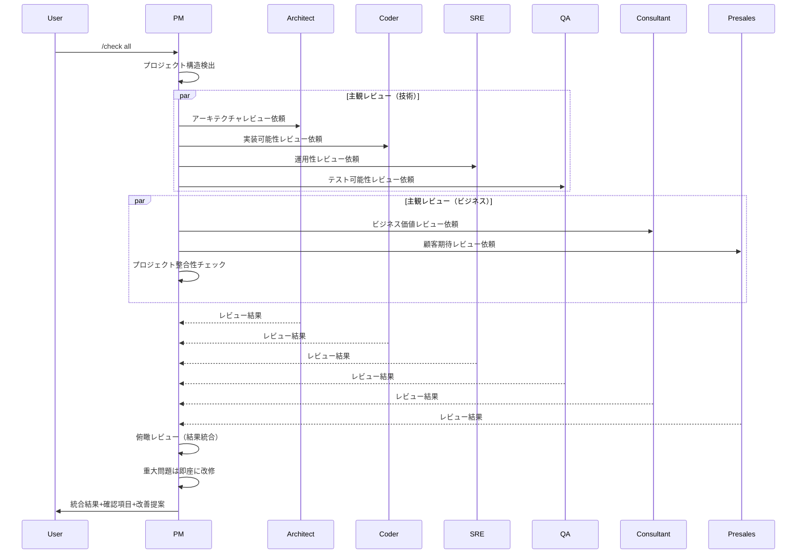

# Check Command - コード品質チェック

## 概要

生成されたファイル（コード、ドキュメント等）の品質をチェックします。

**プロジェクト構造に依存しない汎用的なチェック:**
- 設計書がなくてもチェック可能
- 要件定義書がなくてもチェック可能
- 技術標準ファイルがなくてもチェック可能
- **あるものだけを使ってチェックする**

---

## コマンド一覧

```bash
# 最近生成したファイルをチェック（軽量・高速）
/check

# すべての生成物を一括チェック（深掘り・コスト度外視）
/check all

# 特定のファイルをチェック
/check <file-path>

# 特定のディレクトリ配下をチェック
/check <directory-path>
```

---

## `/check` と `/check all` の違い

### `/check` - 軽量チェック

**目的**: 最近生成したファイルの品質を素早く確認

**特徴**:
- ✅ 高速・軽量（トークン消費を抑える）
- ✅ 基本的な品質チェック
- ✅ 明らかな問題（ハードコード、セキュリティ）を検出
- ⚠️ フェーズ間一貫性チェックは**実施しない**（コスト削減）

**使うタイミング**:
- ファイル生成直後の確認
- 実装中の品質チェック
- 日常的な品質維持

**チェック内容**:
1. 技術標準チェック（基本的な項目のみ）
2. 設計書との整合性チェック（構成・内容）
3. セキュリティチェック（ハードコード禁止等）

### `/check all` - 深掘りチェック

**目的**: プロジェクト全体の品質を徹底的に分析

**特徴**:
- 🔍 **深く深く考える**（コスト度外視）
- 🔍 **フェーズ間の一貫性・トレーサビリティを徹底チェック**
- 🔍 企画→要件→基本設計→詳細設計の流れを完全追跡
- 🔍 矛盾・不整合を検出（予算 vs 性能、納期 vs 技術選定 等）
- 🔍 すべての生成物を一括チェック（15+ファイル）

**使うタイミング**:
- フェーズ完了時（設計完了、実装完了）
- 重要なマイルストーン到達時
- 納品前の最終確認
- プロジェクト全体の健全性チェック

**チェック内容**:
1. **0️⃣ フェーズ間一貫性チェック**（最重要・`/check` では実施しない）
   - 企画書 → 要件定義書の一貫性
   - 要件定義書 → 基本設計書の一貫性
   - 基本設計書 → 詳細設計書の一貫性
   - 矛盾検出（予算 vs 性能、納期 vs 技術選定 等）
2. ユーザー要望チェック
3. 設計書チェック
4. 技術標準チェック（すべての項目）
5. プロジェクト固有規約チェック

**コスト**:
- `/check` の 3〜5倍のトークンを消費
- 重要な局面でのみ使用を推奨

---

### 使い分けの例

| シーン | 推奨コマンド | 理由 |
|--------|------------|------|
| ファイル生成直後 | `/check` | 素早く品質確認 |
| 設計書完成時 | `/check all` | フェーズ間の一貫性確認が必須 |
| 実装中の確認 | `/check` | 日常的な品質維持 |
| 実装完了時 | `/check all` | 設計との整合性を徹底確認 |
| 納品前 | `/check all` | 全体の健全性を保証 |
| 毎日の作業終わり | `/check` | 軽量チェックで問題早期発見 |

---

## チェックの仕組み

### ステップ1: プロジェクト構造の検出

#### 1.1 docs/ ディレクトリの構造確認（最優先）

**重要**: まず `docs/` ディレクトリを探索し、実際にどんなファイル・ディレクトリがあるかを確認します。

**実行するコマンド**:
```bash
# Windowsの場合
dir docs /s /b | findstr "\.md$\|企画書\|要件定義書\|基本設計書\|詳細設計書"

# macOS/Linuxの場合
find docs -type f -name "*.md" -o -type d -name "*企画書*" -o -type d -name "*要件定義書*" -o -type d -name "*基本設計書*" -o -type d -name "*詳細設計書*"
```

**検出パターン**:
- 単一ファイル形式: `docs/01_企画書.md`, `docs/02_要件定義書.md` 等
- ディレクトリ形式: `docs/01_企画書/`, `docs/02_要件定義書/` 等

#### 1.2 参照可能な基準の探索

上記で検出した構造に基づいて、以下を探索します：

```
1. 技術標準ファイルの探索
   → `.claude/docs/40_standards/` があるか？
   → なければ一般的なベストプラクティスを使用

2. 企画書の探索（フェーズ間一貫性チェック用）
   → `docs/01_企画書.md` または `docs/01_企画書/` があるか？
   → なければ「企画書なし」として扱う

3. 要件定義書の探索
   → `docs/02_要件定義書.md` または `docs/02_要件定義書/` があるか？
   → `docs/requirements.md` があるか？
   → なければ「要件定義書なし」として扱う

4. 設計書の探索
   → `docs/03_基本設計書.md` または `docs/03_基本設計書/` があるか？
   → `docs/04_詳細設計書.md` または `docs/04_詳細設計書/` があるか？
   → `README.md` に設計情報があるか？
   → なければ「設計書なし」として扱う

5. プロジェクト固有規約の探索
   → `docs/standards/` があるか？
   → `.eslintrc.json`, `.prettierrc` 等の設定ファイルがあるか？
```

**重要**:
- **単一ファイル形式（`.md`）とディレクトリ形式（`/`）の両方**を検出します
- ディレクトリ形式の場合、配下の `README.md` または `00_概要.md` を参照
- 存在しないファイルは「なし」として扱い、エラーにしません

### ステップ2: チェック基準の決定

**検出された基準のみを使用してチェック**

| 検出されたもの | チェック基準 |
|------------|------------|
| 技術標準 + 設計書 + 要件定義書 | すべて使用（最も厳密） |
| 技術標準 + 設計書 | 技術標準と設計書のみ使用 |
| 技術標準のみ | 技術標準のみ使用 |
| なし | 一般的なベストプラクティスのみ |

### ステップ3: フェーズ間の一貫性チェック（トレーサビリティ）

**重要**: 企画→要件→基本設計→詳細設計の流れで、決定事項が確実に引き継がれているかチェック

**チェック対象:**
1. 企画書で決めた制約事項が要件定義書に記載されているか
2. 要件定義書の非機能要件が基本設計書で対応されているか
3. 基本設計書の技術選定理由が詳細設計書の実装方針に反映されているか
4. フェーズ間で矛盾がないか

**検出方法:**
- 企画書: `docs/01_企画書.md` または `docs/01_企画書/`
- 要件定義書: `docs/02_要件定義書.md` または `docs/02_要件定義書/`
- 基本設計書: `docs/03_基本設計書.md` または `docs/03_基本設計書/`
- 詳細設計書: `docs/04_詳細設計書.md` または `docs/04_詳細設計書/`

**重要**: 単一ファイル形式（`.md`）とディレクトリ形式（`/`）の両方を検出します。

すべて揃っている場合のみ、フェーズ間一貫性チェックを実施。

### ステップ4: チェック実行

検出された基準に基づいてチェック実行

---

## チェック基準（優先順位順）

### 0️⃣ フェーズ間の一貫性（トレーサビリティ）⭐ 最重要

**前提条件:**
- 企画書、要件定義書、基本設計書、詳細設計書がすべて存在する場合のみ

**チェック内容:**

#### A. 企画書 → 要件定義書の一貫性

| 企画書の決定事項 | 要件定義書での詳細化先 | チェック内容 |
|---------------|------------------|------------|
| 予算・納期 | 非機能要件「制約条件」 | 予算制約が要件に記載されているか |
| ターゲットユーザー | 機能要件 | ユーザー特性が機能要件に反映されているか |
| 解決したい課題 | 機能要件 | 課題解決のための機能が要件化されているか |

**チェック例:**
```markdown
✅ 一貫性あり:
- 企画書 1.3節「予算: 月10万円以内」
- 要件定義書 3.1.5節「コスト要件: インフラ月10万円以内」

❌ 不整合:
- 企画書 1.3節「予算: 月10万円以内」
- 要件定義書: コスト要件の記載なし ← 漏れ
```

#### B. 要件定義書 → 基本設計書の一貫性

| 要件定義書の決定事項 | 基本設計書での対応先 | チェック内容 |
|------------------|------------------|------------|
| 機能要件 | システム機能概要 | すべての機能要件が設計に含まれているか |
| 非機能要件（性能） | 性能設計 | レスポンスタイム目標が設計に反映されているか |
| 非機能要件（コスト） | コスト設計 | 予算制約を満たす設計になっているか |
| 非機能要件（セキュリティ） | セキュリティ設計 | セキュリティ要件が設計に反映されているか |
| 制約条件 | 制約事項・前提条件 | 制約が設計の前提条件として記載されているか |

**チェック例:**
```markdown
✅ 一貫性あり:
- 要件定義書 2.1節「ユーザー登録機能」
- 基本設計書 2.2節「システム機能概要」に記載あり
- 基本設計書 7.1節「認証設計」で詳細化

❌ 不整合:
- 要件定義書 3.1.2節「性能要件: レスポンス1秒以内」
- 基本設計書 9.2節「レスポンスタイム目標値」に記載なし ← 漏れ
```

#### C. 基本設計書 → 詳細設計書の一貫性

| 基本設計書の決定事項 | 詳細設計書での対応先 | チェック内容 |
|------------------|------------------|------------|
| アーキテクチャパターン | モジュール設計 | パターンに沿ったモジュール分割になっているか |
| 技術スタック | 実装方針 | 選定した技術が実装方針に明記されているか |
| 性能設計 | シーケンス図・状態遷移図 | 性能要件を満たす処理設計になっているか |
| セキュリティ設計 | エラーハンドリング設計 | セキュリティ考慮がされているか |
| 運用設計 | 監視設計・ログ設計 | 運用要件が詳細化されているか |
| コスト設計 | 実装方針 | コスト制約を考慮したリソース設計か |

**チェック例:**
```markdown
✅ 一貫性あり:
- 基本設計書 4.2.1節「Node.js 20 + Express」
- 詳細設計書 12.5節「技術標準: 42_typescript.md 参照」

❌ 不整合:
- 基本設計書 11.5.1節「月額$95（コスト制約）」
- 詳細設計書 12.2節「ディレクトリ構成」でコスト考慮なし
  （例: 開発環境を夜間停止してコスト削減、の記載がない）
```

#### D. 矛盾チェック

**チェック内容:**

1. **予算 vs 性能のトレードオフ**
   - 企画書: 月10万円以内
   - 要件定義書: 同時接続1000ユーザー
   → コスト試算で矛盾がないか？

2. **納期 vs 技術選定のトレードオフ**
   - 企画書: 4ヶ月でリリース
   - 基本設計書: チーム未経験の技術を選定
   → 学習コストで納期に間に合うか？

3. **セキュリティ要件 vs コスト制約のトレードオフ**
   - 要件定義書: PCI DSS準拠必須
   - 基本設計書: コスト優先でセキュリティ機能削減
   → 矛盾していないか？

**出力例:**
```markdown
⚠️ **フェーズ間の矛盾を検出**

### 矛盾1: コスト制約 vs 性能要件

- 企画書 1.3節: 「予算: 月10万円以内」
- 要件定義書 3.1.2節: 「同時接続1000ユーザー」
- 基本設計書 11.5.1節: 「1000ユーザー対応で月額$450必要」

**問題**: 性能要件を満たすコストが予算を大幅超過（4.5倍）

**ご確認いただきたい点:**

以下のどちらかで対応されますか？

1. **予算を増額**
   - 月10万円 → 月45万円に変更
   - 企画書を更新

2. **性能要件を緩和**
   - 同時接続1000ユーザー → 100ユーザーに変更
   - 要件定義書を更新

3. **段階的な対応**
   - 初期: 100ユーザー（月10万円）
   - 1年後: 1000ユーザーに拡張（予算増額）
```

### 1️⃣ ユーザー要望（最優先）

**参照:**
- `docs/02_要件定義書.md`（存在する場合）
- `docs/requirements.md`（存在する場合）
- `README.md`（存在する場合）

**チェック内容:**
- 機能要件を満たしているか
- 非機能要件を満たしているか

**要件定義書が存在しない場合:**
→ このチェックをスキップ（警告なし）

---

### 2️⃣ 設計書（構成・内容）

**参照:**
- `docs/04_詳細設計書.md` または `docs/04_詳細設計書/`
- `docs/03_基本設計書.md`
- `README.md` の設計情報

#### A. 構成チェック（ドキュメント構造）

**チェック内容:**

1. **ファイル分割の適切性**
   - ドキュメントの内容・セクション構成から、分割が必要かを判断
   - 内容のまとまり、読みやすさ、保守性を重視

2. **必須セクションの存在**
   - 詳細設計書に「## 10. 実装方針」セクションがあるか
   - 実装方針に以下のサブセクションがあるか：
     - 10.1 ファイル分割方針
     - 10.2 ディレクトリ構成
     - 10.3 モジュール分割
     - 10.4 命名規則
     - 10.5 技術標準の適用
     - 10.6 推定行数と分割理由

3. **ドキュメント品質**
   - 図（Mermaid）が含まれているか
   - 具体的な例が記載されているか

**構成チェックの例:**
```
📁 ドキュメント構成チェック

docs/04_詳細設計書.md を確認しました。

**現在の構成:**
- 単一ファイル
- 含まれるセクション: モジュール設計、クラス設計、API仕様書、データベース設計、シーケンス図、状態遷移図、エラーハンドリング設計、ログ設計、実装方針

**ご確認いただきたい点:**

これらのセクションは1ファイルで管理するのが適切でしょうか？

または、内容のまとまりごとに分割を検討されますか？

推奨構成例（セクション別分割）:
docs/04_詳細設計書/
├── README.md              # ナビゲーション
├── 00_概要.md            # はじめに、目的（短いため1ファイル）
├── 01_モジュール設計.md
├── 02_クラス設計.md
├── 03_API仕様書.md
├── 04_データベース設計.md
└── 09_実装方針.md         # 必須

**メリット:**
- セクションごとに独立して編集・レビュー可能
- Git差分が見やすい
- 複数人で並行作業しやすい

参照: .claude/docs/10_facilitation/2.3_設計フェーズ/2.3.6_製造物_詳細設計書構成.md
```

```
❌ 必須セクション不足

「## 10. 実装方針」セクション: 見つかりませんでした

このセクションは必須です。
実装方針がないと、技術標準が守られないコードが生成されます。

推奨アクション:
1. 設計書に「## 10. 実装方針」セクションを追加
2. 以下の内容を記載：
   - ファイル分割方針
   - ディレクトリ構成
   - 推定行数と分割理由
   - 技術標準への参照

参照: .claude/docs/10_facilitation/2.3_設計フェーズ/2.3.7_実装方針設計.md
```

#### B. 内容チェック（実装方針との整合性）

**チェック内容:**
- ファイル分割方針に従っているか
- ディレクトリ構成に従っているか
- 命名規則に従っているか
- 設計書の意図と実装が整合しているか

**設計書が存在しない場合:**
→ 構成・内容チェックの両方をスキップ（警告あり）

**警告メッセージ例:**
```
⚠️ 設計書が見つかりませんでした

設計書があると、以下をチェックできます：
- ドキュメント構成の適切性
- 必須セクションの存在
- ファイル分割方針との整合性
- 実装方針との整合性

推奨アクション:
- 詳細設計書を作成し、「## 10. 実装方針」セクションを追加
- 参照: .claude/docs/10_facilitation/2.3_設計フェーズ/2.3.7_実装方針設計.md
```

---

### 3️⃣ 技術標準

**参照:**
1. プロジェクト内の技術標準（優先）
   - `.claude/docs/40_standards/`

2. 一般的なベストプラクティス（フォールバック）
   - モジュール構成: 責務・内容から適切性を判断
   - セキュリティ: ハードコード禁止、環境変数使用
   - 可読性・保守性: レビュー可能性、変更影響範囲

**チェック内容:**
- ファイル種別に応じた技術標準を適用
- ベストプラクティスに従っているか

**技術標準ファイルが存在しない場合:**
→ 一般的なベストプラクティスでチェック（警告あり）

**警告メッセージ例:**
```
⚠️ プロジェクト固有の技術標準が見つかりませんでした
一般的なベストプラクティスでチェックします。

より厳密なチェックを行うには:
- .claude/docs/40_standards/ に技術標準ファイルを追加
```

---

### 4️⃣ プロジェクト固有規約

**参照:**
- `docs/standards/`
- `.eslintrc.json`, `.prettierrc`, `tsconfig.json` 等の設定ファイル

**チェック内容:**
- プロジェクトで決めた独自ルールに従っているか

**プロジェクト固有規約が存在しない場合:**
→ このチェックをスキップ（警告なし）

---

## チェック対象ファイルと判定基準

### CloudFormation (`*.yaml`, `*.yml`)

#### 基本チェック（常に実施）

| 項目 | 基準 | 判定 |
|------|------|------|
| ハードコード | AWSアカウントID、シークレット禁止 | ❌ エラー |
| パラメータ化 | Environment、ProjectName等 | ⚠️ 警告 |
| タグ | Name、Environment、ManagedBy | ⚠️ 警告 |
| ファイル構成 | 責務・内容から適切性を判断 | ⚠️ 警告 |

#### 技術標準ありの場合（追加チェック）

| 項目 | 基準 | 判定 |
|------|------|------|
| ディレクトリ構造 | stacks/ templates/ parameters/ 構成 | ⚠️ 警告 |
| スタック分割 | ライフサイクル別分割（network/storage/compute） | ⚠️ 警告 |
| 環境差分集約 | parameters/*.json に集約 | ⚠️ 警告 |
| Change Sets | dry-run必須の記載 | ⚠️ 警告 |
| 命名規則 | 技術標準に準拠 | ⚠️ 警告 |
| Well-Architected | 6つの柱への対応 | ⚠️ 警告 |

**構成チェックの例:**
```
📁 CloudFormationディレクトリ構成チェック

現在の構成:
infra/
└── cloudformation/
    ├── network.yaml
    ├── database.yaml
    └── compute.yaml

**ご確認いただきたい点:**

現在の構成で、以下の観点から問題はありませんか？
- 環境差分（dev/prod）の管理はどうされていますか？
- スタック間の依存関係は明確ですか？
- 変更時の影響範囲は把握しやすいですか？

**参考:** 技術標準では以下の構成を推奨していますが、
プロジェクトの状況に応じて判断してください。

推奨構成例（ライフサイクル別分割）:
infra/cloudformation/
├── stacks/              # ライフサイクル別スタック定義
│   ├── network/
│   ├── storage/
│   └── compute/
├── templates/           # 再利用可能テンプレート
└── parameters/          # 環境差分を集約
    ├── dev.json
    └── prod.json

**メリット:**
- スタック分割で変更影響を最小化
- 環境差分が1箇所に集約
- 疎結合・責任分離

参照: .claude/docs/40_standards/45_cloudformation.md
```

#### 設計書ありの場合（追加チェック）

| 項目 | 基準 | 判定 |
|------|------|------|
| ファイル分割方針 | 設計書の方針に準拠 | ❌ エラー |
| 設計意図の整合性 | 設計書と実装の整合性 | ⚠️ 警告 |

---

### Python (`*.py`)

#### 基本チェック（常に実施）

| 項目 | 基準 | 判定 |
|------|------|------|
| ハードコード | APIキー、パスワード禁止 | ❌ エラー |
| モジュール構成 | 責務・内容から適切性を判断 | ⚠️ 警告 |

#### 技術標準ありの場合（追加チェック）

技術標準ファイル (`.claude/docs/40_standards/41_python.md`) に基づく詳細チェック

---

### TypeScript/JavaScript (`*.ts`, `*.tsx`, `*.js`, `*.jsx`)

#### 基本チェック（常に実施）

| 項目 | 基準 | 判定 |
|------|------|------|
| ハードコード | APIキー、シークレット禁止 | ❌ エラー |
| モジュール構成 | 責務・内容から適切性を判断 | ⚠️ 警告 |

#### 技術標準ありの場合（追加チェック）

技術標準ファイル (`.claude/docs/40_standards/42_typescript.md`) に基づく詳細チェック

---

## 出力フォーマット

### `/check` - 基本出力

```markdown
# 📋 品質チェック結果

## 📂 プロジェクト構造の検出

✅ 技術標準: `.claude/docs/40_standards/45_cloudformation.md` を検出
⚠️ 設計書: 見つかりませんでした
⚠️ 要件定義書: 見つかりませんでした

## 🎯 チェック基準

**技術標準のみ**を使用してチェックします。

より厳密なチェックを行うには:
1. 詳細設計書を作成し、「## 10. 実装方針」セクションを追加
2. 要件定義書を作成

---

## ✅ チェック対象ファイル

- `infra/service/03-compute.yaml` (752行)

---

## 1️⃣ ユーザー要望チェック（スキップ）

⚠️ 要件定義書が見つからないため、スキップしました。

---

## 2️⃣ 設計書チェック（スキップ）

⚠️ 設計書が見つからないため、スキップしました。

**設計書があれば以下をチェックできます:**
- ファイル分割方針との整合性
- 推定行数との整合性
- 300行超える理由の説明

---

## 3️⃣ 技術標準チェック

### infra/service/03-compute.yaml

⚠️ **ファイル構成の確認**

このファイルには以下のリソースが含まれています：
- ECS Cluster
- ECS Service
- Task Definition
- ALB (Application Load Balancer)
- Target Group
- Listener
- Security Group
- IAM Role

**ご確認いただきたい点:**

これらのリソースは1ファイルで管理するのが適切でしょうか？

または、以下のような分割を検討されますか？
1. **責務別に分割**
   - `compute.yaml` (親スタック) + `nested/ecs.yaml` + `nested/alb.yaml`
   - メリット: 変更影響の局所化、レビューしやすい

2. **現状のまま1ファイル管理**
   - 設計書を作成し、1ファイル管理とする理由を記載
   - 例: 「ECS関連リソースは密結合のため、1ファイル管理が適切」

**参考**: 標準規約では、メンテナンス性の観点から責務別の分割を推奨していますが、
プロジェクトの状況に応じて判断してください。

参照: .claude/docs/40_standards/45_cloudformation.md

---

✅ **パラメータ化**
- Environment, ProjectName パラメータを使用

✅ **タグ付け**
- すべてのリソースに Name, Environment タグを付与

⚠️ **ハードコードチェック**
- AWSアカウントID、シークレットのハードコードは検出されませんでした

---

## 📊 総合判定

| 基準 | 判定 | 詳細 |
|------|------|------|
| 1️⃣ ユーザー要望 | ⏭️ スキップ | 要件定義書なし |
| 2️⃣ 設計書 | ⏭️ スキップ | 設計書なし |
| 3️⃣ 技術標準 | ⚠️ 警告 | ファイルサイズ超過 |
| 4️⃣ プロジェクト固有規約 | ⏭️ スキップ | 規約なし |

**総合判定: ⚠️ 改善推奨**

---

## 🔧 次のアクション

### 即座に実施すべきこと

1. **ファイル分割の検討**
   - `03-compute.yaml` (752行) を分割

### 今後実施すべきこと

1. **設計書の作成**
   - ファイル分割方針を明記
   - 300行超える場合の理由を記載

2. **要件定義書の作成**（オプション）
   - 機能要件を明記

---

## 💡 参考情報

### 設計書の作成方法

参照: `.claude/docs/10_facilitation/2.3_設計フェーズ/2.3.7_実装方針設計.md`

### 技術標準の詳細

参照: `.claude/docs/40_standards/45_cloudformation.md`
```

---

## `/check all` - 全体チェック出力

```markdown
# 📋 プロジェクト全体品質チェック

## 📂 プロジェクト構造の検出

✅ 企画書: `docs/01_企画書.md` を検出
✅ 要件定義書: `docs/02_要件定義書.md` を検出
✅ 基本設計書: `docs/03_基本設計書.md` を検出
✅ 詳細設計書: `docs/04_詳細設計書.md` を検出
✅ 技術標準: `.claude/docs/40_standards/` を検出

## 🎯 チェック基準

**すべての基準**を使用してチェックします（最も厳密）。

**フェーズ間の一貫性チェック**: ✅ 実施（全ドキュメント揃っているため）

---

## 0️⃣ フェーズ間の一貫性チェック（トレーサビリティ）

### A. 企画書 → 要件定義書

| 企画書の決定事項 | 要件定義書での対応 | 判定 |
|---------------|-----------------|------|
| 予算: 月10万円 | 非機能要件 3.1.5節 コスト要件 | ✅ 対応済み |
| 納期: 4ヶ月 | 非機能要件 3.1.6節 開発期間 | ✅ 対応済み |
| ターゲット: 中小企業 | 機能要件 2.1節 ユーザー特性 | ✅ 対応済み |

**判定**: ✅ 一貫性あり

### B. 要件定義書 → 基本設計書

| 要件定義書の決定事項 | 基本設計書での対応 | 判定 |
|------------------|-----------------|------|
| 機能要件: ユーザー登録 | 2.2節 システム機能概要 | ✅ 対応済み |
| 性能要件: レスポンス1秒以内 | 9.2節 レスポンスタイム目標値 | ✅ 対応済み |
| コスト要件: 月10万円以内 | 11.5.1節 インフラコスト試算 $95 | ✅ 対応済み |
| セキュリティ要件: JWT認証 | 8.1節 認証設計 | ✅ 対応済み |

**判定**: ✅ 一貫性あり

### C. 基本設計書 → 詳細設計書

| 基本設計書の決定事項 | 詳細設計書での対応 | 判定 |
|------------------|-----------------|------|
| アーキテクチャ: マイクロサービス | 2.1節 モジュール設計 | ✅ 対応済み |
| 技術スタック: Node.js + Express | 12.5節 技術標準参照 | ✅ 対応済み |
| 性能設計: キャッシュ戦略 | 6.1節 シーケンス図 | ✅ 対応済み |
| 運用設計: CloudWatch監視 | 10.1節 監視設計 | ✅ 対応済み |
| コスト設計: 夜間停止 | 12.2節 実装方針 | ⚠️ 未対応 |

**判定**: ⚠️ 一部未対応あり

**詳細:**
```
⚠️ コスト最適化戦略が実装方針に反映されていません

- 基本設計書 11.5.3節「短期施策: 開発環境を夜間・休日停止（50%削減）」
- 詳細設計書 12.2節「ディレクトリ構成」に夜間停止の記載なし

**ご確認いただきたい点:**

実装方針に以下を追加されますか？

### 12.7 コスト最適化の実装

**開発環境の夜間停止:**
- EventBridge Rule で毎日 20:00 にECSタスクを停止
- EventBridge Rule で毎日 09:00 にECSタスクを起動
- 土日は終日停止

infra/cloudformation/
└── stacks/
    └── cost-optimization/
        └── schedule-rules.yaml  # 推定80行
```

### D. 矛盾チェック

**チェック結果**: ✅ 矛盾なし

---

## ✅ チェック対象ファイル（15ファイル）

### CloudFormation (6ファイル)
- infra/platform/stack.yaml (214行)
- infra/service/01-network.yaml (245行)
- infra/service/02-database.yaml (352行)
- infra/service/03-compute.yaml (752行) ⚠️

### ドキュメント (6ファイル)
- docs/01_企画書.md
- docs/02_要件定義書.md (824行)
- docs/03_基本設計書.md
- docs/04_詳細設計書.md (1,983行)

### アプリケーション (3ファイル)
- src/index.ts (120行)
- src/services/user.service.ts (180行)
- src/repositories/user.repository.ts (150行)

---

## 📊 チェック結果サマリー

| ファイル種別 | 総数 | ✅ 適合 | ⚠️ 警告 | ❌ エラー |
|------------|------|---------|---------|---------|
| CloudFormation | 6 | 5 | 1 | 0 |
| ドキュメント | 6 | 6 | 0 | 0 |
| TypeScript | 3 | 3 | 0 | 0 |
| **合計** | **15** | **14** | **1** | **0** |

**適合率: 93.3% (14/15)**

---

## ⚠️ 標準規約・設計書との差異

### 1. infra/service/03-compute.yaml

**現状:**
- 設計書の方針: 「ネスト構成に分割」
- 実装: 1ファイル

**ご確認いただきたい点:**

設計書では「ネスト構成に分割」とされていますが、
実装は1ファイルになっています。

以下のどちらで進めますか？

1. **設計書通りにネスト構成に分割**
   - `03-compute.yaml` (親スタック)
   - `nested/ecs.yaml` (ECS Cluster)
   - `nested/alb.yaml` (ALB)
   - メリット: 変更影響の局所化、レビューしやすい

2. **現状のまま（1ファイル）とし、設計書を更新**
   - 設計書の「実装方針」を修正
   - 1ファイル管理とする理由を記載
   - 例: 「ECS関連リソースは密結合のため、1ファイル管理が適切」

**参考**: 設計書の方針は、実装の意図を示す重要な情報です。
実装と設計書が一致していることが、保守性向上につながります。

---

## 🎯 総合判定

| 基準 | 判定 | 詳細 |
|------|------|------|
| 0️⃣ フェーズ間一貫性 | ⚠️ 一部未対応 | 基本設計のコスト最適化が詳細設計に未反映 |
| 1️⃣ ユーザー要望 | ✅ 適合 | すべての機能要件を満たしている |
| 2️⃣ 設計書 | ✅ 適合 | 設計方針に従っている |
| 3️⃣ 技術標準 | ✅ 適合 | 基準を満たしている |
| 4️⃣ セキュリティ | ✅ 適合 | ハードコード、暗号化等すべて適合 |

**総合判定: ⚠️ 改善推奨（フェーズ間一貫性）**

**適合率: 90% (18/20項目)**

---

## 🔧 次のアクション

### 即座に実施すべきこと

1. **03-compute.yaml をネスト構成に分割**
   - 設計書（詳細設計書 3.1節）に記載された方針に従う

### 今後実施すべきこと

なし（他のファイルはすべて適合）
```

---

## `/check <file-path>` - 個別ファイル詳細チェック

特定ファイルの詳細チェック結果を行番号付きで表示

---

## 自動実行

Claude は以下のタイミングで自動的に `/check` を**提案**します：

1. **ファイル生成後**（自動実行はしない）
   - 「生成しました。`/check` で品質確認しますか？」

2. **タスク完了時**（自動実行はしない）
   - 「タスク完了しました。`/check all` で全体確認しますか？」

**重要:** ユーザーが明示的に実行するまで自動実行しません。
レビューは人間が主導すべきです。

---

## オーケストレーションによるダブルチェック（/check all の拡張）

### 設計フェーズ完了時の多角的レビュー

`/check all` 実行時、PM は各サブエージェントに**専門領域のレビュー**を依頼します。

---

### レビュー体制: 主観レビュー + 俯瞰レビュー

#### 【主観レビュー】専門領域の深掘り

**技術的なこと（4名）**:

| レビュアー | 観点 | チェック内容 |
|----------|------|------------|
| **architect** | アーキテクチャ・技術選定の妥当性 | • 技術選定の戦略的妥当性<br/>• ADR（技術選定理由）の明確性<br/>• システム構成図の正確性<br/>• アーキテクチャ設計の整合性 |
| **coder** | 実装可能性・コードレベルの技術評価 | • 実装可能性<br/>• コードレベルの技術課題（環境変数、ログ設計等）<br/>• 開発環境の設計<br/>• 実装時の技術的な落とし穴 |
| **sre** | 運用性・インフラ技術の評価 | • 運用性<br/>• インフラ技術の評価<br/>• 監視・アラート設計<br/>• コスト監視・トラブルシューティング |
| **qa** | テスト可能性・品質保証の技術評価 | • テスト可能性<br/>• 品質保証の技術評価<br/>• 負荷テスト・ロールバックテスト<br/>• 非機能要件の検証方法 |

**ビジネス的なこと（3名）**:

| レビュアー | 観点 | チェック内容 |
|----------|------|------------|
| **consultant** | ビジネス価値・ROI評価 | • ビジネス価値の実現<br/>• ROI（投資対効果）<br/>• ステークホルダー期待管理<br/>• ビジネス課題の解決 |
| **presales** | 顧客期待・提案整合性 | • 顧客期待との整合性<br/>• RFP回答との一致<br/>• 競合差別化<br/>• 追加提案機会 |
| **PM** | プロジェクト管理・全体整合性 | • スケジュール整合性<br/>• 予算整合性<br/>• フェーズ間一貫性<br/>• リスク管理 |

---

#### 【俯瞰レビュー】全体最適

**PM, consultant, presales** が主観レビュー結果を統合し、全体として整合性があるかを判断。

---

### オーケストレーションフロー



---

### PM の統合・判断基準

**即座に改修（重大な問題）**:
- ❌ 技術的な誤り（Mermaid図の誤り、設定不足等）
- ❌ 実装不可能な設計
- ❌ 運用不可能な設計

**ユーザー相談が必要**:
- ⚠️ ビジネス価値に関わる不足（ROI試算、運用工数削減の具体策等）
- ⚠️ 顧客期待に関わる不足（法令準拠、SLA明記等）
- ⚠️ 予算・スケジュールに関わる問題

**改善提案（任意）**:
- 💡 コスト削減提案
- 💡 追加機能提案
- 💡 将来拡張計画

---

## まとめ

### `/check` コマンドの特徴

1. **プロジェクト構造に依存しない**
   - 設計書がなくてもチェック可能
   - 技術標準がなくてもチェック可能
   - あるものだけを使ってチェック

2. **段階的なチェック**
   - 基本チェック（常に実施）
   - 技術標準チェック（技術標準がある場合）
   - 設計書チェック（設計書がある場合）

3. **オーケストレーションによるダブルチェック（/check all）**
   - 主観レビュー: 専門家の深掘り（技術4名、ビジネス3名）
   - 俯瞰レビュー: PM, consultant, presales による全体最適
   - 多角的な評価で品質向上

4. **明確な優先順位**
   - ユーザー要望 > 設計書 > 技術標準
   - 技術標準はガイドライン

5. **人間主導のレビュー**
   - 自動実行しない
   - レビューできる人が使って強力になる

---

**作成日**: 2025-10-21
**更新日**: 2025-10-25（オーケストレーションによるダブルチェック追加、主観・俯瞰レビュー体制追加）
