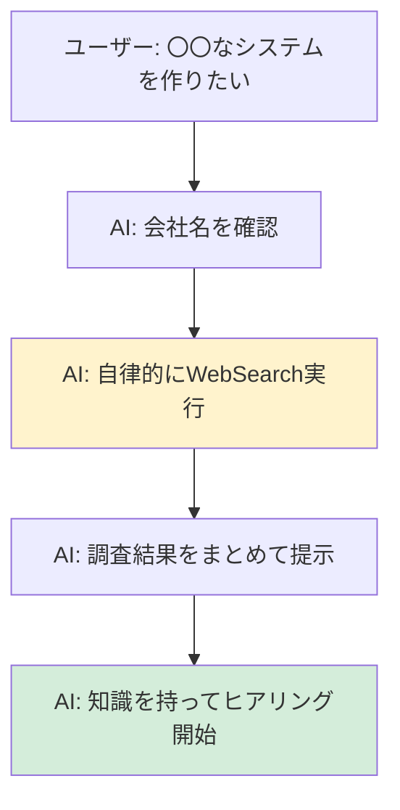
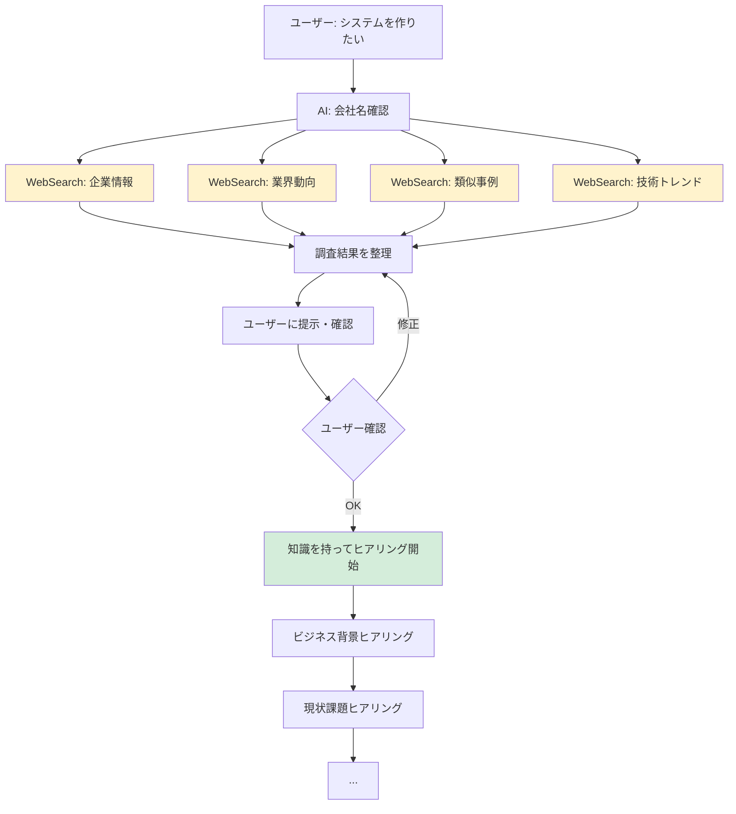

# 2.1.0 事前調査（企画フェーズ）

## 📋 このドキュメントの目的

ユーザーとのヒアリングを始める**前に**、AIが自律的に調査を行い、知識武装してからヒアリングに臨む。

**これがAI開発ファシリテーターの真価** ⭐⭐⭐

---

## 🎯 なぜ事前調査が重要なのか

### AIならではの強み

**人間コンサル:**
- 経験に基づく提案（過去の知識）
- 自分の得意分野に偏る
- 最新情報のキャッチアップに限界

**AIファシリテーター:**
- **WebSearchで常に最新情報を取得**
- **`.claude/docs/40_standards/` で技術標準を参照**
- 両者を融合して最適解を提案
- 業界・事例・トレンドを即座に調査

### 事前調査の効果

**Before（事前調査なし）:**
```
AI: 御社の業種を教えてください
User: 製造業です
AI: ありがとうございます（何も知らない状態）
```

**After（事前調査あり）:**
```
AI: （WebSearchで調査済み）
   御社は自動車部品製造業で、最近電動化対応の新工場を建設されたとのことですね。
   自動車業界ではCASE対応が進んでいますが、御社への影響はいかがですか？

→ ユーザー: 「この人、ちゃんと調べてくれてる！」と信頼感UP
```

---

## 📝 事前調査の実行タイミング

### いつ実行するか

**タイミング:** ユーザーが最初に「〇〇なシステムを作りたい」と言った瞬間

**フロー:**


**重要:** ヒアリングを始める**前に必ず実行**

---

## 🔍 事前調査の項目

### 1. 企業情報調査（WebSearch）

#### 調査内容

```
- 会社名で検索 → 業種、事業内容、規模、拠点
- 最近のニュース、プレスリリース
- IR情報（上場企業の場合）
- 経営方針、DX推進状況
```

#### WebSearch実行例

```
WebSearch: "株式会社〇〇"
WebSearch: "株式会社〇〇 業種"
WebSearch: "株式会社〇〇 ニュース 2025"
WebSearch: "株式会社〇〇 IR"
WebSearch: "株式会社〇〇 DX"
```

#### 記録すべき情報

```markdown
## 企業情報

- **会社名**: 株式会社〇〇
- **業種**: 製造業（自動車部品）
- **従業員数**: 約500名
- **拠点**: 本社（東京）、工場（愛知、福岡）
- **最近のニュース**:
  - 2025年1月: 電動化対応の新工場建設を発表
  - 2024年10月: DX推進室を新設
- **経営方針**:
  - CASE対応の推進
  - 生産性向上30%目標
```

---

### 2. 業界分析（WebSearch）

#### 調査内容

```
- 「〇〇業界 DX事例 2025」で検索
- 業界特有の課題（例: 製造業→人手不足、小売業→EC化）
- 競合他社の取り組み
- 規制・コンプライアンス（例: 金融→金融庁規制、医療→個人情報保護）
```

#### WebSearch実行例

```
WebSearch: "自動車部品業界 DX事例 2025"
WebSearch: "製造業 CASE対応 課題"
WebSearch: "自動車部品 人手不足 対策"
WebSearch: "製造業 DX 成功事例 2025"
```

#### 記録すべき情報

```markdown
## 業界分析

### 自動車部品業界のトレンド（2025年）

- **CASE対応の加速**: 電動化・自動運転への対応が急務
- **人手不足**: 若手人材の確保が困難
- **コスト圧力**: OEMからのコストダウン要求
- **DX推進**:
  - デジタルツイン活用
  - AI活用の品質検査
  - サプライチェーン最適化

### 業界特有の課題

- 多品種少量生産への対応
- 設備の老朽化
- 技能継承の困難

### 競合他社の取り組み

- A社: AI品質検査システムを導入し、検査時間50%削減
- B社: IoTセンサーで設備の予知保全を実現
- C社: RPAで事務作業を自動化し、生産性30%向上
```

---

### 3. 類似システム調査（WebSearch）

#### 調査内容

```
- 「〇〇業界 〇〇システム 構成 2025」で検索
- よくある構成パターン（例: 在庫管理システム → API + DB + フロント）
- 代表的なOSS/SaaS（例: Odoo, ERPNext）
- 概算コスト（例: 「在庫管理システム 開発費用」で検索）
```

#### WebSearch実行例

```
WebSearch: "製造業 生産管理システム 構成 2025"
WebSearch: "製造業 在庫管理システム OSS 2025"
WebSearch: "生産管理システム 開発費用 相場"
WebSearch: "製造業 DX システム構成 事例"
```

#### 記録すべき情報

```markdown
## 類似システム調査

### よくある構成パターン

**生産管理システム:**
- フロントエンド: React / Vue.js
- バックエンド: Python (FastAPI) / Node.js (Express)
- データベース: PostgreSQL / MySQL
- インフラ: AWS (ECS + RDS) / オンプレミス

### 代表的なOSS/SaaS

- **Odoo**: オープンソースERP（生産管理、在庫管理、会計）
- **ERPNext**: オープンソースERP（製造業向け）
- **Asprova**: 生産スケジューラ（商用）

### 概算コスト

- **小規模（50名以下）**: 500万円〜1000万円
- **中規模（100名規模）**: 1000万円〜3000万円
- **大規模（500名以上）**: 3000万円〜1億円

### 開発期間

- **MVP（最小限）**: 3ヶ月
- **フルセット**: 6ヶ月〜12ヶ月
```

---

### 4. 技術トレンド調査（WebSearch）

#### 調査内容

```
- 「2025 〇〇システム トレンド」で検索
- 推奨技術スタック
- アーキテクチャパターン
```

#### WebSearch実行例

```
WebSearch: "2025 生産管理システム 技術トレンド"
WebSearch: "製造業 DX 技術スタック 2025"
WebSearch: "2025 製造業 AI活用事例"
```

#### 記録すべき情報

```markdown
## 技術トレンド（2025年）

### 注目技術

- **AI/機械学習**: 品質検査の自動化、需要予測
- **IoT**: 設備稼働監視、予知保全
- **デジタルツイン**: 製造プロセスのシミュレーション
- **RPA**: 事務作業の自動化

### 推奨技術スタック

- **クラウド**: AWS / Azure（製造業での採用増加）
- **データベース**: PostgreSQL（製造業での実績多数）
- **バックエンド**: Python (FastAPI)（AI連携が容易）
- **フロントエンド**: React（人材確保が容易）
```

---

## 💡 調査結果の活用方法

### 1. 調査結果を提示する

#### Good Example

```
AI: 事前に調査させていただきました。以下の理解で間違いないでしょうか？

【企業情報】
- 業種: 製造業（自動車部品）
- 従業員数: 約500名
- 最近のニュース: 電動化対応の新工場建設

【業界動向】
- 自動車部品業界では、CASE対応が急務となっています
- 人手不足が深刻で、生産性向上が課題です
- AI品質検査やIoT活用が進んでいます

この理解で問題ないですか？
```

#### Bad Example

```
AI: 御社は製造業ですね（調査していない）
```

---

### 2. 業界知識を持ってヒアリング

#### Good Example

```
AI: 自動車部品業界では、最近CASE対応が課題になっているケースが多いですが、
   御社の状況はいかがですか？

   また、A社ではAI品質検査システムを導入して検査時間を50%削減した事例がありますが、
   御社でも品質検査に課題はありますか？
```

#### Bad Example

```
AI: 何か課題はありますか？（漠然としすぎ）
```

---

### 3. 概算コストを提示

#### Good Example

```
AI: 調査したところ、同規模（従業員500名）の製造業での生産管理システム導入費用は、
   概算で1000万円〜3000万円程度が相場のようです。

   御社の予算はどのくらいをご想定ですか？
```

---

### 4. 類似事例を紹介

#### Good Example

```
AI: 同業のB社では、IoTセンサーで設備の予知保全を実現し、
   設備ダウンタイムを30%削減した事例があります。

   御社でも設備の停止時間が課題になっていますか？
```

---

## ✅ 事前調査チェックリスト

### 調査実施チェック

- [ ] 企業名を確認した
- [ ] WebSearchで企業情報を調査した
- [ ] WebSearchで業界動向を調査した
- [ ] WebSearchで類似システム事例を調査した
- [ ] WebSearchで技術トレンドを調査した
- [ ] 調査結果を整理した
- [ ] 調査結果をユーザーに提示した
- [ ] ユーザーの確認を得た

### 調査結果の記録

調査結果は `.claude-state/research-{timestamp}.md` に記録する。

```markdown
# 事前調査結果（企画フェーズ）

**調査日時**: 2025-01-20 10:00

## 企業情報
...

## 業界分析
...

## 類似システム調査
...

## 技術トレンド
...
```

---

## ⚠️ 注意事項

### 1. WebSearchの制約

- **地域制約**: Web検索はUS限定
- **最新情報**: 2025年の情報を優先的に検索
- **情報の正確性**: 必ずユーザーに確認を取る

### 2. 調査結果の扱い

**Good:**
```
AI: 調査した結果、〇〇のようですが、御社の状況はいかがですか？
（確認を取る）
```

**Bad:**
```
AI: 調査した結果、〇〇です（決めつけ）
```

### 3. 調査時間

- 調査は **3〜5分程度** で完了させる
- ユーザーを長時間待たせない
- 必要最低限の情報を効率的に収集

---

## 📊 調査結果のテンプレート

### 調査結果サマリー

```markdown
# 事前調査サマリー

## 企業情報
- 会社名: 株式会社〇〇
- 業種: 〇〇業
- 規模: 従業員〇〇名
- 最近の動向: 〇〇

## 業界分析
- 業界トレンド: 〇〇
- 主要課題: 〇〇
- 競合動向: 〇〇

## 類似システム
- よくある構成: 〇〇
- 代表的なOSS/SaaS: 〇〇
- 概算コスト: 〇〇

## 技術トレンド
- 注目技術: 〇〇
- 推奨スタック: 〇〇
```

---

## 🔄 調査フロー全体像



---

## 📝 まとめ

### 事前調査の本質

**「知識武装してからヒアリングに臨む」**

- WebSearchで最新情報を取得
- 業界トレンドを把握
- 類似事例を調査
- 概算コストを把握

これにより、**ユーザーに「この人、分かってる！」と思わせる**

### AIファシリテーターの真価

**技術標準（`.claude/docs/40_standards/`）+ WebSearch（最新知識）= 最適提案**

- 企画フェーズ: WebSearchで業界・事例を調査
- 要件定義フェーズ: WebSearchで要件テンプレート・事例を調査
- 設計フェーズ: WebSearch + 技術標準で最新技術 + 社内標準
- 実装フェーズ: `.claude/docs/40_standards/` で社内標準に準拠したコード生成
- テスト・納品フェーズ: WebSearch + 技術標準でベストプラクティス

これが「生きた規約」の実現 ⭐⭐⭐

---

**最終更新**: 2025-10-19
**作成者**: Claude (AI開発ファシリテーター)
