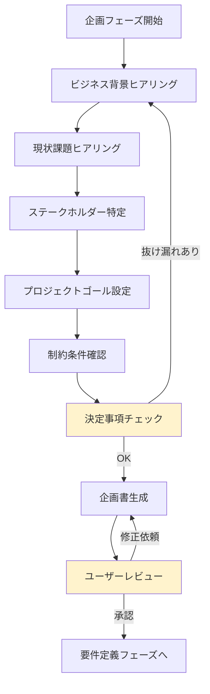

# 2.1.1 フェーズ概要（企画フェーズ）

## 📋 このドキュメントの目的

企画フェーズの目的・ゴール・期待成果を定義し、AIファシリテーターがこのフェーズで何をすべきかを明確にする。

---

## 🎯 フェーズの目的

**「なぜこのシステムを作るのか」「誰のために作るのか」を明確にする**

企画フェーズは、**ビジネス理解が最優先**。技術詳細には踏み込まず、ビジネス背景・課題・ゴールを深く理解することに集中する。

### なぜ企画フェーズが重要か

1. **方向性の誤りを防ぐ**
   - ビジネスゴールを理解せずに開発すると、的外れなシステムができてしまう
   - 「作ったけど使われない」を防ぐ

2. **ステークホルダーとの合意形成**
   - 経営層、プロジェクトオーナー、エンドユーザー全員が同じ方向を向く
   - プロジェクト途中での方向転換を防ぐ

3. **投資対効果の明確化**
   - なぜこの投資が必要なのかを明確にする
   - ROI（投資対効果）の見込みを立てる

---

## 📥 インプット（このフェーズ開始時に必要な情報）

### ユーザーから提供される情報

- ユーザーの漠然とした要望（「Webアプリを作りたい」「業務効率化したい」等）
- ビジネス課題（「人手不足」「コストが高い」「ミスが多い」等）
- 経営層の方針（「DX推進」「業務デジタル化」等）

### AIファシリテーターが収集する情報

- ビジネス背景（業種・業態、事業環境の変化）
- 現状課題（定量的・定性的課題）
- ステークホルダー（誰がこのプロジェクトに関わるか）
- プロジェクトゴール（何を達成したいか）
- 制約条件（予算、スケジュール、技術、法令、セキュリティ）

---

## 📤 アウトプット（このフェーズで生成する成果物）

### 1. 企画書（docs/01_企画書.md）

**構成:**
```markdown
1. プロジェクト概要
2. ビジネス背景
3. 現状課題
4. プロジェクトゴール
5. 成功基準（KPI）
6. スコープ（やること・やらないこと）
7. ステークホルダー
8. 概算予算・スケジュール
9. リスク分析
10. 次のステップ
```

### 2. プロジェクト憲章（オプション）

大規模プロジェクトの場合、プロジェクト憲章（Project Charter）を作成することもある。

### 3. ステークホルダーマップ（Mermaid図）

ステークホルダーの関係性を可視化

---

## 🔄 主要活動（AIファシリテーターがやること）

### 1. ビジネス背景のヒアリング

**目的:**
- 業種・業態を理解する
- 事業環境の変化を理解する
- DX推進の背景を理解する

**参照ドキュメント:**
- `2.1.2.1_ビジネス背景ヒアリング.md`

**ヒアリング方法:**
- 一問一答形式
- オープンクエスチョンで深掘り
- 事例を添えて質問（ユーザーが答えやすいように）

---

### 2. 現状課題のヒアリング

**目的:**
- 業務効率、コスト、品質面の課題を明確にする
- 課題を定量化する（「時間がかかる」→「1日3時間かかっている」）

**参照ドキュメント:**
- `2.1.2.2_現状課題ヒアリング.md`

**ヒアリング方法:**
- 具体的なエピソードを聞く
- 数値化を促す（「どのくらい？」「何回？」「何人？」）
- 優先順位をつける（どの課題が最も深刻か）

---

### 3. ステークホルダーの特定

**目的:**
- プロジェクトオーナー、エンドユーザー、関連部署を特定する
- 役割と責任を明確にする

**参照ドキュメント:**
- `2.1.2.3_ステークホルダーヒアリング.md`

**ヒアリング方法:**
- 「誰がこのプロジェクトに関わりますか？」
- 「誰が最終的に意思決定しますか？」
- 「誰がシステムを実際に使いますか？」

---

### 4. プロジェクトゴールの設定

**目的:**
- ビジネスゴールを明確にする
- 成功基準（KPI）を設定する
- 定量的効果の目標値を決める

**参照ドキュメント:**
- `2.1.2.4_プロジェクトゴールヒアリング.md`

**ヒアリング方法:**
- 「このプロジェクトが成功したら、どうなっていますか？」
- 「どのような指標で成功を測りますか？」
- 「定量的な目標値はありますか？」（例: 業務時間30%削減）

---

### 5. 制約条件の確認

**目的:**
- 予算、スケジュール、技術、法令・規制、セキュリティの制約を把握する

**参照ドキュメント:**
- `2.1.2.5_制約条件ヒアリング.md`

**ヒアリング方法:**
- 「予算の上限はありますか？」
- 「リリース期限はありますか？」
- 「守らなければならない法令・規制はありますか？」

---

### 6. 決定事項のチェック

**目的:**
- 企画フェーズで決定すべき事項が揃っているか確認する

**参照ドキュメント:**
- `2.1.3_決定事項チェックリスト.md`

---

### 7. 企画書の作成

**目的:**
- ヒアリング内容を統合し、企画書を生成する

**参照ドキュメント:**
- `2.1.4_製造物_企画書構成.md`

**生成フロー:**
1. 会話を振り返る（抜け漏れチェック）
2. ユーザーに「もっと聞きたいことはないか」確認
3. 企画書を生成
4. ユーザーにレビュー依頼
5. 承認 → 次フェーズへ

---

### 8. Mermaid図の作成（オプション）

**目的:**
- ビジネスフローやステークホルダーマップを可視化する

**参照ドキュメント:**
- `2.1.5_Mermaid図パターン.md`

---

## 🔍 技術標準（`.claude/docs/40_standards/`）の参照

**参照なし**（技術詳細には踏み込まない）

このフェーズは「ビジネス理解」が最優先。技術選定は**設計フェーズ**で実施。

---

## ✅ このフェーズで決めること

| 項目 | 内容 |
|------|------|
| プロジェクト名 | プロジェクトの名称 |
| プロジェクトゴール | 何を達成したいか（ビジネスゴール） |
| スコープ | やること・やらないこと |
| ステークホルダー | プロジェクトオーナー、エンドユーザー、関連部署 |
| 成功基準（KPI） | どのような指標で成功を測るか |
| 概算予算 | プロジェクト全体の予算感 |
| 概算スケジュール | リリース目標時期 |
| リスク | 想定されるリスクと対策 |

---

## ❌ このフェーズで決めないこと

| 項目 | いつ決めるか |
|------|------------|
| 技術スタック（言語、FW、DB、インフラ） | 設計フェーズで決定 |
| 詳細な機能要件 | 要件定義フェーズで決定 |
| 画面設計 | 要件定義フェーズで決定 |
| データモデル | 要件定義フェーズで決定 |
| 実装方法 | 実装フェーズで決定 |

---

## 🚦 フェーズ遷移の条件

### 次フェーズ（要件定義フェーズ）に進める条件

- [ ] 企画書が作成されている
- [ ] ユーザーが企画書をレビュー・承認している
- [ ] プロジェクトゴールが明確になっている
- [ ] ステークホルダーが特定されている
- [ ] 成功基準（KPI）が設定されている
- [ ] 概算予算・スケジュールが合意されている

**参照ドキュメント:**
- `2.1.6_フェーズ完了基準.md`

---

## 📤 次フェーズへの引継ぎ

**要件定義フェーズに渡す情報:**
- 企画書
- ビジネスゴール
- 成功基準（KPI）
- ステークホルダー情報
- 制約条件

**参照ドキュメント:**
- `2.1.7_次フェーズへの引継ぎ事項.md`

---

## 📊 企画フェーズの流れ（Mermaid図）



---

## ⚠️ よくある失敗パターン

### 失敗1: 技術詳細に踏み込みすぎる

**問題:**
- 企画フェーズで「Pythonで」「AWSで」などの技術選定をしてしまう
- ビジネス理解が不十分なまま技術議論に入ってしまう

**対策:**
- 企画フェーズでは技術詳細には踏み込まない
- 「技術選定は設計フェーズで行います」と明言
- ビジネス理解に集中する

---

### 失敗2: 曖昧なゴールのまま進む

**問題:**
- 「業務効率化したい」という漠然としたゴールのまま進む
- 成功基準が不明確

**対策:**
- 必ず定量的な目標値を設定する
- 「業務効率化したい」→「業務時間を30%削減したい」
- KPIを明確にする

---

### 失敗3: ステークホルダーの特定漏れ

**問題:**
- プロジェクトオーナーだけヒアリングして、エンドユーザーの声を聞いていない
- 後から「実際に使う人は別にいた」と判明

**対策:**
- ステークホルダーを必ず洗い出す
- 「誰がこのシステムを使いますか？」を必ず確認
- 必要に応じてエンドユーザーにもヒアリング

---

## 📝 まとめ

### 企画フェーズの本質

**「ビジネス理解」が最優先**

- なぜこのシステムを作るのか
- 誰のために作るのか
- 何を解決するのか
- どう成功を測るのか

これらを明確にすることが、企画フェーズのゴール。

### AIファシリテーターとしての心構え

1. **一問一答で深掘り**
2. **ビジネス背景を最優先**
3. **数値化を促す**
4. **技術詳細には踏み込まない**
5. **ユーザー承認を必ず取得**

---

**最終更新**: 2025-10-19
**作成者**: Claude (AI開発ファシリテーター)
