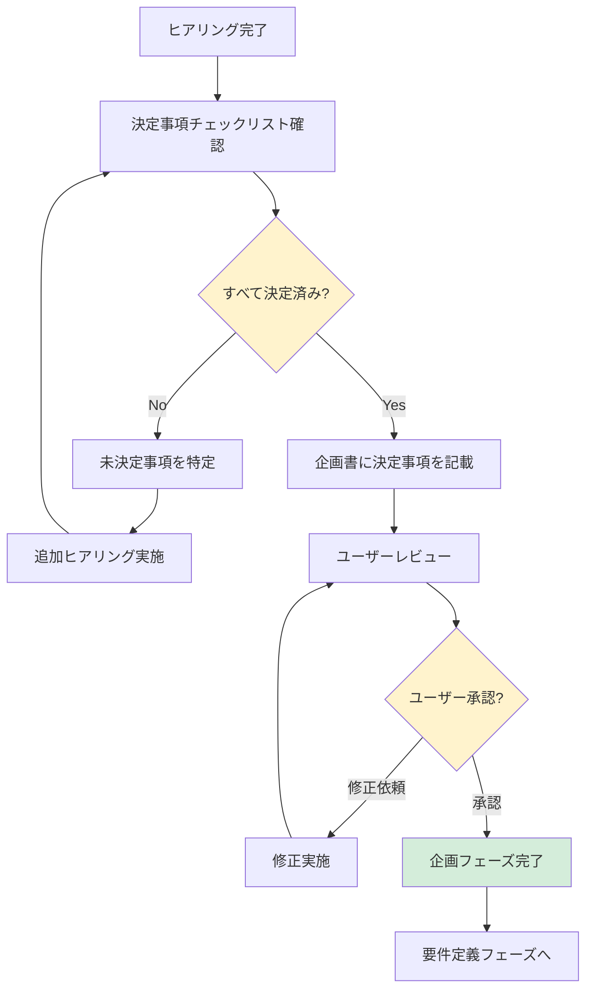

# 2.1.3 決定事項チェックリスト（企画フェーズ）

## 📋 このドキュメントの目的

企画フェーズで**必ず決定すべき事項**を明確化し、抜け漏れを防ぐ。

**重要:** このチェックリストを完了しないと、次フェーズ（要件定義）に進めない。

---

## ✅ 必須決定事項

### 1. プロジェクト名の決定

- [ ] プロジェクト名が決まっている
- [ ] プロジェクト略称が決まっている（システム名として使用）

**Good Example:**
```
プロジェクト名: 営業支援システム刷新プロジェクト
略称: SFA (Sales Force Automation)
```

**Bad Example:**
```
プロジェクト名: 営業のやつ（曖昧）
```

---

### 2. プロジェクトゴールの合意

- [ ] ビジネスゴールが明確になっている
- [ ] 定量的な目標値が設定されている
- [ ] 成功基準（KPI）が合意されている
- [ ] ユーザーの承認を得ている

**Good Example:**
```
【ビジネスゴール】
営業事務作業時間を月40時間から月20時間に削減（50%削減）

【成功基準（KPI）】
- 営業事務作業時間: 月20時間以下
- 測定方法: 営業担当者の作業ログ
- 達成期限: 今年度中（2025年3月末）
```

**Bad Example:**
```
ゴール: 業務効率化する（数値化されていない）
```

---

### 3. スコープ（やること・やらないこと）の決定

- [ ] プロジェクトスコープが明確になっている
- [ ] 「やること」が具体的にリストアップされている
- [ ] 「やらないこと」が明確になっている
- [ ] スコープ外の事項が文書化されている

**Good Example:**
```
【やること】
- 営業日報の入力・管理
- 顧客情報の一元管理
- 営業活動のレポート作成

【やらないこと】
- マーケティング機能（別プロジェクトで実施）
- 経理システムとの連携（フェーズ2で実施）
- スマートフォンアプリ（予算制約のため見送り）
```

**Bad Example:**
```
スコープ: 営業全般を効率化する（範囲が曖昧）
```

---

### 4. ステークホルダーの特定

- [ ] 主要ステークホルダーがすべて特定されている
- [ ] 各ステークホルダーの役割・権限が明確になっている
- [ ] 意思決定者が明確になっている
- [ ] ステークホルダーマップが作成されている

**Good Example:**
```
【ステークホルダー】
- プロジェクトオーナー: 営業部長（予算承認、要件承認）
- 最終意思決定者: CTO（技術選定の最終承認）
- 実際の利用者: 営業担当者15名
- 運用担当: 情報システム部門
- 影響を受ける部門: マーケティング部門（データ連携）
```

**Bad Example:**
```
ステークホルダー: 営業部（誰が何を決めるか不明確）
```

---

### 5. 制約条件の明確化

- [ ] 予算制約が明確になっている
- [ ] 期間制約が明確になっている
- [ ] 技術制約が明確になっている
- [ ] 組織・人的制約が明確になっている
- [ ] ビジネス制約（法規制等）が明確になっている

**Good Example:**
```
【制約条件】
- 予算: 初期開発費500万円（上限）、年間運用費100万円
- 期間: 今年度中（2025年3月末）に稼働開始
- 技術: クラウド禁止（セキュリティポリシー）、オンプレミス必須
- 人的: 社内エンジニアなし、運用は情報システム部門（3名）
- 法規制: 個人情報保護法対応必須
```

**Bad Example:**
```
制約: 予算は少なめで（具体的な数値なし）
```

---

### 6. 概算予算・スケジュールの合意

- [ ] 概算予算が合意されている
- [ ] 概算スケジュールが合意されている
- [ ] 予算・スケジュールに柔軟性があるか確認済み
- [ ] ユーザーの承認を得ている

**Good Example:**
```
【概算予算】
- 初期開発費: 500万円
  - 要件定義: 50万円
  - 設計: 100万円
  - 実装: 250万円
  - テスト: 50万円
  - 納品: 50万円
- 年間運用費: 100万円

【概算スケジュール】
- 企画: 2025年1月（1ヶ月）
- 要件定義: 2025年2月（1ヶ月）
- 設計: 2025年3月（1ヶ月）
- 実装: 2025年4月〜6月（3ヶ月）
- テスト: 2025年7月（1ヶ月）
- 納品: 2025年8月（1ヶ月）
```

**Bad Example:**
```
予算: だいたい500万円くらい（曖昧）
スケジュール: なるべく早く（期限が不明確）
```

---

### 7. リスクの洗い出し

- [ ] プロジェクトリスクが洗い出されている
- [ ] 各リスクの影響度・発生確率が評価されている
- [ ] リスク対策が検討されている
- [ ] リスクオーナーが決まっている

**Good Example:**
```
【リスク一覧】

| リスク | 影響度 | 発生確率 | 対策 | オーナー |
|--------|--------|----------|------|----------|
| 予算超過 | 高 | 中 | MVP方式で段階的実装 | PM |
| 期限遅延 | 高 | 中 | バッファ1ヶ月確保 | PM |
| 要件変更 | 中 | 高 | 変更管理プロセス策定 | 営業部長 |
| 現場の拒否反応 | 高 | 中 | UAT早期実施、段階導入 | 営業部長 |
| 技術者不足 | 中 | 低 | 外部ベンダー活用 | CTO |
```

**Bad Example:**
```
リスク: 何かあるかも（具体性なし）
```

---

## 📝 決定事項の記録方法

### 記録フォーマット

企画書に以下の形式で記録する：

```markdown
## 決定事項

### プロジェクト名
- プロジェクト名: 営業支援システム刷新プロジェクト
- 略称: SFA
- 決定日: 2025-01-20
- 承認者: 営業部長

### プロジェクトゴール
- ビジネスゴール: 営業事務作業時間を月40時間から月20時間に削減
- 成功基準（KPI）: 営業事務作業時間 月20時間以下
- 測定方法: 営業担当者の作業ログ
- 達成期限: 2025年3月末
- 決定日: 2025-01-20
- 承認者: 営業部長

### スコープ
【やること】
- 営業日報の入力・管理
- 顧客情報の一元管理
- 営業活動のレポート作成

【やらないこと】
- マーケティング機能
- 経理システムとの連携
- スマートフォンアプリ

決定日: 2025-01-20
承認者: 営業部長

... (以下同様)
```

---

## 🔄 決定事項チェックの流れ



---

## ⚠️ よくある抜け漏れ

### 1. スコープ外を明確にしていない

**問題:**
```
「やること」だけ決めて、「やらないこと」を決めていない
→ 後から「これもやってほしい」と言われる
```

**対策:**
```
AI: スコープ外（やらないこと）も明確にしておきましょう。
   例えば、以下は今回のスコープ外で良いですか？
   - マーケティング機能
   - スマートフォンアプリ
   - 他システムとの連携
```

---

### 2. 意思決定者が不明確

**問題:**
```
「誰が最終承認するのか」が不明確
→ プロジェクトが進まない
```

**対策:**
```
AI: 以下の意思決定について、誰が最終承認しますか？
   - 予算承認: ?
   - 要件の最終承認: ?
   - 技術選定: ?
   - 本番移行の承認: ?
```

---

### 3. 成功基準が曖昧

**問題:**
```
ゴール: 「業務効率化を実現する」
→ 何をもって成功とするのか不明確
```

**対策:**
```
AI: 成功基準を数値化しましょう。
   どのくらいの改善があれば「成功」と言えますか？
   （例: 作業時間50%削減、コスト30%削減など）
```

---

### 4. リスク対策を検討していない

**問題:**
```
リスクは洗い出したが、対策を考えていない
→ リスクが顕在化した時に対応できない
```

**対策:**
```
AI: 各リスクについて、対策を考えましょう。

   リスク: 予算超過
   対策案: MVP方式で段階的に実装し、最小限の機能から始める

   この対策で問題ないですか？
```

---

## 💡 決定事項チェックのタイミング

### いつチェックするか

**タイミング1: ヒアリング完了後**
```
AI: ヒアリングが完了しました。
   決定事項を確認させてください。

   （チェックリストを1つずつ確認）
```

**タイミング2: 企画書提示前**
```
AI: 企画書を作成する前に、決定事項の抜け漏れがないか
   最終確認させてください。

   （チェックリストを再確認）
```

**タイミング3: ユーザー承認前**
```
AI: 企画書をレビューいただく前に、
   以下の決定事項に間違いがないか確認させてください。

   （決定事項を列挙）
```

---

## ✅ 最終確認チェックリスト

企画書提示前に、以下をすべて確認する：

- [ ] プロジェクト名が決まっている
- [ ] プロジェクトゴールが数値化されている
- [ ] 成功基準（KPI）が合意されている
- [ ] スコープ（やること・やらないこと）が明確
- [ ] ステークホルダーが全員特定されている
- [ ] 意思決定者が明確になっている
- [ ] 制約条件（予算・期間・技術等）が明確
- [ ] 概算予算・スケジュールが合意されている
- [ ] リスクが洗い出され、対策が検討されている
- [ ] すべての決定事項がユーザー承認を得ている

**すべてチェック完了 → 企画書生成へ**

---

## 📊 決定事項サマリーテンプレート

企画書の冒頭に、以下のサマリーを記載する：

```markdown
# 決定事項サマリー

| 項目 | 内容 | 決定日 | 承認者 |
|------|------|--------|--------|
| プロジェクト名 | 営業支援システム刷新プロジェクト（SFA） | 2025-01-20 | 営業部長 |
| ビジネスゴール | 営業事務作業時間を月40時間→月20時間に削減 | 2025-01-20 | 営業部長 |
| 成功基準（KPI） | 営業事務作業時間 月20時間以下 | 2025-01-20 | 営業部長 |
| スコープ | 営業日報、顧客管理、レポート作成 | 2025-01-20 | 営業部長 |
| 予算 | 初期500万円、年間運用100万円 | 2025-01-20 | 営業部長 |
| スケジュール | 2025年8月本番稼働 | 2025-01-20 | 営業部長 |
| 主要リスク | 予算超過、期限遅延、要件変更 | 2025-01-20 | PM |
```

---

## 📝 まとめ

### 決定事項チェックリストの本質

**「抜け漏れを防ぎ、次フェーズへの確実な引き継ぎを保証する」**

- 7つの必須決定事項をすべてチェック
- 曖昧な表現を排除し、具体的に記録
- ユーザー承認を必ず取得
- 決定事項を企画書に明記

これにより、**要件定義フェーズでの手戻りを防ぐ**

### AIファシリテーターとしての心構え

1. **チェックリストを機械的に確認するのではなく、対話の中で自然に確認**
2. **未決定事項があれば、その場で追加ヒアリング**
3. **決定事項はユーザーに復唱して確認**
4. **すべて決定してから企画書を生成**

---

**最終更新**: 2025-10-19
**作成者**: Claude (AI開発ファシリテーター)
