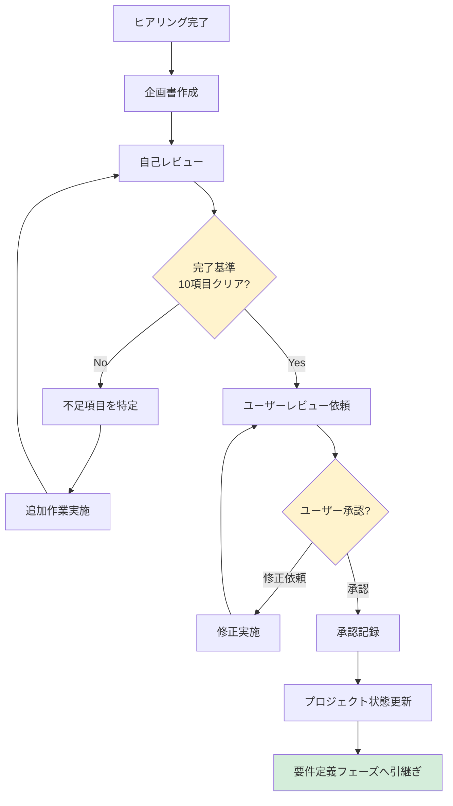

# 2.1.6 フェーズ完了基準（企画フェーズ）

## 📋 このドキュメントの目的

企画フェーズを完了してよい条件を明確化し、不十分な状態で次フェーズに進むことを防ぐ。

**重要:** すべての基準を満たさないと、要件定義フェーズに進めない。

---

## ✅ 必須完了条件

### 1. 企画書が完成している

- [ ] 企画書が標準テンプレートに従って作成されている
- [ ] 全11セクションが記述されている
- [ ] Mermaid図が含まれている（ステークホルダーマップ、Gantt図）
- [ ] ROI計算が記載されている
- [ ] 誤字脱字がない
- [ ] ファイルが適切な場所に保存されている（`docs/01_企画書.md`）

**確認方法:**
```markdown
企画書のセクション確認:
☑ 1. プロジェクト概要
☑ 2. ビジネス背景
☑ 3. 現状の課題
☑ 4. プロジェクトの目的
☑ 5. 期待される効果
☑ 6. ステークホルダー
☑ 7. プロジェクトスコープ
☑ 8. 成功基準（KPI）
☑ 9. 概算予算・スケジュール
☑ 10. リスクと対策
☑ 11. 次のステップ
```

---

### 2. ビジネス背景が明確になっている

- [ ] 事業環境の変化が記載されている
- [ ] 経営方針との整合性が示されている
- [ ] DX推進の背景が説明されている
- [ ] 業界動向が調査されている（WebSearch結果を含む）

**確認方法:**
```
AI: ビジネス背景のセクションに以下が含まれているか確認
   - 事業環境の変化: ✅
   - 経営方針との整合性: ✅
   - 業界動向: ✅
```

---

### 3. 現状課題が定量化されている

- [ ] 課題が具体的に記載されている
- [ ] 課題が数値化されている（時間、金額）
- [ ] 課題の影響が明確になっている
- [ ] 課題の原因が特定されている
- [ ] 放置した場合のリスクが記載されている

**Good Example:**
```
☑ 営業事務作業時間: 月40時間/人
☑ 影響: 月600時間（15名）= 月300万円
☑ 原因: 手作業が多い、データ分散
☑ リスク: 営業担当者の離職率上昇
```

**Bad Example:**
```
✗ 営業事務作業が多い（数値化されていない）
```

---

### 4. プロジェクトゴールが合意されている

- [ ] ビジネスゴールが明確になっている
- [ ] 定量的な目標値が設定されている
- [ ] SMART基準を満たしている
  - Specific（具体的）
  - Measurable（測定可能）
  - Achievable（達成可能）
  - Relevant（関連性がある）
  - Time-bound（期限がある）
- [ ] ユーザーの承認を得ている

**SMART確認:**
```
☑ Specific: 営業事務作業時間を月20時間に削減
☑ Measurable: 作業ログで測定
☑ Achievable: 類似事例で達成実績あり
☑ Relevant: 経営方針「生産性30%向上」に貢献
☑ Time-bound: 今年度中（2025年3月末）
```

---

### 5. スコープが明確になっている

- [ ] 「やること」が具体的にリストアップされている
- [ ] 「やらないこと」が明確になっている
- [ ] スコープ外の理由が記載されている
- [ ] 将来的に検討することが整理されている
- [ ] ユーザーの合意を得ている

**確認方法:**
```
【やること】
☑ 営業日報の入力・管理
☑ 顧客情報の一元管理
☑ レポート作成の自動化

【やらないこと】
☑ マーケティング機能（理由: 別プロジェクト）
☑ スマホアプリ（理由: 予算制約）
```

---

### 6. ステークホルダーが特定されている

- [ ] 主要ステークホルダーがすべて特定されている
- [ ] 各ステークホルダーの役割・権限が明確になっている
- [ ] 意思決定者が明確になっている
- [ ] ステークホルダーマップが作成されている（Mermaid図）
- [ ] 隠れたステークホルダーがいないか確認済み

**確認方法:**
```
ステークホルダー一覧:
☑ 意思決定者: CTO
☑ 予算承認者: 営業部長
☑ 実際の利用者: 営業担当者15名
☑ 運用担当: 情報システム部門
☑ 影響を受ける部門: マーケティング部門

隠れたステークホルダー確認:
☑ 法務部門: 不要
☑ 購買部門: 確認済み
☑ 監査部門: 不要
```

---

### 7. 成功基準（KPI）が合意されている

- [ ] 定量的KPIが設定されている
- [ ] 測定方法が明確になっている
- [ ] 目標値が現実的である
- [ ] 測定タイミングが決まっている
- [ ] 「最低限の成功」「成功」「大成功」の定義がある
- [ ] ユーザーの承認を得ている

**確認方法:**
```
KPI一覧:
☑ 営業事務作業時間: 月40時間 → 月20時間
  測定方法: 作業ログ
  測定タイミング: 導入後3ヶ月

成功の定義:
☑ 最低限の成功: 25%削減
☑ 成功: 50%削減
☑ 大成功: 75%削減
```

---

### 8. 概算予算・スケジュールが合意されている

- [ ] 概算予算が明確になっている
- [ ] 予算の内訳が記載されている
- [ ] 概算スケジュールが明確になっている
- [ ] マイルストーンが設定されている
- [ ] Gantt図が作成されている
- [ ] 予算・スケジュールの柔軟性が確認済み
- [ ] ユーザーの承認を得ている

**確認方法:**
```
予算:
☑ 初期開発費: 500万円（内訳あり）
☑ 年間運用費: 100万円

スケジュール:
☑ 企画: 2025年1月（完了）
☑ 要件定義: 2025年2月
☑ 設計: 2025年3月
☑ 実装: 2025年4月〜6月
☑ テスト: 2025年7月
☑ 納品: 2025年8月

Gantt図: ☑ 作成済み
```

---

### 9. リスクが洗い出されている

- [ ] プロジェクトリスクが洗い出されている
- [ ] 各リスクの影響度・発生確率が評価されている
- [ ] リスク対策が検討されている
- [ ] リスクオーナーが決まっている
- [ ] 上位3つのリスクに対する具体的対策がある

**確認方法:**
```
リスク一覧:
☑ 予算超過（影響度:高、発生確率:中）
  対策: MVP方式で段階的実装
  オーナー: PM

☑ 期限遅延（影響度:高、発生確率:中）
  対策: バッファ1ヶ月確保
  オーナー: PM

☑ 要件変更（影響度:中、発生確率:高）
  対策: 変更管理プロセス策定
  オーナー: 営業部長
```

---

### 10. ユーザー承認を取得している

- [ ] 企画書のレビューが完了している
- [ ] ユーザーからのフィードバックに対応している
- [ ] 最終承認を得ている
- [ ] 承認日・承認者が記録されている
- [ ] 承認の証跡が残っている（メール、議事録等）

**確認方法:**
```
レビュー履歴:
☑ 2025-01-25: 営業部長レビュー → 修正依頼
☑ 2025-01-27: 修正完了 → 営業部長承認
☑ 2025-01-29: CTOレビュー → 承認
☑ 2025-01-30: 経営会議 → 最終承認

承認者:
☑ 営業部長: 田中太郎
☑ CTO: 山田三郎
☑ 承認日: 2025-01-30
```

---

## 🔄 フェーズ完了プロセス



---

## 📊 完了基準チェックシート

### 使用方法

企画書提示前に、以下のチェックシートをすべて確認する。

```markdown
# 企画フェーズ完了基準チェックシート

**プロジェクト名:** 営業支援システム刷新プロジェクト
**チェック日:** 2025-01-27
**チェック者:** Claude (AI)

## 必須完了条件

### 1. 企画書完成
- [x] 標準テンプレートに従っている
- [x] 全11セクション記述済み
- [x] Mermaid図あり
- [x] ROI計算あり
- [x] 誤字脱字なし
- [x] 保存先: docs/01_企画書.md

### 2. ビジネス背景明確化
- [x] 事業環境の変化記載
- [x] 経営方針との整合性記載
- [x] DX推進背景記載
- [x] 業界動向調査済み

### 3. 現状課題定量化
- [x] 課題具体的
- [x] 課題数値化
- [x] 影響明確
- [x] 原因特定
- [x] リスク記載

### 4. プロジェクトゴール合意
- [x] ビジネスゴール明確
- [x] 定量目標設定
- [x] SMART基準満了
- [x] ユーザー承認取得

### 5. スコープ明確化
- [x] やること明確
- [x] やらないこと明確
- [x] 理由記載
- [x] 将来検討事項整理
- [x] ユーザー合意取得

### 6. ステークホルダー特定
- [x] 全員特定済み
- [x] 役割・権限明確
- [x] 意思決定者明確
- [x] マップ作成済み
- [x] 隠れた人確認済み

### 7. 成功基準（KPI）合意
- [x] 定量KPI設定
- [x] 測定方法明確
- [x] 目標値現実的
- [x] 測定タイミング決定
- [x] 成功定義明確
- [x] ユーザー承認取得

### 8. 予算・スケジュール合意
- [x] 予算明確
- [x] 内訳記載
- [x] スケジュール明確
- [x] マイルストーン設定
- [x] Gantt図作成
- [x] 柔軟性確認済み
- [x] ユーザー承認取得

### 9. リスク洗い出し
- [x] リスク洗い出し済み
- [x] 影響度・発生確率評価
- [x] 対策検討済み
- [x] オーナー決定
- [x] 上位3リスク対策あり

### 10. ユーザー承認取得
- [x] レビュー完了
- [x] フィードバック対応
- [x] 最終承認取得
- [x] 承認日・承認者記録
- [x] 証跡あり

## 総合判定

**判定:** ✅ 合格（すべての基準をクリア）

**次のアクション:** 要件定義フェーズへ進む
```

---

## ⚠️ よくある不合格パターン

### 1. ビジネス背景が浅い

**問題:**
```
「業務効率化したい」だけで、経営背景や業界動向が説明されていない
```

**対策:**
```
AI: ビジネス背景をもう少し深掘りさせてください。
   - 経営方針との関連は？
   - 業界でどのような変化が起きている？
   - 競合他社の動向は？
```

---

### 2. 数値化が不十分

**問題:**
```
「作業時間が多い」と記載されているが、具体的な時間が不明
```

**対策:**
```
AI: 現状の作業時間を数値化しましょう。
   - 現在: 月何時間?
   - 目標: 月何時間?
   - 削減率: 何%?
```

---

### 3. スコープ外が不明確

**問題:**
```
「やること」だけ決めて、「やらないこと」を決めていない
```

**対策:**
```
AI: スコープ外も明確にしましょう。
   以下は今回のスコープ外で良いですか？
   - マーケティング機能
   - スマホアプリ
   - 他システム連携
```

---

### 4. リスク対策が不十分

**問題:**
```
リスクは洗い出したが、対策が「検討中」になっている
```

**対策:**
```
AI: 各リスクの対策を具体化しましょう。
   リスク: 予算超過
   対策案: MVP方式で段階的実装、予算管理を週次で実施
```

---

## 📝 まとめ

### フェーズ完了基準の本質

**「不十分な状態で次フェーズに進むことを防ぐ」**

- 10項目の必須条件をすべてクリア
- ユーザー承認を必ず取得
- チェックシートで機械的に確認
- 不合格なら追加作業を実施

これにより、**要件定義フェーズでの手戻りを防ぐ**

### AIファシリテーターとしての心構え

1. **チェックリストを厳密に確認**
2. **不合格項目があれば必ず追加作業**
3. **ユーザー承認なしに次フェーズに進まない**
4. **完了基準を満たしてから企画書を提示**

---

**最終更新**: 2025-10-19
**作成者**: Claude (AI開発ファシリテーター)
