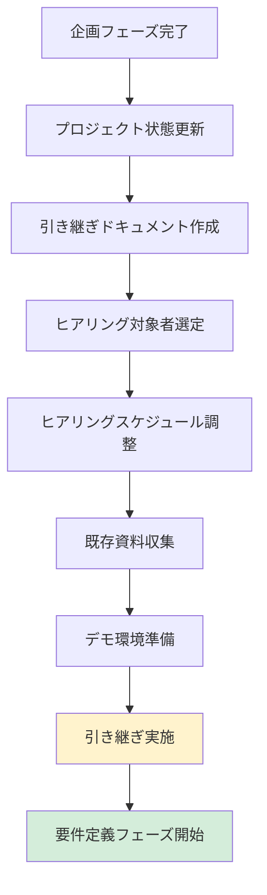

# 2.1.7 次フェーズへの引継ぎ事項（企画フェーズ）

## 📋 このドキュメントの目的

企画フェーズから要件定義フェーズへ、必要な情報を確実に引き継ぐ。

**重要:** 引き継ぎ漏れがあると、要件定義フェーズで手戻りが発生する。

---

## 📦 引き継ぐべき情報リスト

### 1. 企画書（承認済み）

#### 引き継ぎ内容
- **ファイル:** `docs/01_企画書.md`
- **承認日:** 2025-01-30
- **承認者:** 営業部長、CTO、経営会議

#### 確認事項
- [ ] 企画書が承認済みである
- [ ] 承認日・承認者が記録されている
- [ ] 最新版であることを確認した
- [ ] ファイルパスが正しい

---

### 2. プロジェクトゴール

#### 引き継ぎ内容

```markdown
## プロジェクトゴール

### ビジネスゴール
営業事務作業時間を月40時間から月20時間に削減（50%削減）

### 定量的目標
- 営業事務作業時間: 月40時間 → 月20時間
- 顧客訪問時間: 月40時間 → 月60時間
- 営業担当者満足度: 3.2点 → 4.0点以上（5点満点）

### 成功基準（KPI）
- 営業事務作業時間: 月20時間以下
- 測定方法: 営業担当者の作業ログ
- 達成期限: 2025年3月末
```

#### 要件定義フェーズでの活用
- 機能要件の優先順位づけに使用
- 非機能要件の数値目標設定に使用
- ユーザーヒアリング時の前提情報として使用

---

### 3. スコープ

#### 引き継ぎ内容

```markdown
## スコープ

### やること
- 営業日報の入力・管理
- 顧客情報の一元管理
- 営業活動のレポート作成

### やらないこと
- マーケティング機能（別プロジェクト）
- 経理システムとの連携（フェーズ2）
- スマートフォンアプリ（予算制約）

### 将来的に検討
- スマートフォンアプリ対応（フェーズ2）
- AI活用の売上予測（フェーズ3）
```

#### 要件定義フェーズでの活用
- ヒアリング時にスコープを確認
- スコープ外の要望が出た場合の判断基準
- 機能一覧作成時の範囲確認

---

### 4. ステークホルダー情報

#### 引き継ぎ内容

```markdown
## ステークホルダー

| 名前 | 所属 | 役割 | 権限 | 連絡先 |
|------|------|------|------|--------|
| 田中太郎 | 営業部 | 部長 | 予算承認、要件承認 | tanaka@example.com |
| 佐藤花子 | 情報システム部 | 部長 | セキュリティ承認 | sato@example.com |
| 鈴木次郎 | 開発部 | 開発責任者 | 技術選定推薦 | suzuki@example.com |
| 山田三郎 | 経営企画室 | CTO | 最終承認 | yamada@example.com |

### ヒアリング対象者
- 営業担当者: 15名（代表3名をピックアップ）
  - ヘビーユーザー: 1名
  - 通常ユーザー: 1名
  - ライトユーザー: 1名
```

#### 要件定義フェーズでの活用
- ヒアリング対象者の選定
- 承認フローの確認
- コミュニケーション計画の策定

---

### 5. 制約条件

#### 引き継ぎ内容

```markdown
## 制約条件

### 予算制約
- 初期開発費: 500万円（上限）
- 年間運用費: 100万円
- 予算追加: 不可

### 期間制約
- 希望納期: 2025年8月末
- 柔軟性: なし（経営会議で決定済み）

### 技術制約
- クラウド禁止（セキュリティポリシー）
- オンプレミス必須
- Windows Server必須（社内標準）

### 組織・人的制約
- 社内エンジニア: なし
- 運用担当: 情報システム部門（3名、サーバー運用経験あり）

### ビジネス制約
- 個人情報保護法対応必須
- 社内セキュリティポリシー遵守
```

#### 要件定義フェーズでの活用
- 非機能要件の定義時に参照
- 技術選定の制約として認識
- スケジュール策定時の制約として認識

---

### 6. 現状課題（定量化済み）

#### 引き継ぎ内容

```markdown
## 現状課題

### 営業事務作業の負担増大
- 営業日報入力: 月15時間/人
- 顧客情報管理: 月10時間/人
- レポート作成: 月15時間/人
- **合計**: 月40時間/人

### 影響
- 営業担当者15名 × 月40時間 = 月600時間
- 金額換算: 月300万円（年間3,600万円）
- 顧客訪問時間の圧迫

### 原因
- Excelベースの手作業が多い
- 顧客情報が分散している
- レポート作成が手動
```

#### 要件定義フェーズでの活用
- 機能要件のヒアリング時の前提情報
- 現状業務フローの理解
- 改善ポイントの特定

---

### 7. 事前調査結果

#### 引き継ぎ内容

```markdown
## 事前調査結果（企画フェーズ）

### 企業情報
- 業種: 製造業（自動車部品）
- 従業員数: 約500名
- 最近のニュース: 電動化対応の新工場建設

### 業界動向
- CASE対応が急務
- 人手不足が深刻
- AI品質検査やIoT活用が進む

### 類似システム事例
- A社: AI品質検査で検査時間50%削減
- B社: IoT予知保全でダウンタイム30%削減
- C社: RPA導入で生産性30%向上

### 技術トレンド
- AI/機械学習の活用
- IoT活用
- クラウド採用増加
```

#### 要件定義フェーズでの活用
- ヒアリング時の業界知識として活用
- 類似事例を参考に要件を提案
- 技術トレンドを踏まえた提案

---

## 📁 プロジェクト状態の更新

### `.claude-state/project-state.json` の更新

#### 更新内容

```json
{
  "projectName": "営業支援システム刷新プロジェクト",
  "projectAbbreviation": "SFA",
  "currentPhase": "requirements",
  "previousPhase": "planning",
  "status": "ongoing",
  "completedPhases": [
    {
      "phase": "planning",
      "completedAt": "2025-01-30",
      "approver": "営業部長、CTO、経営会議"
    }
  ],
  "currentTasks": [
    "要件定義フェーズの開始準備",
    "ヒアリング対象者の選定",
    "ヒアリングスケジュールの調整"
  ],
  "decisions": {
    "businessGoal": "営業事務作業時間を月40時間から月20時間に削減",
    "scope": {
      "inScope": ["営業日報", "顧客管理", "レポート作成"],
      "outOfScope": ["マーケティング機能", "スマホアプリ"]
    },
    "budget": {
      "initial": 5000000,
      "annual": 1000000
    },
    "schedule": {
      "targetDate": "2025-08-31"
    }
  },
  "stakeholders": [
    {
      "name": "田中太郎",
      "role": "営業部長",
      "authority": "予算承認、要件承認"
    },
    {
      "name": "山田三郎",
      "role": "CTO",
      "authority": "最終承認"
    }
  ],
  "constraints": {
    "budget": "500万円上限",
    "schedule": "2025年8月末",
    "technology": "クラウド禁止、オンプレミス必須"
  },
  "updatedAt": "2025-01-30T18:00:00Z"
}
```

#### 確認事項
- [ ] プロジェクト状態ファイルを更新した
- [ ] currentPhaseを "requirements" に変更した
- [ ] completedPhasesに "planning" を追加した
- [ ] 決定事項を記録した
- [ ] ステークホルダー情報を記録した
- [ ] 制約条件を記録した

---

## 🔄 要件定義フェーズへの準備事項

### 1. ヒアリング対象者の選定

#### 準備内容

```markdown
## ヒアリング対象者

### 営業担当者（3名選定）
- ヘビーユーザー: 佐藤一郎（月訪問件数20件以上）
- 通常ユーザー: 鈴木二郎（月訪問件数10件程度）
- ライトユーザー: 田中三郎（月訪問件数5件以下）

### 選定理由
- 利用頻度の異なるユーザーから幅広く意見を収集
- ヘビーユーザー: 高度な機能要件を把握
- ライトユーザー: シンプルな使い勝手の要望を把握

### ヒアリングスケジュール
- 2025年2月3日（月）10:00-11:00: 佐藤一郎
- 2025年2月3日（月）14:00-15:00: 鈴木二郎
- 2025年2月4日（火）10:00-11:00: 田中三郎
```

#### 確認事項
- [ ] ヒアリング対象者を選定した
- [ ] ヒアリングスケジュールを調整した
- [ ] ヒアリング対象者に事前連絡した
- [ ] ヒアリング目的を説明した

---

### 2. 既存システムの資料収集

#### 収集すべき資料

```markdown
## 既存システム資料

### 営業日報
- 現在の営業日報フォーマット（Excel）
- 入力項目一覧
- 月次レポートのサンプル

### 顧客情報
- 顧客台帳のフォーマット
- 顧客分類方法
- 取引履歴の管理方法

### レポート
- 現在作成しているレポート一覧
- レポートのサンプル
- レポート作成の手順書
```

#### 確認事項
- [ ] 既存システムの資料を収集した
- [ ] 資料を整理した
- [ ] 不足している資料を特定した
- [ ] 資料の入手方法を確認した

---

### 3. 類似システムのデモ環境準備

#### 準備内容

```markdown
## デモ環境

### 目的
ユーザーに具体的なイメージを持ってもらうため、類似システムのデモを準備

### 候補システム
- Odoo（オープンソースERP）: 営業管理機能
- ERPNext（オープンソースERP）: 営業管理機能
- Salesforce（SaaS）: 営業支援機能

### 準備状況
- [ ] Odooのデモ環境構築
- [ ] OdooのSFA機能を試用
- [ ] デモ用のサンプルデータ準備
```

---

## 📝 引き継ぎドキュメントの作成

### 引き継ぎドキュメントのテンプレート

```markdown
# 企画フェーズ → 要件定義フェーズ 引き継ぎ書

**作成日:** 2025-01-30
**作成者:** Claude (AI開発ファシリテーター)

## 1. プロジェクト概要
- プロジェクト名: 営業支援システム刷新プロジェクト
- 略称: SFA
- 承認日: 2025-01-30
- 次フェーズ開始日: 2025-02-01

## 2. 引き継ぎ資料
- 企画書: `docs/01_企画書.md`
- プロジェクト状態: `.claude-state/project-state.json`
- 事前調査結果: `.claude-state/research-2025-01-20.md`

## 3. プロジェクトゴール
（省略: 上記「2. プロジェクトゴール」を参照）

## 4. スコープ
（省略: 上記「3. スコープ」を参照）

## 5. ステークホルダー
（省略: 上記「4. ステークホルダー情報」を参照）

## 6. 制約条件
（省略: 上記「5. 制約条件」を参照）

## 7. 現状課題
（省略: 上記「6. 現状課題」を参照）

## 8. 事前調査結果
（省略: 上記「7. 事前調査結果」を参照）

## 9. 要件定義フェーズでの重点事項
- ヒアリング対象者から詳細な業務フローを聞き出す
- 現状の課題（月40時間の作業内訳）を詳細化
- 「月20時間」を実現するための機能要件を明確化
- 非機能要件（性能、セキュリティ）を数値化

## 10. 未解決事項
- なし（企画フェーズで全て解決済み）

## 11. 備考
- 予算500万円は確定（追加不可）
- 期限2025年8月末は確定（延期不可）
- スコープ外の要望が出た場合は、フェーズ2で検討と説明

## 12. 問い合わせ先
- プロジェクトマネージャー: 〇〇
- 開発責任者: 〇〇
```

---

## ✅ 引き継ぎチェックリスト

### 引き継ぎ実施前チェック

- [ ] 企画書が承認済みである
- [ ] プロジェクト状態ファイルを更新した
- [ ] 引き継ぎドキュメントを作成した
- [ ] ヒアリング対象者を選定した
- [ ] ヒアリングスケジュールを調整した
- [ ] 既存システムの資料を収集した
- [ ] 類似システムのデモ環境を準備した

### 引き継ぎ実施チェック

- [ ] 要件定義フェーズの担当者に引き継ぎ実施（自分自身）
- [ ] 引き継ぎドキュメントを共有した
- [ ] 不明点がないか確認した
- [ ] 次フェーズの開始準備完了を確認した

---

## 🔄 引き継ぎフロー



---

## 📝 まとめ

### 引き継ぎの本質

**「次フェーズで必要な情報を確実に渡す」**

- 企画書（承認済み）
- プロジェクトゴール・スコープ
- ステークホルダー情報
- 制約条件
- 現状課題
- 事前調査結果
- プロジェクト状態の更新

これにより、**要件定義フェーズをスムーズに開始できる**

### AIファシリテーターとしての心構え

1. **引き継ぎ漏れをゼロにする**
2. **プロジェクト状態を必ず更新**
3. **次フェーズの準備を完了させる**
4. **引き継ぎドキュメントを作成**

---

**要件定義フェーズへ進む準備が完了しました！** ✅

---

**最終更新**: 2025-10-19
**作成者**: Claude (AI開発ファシリテーター)
