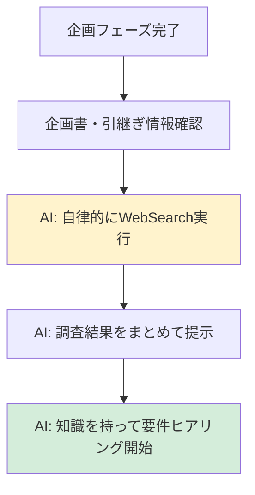
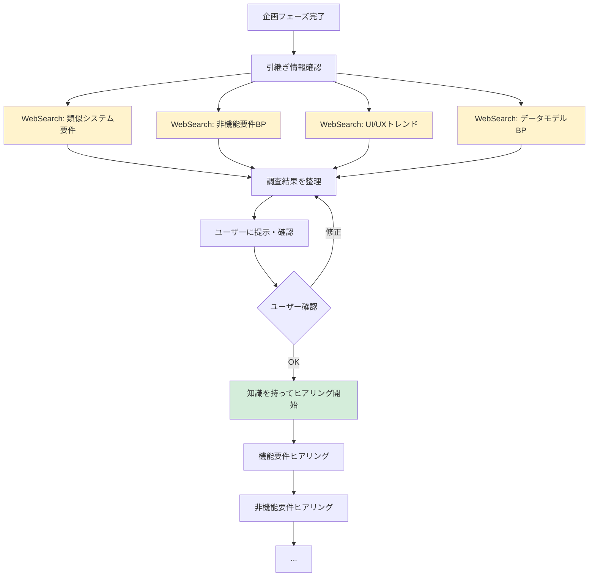

# 2.2.0 事前調査（要件定義フェーズ）

## 📋 このドキュメントの目的

要件定義フェーズを開始する**前に**、AIが自律的に調査を行い、要件ヒアリングの質を高める。

**これがAI開発ファシリテーターの真価** ⭐⭐⭐

---

## 🎯 なぜ事前調査が重要なのか

### 要件定義フェーズでの事前調査の意義

**企画フェーズとの違い:**
- **企画フェーズ**: 業界動向・類似事例の調査（広く浅く）
- **要件定義フェーズ**: 要件テンプレート・具体的な要件事例の調査（狭く深く）

### 事前調査の効果

**Before（事前調査なし）:**
```
AI: 機能要件を教えてください
User: うーん、何が必要かな...
AI: （何も提案できない）
```

**After（事前調査あり）:**
```
AI: （WebSearchで調査済み）
   営業支援システムでは、一般的に以下の機能が必要とされています：
   1. 営業日報管理
   2. 顧客情報管理
   3. 商談管理
   4. 売上予測
   5. レポート・ダッシュボード

   御社ではどの機能が最優先ですか？

→ ユーザー: 「そうですね、1,2,5が必要です」（具体的な回答）
```

---

## 📝 事前調査の実行タイミング

### いつ実行するか

**タイミング:** 企画フェーズ完了後、要件定義フェーズ開始直前

**フロー:**


**重要:** 要件ヒアリングを始める**前に必ず実行**

---

## 🔍 事前調査の項目

### 1. 類似システムの要件調査（WebSearch）

#### 調査内容

```
- 「〇〇システム 要件定義 テンプレート 2025」で検索
- 「〇〇業界 〇〇システム 要件一覧 2025」で検索
- 「〇〇システム 機能一覧 事例」で検索
```

#### WebSearch実行例

```
WebSearch: "営業支援システム 要件定義書 テンプレート 2025"
WebSearch: "SFA CRM 機能一覧 2025"
WebSearch: "製造業 営業管理システム 要件 事例"
WebSearch: "営業日報 顧客管理 必須機能"
```

#### 記録すべき情報

```markdown
## 類似システムの要件調査

### 営業支援システムの一般的な機能要件

#### 1. 営業日報管理
- 訪問記録の登録
- 移動時間の自動計算
- 写真・ファイル添付
- 承認ワークフロー
- 過去履歴参照

#### 2. 顧客情報管理
- 顧客基本情報（会社名、住所、連絡先）
- 担当者情報
- 取引履歴
- 商談履歴
- 顧客分類・タグ付け

#### 3. 商談管理
- 商談ステージ管理
- 見込み額・確度管理
- 商談履歴
- 次回アクション設定

#### 4. レポート・ダッシュボード
- 営業実績レポート
- 売上予測レポート
- 個人別・チーム別実績
- ダッシュボード（グラフ表示）

#### 5. その他よくある機能
- スケジュール管理
- タスク管理
- 目標管理
- データエクスポート
- 権限管理
```

---

### 2. 非機能要件のベストプラクティス調査（WebSearch）

#### 調査内容

```
- 「〇〇システム 非機能要件 チェックリスト 2025」で検索
- 「性能要件 レスポンスタイム 目安」で検索
- 「可用性要件 稼働率 目標値」で検索
```

#### WebSearch実行例

```
WebSearch: "営業支援システム 非機能要件 2025"
WebSearch: "Webシステム レスポンスタイム 目標値"
WebSearch: "業務システム 可用性 99.9%"
WebSearch: "セキュリティ要件 認証 暗号化 2025"
```

#### 記録すべき情報

```markdown
## 非機能要件のベストプラクティス

### 性能要件の一般的な目標値

- **レスポンスタイム**:
  - 画面表示: 3秒以内
  - 検索処理: 5秒以内
  - 帳票出力: 10秒以内

- **スループット**:
  - 同時アクセスユーザー数: 利用者数の10〜20%
  - （例: 利用者100名 → 同時10〜20名）

### 可用性要件の一般的な目標値

- **稼働時間**: 平日9:00-18:00 または 24時間365日
- **目標稼働率**:
  - 業務時間のみ: 99.5%以上
  - 24時間365日: 99.9%以上
- **RTO（目標復旧時間）**: 4時間以内
- **RPO（目標復旧時点）**: 1時間以内

### セキュリティ要件の一般的な要件

- **認証**: ID/パスワード + 多要素認証
- **認可**: ロールベースアクセス制御（RBAC）
- **暗号化**:
  - 転送中: TLS 1.2以上
  - 保管中: AES-256
- **監査ログ**: ログイン、データ更新、削除を記録
```

---

### 3. 画面・UI/UXのトレンド調査（WebSearch）

#### 調査内容

```
- 「〇〇システム UI/UX トレンド 2025」で検索
- 「営業支援システム 画面設計 ベストプラクティス」で検索
- 「ダッシュボード デザイン 2025」で検索
```

#### WebSearch実行例

```
WebSearch: "営業支援システム UI/UX トレンド 2025"
WebSearch: "SFA CRM 画面設計 ベストプラクティス"
WebSearch: "ダッシュボード デザイン 見やすさ"
WebSearch: "業務システム モバイル対応 2025"
```

#### 記録すべき情報

```markdown
## 画面・UI/UXのトレンド

### 2025年のUI/UXトレンド

- **ダッシュボード重視**: 営業実績を一目で把握
- **シンプルなデザイン**: 複雑な機能を隠す
- **レスポンシブ対応**: PC・タブレット対応
- **ダークモード対応**: 目に優しい表示
- **アクセシビリティ**: WCAG 2.1準拠

### よくある画面構成

1. **ダッシュボード（トップ画面）**
   - KPI表示（売上、訪問件数など）
   - グラフ表示
   - 通知・アラート

2. **営業日報入力画面**
   - 簡潔なフォーム
   - 自動入力機能（日時、移動時間など）
   - 過去履歴のコピー機能

3. **顧客情報画面**
   - タブ形式（基本情報、取引履歴、商談履歴）
   - 検索・フィルター機能
   - 一覧表示 + 詳細表示

4. **レポート画面**
   - グラフ表示（棒グラフ、円グラフ、折れ線グラフ）
   - フィルター機能（期間、担当者など）
   - エクスポート機能（Excel、PDF）
```

---

### 4. データモデルのベストプラクティス調査（WebSearch）

#### 調査内容

```
- 「〇〇システム データモデル ER図 事例」で検索
- 「顧客管理 データベース設計」で検索
```

#### WebSearch実行例

```
WebSearch: "営業支援システム データモデル ER図"
WebSearch: "顧客管理 データベース設計 ベストプラクティス"
WebSearch: "SFA CRM データベーススキーマ"
```

#### 記録すべき情報

```markdown
## データモデルのベストプラクティス

### 営業支援システムの典型的なエンティティ

1. **顧客（Customer）**
   - 顧客ID（主キー）
   - 会社名
   - 住所
   - 電話番号
   - 業種
   - 担当者（外部キー: User）

2. **担当者（Contact）**
   - 担当者ID（主キー）
   - 顧客ID（外部キー: Customer）
   - 氏名
   - 部署
   - 役職
   - メールアドレス
   - 電話番号

3. **営業日報（SalesReport）**
   - 日報ID（主キー）
   - 営業担当者ID（外部キー: User）
   - 訪問日時
   - 顧客ID（外部キー: Customer）
   - 訪問内容
   - 次回アクション

4. **商談（Opportunity）**
   - 商談ID（主キー）
   - 顧客ID（外部キー: Customer）
   - 商談名
   - ステージ（見込み、提案、交渉、受注、失注）
   - 見込み額
   - 確度
   - 商談開始日
   - 完了予定日

5. **ユーザー（User）**
   - ユーザーID（主キー）
   - 氏名
   - メールアドレス
   - ロール（管理者、一般ユーザー）
```

---

## 💡 調査結果の活用方法

### 1. 要件ヒアリング時に調査結果を提示

#### Good Example

```
AI: 事前に調査させていただきました。
   営業支援システムでは、一般的に以下の機能が必要とされています：

   【営業日報管理】
   - 訪問記録の登録
   - 移動時間の自動計算
   - 過去履歴参照

   【顧客情報管理】
   - 顧客基本情報
   - 取引履歴
   - 商談履歴

   【レポート・ダッシュボード】
   - 営業実績レポート
   - ダッシュボード

   御社ではどの機能が必要ですか？
```

#### Bad Example

```
AI: 機能要件を教えてください（何も提案しない）
```

---

### 2. 非機能要件の目標値を提案

#### Good Example

```
AI: 性能要件について、一般的な目標値を提案させていただきます。

   【レスポンスタイム】
   - 画面表示: 3秒以内
   - 検索処理: 5秒以内

   【可用性】
   - 稼働時間: 平日9:00-18:00
   - 目標稼働率: 99.5%以上

   この目標値で問題ないですか？
   それとも、より厳しい基準が必要ですか？
```

---

### 3. UI/UXのトレンドを紹介

#### Good Example

```
AI: 画面設計について、2025年のトレンドをご紹介します。

   最近の営業支援システムでは、以下が主流です：
   - ダッシュボード重視（営業実績を一目で把握）
   - シンプルなデザイン
   - レスポンシブ対応（PC・タブレット）

   御社でもこの方向性で問題ないですか？
```

---

### 4. データモデルを提案

#### Good Example

```
AI: データモデルについて、典型的なエンティティを提案します。

   【エンティティ】
   1. 顧客（Customer）
   2. 担当者（Contact）
   3. 営業日報（SalesReport）
   4. 商談（Opportunity）
   5. ユーザー（User）

   この構成で問題ないですか？
   他に必要なエンティティはありますか？
```

---

## ✅ 事前調査チェックリスト

### 調査実施チェック

- [ ] 企画書・引継ぎ情報を確認した
- [ ] WebSearchで類似システムの要件を調査した
- [ ] WebSearchで非機能要件のベストプラクティスを調査した
- [ ] WebSearchで画面・UI/UXのトレンドを調査した
- [ ] WebSearchでデータモデルのベストプラクティスを調査した
- [ ] 調査結果を整理した
- [ ] 調査結果をユーザーに提示する準備をした

### 調査結果の記録

調査結果は `.claude-state/research-requirements-{timestamp}.md` に記録する。

```markdown
# 事前調査結果（要件定義フェーズ）

**調査日時**: 2025-02-01 09:00

## 類似システムの要件調査
...

## 非機能要件のベストプラクティス
...

## 画面・UI/UXのトレンド
...

## データモデルのベストプラクティス
...
```

---

## ⚠️ 注意事項

### 1. 企画フェーズとの違い

**企画フェーズ:**
- 業界動向・類似事例の調査（広く浅く）
- ビジネス背景の理解

**要件定義フェーズ:**
- 要件テンプレート・具体的な要件事例の調査（狭く深く）
- 技術的な詳細の理解

### 2. 調査結果の扱い

**Good:**
```
AI: 一般的には〇〇ですが、御社の状況はいかがですか？
（提案 + 確認）
```

**Bad:**
```
AI: 一般的には〇〇です（押しつけ）
```

### 3. 調査時間

- 調査は **5〜10分程度** で完了させる
- ユーザーを長時間待たせない
- 必要最低限の情報を効率的に収集

---

## 🔄 調査フロー全体像



---

## 📝 まとめ

### 事前調査の本質（要件定義フェーズ）

**「要件ヒアリングの質を高める」**

- WebSearchで類似システムの要件を調査
- 非機能要件のベストプラクティスを把握
- UI/UXのトレンドを調査
- データモデルのベストプラクティスを把握

これにより、**ユーザーに具体的な提案ができる**

### AIファシリテーターの真価

**企画フェーズ（2.1.0）:**
- WebSearchで業界・事例を調査
- ビジネス背景を理解

**要件定義フェーズ（2.2.0）:**
- WebSearchで要件テンプレート・事例を調査
- 具体的な要件を提案

**設計フェーズ（2.3.0）:**
- WebSearch + 技術標準で最新技術 + 社内標準
- 技術選定を提案

**実装フェーズ（2.4.0）:**
- `.claude/docs/40_standards/` で社内標準に準拠したコード生成
- ベストプラクティスを適用

これが「生きた規約」の実現 ⭐⭐⭐

---

**最終更新**: 2025-10-19
**作成者**: Claude (AI開発ファシリテーター)
