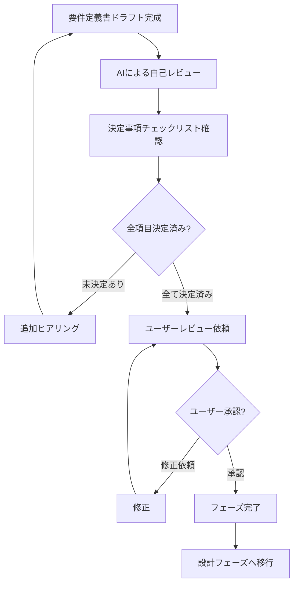
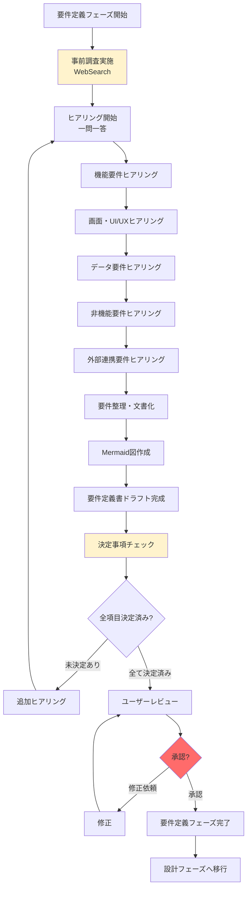

# 2.2.1 フェーズ概要（要件定義フェーズ）

## 📋 このフェーズの目的

企画フェーズで合意した「なぜ作るか」を受けて、**「何を作るか」を明確にする**。

- 機能要件を具体的に定義
- 非機能要件を数値化
- データモデルを設計
- 画面遷移を可視化
- 外部連携仕様を確定

**重要:** このフェーズでは**技術選定はしない**。「何を作るか」に集中する。

---

## 🎯 フェーズのゴール

### このフェーズで決めること

1. **機能要件**
   - システムが提供する機能の一覧
   - 各機能の詳細仕様
   - 優先順位（MoSCoW: Must/Should/Could/Won't）

2. **非機能要件**
   - 性能要件（レスポンスタイム、スループット）
   - 可用性要件（稼働時間、SLA）
   - セキュリティ要件（認証、認可、暗号化）
   - 運用要件（バックアップ、監視、ログ）

3. **データモデル**
   - 管理対象のデータ（エンティティ）
   - データ項目（属性）
   - データ間の関連（リレーション）
   - データ量（件数、サイズ）

4. **画面遷移**
   - 画面一覧
   - 画面遷移フロー
   - 主要画面のイメージ

5. **外部連携仕様**
   - 連携先システム
   - 連携方式（API/ファイル/DB）
   - 連携タイミング
   - 連携データ項目

### このフェーズで決めないこと ⭐

1. **技術スタック**（言語、フレームワーク、データベース、インフラ）
   - → 設計フェーズで決定

2. **詳細なアーキテクチャ**（Clean Architecture、マイクロサービス等）
   - → 設計フェーズで決定

3. **実装方法**（コーディング規約、ディレクトリ構成等）
   - → 実装フェーズで決定

---

## 📥 インプット（このフェーズ開始時に必要な情報）

### 企画フェーズから引き継がれる情報

1. **企画書（承認済み）**
   - プロジェクト概要
   - ビジネス背景
   - 現状の課題
   - プロジェクトの目的
   - 期待される効果

2. **プロジェクトゴール**
   - ビジネスゴール
   - 成功基準（KPI）
   - 定量的効果の目標値

3. **スコープ**
   - やること
   - やらないこと

4. **ステークホルダー情報**
   - プロジェクトオーナー
   - エンドユーザー
   - 関連部署

5. **制約条件**
   - 予算制約
   - スケジュール制約
   - 技術制約（既存システムとの兼ね合い）
   - 法令・規制制約

6. **リスク一覧**
   - 企画フェーズで洗い出されたリスク

### プロジェクト状態

`.claude-state/project-state.json` に記録された現在のプロジェクト状態:

```json
{
  "projectName": "○○システム",
  "currentPhase": "requirements",
  "status": "ongoing",
  "updatedAt": "2025-01-27T10:00:00Z"
}
```

---

## 📤 アウトプット（このフェーズで生成する成果物）

### 1. 要件定義書（メインドキュメント）

**保存先**: `docs/02_要件定義書.md`

**標準目次構成**:
```markdown
# 要件定義書

## 1. はじめに
## 2. プロジェクト概要（企画書から転記）
## 3. 機能要件
### 3.1 機能一覧
### 3.2 機能詳細仕様
## 4. 非機能要件
### 4.1 性能要件
### 4.2 可用性要件
### 4.3 セキュリティ要件
### 4.4 運用要件
## 5. 画面遷移図
## 6. データモデル（ER図）
## 7. 外部連携仕様
## 8. 制約事項
## 9. 用語集
```

### 2. Mermaid図（ビジュアル資料）

**保存先**: `docs/diagrams/`

- 画面遷移図（flowchart）
- ER図（erDiagram）
- システム構成図（概念レベル）（graph TB）
- ユースケース図（graph LR）
- 業務フローシーケンス図（sequenceDiagram）

### 3. プロジェクト状態の更新

**保存先**: `.claude-state/project-state.json`

要件定義フェーズ完了時に更新:
```json
{
  "projectName": "○○システム",
  "currentPhase": "requirements",
  "status": "completed",
  "completedPhases": ["planning", "requirements"],
  "updatedAt": "2025-01-27T16:00:00Z",
  "artifacts": {
    "requirements": "docs/02_要件定義書.md",
    "diagrams": ["docs/diagrams/画面遷移図.md", "docs/diagrams/ER図.md"]
  }
}
```

---

## 🚀 主要活動

### 1. 事前調査（AI自律実行）⭐⭐⭐

**参照ドキュメント**: `2.2.0_事前調査.md`

**WebSearch実施内容**:
- 類似システムの要件事例
- 非機能要件のベストプラクティス
- UI/UXトレンド
- データモデルのベストプラクティス

**記録先**: `.claude-state/research-requirements-{timestamp}.md`

### 2. ヒアリング（一問一答形式）

**参照ドキュメント**:
- `2.2.2_ヒアリング項目定義/` 配下の全ファイル

**ヒアリング順序**:
1. 機能要件ヒアリング（2.2.2.1）
2. 画面・UI/UXヒアリング（2.2.2.2）
3. データ要件ヒアリング（2.2.2.3）
4. 非機能要件ヒアリング（2.2.2.4）
5. 外部連携要件ヒアリング（2.2.2.5）

**ヒアリングの進め方**:
- 一問一答を徹底（1回に1つの質問のみ）
- オープンクエスチョン → クローズドクエスチョン
- ユーザーの回答を復唱して確認
- 曖昧な表現を数値化（「速く」→「3秒以内」）

**詳細**: `2.2.2.6_一問一答の進め方.md` 参照

### 3. 要件整理・文書化

**参照ドキュメント**:
- `2.2.4_製造物_要件定義書構成.md` - 要件定義書のテンプレート
- `2.2.5_機能要件の記述方法/` - 機能要件の記述方法
- `2.2.6_非機能要件の記述方法/` - 非機能要件の記述方法

**整理内容**:
- ヒアリング内容を要件定義書の形式に整理
- 機能一覧表作成
- 非機能要件の数値化
- 優先順位付け（MoSCoW）

### 4. 図表化（Mermaid）

**参照ドキュメント**:
- `2.2.7_Mermaid図パターン/` 配下の全ファイル

**作成する図**:
- 画面遷移図
- ER図
- システム構成図（概念レベル）
- ユースケース図
- 業務フローシーケンス図

### 5. レビュー・承認

**参照ドキュメント**:
- `2.2.3_決定事項チェックリスト.md` - 決定すべき事項の確認
- `2.2.8_フェーズ完了基準.md` - 完了条件

**レビューフロー**:


---

## ⚙️ 技術標準（`.claude/docs/40_standards/`）の参照

### 要件定義フェーズでの参照: **なし** ⭐

**理由**:
- このフェーズでは技術選定を行わない
- 「何を作るか」に集中する
- 技術的実現可能性は設計フェーズで検討

### 設計フェーズで参照開始 ⭐⭐⭐

次の設計フェーズで初めて技術標準（`.claude/docs/40_standards/`）を参照:
- 非機能要件を満たす技術スタックの選定
- `.claude/docs/40_standards/45_cloudformation.md`~4.9 の技術標準に準拠した設計

---

## 📊 フェーズの流れ



---

## 🎯 成功のポイント

### 1. 一問一答を徹底

**Good:**
```
AI: このシステムの主要な機能は何ですか？
ユーザー: 営業日報の管理です。
AI: 営業日報では、どのような情報を記録しますか？
```

**Bad:**
```
AI: このシステムの主要な機能は何ですか？また、営業日報ではどのような情報を記録しますか？さらに、どんな帳票が必要ですか？
→ 質問が多すぎてユーザーが疲れる
```

---

### 2. 曖昧さを排除

**Good:**
- 「検索結果は3秒以内に表示される」
- 「同時100ユーザーのアクセスに対応」
- 「月間稼働率99.9%以上」

**Bad:**
- 「速く表示される」
- 「多くのユーザーがアクセスできる」
- 「高い可用性」

---

### 3. 技術詳細に踏み込まない

**Good:**
```
- 「ユーザー認証機能が必要」（要件定義）
→ 設計フェーズで「JWT認証 + OAuth2.0」と決定
```

**Bad:**
```
- 「JWTとOAuth2.0でユーザー認証」（要件定義で技術選定している）
→ 要件定義フェーズでは技術選定しない
```

---

### 4. ユーザー承認を必ず取得

**Good:**
```
AI: 要件定義書をお見せする前に、これまでの会話を振り返らせてください。
- 機能: 営業日報管理、顧客管理、商談管理
- 画面: 8画面
- 非機能要件: レスポンスタイム3秒以内、同時100ユーザー
抜け漏れはございませんか？
```

**Bad:**
```
AI: 要件定義書を作成しました。（いきなり提示）
→ 抜け漏れチェックなし、ユーザーが見落とす可能性
```

---

## 📝 チェックリスト

### フェーズ開始時

- [ ] 企画書を読み込んだ
- [ ] プロジェクトゴールを理解した
- [ ] ステークホルダー情報を確認した
- [ ] 制約条件を確認した
- [ ] 事前調査を実施した（WebSearch）

### ヒアリング中

- [ ] 一問一答を徹底している
- [ ] 曖昧な表現を数値化している
- [ ] 技術詳細に踏み込んでいない
- [ ] ユーザーの回答を復唱して確認している

### 文書化中

- [ ] 機能一覧表を作成した
- [ ] 非機能要件を数値化した
- [ ] 画面遷移図を作成した
- [ ] ER図を作成した
- [ ] 要件定義書の全セクションを記述した

### レビュー・承認前

- [ ] 決定事項チェックリストで全項目を確認した
- [ ] 会話を振り返り、抜け漏れチェックした
- [ ] 曖昧な表現が残っていないか確認した
- [ ] ユーザーに要件定義書を提示した
- [ ] ユーザー承認を取得した

---

## 📚 関連ドキュメント

### 必ず参照

- `2.2.0_事前調査.md` - WebSearchによる事前調査
- `2.2.2_ヒアリング項目定義/` - ヒアリング質問集
- `2.2.3_決定事項チェックリスト.md` - 決定すべき事項
- `2.2.4_製造物_要件定義書構成.md` - 要件定義書テンプレート
- `2.2.8_フェーズ完了基準.md` - 完了条件
- `2.2.9_次フェーズへの引継ぎ事項.md` - 設計フェーズへの引継ぎ

### 必要に応じて参照

- `2.2.5_機能要件の記述方法/` - 機能要件の記述パターン
- `2.2.6_非機能要件の記述方法/` - 非機能要件の記述パターン
- `2.2.7_Mermaid図パターン/` - Mermaid図の記述方法

---

## ⚠️ よくある失敗パターン

### 失敗1: 技術選定してしまう

**Bad:**
```
- 「Python + FastAPI + PostgreSQL + AWS ECS で構築する」
→ 要件定義フェーズでは技術選定しない
```

**Good:**
```
- 「Webアプリケーションとして構築する」
- 「非機能要件: レスポンスタイム3秒以内、同時100ユーザー対応」
→ 設計フェーズで技術選定
```

---

### 失敗2: 曖昧な表現を残す

**Bad:**
```
- 「速く動作すること」
- 「高い可用性」
- 「セキュアであること」
```

**Good:**
```
- 「検索結果は3秒以内に表示されること」
- 「月間稼働率99.9%以上」
- 「ID/パスワード認証 + 多要素認証（SMS）」
```

---

### 失敗3: ユーザー承認を取らずに次フェーズへ

**Bad:**
```
AI: 要件定義書を作成しました。設計フェーズに進みます。
→ ユーザー承認なし
```

**Good:**
```
AI: 要件定義書を作成しました。内容をご確認いただき、承認をお願いします。
ユーザー: 承認します。
AI: ありがとうございます。それでは設計フェーズに進みます。
```

---

## 📈 次のステップ

要件定義フェーズ完了後 → **設計フェーズ（2.3）** へ移行

設計フェーズでは:
- **技術標準（`.claude/docs/40_standards/`）の参照開始** ⭐⭐⭐
- 非機能要件を満たす技術スタックの選定
- アーキテクチャ設計
- データベーススキーマ設計
- API設計

---

**最終更新**: 2025-10-19
**作成者**: Claude (AI開発ファシリテーター)
