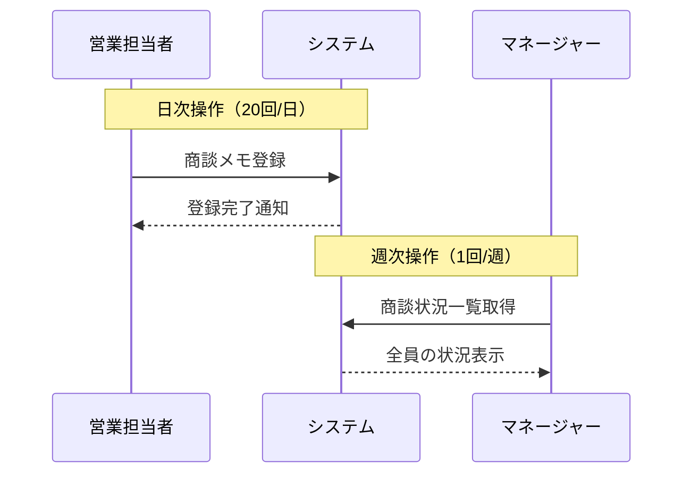
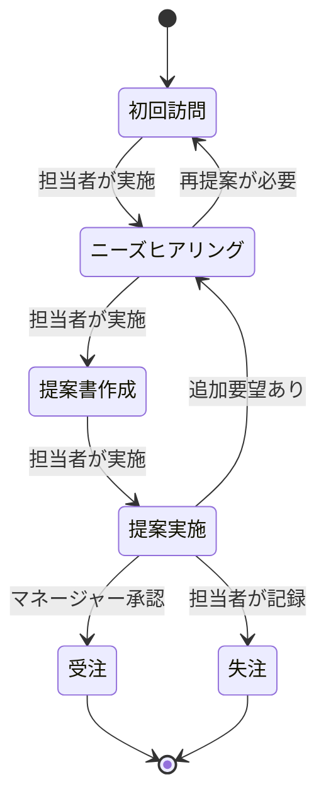
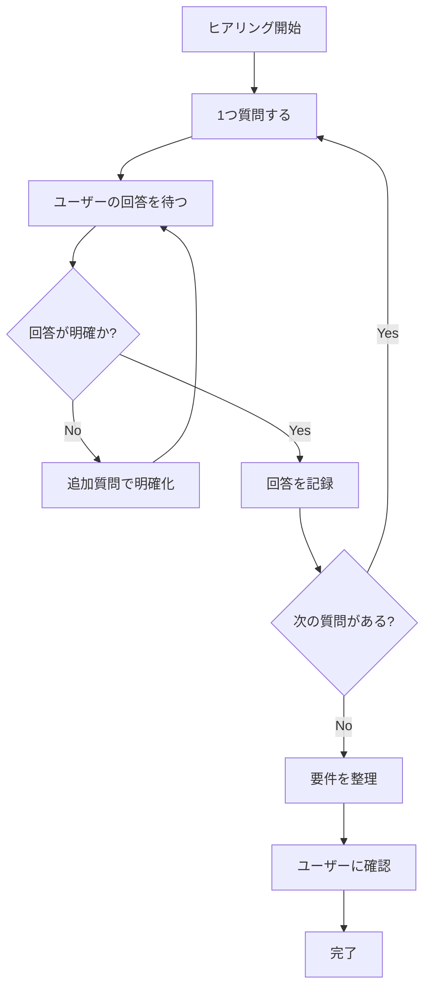

# 2.2.2.1 機能要件ヒアリング項目

## 目的

要件定義フェーズにおいて、**システムが提供すべき機能**を漏れなく引き出すためのヒアリング項目を提供します。

### このドキュメントで得られること

1. 一問一答で機能要件を引き出す質問テンプレート
2. ユーザーストーリー形式での要件整理方法
3. 優先順位付けの支援
4. 抜け漏れ防止のチェックリスト

---

## 📋 ヒアリング項目一覧

### 1. コア機能の特定

#### 1.1 ユーザー視点の価値

```
Q: このシステムを使うユーザーは、何ができるようになりますか?
目的: システムの存在意義を確認
```

**Good Example**:
```
A: 「営業担当者が、顧客情報を即座に検索し、過去の商談履歴を確認しながら、
   最適な提案書を5分で作成できるようになります。」
```

**Bad Example**:
```
A: 「データベースに情報を登録できます。」
理由: ユーザー視点の価値が不明確
```

---

#### 1.2 主要なユースケース

```
Q: 日常的に最も頻繁に行われる操作は何ですか?
目的: 使用頻度の高い機能を優先的に明確化
```

**Good Example**:
```
A: 「1日に20回程度、営業担当者が商談終了後すぐに商談メモを登録します。
   週に1回、マネージャーが全員の商談状況を一覧で確認します。」
```

**ヒアリング時のMermaid図生成**:



---

#### 1.3 ユーザーロール

```
Q: このシステムを使う人の役割は何種類ありますか?
Q: それぞれの役割で、できることは何ですか?
目的: 権限設計の基礎情報を収集
```

**Good Example**:
```
A:
- 営業担当者: 自分の商談情報の登録・更新・閲覧
- マネージャー: 全員の商談情報の閲覧・分析
- 管理者: ユーザー管理・マスタデータ管理
```

**権限マトリクス表形式**:

| 機能 | 営業担当者 | マネージャー | 管理者 |
|------|-----------|-------------|--------|
| 商談登録 | ○ (自分のみ) | × | ○ |
| 商談閲覧 | ○ (自分のみ) | ○ (全員) | ○ |
| ユーザー管理 | × | × | ○ |
| レポート出力 | × | ○ | ○ |

---

### 2. CRUD操作の詳細化

各エンティティ（データのまとまり）について、以下を確認します。

#### 2.1 Create（作成）

```
Q: [エンティティ名]を新規作成する際、どんな情報が必要ですか?
Q: 必須項目と任意項目は何ですか?
Q: 初期値・デフォルト値はありますか?
目的: 入力フォームの項目を明確化
```

**Good Example (商談情報の作成)**:
```
必須項目:
- 顧客名（既存顧客から選択 or 新規入力）
- 商談日
- 営業担当者（ログインユーザーで自動設定）

任意項目:
- 商談メモ
- 受注見込み金額
- 受注予定日

デフォルト値:
- 商談日: 今日の日付
- ステータス: "初回訪問"
```

---

#### 2.2 Read（読み取り）

```
Q: [エンティティ名]を検索・閲覧する際、どんな条件で絞り込みますか?
Q: 一覧表示では、どの情報を表示しますか?
Q: 詳細表示では、どの情報を表示しますか?
目的: 検索機能・一覧画面・詳細画面の仕様を明確化
```

**Good Example (商談情報の検索)**:
```
検索条件:
- 顧客名（部分一致）
- 商談日（範囲指定）
- ステータス（複数選択可）
- 営業担当者（複数選択可）

一覧表示項目:
- 顧客名
- 商談日
- 営業担当者名
- ステータス
- 受注見込み金額

詳細表示項目:
- 上記一覧項目 + 商談メモ全文 + 過去の商談履歴
```

---

#### 2.3 Update（更新）

```
Q: [エンティティ名]を更新できるのは誰ですか?
Q: どの項目を更新できますか?
Q: 更新できない項目はありますか?
Q: 更新履歴は残しますか?
目的: 更新権限・更新可能項目・監査ログの要件を明確化
```

**Good Example**:
```
更新権限:
- 営業担当者: 自分が作成した商談のみ更新可能
- マネージャー: 全員の商談を更新可能

更新可能項目:
- 商談メモ、ステータス、受注見込み金額、受注予定日

更新不可項目:
- 商談ID（自動採番）
- 作成日時、作成者
- 顧客名（変更する場合は新規作成）

更新履歴:
- 更新日時、更新者、更新前後の値を記録
```

---

#### 2.4 Delete（削除）

```
Q: [エンティティ名]を削除できるのは誰ですか?
Q: 削除方法は物理削除ですか、論理削除ですか?
Q: 削除時に確認メッセージを表示しますか?
目的: 削除権限・削除方法を明確化
```

**Good Example**:
```
削除権限:
- 管理者のみ

削除方法:
- 論理削除（削除フラグを立てる）
- データは残し、通常の検索結果には表示しない
- 管理者は削除済みデータも閲覧可能

確認メッセージ:
- 「この商談を削除しますか? この操作は取り消せません。」
- 「はい」「いいえ」の2択
```

---

### 3. 業務フローの確認

#### 3.1 ステップごとの操作

```
Q: この業務は、どんな順序で進みますか?
Q: 各ステップで、誰が何をしますか?
Q: 前のステップに戻ることはありますか?
目的: ワークフロー型機能の仕様を明確化
```

**Good Example (商談フロー)**:



**業務フローの説明**:
```
1. 初回訪問: 営業担当者が商談を登録
2. ニーズヒアリング: 顧客の課題をヒアリング
3. 提案書作成: 提案書をシステム内で作成
4. 提案実施: 顧客に提案
5. 受注 or 失注: マネージャーが承認
```

---

#### 3.2 条件分岐

```
Q: ○○の場合と××の場合で、処理が変わりますか?
Q: その判定条件は何ですか?
目的: 条件分岐ロジックを明確化
```

**Good Example**:
```
Q: 受注見込み金額が1000万円以上の場合、処理が変わりますか?

A: はい。以下のように変わります。
- 1000万円未満: 営業担当者の判断で受注確定可能
- 1000万円以上: マネージャーの承認が必須
```

---

### 4. 外部システム連携

#### 4.1 連携先の確認

```
Q: 他のシステムとデータをやり取りしますか?
Q: どのシステムと、どんなデータを、どのタイミングで連携しますか?
目的: 外部連携要件を明確化
```

**Good Example**:
```
連携先: 会計システム

連携データ:
- 受注情報（顧客名、金額、受注日）

連携タイミング:
- 商談ステータスが「受注」になった時点で即座に連携

連携方式:
- REST API（会計システムが提供）
- 連携失敗時は管理者にメール通知
```

---

#### 4.2 連携エラー時の対応

```
Q: 外部システムとの連携が失敗した場合、どうしますか?
目的: エラーハンドリング要件を明確化
```

**Good Example**:
```
- 自動リトライ: 5分間隔で3回まで
- リトライ失敗後: 管理者にメール通知
- ユーザーへの表示: 「連携処理中です。しばらくお待ちください。」
- 手動リトライ: 管理者画面から可能
```

---

### 5. バッチ処理・定期処理

```
Q: 夜間に実行する処理はありますか?
Q: 定期的に自動実行する処理はありますか?
目的: バッチ処理要件を明確化
```

**Good Example**:
```
処理名: 月次売上集計

実行タイミング: 毎月1日 AM 2:00

処理内容:
- 前月の受注情報を集計
- 営業担当者別、顧客別の売上レポートを生成
- マネージャーにメール送信

処理時間: 約30分（10万件の商談データを処理）
```

---

### 6. 通知・アラート

```
Q: ユーザーに通知する必要がある場面はありますか?
Q: 通知方法は何ですか?（メール、画面内通知、プッシュ通知など）
目的: 通知要件を明確化
```

**Good Example**:
```
通知シーン1: 商談が1週間以内に受注予定日を迎える

通知先: 営業担当者

通知方法:
- メール（毎朝9時に一斉送信）
- 画面内通知（ログイン時に表示）

通知内容:
「【リマインド】○○社の商談が3日後に受注予定日を迎えます。」
```

---

### 7. レポート・集計

```
Q: どんなレポートが欲しいですか?
Q: どんな軸で集計しますか?
Q: どの期間で集計しますか?
目的: レポート機能の要件を明確化
```

**Good Example**:
```
レポート名: 月次売上レポート

集計軸:
- 営業担当者別
- 顧客別
- 商品カテゴリ別

集計期間:
- 当月、前月、前年同月（比較可能）

表示形式:
- 棒グラフ（営業担当者別）
- 円グラフ（商品カテゴリ別）
- テーブル（顧客別の詳細）

出力形式:
- PDF、Excel
```

---

## 🎯 ヒアリングの進め方

### 一問一答の原則



### ヒアリングの順序

1. **大枠から詳細へ**
   - まずコア機能を特定
   - 次に各機能の詳細を掘り下げ

2. **頻度の高いものから**
   - 日常的に使う機能を優先
   - 年1回の機能は後回し

3. **ユーザーの関心に沿う**
   - ユーザーが重視する機能を優先
   - 技術的な詳細は後で確認

---

## ✅ 機能要件ヒアリング完了チェックリスト

### 基本機能
- [ ] コア機能が特定できている
- [ ] 主要なユースケースが明確
- [ ] ユーザーロールと権限が定義されている

### CRUD操作
- [ ] 各エンティティのCRUD操作が明確
- [ ] 必須項目・任意項目が定義されている
- [ ] 検索条件が明確

### 業務フロー
- [ ] 業務の流れが整理されている
- [ ] ステータス遷移が明確
- [ ] 条件分岐が定義されている

### その他
- [ ] 外部連携要件が明確（該当する場合）
- [ ] バッチ処理要件が明確（該当する場合）
- [ ] 通知要件が明確（該当する場合）
- [ ] レポート要件が明確（該当する場合）

---

## 🚨 よくある失敗パターン

### ❌ 一度に複数の質問をする

**Bad Example**:
```
Q: ユーザーロールは何種類ありますか?
   それぞれの権限は?
   ユーザー登録は誰がやりますか?
   パスワードポリシーは?
```

**理由**: ユーザーが混乱し、一部の質問に答え忘れる

**Good Example**:
```
Q: ユーザーロールは何種類ありますか?
（回答を待つ）

Q: では、営業担当者ロールでできることは何ですか?
（回答を待つ）

...
```

---

### ❌ 技術用語を使いすぎる

**Bad Example**:
```
Q: RESTful APIでCRUD操作を実装する際、
   べき等性を担保するためにPUTとPATCHをどう使い分けますか?
```

**理由**: 非エンジニアのユーザーには理解困難

**Good Example**:
```
Q: 顧客情報を更新する際、どの項目を変更できますか?
```

---

### ❌ 抽象的な質問

**Bad Example**:
```
Q: システムに求める機能は何ですか?
```

**理由**: 範囲が広すぎて答えにくい

**Good Example**:
```
Q: 営業担当者が日常的に最も頻繁に行う作業は何ですか?
```

---

## 📚 次のステップ

機能要件のヒアリングが完了したら:

1. **2.2.2.2 画面・UI/UXヒアリング項目.md** へ進む
2. 画面構成・画面遷移を具体化
3. ユーザー体験の詳細を詰める

---

## 関連ドキュメント

- [2.2.1 フェーズ概要](./2.2.1_フェーズ概要.md) - 要件定義フェーズ全体の流れ
- [2.2.5.1 機能一覧表フォーマット](./2.2.5.1_機能一覧表フォーマット.md) - ヒアリング結果の記述方法
- [2.2.5.2 ユースケース記述方法](./2.2.5.2_ユースケース記述方法.md) - ユースケースの書き方
- [2.2.7.4 ユースケース図パターン](./2.2.7.4_ユースケース図パターン.md) - ユースケース図の書き方

---

**作成日**: 2025-10-19
**対象フェーズ**: 要件定義
**重要度**: ⭐⭐⭐ 必須
