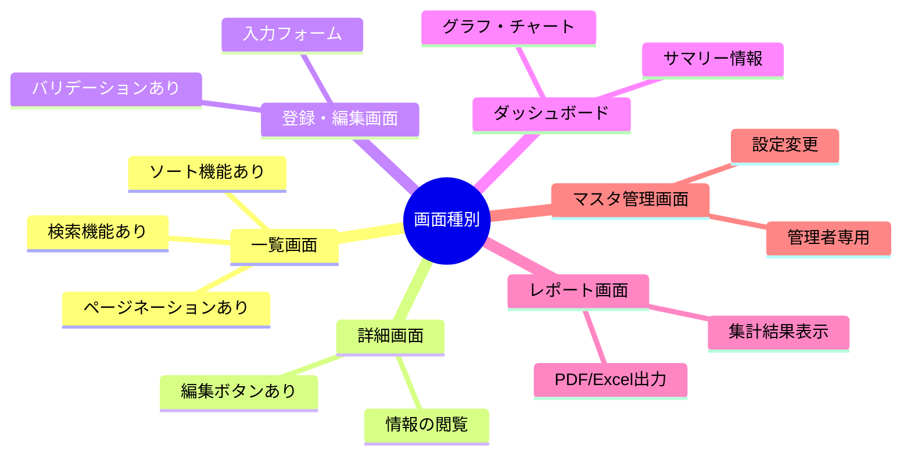
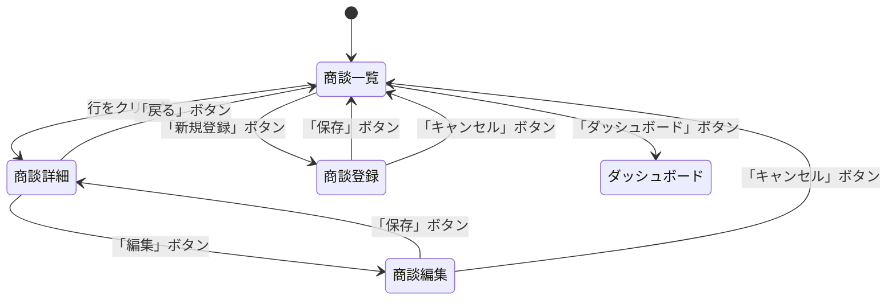
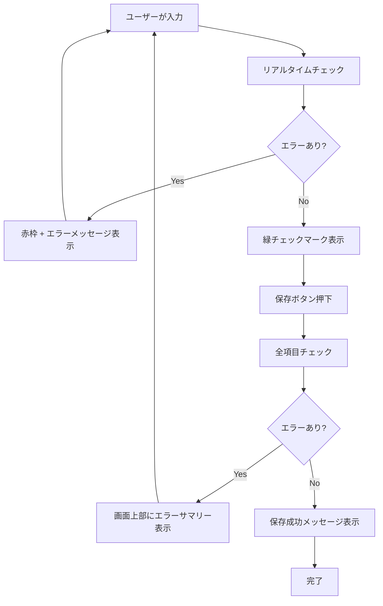
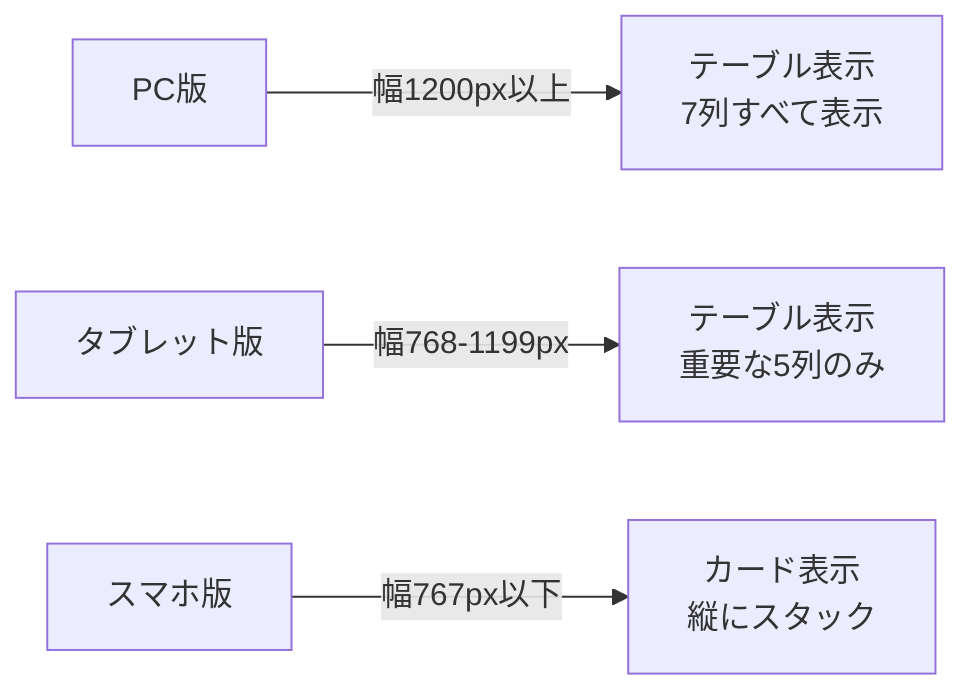
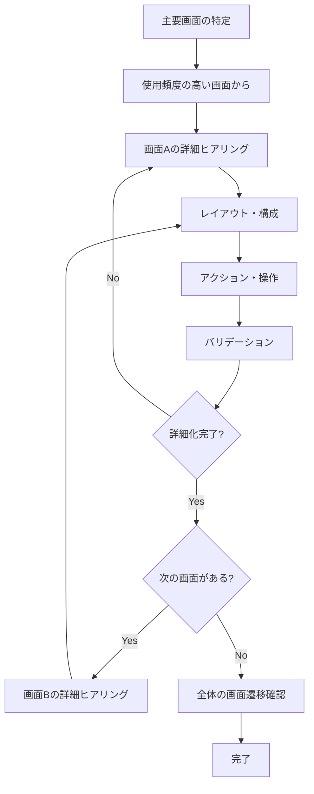

# 2.2.2.2 画面・UI/UXヒアリング項目

## 目的

要件定義フェーズにおいて、**ユーザーが実際に操作する画面の構成・遷移・体験**を具体化するためのヒアリング項目を提供します。

### このドキュメントで得られること

1. 画面構成を引き出す質問テンプレート
2. UI/UX要件を具体化する方法
3. 画面遷移図の作成に必要な情報の収集方法
4. ユーザビリティの観点からの確認項目

---

## 📋 ヒアリング項目一覧

### 1. 画面一覧の特定

#### 1.1 主要画面の洗い出し

```
Q: このシステムで、ユーザーが見る画面は何種類ありますか?
Q: 最もよく使う画面はどれですか?
目的: 画面の全体像を把握
```

**Good Example**:
```
主要画面（使用頻度順）:
1. 商談一覧画面（毎日20回）
2. 商談登録・編集画面（毎日10回）
3. 商談詳細画面（毎日15回）
4. ダッシュボード画面（毎朝1回）
5. レポート画面（週1回）
6. マスタ管理画面（月1回）
```

**画面一覧の表形式**:

| 画面名 | 主要ユーザー | 使用頻度 | 優先度 |
|--------|-------------|---------|-------|
| 商談一覧 | 営業担当者 | 毎日20回 | 高 |
| 商談登録 | 営業担当者 | 毎日10回 | 高 |
| ダッシュボード | マネージャー | 毎朝1回 | 中 |
| レポート | マネージャー | 週1回 | 中 |
| マスタ管理 | 管理者 | 月1回 | 低 |

---

#### 1.2 画面の種別

```
Q: それぞれの画面は、どんな種類の画面ですか?
目的: 画面の性質を分類
```

**画面種別の分類**:



---

### 2. 画面遷移の確認

#### 2.1 画面間の移動

```
Q: ○○画面から、どの画面に移動できますか?
Q: 移動するには、どのボタンを押しますか?
目的: 画面遷移図の作成に必要な情報を収集
```

**Good Example (商談一覧画面からの遷移)**:



---

#### 2.2 初期画面（ログイン後）

```
Q: ユーザーがログインした直後に表示される画面はどれですか?
Q: ユーザーロールによって初期画面は変わりますか?
目的: ログイン後の導線を明確化
```

**Good Example**:
```
営業担当者:
- ログイン後 → 商談一覧画面
- 理由: 最も頻繁に使う画面

マネージャー:
- ログイン後 → ダッシュボード画面
- 理由: チーム全体の状況を確認したい

管理者:
- ログイン後 → ダッシュボード画面
```

---

### 3. 画面レイアウト・構成

#### 3.1 画面の主要要素

```
Q: ○○画面には、どんな情報が表示されますか?
Q: どの情報が最も重要ですか?
目的: 画面のワイヤーフレームを作成
```

**Good Example (商談一覧画面)**:

```
表示要素（重要度順）:
1. 商談一覧テーブル ⭐⭐⭐
   - 顧客名、商談日、営業担当者、ステータス、金額
2. 検索フォーム
   - 顧客名、期間、ステータス
3. 新規登録ボタン
4. ページネーション
5. 合計金額表示（画面上部）
```

**ワイヤーフレーム（テキスト表現）**:
```
┌────────────────────────────────────────┐
│  商談一覧                              │
├────────────────────────────────────────┤
│ [検索] 顧客名: [____]  期間: [____]    │
│        ステータス: [____]  [検索ボタン]  │
├────────────────────────────────────────┤
│ 合計金額: 12,345,000円     [新規登録]   │
├────────────────────────────────────────┤
│ 顧客名 | 商談日 | 担当者 | ステータス | 金額 │
│ A社    | 1/15  | 山田   | 提案中    | 100万│
│ B社    | 1/20  | 佐藤   | 受注     | 500万│
│ ...                                    │
├────────────────────────────────────────┤
│ << < 1 2 3 > >>                        │
└────────────────────────────────────────┘
```

---

#### 3.2 ヘッダー・フッター・サイドバー

```
Q: 全画面共通のヘッダー・フッターには何を表示しますか?
Q: サイドバーには何を表示しますか?
目的: 共通レイアウトを定義
```

**Good Example**:
```
ヘッダー（全画面共通）:
- ロゴ
- ユーザー名表示
- ログアウトボタン
- ヘルプボタン

サイドバー（メニュー）:
- ダッシュボード
- 商談一覧
- 顧客一覧
- レポート
- マスタ管理（管理者のみ）

フッター:
- コピーライト
- 利用規約リンク
- お問い合わせリンク
```

---

### 4. 入力フォームの詳細

#### 4.1 入力項目の種類

```
Q: ○○画面の入力フォームには、どんな項目がありますか?
Q: それぞれの入力方法は何ですか?（テキスト、選択、日付など）
目的: フォーム設計に必要な情報を収集
```

**Good Example (商談登録画面)**:

| 項目名 | 入力方法 | 必須/任意 | 初期値 | バリデーション |
|--------|---------|----------|-------|---------------|
| 顧客名 | ドロップダウン（既存顧客）+ 新規入力 | 必須 | なし | 重複チェック |
| 商談日 | カレンダー（日付選択） | 必須 | 今日 | 未来日も可 |
| 営業担当者 | ドロップダウン | 必須 | ログインユーザー | - |
| ステータス | ラジオボタン | 必須 | 初回訪問 | - |
| 商談メモ | テキストエリア（複数行） | 任意 | なし | 1000文字以内 |
| 受注見込み金額 | 数値入力 | 任意 | なし | 0以上の整数 |
| 受注予定日 | カレンダー（日付選択） | 任意 | なし | 商談日以降 |

---

#### 4.2 入力支援機能

```
Q: 入力を簡単にするための機能は必要ですか?
目的: UXを向上させる機能を特定
```

**Good Example**:
```
入力支援機能:
- 顧客名: インクリメンタルサーチ（入力中に候補を表示）
- 商談日: カレンダーポップアップ + 「今日」「明日」ボタン
- 商談メモ: テンプレート選択機能（定型文の挿入）
- 受注見込み金額: カンマ自動挿入（1000000 → 1,000,000）
```

---

#### 4.3 バリデーション・エラー表示

```
Q: 入力エラーがある場合、どのように表示しますか?
Q: 保存ボタンを押す前にチェックしますか?
目的: バリデーション仕様を明確化
```

**Good Example**:
```
リアルタイムバリデーション:
- 入力中にエラーをチェック
- エラー項目を赤枠で表示
- エラーメッセージを項目の下に赤文字で表示

保存時バリデーション:
- 保存ボタン押下時に全項目をチェック
- エラーがある場合は保存せず、画面上部にエラーサマリーを表示
- 「3つのエラーがあります」+ エラー項目リスト

エラーメッセージ例:
- 「顧客名は必須です」
- 「受注予定日は商談日以降の日付を入力してください」
```

**バリデーションフロー**:



---

### 5. 一覧・テーブル表示

#### 5.1 表示項目・列

```
Q: 一覧には、どの項目を表示しますか?
Q: 列の並び順は何ですか?
目的: テーブル設計
```

**Good Example (商談一覧)**:
```
表示列（左から順に）:
1. チェックボックス（一括操作用）
2. 顧客名
3. 商談日
4. 営業担当者
5. ステータス
6. 受注見込み金額
7. アクションボタン（詳細、編集、削除）
```

---

#### 5.2 ソート・フィルター

```
Q: 一覧をソート（並び替え）できますか?
Q: どの列でソートしますか?
Q: フィルター（絞り込み）機能は必要ですか?
目的: ソート・フィルター機能の仕様を明確化
```

**Good Example**:
```
ソート機能:
- 商談日、受注見込み金額でソート可能
- 列ヘッダーをクリックで昇順/降順切り替え
- デフォルト: 商談日の降順（新しい順）

フィルター機能:
- ステータスで絞り込み（複数選択可）
- 営業担当者で絞り込み（複数選択可）
- 期間で絞り込み（開始日〜終了日）
```

---

#### 5.3 ページネーション

```
Q: 一覧に表示する件数は何件ですか?
Q: 100件以上ある場合、どうしますか?
目的: ページネーション仕様を明確化
```

**Good Example**:
```
表示件数:
- デフォルト: 20件/ページ
- ユーザーが変更可能: 20件、50件、100件から選択

ページネーション:
- 画面下部に表示
- << < 1 2 3 4 5 > >> 形式
- 「全500件中 1-20件を表示」と表示
```

---

### 6. アクション・ボタン

#### 6.1 主要なアクション

```
Q: ○○画面で、ユーザーが実行できる操作は何ですか?
Q: それぞれの操作は、どのボタンで実行しますか?
目的: ボタン配置・ラベルを決定
```

**Good Example (商談詳細画面)**:
```
主要アクション:
- 「編集」ボタン（右上）
- 「削除」ボタン（右上、赤色）
- 「戻る」ボタン（左上）
- 「PDF出力」ボタン（右上）

ボタンの色分け:
- 主要アクション（編集、保存）: 青色
- 破壊的アクション（削除）: 赤色
- 中立的アクション（戻る、キャンセル）: グレー
```

---

#### 6.2 確認ダイアログ

```
Q: ボタンを押した時、確認メッセージを表示しますか?
Q: どんなメッセージを表示しますか?
目的: ユーザーの誤操作を防ぐ
```

**Good Example**:
```
削除ボタン押下時:
- 確認ダイアログ表示: 「この商談を削除しますか? この操作は取り消せません。」
- ボタン: 「削除する」（赤）、「キャンセル」（グレー）
- デフォルトフォーカス: 「キャンセル」

保存ボタン押下時:
- 確認なし（即座に保存）
- 保存成功後: 「商談を保存しました」とトースト通知
```

---

### 7. レスポンシブデザイン

#### 7.1 利用デバイス

```
Q: このシステムは、PCだけで使いますか?
Q: スマホやタブレットでも使いますか?
目的: レスポンシブ対応の必要性を確認
```

**Good Example**:
```
利用デバイス:
- PC: 主に使用（80%）
- タブレット: 営業先で使用（15%）
- スマホ: 外出先で簡易確認（5%）

対応方針:
- PC版: フル機能
- タブレット版: 主要機能のみ（商談一覧、詳細、登録）
- スマホ版: 閲覧のみ（商談一覧、詳細）
```

---

#### 7.2 画面サイズごとの対応

```
Q: スマホで見た時、レイアウトはどうなりますか?
目的: レスポンシブデザインの詳細を確認
```

**Good Example (商談一覧画面)**:



**PC版**:
```
┌──────────────────────────────────────────────┐
│ 顧客名 | 商談日 | 担当者 | ステータス | 金額 | 操作 │
│ A社    | 1/15  | 山田  | 提案中    | 100万 | [詳細]│
└──────────────────────────────────────────────┘
```

**スマホ版**:
```
┌────────────────┐
│ A社            │
│ 2025/1/15      │
│ 山田           │
│ 提案中 100万円 │
│ [詳細を見る]   │
├────────────────┤
│ B社            │
│ 2025/1/20      │
│ ...            │
└────────────────┘
```

---

### 8. アクセシビリティ

#### 8.1 キーボード操作

```
Q: マウスを使わずに、キーボードだけで操作できますか?
目的: アクセシビリティ要件を確認
```

**Good Example**:
```
キーボード操作:
- Tab: 次の入力項目へ移動
- Shift+Tab: 前の入力項目へ移動
- Enter: 保存ボタン押下（フォーム内）
- Esc: ダイアログを閉じる

ショートカットキー:
- Ctrl+S: 保存
- Ctrl+N: 新規登録
- Ctrl+F: 検索フォームにフォーカス
```

---

#### 8.2 視覚的配慮

```
Q: 色覚多様性（色弱）の方でも使えますか?
Q: 文字サイズを大きくできますか?
目的: 幅広いユーザーが使えるようにする
```

**Good Example**:
```
色覚多様性対応:
- 色だけで状態を表現しない
- ステータスは色 + アイコン + テキストで表現
  - 受注: 緑 + ✓ + "受注"
  - 失注: 赤 + ✗ + "失注"
  - 提案中: 青 + ⏳ + "提案中"

文字サイズ:
- デフォルト: 14px
- 拡大: 16px、18px（設定画面で変更可能）
- ブラウザのズーム機能で拡大可能（200%まで）
```

---

### 9. フィードバック・メッセージ

#### 9.1 成功メッセージ

```
Q: 操作が成功した時、どんなメッセージを表示しますか?
目的: ユーザーに操作結果を伝える
```

**Good Example**:
```
保存成功時:
- トースト通知（画面右上、3秒後に自動で消える）
- メッセージ: 「商談を保存しました」
- 緑色の背景 + チェックマークアイコン
```

---

#### 9.2 エラーメッセージ

```
Q: エラーが発生した時、どんなメッセージを表示しますか?
目的: ユーザーがエラーを理解し、対処できるようにする
```

**Good Example**:
```
保存エラー時:
- 画面上部にエラーバナー表示（×ボタンで閉じる）
- メッセージ: 「保存に失敗しました。もう一度お試しください。」
- 赤色の背景 + エラーアイコン
- 技術的なエラーの場合: 「エラーコード: E1001 (サポートにお問い合わせください)」
```

---

#### 9.3 読み込み中の表示

```
Q: データ読み込み中は、何を表示しますか?
目的: ユーザーに待ち時間を認識させる
```

**Good Example**:
```
データ読み込み中:
- スピナー（くるくる回るアイコン）表示
- メッセージ: 「データを読み込んでいます...」
- 長時間かかる場合: プログレスバー表示（「75%完了」）

ボタン押下後:
- ボタンをグレーアウト（連打防止）
- ボタン内にスピナー表示
- テキスト: 「保存中...」
```

---

## 🎯 ヒアリングの進め方

### 画面ごとに深掘り



---

## ✅ 画面・UI/UXヒアリング完了チェックリスト

### 画面一覧
- [ ] 全画面を洗い出し済み
- [ ] 画面の種別を分類済み
- [ ] 使用頻度・優先度を確認済み

### 画面遷移
- [ ] 画面間の移動を整理済み
- [ ] 初期画面（ログイン後）を確認済み
- [ ] 画面遷移図を作成済み

### 画面レイアウト
- [ ] 各画面の主要要素を確認済み
- [ ] ヘッダー・フッター・サイドバーを定義済み
- [ ] ワイヤーフレーム（簡易）を作成済み

### 入力フォーム
- [ ] 入力項目・入力方法を確認済み
- [ ] バリデーションルールを定義済み
- [ ] エラー表示方法を確認済み

### 一覧表示
- [ ] 表示項目・列を確認済み
- [ ] ソート・フィルター機能を確認済み
- [ ] ページネーション仕様を確認済み

### UX
- [ ] レスポンシブ対応を確認済み（該当する場合）
- [ ] アクセシビリティを考慮済み
- [ ] フィードバック・メッセージを定義済み

---

## 🚨 よくある失敗パターン

### ❌ 画面の詳細を聞かずに進める

**Bad Example**:
```
Claude: 商談一覧画面が必要ですね。次は...
```

**理由**: 画面の具体的な構成・項目が不明確

**Good Example**:
```
Claude: 商談一覧画面について詳しく教えてください。
        どの情報を表示しますか?
User: 顧客名、商談日、金額を表示したいです。
Claude: かしこまりました。それらはテーブル形式で表示しますか?
        それとも、カード形式で表示しますか?
```

---

### ❌ デザインの細かい色・フォントまで聞く

**Bad Example**:
```
Q: ボタンの色は#0066FFですか? それとも#0077EEですか?
Q: フォントはNoto Sansですか? Robotoですか?
```

**理由**: 要件定義フェーズでは不要な詳細（設計・実装フェーズで決定）

**Good Example**:
```
Q: ボタンは、主要アクション・破壊的アクション・中立的アクションで
   色分けしますか?
```

---

### ❌ 技術的な実装方法を聞く

**Bad Example**:
```
Q: フロントエンドはReactで実装しますか? Vueですか?
Q: ステート管理はReduxですか? Contextですか?
```

**理由**: 技術選定は設計フェーズで実施

**Good Example**:
```
Q: 画面のレスポンスは、どれくらい速ければ良いですか?
   （例: ボタンを押してから1秒以内に結果が表示される）
```

---

## 📚 次のステップ

画面・UI/UXヒアリングが完了したら:

1. **2.2.7.1 画面遷移図パターン.md** を参照し、画面遷移図を作成
2. **2.2.2.3 データ要件ヒアリング項目.md** へ進む
3. データモデルを具体化

---

## 関連ドキュメント

- [2.2.2.1 機能要件ヒアリング項目](./2.2.2.1_機能要件ヒアリング項目.md) - 機能要件のヒアリング
- [2.2.7.1 画面遷移図パターン](./2.2.7.1_画面遷移図パターン.md) - 画面遷移図の書き方
- [2.2.5.2 ユースケース記述方法](./2.2.5.2_ユースケース記述方法.md) - ユースケースの書き方

---

**作成日**: 2025-10-19
**対象フェーズ**: 要件定義
**重要度**: ⭐⭐⭐ 必須
