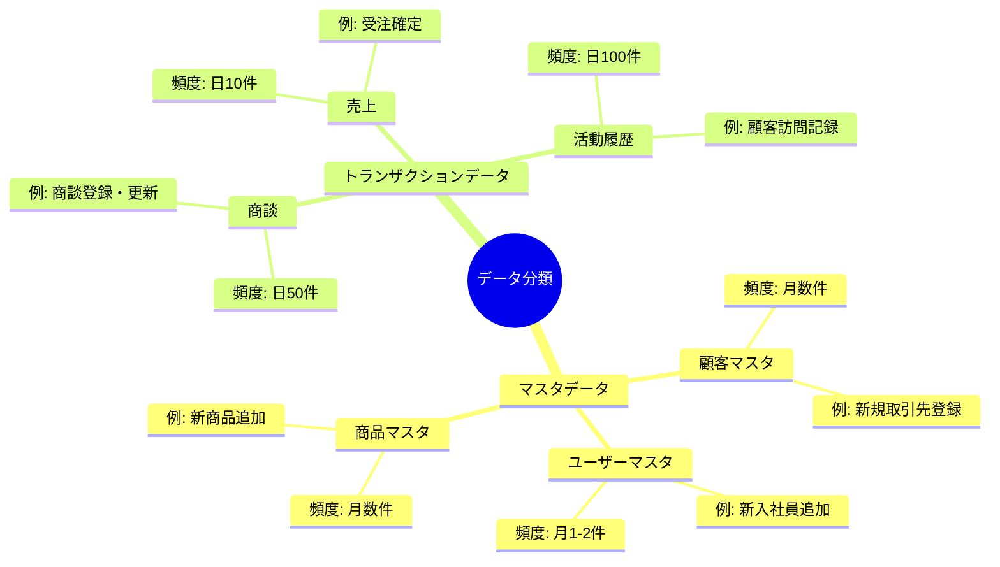
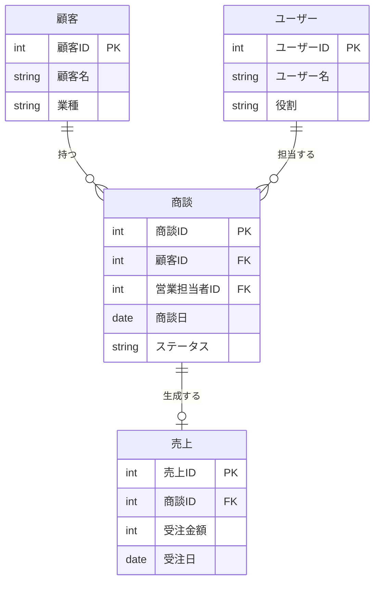
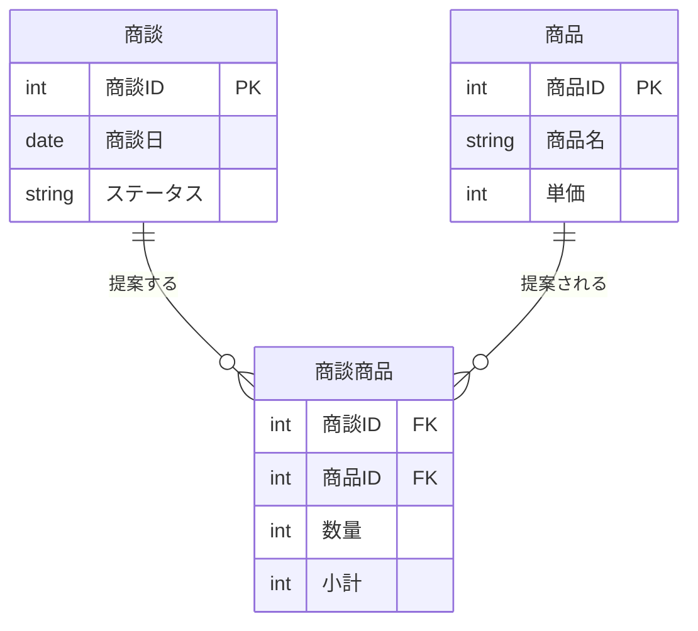
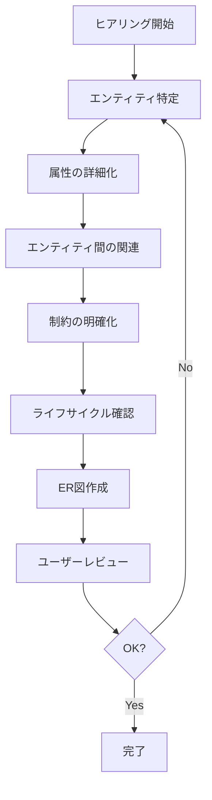

# 2.2.2.3 データ要件ヒアリング項目

## 目的

要件定義フェーズにおいて、**システムが扱うデータの構造・関連・制約**を明確化するためのヒアリング項目を提供します。

### このドキュメントで得られること

1. データモデルを引き出す質問テンプレート
2. エンティティ（データのまとまり）の特定方法
3. データ間の関連の整理方法
4. ER図作成に必要な情報の収集方法

---

## 📋 ヒアリング項目一覧

### 1. エンティティ（データのまとまり）の特定

#### 1.1 主要なデータの洗い出し

```
Q: このシステムで管理する主なデータは何ですか?
Q: それぞれのデータは、何を表していますか?
目的: システムが扱うエンティティを特定
```

**Good Example**:
```
主要なデータ:
1. 商談情報
   - 営業活動における個々の商談を表す
2. 顧客情報
   - 取引先企業の情報を表す
3. ユーザー情報
   - システムを利用する営業担当者・マネージャーの情報
4. 商品情報
   - 販売する商品・サービスの情報
5. 売上情報
   - 受注確定後の売上実績を表す
```

**エンティティ一覧（表形式）**:

| エンティティ名 | 説明 | 主キー | 件数見積もり |
|--------------|------|--------|-------------|
| 商談 | 営業活動の個々の商談 | 商談ID | 年間1万件 |
| 顧客 | 取引先企業 | 顧客ID | 500社 |
| ユーザー | システム利用者 | ユーザーID | 50名 |
| 商品 | 販売商品・サービス | 商品ID | 100種類 |
| 売上 | 受注確定後の売上実績 | 売上ID | 年間3000件 |

---

#### 1.2 マスタデータとトランザクションデータの区別

```
Q: それぞれのデータは、頻繁に変わりますか?
Q: マスタデータ（基本情報）とトランザクションデータ（取引記録）の区別はできますか?
目的: データの性質を分類
```

**Good Example**:



---

### 2. 属性（データ項目）の詳細化

#### 2.1 各エンティティの属性

```
Q: [エンティティ名]には、どんな情報が含まれますか?
Q: それぞれの項目は、どんなデータ型ですか?
目的: 各エンティティの属性を明確化
```

**Good Example (商談エンティティ)**:

| 属性名 | データ型 | 必須 | 一意 | 説明 | 例 |
|--------|---------|------|------|------|-----|
| 商談ID | 整数 | ○ | ○ | 自動採番 | 1001 |
| 顧客ID | 整数 | ○ | × | 顧客マスタへの外部キー | 501 |
| 営業担当者ID | 整数 | ○ | × | ユーザーマスタへの外部キー | 10 |
| 商談日 | 日付 | ○ | × | 商談実施日 | 2025-01-15 |
| ステータス | 文字列 | ○ | × | 商談の進捗状況 | "提案中" |
| 商談メモ | テキスト | × | × | 商談内容のメモ | "価格交渉中..." |
| 受注見込み金額 | 数値 | × | × | 受注見込みの金額（円） | 1000000 |
| 受注予定日 | 日付 | × | × | 受注予定の日付 | 2025-02-28 |
| 作成日時 | 日時 | ○ | × | レコード作成日時 | 2025-01-10 09:00:00 |
| 更新日時 | 日時 | ○ | × | レコード更新日時 | 2025-01-12 14:30:00 |

---

#### 2.2 データの制約

```
Q: [属性名]には、どんな値が入りますか?
Q: 入力できる値に制限はありますか?
目的: データの制約を明確化（バリデーション・データ整合性）
```

**Good Example**:
```
ステータス:
- 許可される値: "初回訪問", "ニーズヒアリング", "提案中", "受注", "失注"
- デフォルト値: "初回訪問"
- NULL不可

受注見込み金額:
- 範囲: 0以上、1億円以下
- 小数不可（整数のみ）
- NULL可（見込み不明の場合）

受注予定日:
- 範囲: 商談日以降
- 過去日不可
- NULL可（未定の場合）

商談メモ:
- 最大長: 1000文字
- NULL可
```

---

### 3. エンティティ間の関連

#### 3.1 1対多の関連

```
Q: 1つの[エンティティA]に対して、複数の[エンティティB]が紐づきますか?
目的: 1対多の関連を特定
```

**Good Example**:



**関連の説明**:
```
1. 顧客 ─ 商談 (1対多)
   - 1つの顧客に対して、複数の商談が存在する
   - 1つの商談は、必ず1つの顧客に紐づく

2. ユーザー ─ 商談 (1対多)
   - 1人のユーザー（営業担当者）は、複数の商談を担当する
   - 1つの商談は、必ず1人のユーザーに担当される

3. 商談 ─ 売上 (1対0または1)
   - 1つの商談は、受注した場合のみ1つの売上レコードを生成する
   - 失注の場合は売上レコードなし
```

---

#### 3.2 多対多の関連

```
Q: [エンティティA]と[エンティティB]は、多対多の関係ですか?
Q: 1つの[エンティティA]に対して、複数の[エンティティB]が紐づき、
   かつ、1つの[エンティティB]に対して、複数の[エンティティA]が紐づきますか?
目的: 多対多の関連を特定（中間テーブルが必要）
```

**Good Example (商談 ─ 商品)**:

```
関連の説明:
- 1つの商談で、複数の商品を提案できる
- 1つの商品は、複数の商談で提案される

多対多の関連 → 中間テーブルが必要
```

**ER図（中間テーブルあり）**:



**中間テーブル（商談商品）**:
```
目的: 商談と商品の多対多の関連を表現

属性:
- 商談ID（外部キー）
- 商品ID（外部キー）
- 数量（この商談で提案する商品の数量）
- 小計（単価 × 数量）

主キー: (商談ID, 商品ID)の複合キー
```

---

#### 3.3 任意の関連と必須の関連

```
Q: [エンティティA]は、必ず[エンティティB]に紐づきますか?
Q: 紐づかない場合もありますか?
目的: 関連の多重度を明確化
```

**Good Example**:

| 関連 | 必須/任意 | 説明 |
|------|----------|------|
| 商談 → 顧客 | 必須 | 商談は必ず顧客に紐づく |
| 商談 → 売上 | 任意 | 受注した場合のみ売上が生成される |
| 顧客 → 商談 | 任意 | 新規登録直後の顧客は商談なし |
| ユーザー → 商談 | 任意 | 新入社員は商談なし |

**ER図での表現**:
```
必須: ||--|| (両端が ||)
任意: ||--o{ (片端が o)
```

---

### 4. データの生成・更新・削除

#### 4.1 データの生成タイミング

```
Q: [エンティティ名]のデータは、いつ作られますか?
Q: 誰が作りますか?
目的: データのライフサイクルを理解
```

**Good Example**:
```
商談データ:
- 作成タイミング: 営業担当者が顧客訪問後
- 作成者: 営業担当者
- 作成頻度: 1日あたり50件

売上データ:
- 作成タイミング: 商談ステータスが「受注」になった時点で自動生成
- 作成者: システム（自動）
- 作成頻度: 1日あたり10件
```

---

#### 4.2 データの更新

```
Q: [エンティティ名]のデータは、更新されますか?
Q: どの項目が更新されますか?
Q: 更新履歴は必要ですか?
目的: 更新可能性・履歴管理要件を明確化
```

**Good Example**:
```
商談データ:
- 更新可能項目: ステータス、商談メモ、受注見込み金額、受注予定日
- 更新不可項目: 商談ID、顧客ID、作成日時
- 更新履歴: 必要（誰が、いつ、何を変更したかを記録）

顧客マスタ:
- 更新可能項目: すべての項目（顧客ID以外）
- 更新履歴: 不要（最新の情報のみ保持）
```

**更新履歴テーブル（商談履歴）**:

| 属性名 | データ型 | 説明 |
|--------|---------|------|
| 履歴ID | 整数 | 主キー |
| 商談ID | 整数 | 対象の商談 |
| 更新日時 | 日時 | 更新された日時 |
| 更新者ID | 整数 | 更新したユーザー |
| 更新項目 | 文字列 | 更新された項目名 |
| 更新前の値 | テキスト | 更新前の値 |
| 更新後の値 | テキスト | 更新後の値 |

---

#### 4.3 データの削除

```
Q: [エンティティ名]のデータは、削除されますか?
Q: 削除方法は物理削除ですか、論理削除ですか?
目的: 削除方法を明確化
```

**Good Example**:
```
商談データ:
- 削除方法: 論理削除
- 削除フラグ: deleted_at（削除日時）
- NULL = 有効、日時が入っている = 削除済み
- 理由: 過去の商談データを分析で使用するため

顧客マスタ:
- 削除方法: 論理削除
- 削除フラグ: is_active（有効フラグ）
- TRUE = 有効、FALSE = 無効
- 理由: 過去の取引先情報を残すため

マスタデータ（商品など）:
- 削除方法: 物理削除可能
- 条件: トランザクションデータに紐づいていない場合のみ
```

---

### 5. データの件数・容量見積もり

#### 5.1 データ件数の見積もり

```
Q: [エンティティ名]のデータは、何件くらいになりますか?
Q: 1年後、3年後、5年後の件数は?
目的: データ容量・パフォーマンス要件の基礎情報
```

**Good Example**:

| エンティティ | 初期 | 1年後 | 3年後 | 5年後 | 備考 |
|------------|------|-------|-------|-------|------|
| 顧客 | 500件 | 600件 | 800件 | 1000件 | 年100件増 |
| ユーザー | 50件 | 60件 | 80件 | 100件 | 組織拡大 |
| 商談 | 0件 | 1万件 | 3万件 | 5万件 | 年1万件増 |
| 売上 | 0件 | 3000件 | 9000件 | 1.5万件 | 年3000件増 |
| 商談履歴 | 0件 | 5万件 | 15万件 | 25万件 | 商談1件あたり平均5回更新 |

---

#### 5.2 データ保持期間

```
Q: 古いデータは、いつまで保持しますか?
Q: アーカイブ（別の場所に移動）は必要ですか?
目的: データライフサイクル管理要件を明確化
```

**Good Example**:
```
商談データ:
- オンライン保持期間: 3年間
- アーカイブ: 3年以上前のデータは別DBに移動
- 完全削除: 10年後（法律上の保存義務期間が7年のため余裕を持たせる）

売上データ:
- オンライン保持期間: 5年間
- アーカイブ: 5年以上前のデータは別DBに移動
- 完全削除: しない（永久保存）

アクセスログ:
- オンライン保持期間: 3ヶ月
- アーカイブ: 3ヶ月以上前はログファイルに出力
- 完全削除: 1年後
```

---

### 6. データの整合性

#### 6.1 参照整合性

```
Q: [エンティティA]が削除された場合、紐づく[エンティティB]はどうなりますか?
目的: 外部キー制約の動作を明確化
```

**Good Example**:

| 親エンティティ | 子エンティティ | 削除時の動作 | 理由 |
|--------------|--------------|------------|------|
| 顧客 | 商談 | 削除不可 | 商談が残っている顧客は削除できない |
| ユーザー | 商談 | NULL設定 | ユーザー退職後も商談データは残す |
| 商談 | 売上 | 連鎖削除 | 商談削除時は売上も削除 |
| 商品 | 商談商品 | 削除不可 | 商談で使われている商品は削除できない |

**削除時の動作パターン**:
```
1. 削除不可（RESTRICT）:
   - 子レコードが存在する場合、親レコードを削除できない
   - 例: 商談が存在する顧客は削除不可

2. 連鎖削除（CASCADE）:
   - 親レコード削除時、子レコードも自動削除
   - 例: 商談削除時、紐づく売上も削除

3. NULL設定（SET NULL）:
   - 親レコード削除時、子レコードの外部キーをNULLに設定
   - 例: ユーザー削除時、商談の営業担当者IDをNULL

4. デフォルト値設定（SET DEFAULT）:
   - 親レコード削除時、子レコードの外部キーをデフォルト値に設定
   - 例: 営業担当者削除時、商談の担当者を「未割り当て」に設定
```

---

#### 6.2 一意性制約

```
Q: [エンティティ名]で、重複してはいけない項目はありますか?
目的: ユニーク制約を明確化
```

**Good Example**:
```
ユーザーマスタ:
- メールアドレス: 一意（重複不可）
- ユーザー名: 一意（重複不可）

顧客マスタ:
- 顧客コード: 一意（重複不可）
- 顧客名: 重複可（同名の会社が存在する可能性）

商談:
- 商談ID: 一意（主キー）
- その他の項目: 重複可
```

---

### 7. データの初期値・マスタデータ

#### 7.1 システム初期投入データ

```
Q: システム稼働時に、事前に登録しておくデータはありますか?
目的: マスタデータの初期投入要件を明確化
```

**Good Example**:
```
初期投入データ:

1. ユーザーマスタ:
   - 管理者ユーザー（1件）
   - 既存の営業担当者50名
   - マネージャー5名

2. 顧客マスタ:
   - 既存の取引先500社
   - Excelファイルからインポート

3. 商品マスタ:
   - 販売中の商品100種類
   - 商品コード、商品名、単価

4. ステータスマスタ:
   - "初回訪問", "ニーズヒアリング", "提案中", "受注", "失注"

初期投入方法:
- CSVインポート機能を提供
- 管理者が画面からアップロード
```

---

#### 7.2 コードマスタ

```
Q: ステータスや区分など、選択肢が決まっている項目はありますか?
Q: その選択肢は、将来追加・変更される可能性がありますか?
目的: コードマスタの必要性を判断
```

**Good Example**:

**パターンA: 固定値（コードマスタ不要）**
```
性別:
- 選択肢: "男性", "女性", "その他"
- 変更可能性: なし
- 実装方法: アプリケーション内でハードコード
```

**パターンB: 可変値（コードマスタ必要）**
```
商談ステータス:
- 選択肢: "初回訪問", "ニーズヒアリング", "提案中", "受注", "失注"
- 変更可能性: あり（将来、新しいステータスを追加する可能性）
- 実装方法: ステータスマスタテーブルを作成
```

**ステータスマスタテーブル**:

| ステータスID | ステータス名 | 表示順 | 有効フラグ |
|------------|-------------|--------|-----------|
| 1 | 初回訪問 | 1 | TRUE |
| 2 | ニーズヒアリング | 2 | TRUE |
| 3 | 提案中 | 3 | TRUE |
| 4 | 受注 | 4 | TRUE |
| 5 | 失注 | 5 | TRUE |

---

## 🎯 ヒアリングの進め方

### データモデリングの流れ



---

## ✅ データ要件ヒアリング完了チェックリスト

### エンティティ
- [ ] 主要なエンティティを洗い出し済み
- [ ] マスタデータとトランザクションデータを分類済み
- [ ] 各エンティティの役割を明確化済み

### 属性
- [ ] 各エンティティの属性を洗い出し済み
- [ ] データ型を確認済み
- [ ] 必須/任意を確認済み
- [ ] データの制約を確認済み

### 関連
- [ ] エンティティ間の関連を整理済み
- [ ] 1対多、多対多の関連を明確化済み
- [ ] 必須/任意の関連を確認済み

### ライフサイクル
- [ ] データの生成タイミングを確認済み
- [ ] データの更新可能性を確認済み
- [ ] データの削除方法を確認済み
- [ ] データ保持期間を確認済み

### その他
- [ ] データ件数を見積もり済み
- [ ] 参照整合性を確認済み
- [ ] 初期投入データを確認済み
- [ ] ER図を作成済み

---

## 🚨 よくある失敗パターン

### ❌ 正規化を考えすぎる

**Bad Example**:
```
Claude: 顧客名と住所を別テーブルに分けて、第3正規形にしましょう。
```

**理由**: 要件定義フェーズでは、正規化の詳細は不要（設計フェーズで実施）

**Good Example**:
```
Claude: 顧客情報には、顧客名、住所、電話番号が含まれるということですね。
        1つの顧客に対して、複数の住所が登録される可能性はありますか?
```

---

### ❌ データベース技術の詳細を聞く

**Bad Example**:
```
Q: インデックスはどの列に作成しますか?
Q: パーティショニングは必要ですか?
```

**理由**: 技術的な詳細は設計フェーズで決定

**Good Example**:
```
Q: 商談一覧画面では、どの条件で検索することが多いですか?
   （検索が多い項目 → インデックス対象として設計フェーズで考慮）
```

---

### ❌ ER図を最初から完璧に作ろうとする

**Bad Example**:
```
Claude: 完璧なER図を作成しました。これで確定しましょう。
```

**理由**: ヒアリングの途中でエンティティや関連が追加・変更される

**Good Example**:
```
Claude: 現時点でのER図はこちらです。（図を提示）
        今後のヒアリングで、追加・変更していきます。
```

---

## 📚 次のステップ

データ要件ヒアリングが完了したら:

1. **2.2.7.2 ER図パターン.md** を参照し、ER図を完成させる
2. **2.2.2.4 非機能要件ヒアリング項目.md** へ進む
3. 性能・セキュリティ要件を具体化

---

## 関連ドキュメント

- [2.2.2.1 機能要件ヒアリング項目](./2.2.2.1_機能要件ヒアリング項目.md) - 機能要件のヒアリング
- [2.2.7.2 ER図パターン](./2.2.7.2_ER図パターン.md) - ER図の書き方
- [2.2.7.3 システム構成図](./2.2.7.3_システム構成図（概念レベル）.md) - システム構成の図示

---

**作成日**: 2025-10-19
**対象フェーズ**: 要件定義
**重要度**: ⭐⭐⭐ 必須
