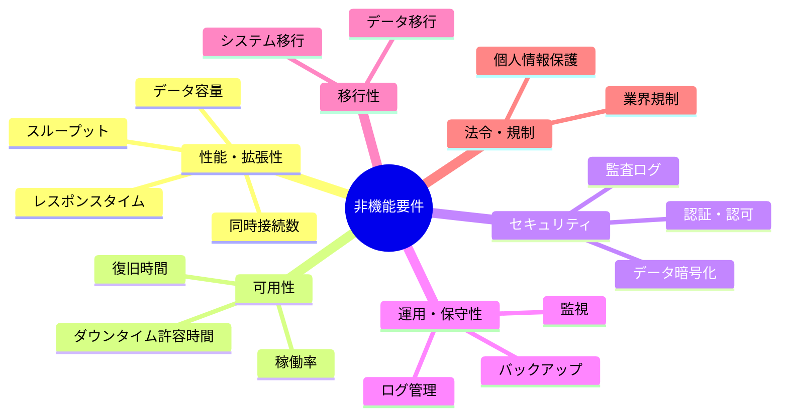
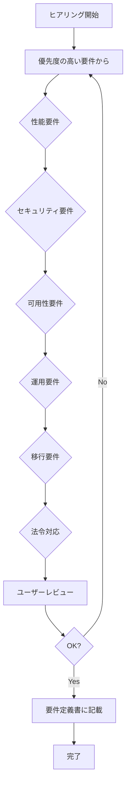

# 2.2.2.4 非機能要件ヒアリング項目

## 目的

要件定義フェーズにおいて、**システムの性能・可用性・セキュリティ・運用など、機能以外の品質要件**を明確化するためのヒアリング項目を提供します。

### このドキュメントで得られること

1. 非機能要件を引き出す質問テンプレート
2. 具体的な数値目標の設定方法
3. 優先順位付けの支援
4. 非機能要件の記述方法

---

## 📋 非機能要件の分類

非機能要件は、以下の6つのカテゴリに分類されます：



---

## 📋 ヒアリング項目一覧

### 1. 性能・拡張性要件

#### 1.1 レスポンスタイム

```
Q: 画面が表示されるまでの時間は、どれくらいであれば許容できますか?
Q: ボタンを押してから結果が表示されるまでの時間は?
目的: レスポンスタイムの目標値を設定
```

**Good Example**:
```
画面表示:
- 一覧画面: 2秒以内 ⭐⭐⭐ 必須
- 詳細画面: 1秒以内 ⭐⭐⭐ 必須
- ダッシュボード: 3秒以内 ⭐⭐ 推奨

データ保存:
- 商談登録: 1秒以内 ⭐⭐⭐ 必須
- 一括更新: 5秒以内 ⭐⭐ 推奨

レポート生成:
- 月次レポート: 10秒以内 ⭐⭐ 推奨
- 年次レポート: 30秒以内 ⭐ 許容
```

**レスポンスタイムの目安**:

| 操作種別 | 目標時間 | 理由 |
|---------|---------|------|
| 画面表示 | 1-2秒 | ユーザーが待たされる感覚がない |
| データ保存 | 1秒以内 | 即座にフィードバックが必要 |
| 検索結果表示 | 2秒以内 | 待ち時間が長いとストレス |
| レポート生成 | 10秒以内 | ローディングインジケーター表示で許容 |
| バッチ処理 | 数分〜数時間 | 夜間実行で許容 |

---

#### 1.2 スループット（処理能力）

```
Q: 同時に何人のユーザーが使いますか?
Q: ピーク時（最も混雑する時間帯）は何人ですか?
目的: 同時接続数・トランザクション数の目標値を設定
```

**Good Example**:
```
同時接続ユーザー数:
- 平常時: 20人
- ピーク時: 50人（朝9時、夕方17時）
- 最大想定: 80人（営業会議中）

トランザクション数:
- 商談登録: 50件/日（平均2件/時間）
- 商談更新: 100件/日（平均4件/時間）
- 検索: 500回/日（平均20回/時間）

ピーク時のトランザクション数:
- 朝9時: 通常の3倍（営業担当者が一斉にログイン）
```

---

#### 1.3 データ容量

```
Q: データは、どれくらいの量になる見込みですか?
Q: 何年分のデータを保持しますか?
目的: ストレージ容量を見積もる
```

**Good Example**:
```
初期データ容量:
- 顧客マスタ: 500件 × 1KB = 0.5MB
- ユーザーマスタ: 50件 × 0.5KB = 25KB
- 合計: 約1MB

年間増加量:
- 商談データ: 1万件 × 10KB = 100MB
- 添付ファイル: 年間500件 × 1MB = 500MB
- 合計: 約600MB/年

5年後の想定容量:
- データベース: 100MB + 600MB×5年 = 3.1GB
- ファイルストレージ: 500MB×5年 = 2.5GB
- 合計: 約5.6GB
```

---

#### 1.4 拡張性

```
Q: 将来、ユーザー数やデータ量が増えた場合、システムを拡張できる必要がありますか?
Q: どれくらいまで増える想定ですか?
目的: スケーラビリティ要件を明確化
```

**Good Example**:
```
現在: ユーザー50人、商談データ1万件/年

3年後の想定:
- ユーザー: 100人（2倍）
- 商談データ: 2万件/年（2倍）

拡張方針:
- スケールアップ: サーバースペックを上げる
- スケールアウト: サーバー台数を増やす（将来的に検討）

拡張時の条件:
- レスポンスタイムが目標値を下回った場合
- 同時接続数が80人を超えた場合
```

---

### 2. 可用性要件

#### 2.1 稼働率・ダウンタイム

```
Q: システムは、1年間でどれくらいの時間、動いている必要がありますか?
Q: システムが止まってしまった場合、どれくらいの影響がありますか?
目的: 可用性の目標値を設定
```

**Good Example**:
```
稼働時間:
- 営業時間: 平日9:00-18:00 ⭐⭐⭐ 必須
- それ以外: 停止可能（メンテナンス時間として利用）

稼働率:
- 目標: 99.5%（営業時間内）
- 計算: 月間営業時間200時間のうち、停止許容は1時間
- 年間停止許容時間: 約12時間

ダウンタイムの影響:
- 営業時間中: 大（営業活動が止まる）
- 営業時間外: 小（翌朝までに復旧すればOK）
```

**可用性の目安**:

| 稼働率 | 年間停止時間 | 月間停止時間 | 適用例 |
|-------|------------|------------|--------|
| 99% | 3.65日 | 7.2時間 | 一般的なWebアプリ |
| 99.5% | 1.83日 | 3.6時間 | 業務システム |
| 99.9% | 8.76時間 | 43.2分 | ミッションクリティカル |
| 99.99% | 52.6分 | 4.32分 | 金融システム |

---

#### 2.2 復旧時間目標（RTO）

```
Q: システムが止まった場合、何時間以内に復旧する必要がありますか?
目的: 復旧時間の目標値を設定
```

**Good Example**:
```
復旧時間目標（RTO: Recovery Time Objective）:
- 営業時間中: 1時間以内 ⭐⭐⭐ 必須
- 営業時間外: 翌朝9時まで ⭐⭐ 推奨

復旧手順:
1. 障害検知（5分以内）
2. 原因調査（15分以内）
3. 復旧作業（40分以内）
合計: 1時間以内
```

---

#### 2.3 データ復旧目標（RPO）

```
Q: システムが止まった場合、何時間前のデータまで復旧できれば良いですか?
目的: バックアップ間隔を決定
```

**Good Example**:
```
データ復旧目標（RPO: Recovery Point Objective）:
- 許容データ損失: 1時間以内のデータ ⭐⭐⭐ 必須

バックアップ戦略:
- データベース: 1時間ごとに増分バックアップ
- ファイル: 1日1回のフルバックアップ

復旧時の最悪シナリオ:
- 11:55に障害発生
- 11:00のバックアップから復旧
- 55分間のデータが失われる（許容範囲内）
```

---

### 3. セキュリティ要件

#### 3.1 認証・認可

```
Q: システムにログインする際、どのように本人確認をしますか?
Q: ユーザーの役割によって、使える機能を制限しますか?
目的: 認証・認可の方式を決定
```

**Good Example**:
```
認証方式:
- メールアドレス + パスワード ⭐⭐⭐ 必須
- 多要素認証（MFA）: 管理者のみ必須 ⭐⭐ 推奨

パスワードポリシー:
- 最小長: 8文字
- 複雑性: 英大文字・小文字・数字・記号のうち3種類以上
- 有効期限: 90日（変更を促す）
- 再利用禁止: 過去3回分のパスワードは使用不可

認可（アクセス制御）:
- ロールベースアクセス制御（RBAC）
- 営業担当者: 自分の商談のみ閲覧・編集可能
- マネージャー: 全員の商談を閲覧可能
- 管理者: すべての機能にアクセス可能
```

---

#### 3.2 データ暗号化

```
Q: 個人情報や機密情報を扱いますか?
Q: データを暗号化する必要がありますか?
目的: 暗号化要件を明確化
```

**Good Example**:
```
暗号化対象:
- 通信経路: HTTPS（TLS 1.2以上） ⭐⭐⭐ 必須
- データベース: 顧客情報、売上情報を暗号化 ⭐⭐⭐ 必須
- バックアップ: 暗号化して保存 ⭐⭐⭐ 必須
- ログファイル: 個人情報を含む場合は暗号化 ⭐⭐ 推奨

暗号化方式:
- 通信: TLS 1.2以上
- データ: AES-256
- パスワード: bcryptでハッシュ化（暗号化ではなくハッシュ化）
```

---

#### 3.3 監査ログ

```
Q: 誰が、いつ、何をしたかの記録を残す必要がありますか?
Q: ログは何年間保持しますか?
目的: 監査ログ要件を明確化
```

**Good Example**:
```
ログ記録対象:
- ログイン・ログアウト ⭐⭐⭐ 必須
- データの作成・更新・削除 ⭐⭐⭐ 必須
- 権限変更 ⭐⭐⭐ 必須
- 設定変更 ⭐⭐ 推奨
- 検索操作 ⭐ オプション

ログ記録内容:
- 日時（タイムスタンプ）
- ユーザーID・ユーザー名
- 操作内容（例: "商談ID=1001を更新"）
- IPアドレス
- 変更前後の値（データ更新の場合）

ログ保持期間:
- オンライン: 1年間
- アーカイブ: 7年間（法律上の保存義務期間）
```

---

#### 3.4 セキュリティ対策

```
Q: 外部からの攻撃に対して、どのような対策が必要ですか?
目的: セキュリティ対策要件を明確化
```

**Good Example**:
```
セキュリティ対策:

1. 不正ログイン対策:
   - ログイン失敗5回でアカウントロック（30分間）
   - IPアドレスベースのアクセス制限（オフィスIPからのみ許可）

2. SQLインジェクション対策:
   - プリペアドステートメント使用
   - 入力値のサニタイジング

3. XSS（クロスサイトスクリプティング）対策:
   - 出力時のエスケープ処理
   - Content Security Policy（CSP）設定

4. CSRF（クロスサイトリクエストフォージェリ）対策:
   - CSRFトークンの使用

5. DDoS攻撃対策:
   - レート制限（1分間に100リクエストまで）
   - WAF（Web Application Firewall）導入

6. ファイルアップロード対策:
   - ファイル種別制限（PDF, Excel, 画像のみ）
   - ファイルサイズ制限（10MBまで）
   - ウイルススキャン
```

---

### 4. 運用・保守性要件

#### 4.1 バックアップ

```
Q: データのバックアップは、どれくらいの頻度で取りますか?
Q: バックアップデータは、どこに保存しますか?
目的: バックアップ戦略を決定
```

**Good Example**:
```
バックアップ戦略:

データベース:
- フルバックアップ: 毎日AM 3:00
- 増分バックアップ: 1時間ごと
- 保存先: AWS S3（本番環境とは別リージョン）
- 世代管理: 30日分保持

ファイル:
- フルバックアップ: 毎日AM 4:00
- 保存先: AWS S3
- 世代管理: 90日分保持

バックアップテスト:
- 月1回、バックアップからのリストアテストを実施
- リストア時間: 1時間以内
```

---

#### 4.2 監視

```
Q: システムの状態を監視する必要がありますか?
Q: 異常を検知した場合、誰に通知しますか?
目的: 監視要件を明確化
```

**Good Example**:
```
監視項目:

1. サーバー監視:
   - CPU使用率: 80%超えでアラート
   - メモリ使用率: 80%超えでアラート
   - ディスク使用率: 90%超えでアラート

2. アプリケーション監視:
   - レスポンスタイム: 5秒超えでアラート
   - エラー率: 5%超えでアラート
   - 稼働状態: ヘルスチェック（1分ごと）

3. データベース監視:
   - 接続数: 100接続超えでアラート
   - スロークエリ: 3秒超えのクエリをログ記録

通知先:
- 営業時間中: 担当エンジニアにメール + Slack通知
- 営業時間外: 担当エンジニアにメールのみ（翌朝確認）
- 重大障害: 担当エンジニアに電話 + マネージャーにメール
```

---

#### 4.3 ログ管理

```
Q: システムのログは、どのように管理しますか?
Q: ログは何年間保持しますか?
目的: ログ管理要件を明確化
```

**Good Example**:
```
ログ種別:

1. アプリケーションログ:
   - レベル: ERROR, WARN, INFO, DEBUG
   - 保存先: ログファイル（日次ローテーション）
   - 保持期間: 90日間

2. アクセスログ:
   - 内容: リクエストURL, IPアドレス, レスポンスタイム
   - 保存先: ログファイル（日次ローテーション）
   - 保持期間: 1年間

3. 監査ログ:
   - 内容: ユーザー操作履歴
   - 保存先: データベース
   - 保持期間: 7年間

ログ集約:
- CloudWatch Logs（AWS）にログを集約
- ログ検索・分析が可能
```

---

#### 4.4 メンテナンス

```
Q: システムのメンテナンス（更新・修正）は、どれくらいの頻度で行いますか?
Q: メンテナンス中はシステムを停止しますか?
目的: メンテナンス戦略を決定
```

**Good Example**:
```
定期メンテナンス:
- 頻度: 月1回（第2土曜日）
- 時間帯: 深夜0:00-6:00
- 停止時間: 最大6時間
- 事前通知: 1週間前にユーザーに通知

緊急メンテナンス:
- 重大な脆弱性が発見された場合
- システム障害が発生した場合
- 可能な限り無停止で実施（可能な場合）
- 停止が必要な場合: 最小限の時間で実施

アプリケーション更新:
- 小規模な機能追加: 月1回の定期メンテナンス時
- 大規模な機能追加: 四半期に1回（ユーザーへの事前説明会を実施）
```

---

### 5. 移行性要件

#### 5.1 データ移行

```
Q: 既存システムからデータを移行する必要がありますか?
Q: どのようなデータを移行しますか?
目的: データ移行要件を明確化
```

**Good Example**:
```
移行対象データ:
- 顧客マスタ: 500件（Excelファイルから移行）
- ユーザーマスタ: 50件（既存システムのDBから移行）
- 過去の商談データ: 不要（新システムで新規作成）

移行方法:
- 顧客マスタ: CSVファイルをインポート
- ユーザーマスタ: SQLスクリプトでデータ抽出→変換→投入

移行スケジュール:
- 事前テスト: 本番移行の1週間前
- 本番移行: 稼働開始日の前日（深夜実施）
- 移行時間: 2時間以内

移行後の確認:
- データ件数チェック
- サンプルデータの内容チェック
- ユーザーによる受け入れテスト
```

---

### 6. 法令・規制対応

#### 6.1 個人情報保護

```
Q: 個人情報を扱いますか?
Q: 個人情報保護法に準拠する必要がありますか?
目的: 個人情報保護要件を明確化
```

**Good Example**:
```
個人情報の種類:
- 顧客の担当者名、メールアドレス、電話番号
- 社内ユーザーの氏名、メールアドレス

個人情報保護法対応:
- 利用目的の明示: 顧客管理・営業活動のため
- 本人同意: 顧客の担当者から同意を取得済み
- 第三者提供: なし
- 開示請求対応: 個人情報開示請求があった場合、1週間以内に対応
- 削除請求対応: 個人情報削除請求があった場合、即座に削除

GDPR対応（EU圏の顧客がいる場合）:
- データポータビリティ: データをCSVでエクスポート可能
- 忘れられる権利: ユーザーが自分で削除依頼可能
```

---

#### 6.2 業界規制

```
Q: 業界特有の規制に準拠する必要がありますか?
目的: 業界規制への対応を確認
```

**Good Example**:
```
業界規制:
- 該当なし（一般的な営業支援システム）

金融業界の場合（例）:
- 金融商品取引法: 顧客情報の厳格な管理
- PCI DSS: クレジットカード情報を扱う場合

医療業界の場合（例）:
- 医療法: 患者情報の管理
- HIPAA（米国）: 医療情報のプライバシー保護
```

---

## 🎯 ヒアリングの進め方

### 非機能要件の優先順位付け



### 数値目標の設定

非機能要件は、**具体的な数値目標**を設定することが重要です。

**Good Example**:
```
レスポンスタイム: 2秒以内 ⭐⭐⭐ 必須
```

**Bad Example**:
```
レスポンスタイム: できるだけ速く
理由: 「できるだけ」では、設計・実装で判断できない
```

---

## ✅ 非機能要件ヒアリング完了チェックリスト

### 性能・拡張性
- [ ] レスポンスタイムの目標値を設定済み
- [ ] 同時接続数・トランザクション数を見積もり済み
- [ ] データ容量を見積もり済み
- [ ] 拡張性要件を確認済み

### 可用性
- [ ] 稼働時間・稼働率を確認済み
- [ ] 復旧時間目標（RTO）を設定済み
- [ ] データ復旧目標（RPO）を設定済み

### セキュリティ
- [ ] 認証・認可方式を確認済み
- [ ] データ暗号化要件を確認済み
- [ ] 監査ログ要件を確認済み
- [ ] セキュリティ対策を確認済み

### 運用・保守性
- [ ] バックアップ戦略を確認済み
- [ ] 監視要件を確認済み
- [ ] ログ管理要件を確認済み
- [ ] メンテナンス戦略を確認済み

### 移行性
- [ ] データ移行要件を確認済み（該当する場合）
- [ ] 移行スケジュールを確認済み（該当する場合）

### 法令・規制
- [ ] 個人情報保護要件を確認済み
- [ ] 業界規制への対応を確認済み

---

## 🚨 よくある失敗パターン

### ❌ 曖昧な表現

**Bad Example**:
```
Q: レスポンスは速い方が良いですか?
A: はい、速い方が良いです。
```

**理由**: 「速い」の基準が不明確

**Good Example**:
```
Q: 画面が表示されるまで、何秒以内であれば許容できますか?
   例えば、1秒、2秒、3秒のうち、どれが適切ですか?
A: 2秒以内であれば許容できます。
```

---

### ❌ 非現実的な要件

**Bad Example**:
```
User: 稼働率は100%を目指してください。
Claude: かしこまりました。
```

**理由**: 稼働率100%は現実的に不可能（メンテナンスが必要）

**Good Example**:
```
User: 稼働率は100%を目指してください。
Claude: 稼働率100%は、メンテナンスや障害を考慮すると現実的に難しいです。
        営業時間中（9:00-18:00）の稼働率99.5%を目標にしませんか?
        これは、月間約3.6時間の停止を許容する水準です。
```

---

### ❌ 技術的な実装方法を聞く

**Bad Example**:
```
Q: データベースはPostgreSQLですか? MySQLですか?
```

**理由**: 技術選定は設計フェーズで実施

**Good Example**:
```
Q: データベースに保存するデータは、どれくらいの量になりますか?
   （容量見積もり → 技術選定の判断材料）
```

---

## 📚 次のステップ

非機能要件ヒアリングが完了したら:

1. **2.2.6.1〜2.2.6.5 非機能要件の記述方法.md** を参照し、要件定義書に記載
2. **2.2.2.5 外部連携要件ヒアリング項目.md** へ進む
3. 外部システムとの連携要件を具体化

---

## 関連ドキュメント

- [2.2.6.1 性能要件の記述方法](./2.2.6.1_性能要件の記述方法.md) - 性能要件の書き方
- [2.2.6.3 セキュリティ要件の記述方法](./2.2.6.3_セキュリティ要件の記述方法.md) - セキュリティ要件の書き方
- [2.2.4 製造物_要件定義書構成](./2.2.4_製造物_要件定義書構成.md) - 要件定義書の構成

---

**作成日**: 2025-10-19
**対象フェーズ**: 要件定義
**重要度**: ⭐⭐⭐ 必須
