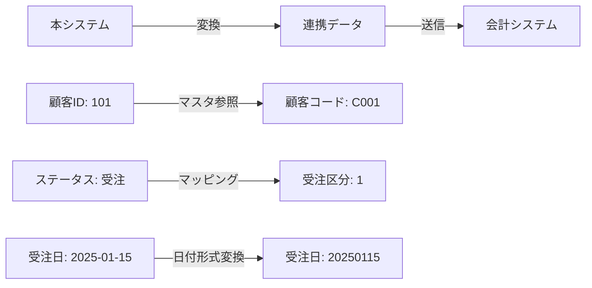
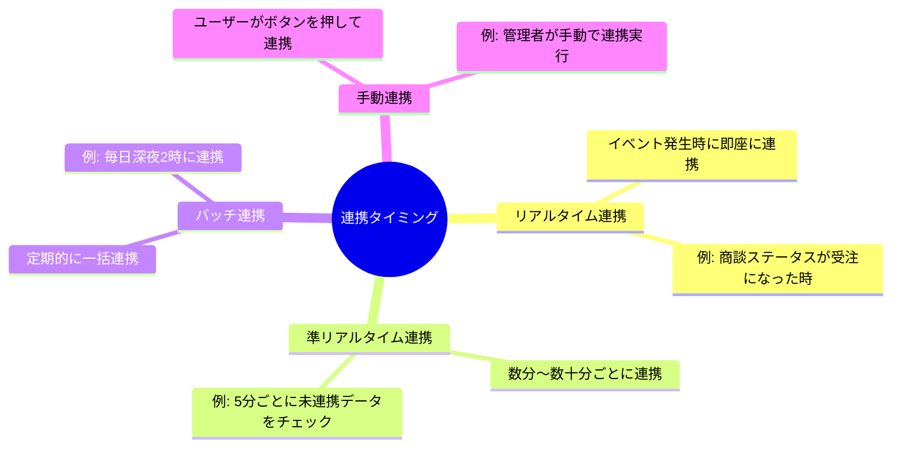
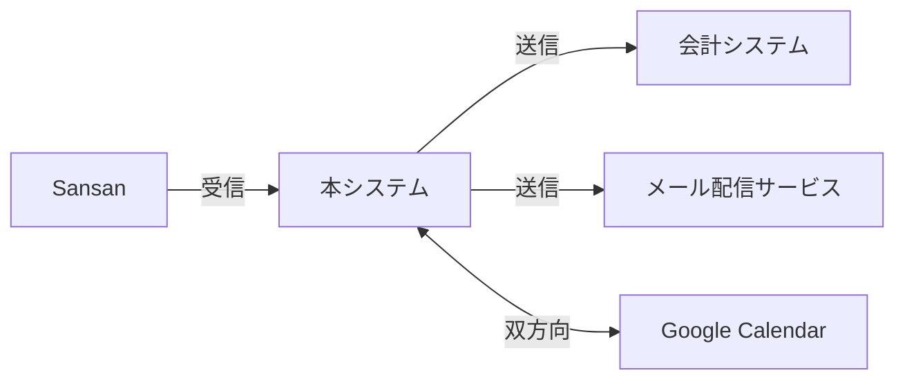
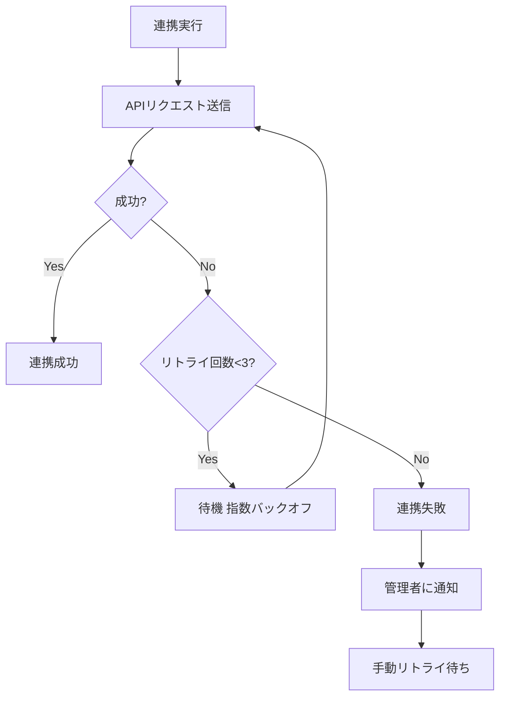
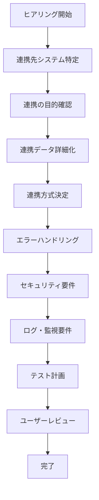

# 2.2.2.5 外部連携要件ヒアリング項目

## 目的

要件定義フェーズにおいて、**外部システム・サービスとのデータ連携・API連携**の要件を明確化するためのヒアリング項目を提供します。

### このドキュメントで得られること

1. 外部連携の必要性を引き出す質問テンプレート
2. 連携方式の選択方法
3. エラーハンドリング・リトライ戦略の決定方法
4. 外部連携の設計に必要な情報の収集方法

---

## 📋 ヒアリング項目一覧

### 1. 外部連携の必要性

#### 1.1 連携先システムの特定

```
Q: このシステムは、他のシステムとデータをやり取りしますか?
Q: どのシステムと連携しますか?
目的: 連携先システムを洗い出す
```

**Good Example**:
```
連携先システム:
1. 会計システム（既存システム）
   - 受注情報を会計システムに送信
2. メール配信サービス（外部SaaS）
   - 顧客にメールを送信
3. カレンダーサービス（Google Calendar）
   - 商談予定をカレンダーに登録
4. 名刺管理サービス（Sansan）
   - 顧客情報を取り込み
```

**連携先一覧（表形式）**:

| 連携先システム | 種別 | 連携方向 | 連携頻度 | 重要度 |
|--------------|------|---------|---------|-------|
| 会計システム | 既存社内システム | 送信 | リアルタイム | ⭐⭐⭐ 必須 |
| メール配信サービス | 外部SaaS | 送信 | リアルタイム | ⭐⭐ 推奨 |
| Google Calendar | 外部SaaS | 双方向 | リアルタイム | ⭐ オプション |
| Sansan | 外部SaaS | 受信 | 週1回バッチ | ⭐ オプション |

---

#### 1.2 連携の目的

```
Q: なぜ、そのシステムと連携する必要がありますか?
Q: 連携しない場合、どんな問題がありますか?
目的: 連携の必要性・優先度を明確化
```

**Good Example**:
```
会計システムとの連携:
- 目的: 受注情報を会計システムに自動送信し、請求書発行を自動化
- 連携しない場合: 営業担当者が手作業でExcelに転記→会計担当者に送信（月100件、各5分 = 500分/月の工数）
- 効果: 手作業が不要になり、転記ミスがなくなる
- 優先度: ⭐⭐⭐ 必須

Google Calendarとの連携:
- 目的: 商談予定をカレンダーに自動登録し、営業担当者のスケジュール管理を支援
- 連携しない場合: 営業担当者が手作業でカレンダーに登録
- 効果: 手作業が不要になる
- 優先度: ⭐ オプション（将来的に実装）
```

---

### 2. 連携データの詳細

#### 2.1 連携するデータ

```
Q: どのようなデータを連携しますか?
Q: どの項目を送信/受信しますか?
目的: 連携データの詳細を明確化
```

**Good Example (会計システムへの送信)**:

```
連携データ: 受注情報

送信項目:
- 受注ID（本システムの売上ID）
- 顧客コード（会計システムの顧客マスタのコード）
- 受注日
- 商品コード（会計システムの商品マスタのコード）
- 数量
- 単価
- 小計
- 合計金額
- 営業担当者コード

データ形式: JSON

サンプルデータ:
{
  "order_id": "1001",
  "customer_code": "C001",
  "order_date": "2025-01-15",
  "items": [
    {
      "product_code": "P001",
      "quantity": 10,
      "unit_price": 1000,
      "subtotal": 10000
    }
  ],
  "total_amount": 10000,
  "sales_person_code": "S001"
}
```

---

#### 2.2 データのマッピング

```
Q: 本システムのデータ項目と、連携先システムのデータ項目は一致していますか?
Q: 変換が必要な項目はありますか?
目的: データ変換ルールを明確化
```

**Good Example**:

| 本システム | 連携先システム | 変換ルール |
|-----------|--------------|-----------|
| 顧客ID | 顧客コード | 顧客マスタで顧客コードを取得 |
| ステータス "受注" | 受注区分 "1" | "受注" → "1" に変換 |
| 受注見込み金額 | 受注金額 | そのまま送信 |
| 受注日 "2025-01-15" | 受注日 "20250115" | YYYY-MM-DD → YYYYMMDD に変換 |

**データ変換の例**:



---

### 3. 連携方式

#### 3.1 連携タイミング

```
Q: データ連携は、いつ実行しますか?
目的: 連携タイミングを決定
```

**連携タイミングのパターン**:



**Good Example**:

| 連携先 | タイミング | 理由 |
|-------|----------|------|
| 会計システム | リアルタイム | 受注確定後すぐに請求処理を開始したい |
| メール配信 | リアルタイム | 顧客にすぐにメールを送信したい |
| Sansan | バッチ（週1回） | リアルタイム性は不要、負荷を分散したい |

---

#### 3.2 連携方式（プロトコル）

```
Q: どのような方法でデータを連携しますか?
目的: 連携方式（プロトコル）を決定
```

**連携方式のパターン**:

| 方式 | 説明 | メリット | デメリット | 適用例 |
|------|------|---------|-----------|--------|
| REST API | HTTP/HTTPSでJSON/XMLをやり取り | 標準的、実装しやすい | リアルタイム性が必要 | 外部SaaS連携 |
| SOAP API | HTTPでXMLをやり取り | エンタープライズ向け | 実装が複雑 | 既存レガシーシステム |
| ファイル連携 | CSV/Excel/JSONファイルを共有フォルダに配置 | システム間の依存が少ない | リアルタイム性がない | バッチ処理 |
| データベース直接連携 | 相手のDBに直接接続 | 高速 | 強い依存関係 | 社内システム |
| メッセージキュー | RabbitMQ, AWS SQS等 | 非同期、スケーラブル | インフラが必要 | 大量データ |

**Good Example**:

```
会計システム:
- 連携方式: REST API
- 理由: 会計システムがREST APIを提供している
- エンドポイント: POST /api/orders
- 認証: APIキー（Header: X-API-Key）

メール配信サービス:
- 連携方式: REST API（SendGrid）
- エンドポイント: POST /v3/mail/send
- 認証: Bearer Token

Sansan:
- 連携方式: ファイル連携（CSV）
- 方法: SansanからCSVをダウンロード→本システムにインポート
- 頻度: 週1回
```

---

#### 3.3 連携の向き

```
Q: データは、どちらからどちらへ送りますか?
Q: 双方向ですか?
目的: 連携の向きを明確化
```

**連携の向きのパターン**:



**Good Example**:

| 連携先 | 向き | 説明 |
|-------|------|------|
| 会計システム | 送信のみ | 受注情報を会計システムに送信 |
| メール配信サービス | 送信のみ | メール送信指示を送る |
| Sansan | 受信のみ | 顧客情報を取り込む |
| Google Calendar | 双方向 | 商談予定を登録・取得 |

---

### 4. エラーハンドリング・リトライ戦略

#### 4.1 連携エラーの検知

```
Q: 連携が失敗した場合、どのように検知しますか?
Q: どのような場合に失敗とみなしますか?
目的: エラー検知の仕組みを明確化
```

**Good Example**:
```
エラー検知:

1. HTTPステータスコードで判定:
   - 200-299: 成功
   - 400-499: クライアントエラー（本システムの問題）
   - 500-599: サーバーエラー（連携先の問題）

2. レスポンスのエラーフラグで判定:
   - {"status": "success"} → 成功
   - {"status": "error", "message": "..."} → 失敗

3. タイムアウト:
   - 10秒以内にレスポンスがない場合、失敗とみなす

失敗とみなすケース:
- HTTPステータスコード 500以上
- タイムアウト
- ネットワークエラー
- レスポンスのエラーフラグ
```

---

#### 4.2 リトライ戦略

```
Q: 連携が失敗した場合、再試行しますか?
Q: 何回まで再試行しますか?
目的: リトライ戦略を決定
```

**Good Example**:

```
リトライ戦略:

会計システム（重要度: ⭐⭐⭐ 必須）:
- 自動リトライ: 3回まで
- リトライ間隔: 指数バックオフ（1分、2分、4分）
- リトライ失敗後: 管理者にメール通知
- 手動リトライ: 管理者画面から可能

メール配信サービス（重要度: ⭐⭐ 推奨）:
- 自動リトライ: 1回まで
- リトライ間隔: 1分後
- リトライ失敗後: エラーログに記録（通知なし）
```

**リトライフロー**:



---

#### 4.3 エラー時の代替処理

```
Q: 連携が失敗した場合、どうしますか?
Q: 手作業で対応しますか?
目的: 連携失敗時の運用を決定
```

**Good Example**:
```
会計システム連携失敗時:
1. 自動リトライ（3回）
2. リトライ失敗後、管理者にメール通知
3. 管理者が管理画面から手動リトライ
4. それでも失敗する場合、Excelで会計システムに手作業で登録

運用ルール:
- 連携失敗データは「未連携」ステータスで管理
- 管理画面に「未連携データ一覧」を表示
- 管理者が定期的にチェック（毎朝9時）
```

---

### 5. 連携のセキュリティ

#### 5.1 認証・認可

```
Q: 連携先システムとの通信は、どのように認証しますか?
目的: 認証方式を決定
```

**認証方式のパターン**:

| 方式 | 説明 | セキュリティレベル | 適用例 |
|------|------|-------------------|--------|
| APIキー | HTTPヘッダーにAPIキーを含める | 中 | 簡易的な連携 |
| Bearer Token | JWTトークンを使用 | 高 | OAuth2.0対応サービス |
| Basic認証 | ユーザー名・パスワード | 低 | 社内システム |
| OAuth2.0 | トークンベース認証 | 高 | Google, Microsoft等 |
| 相互TLS認証 | クライアント証明書 | 最高 | 金融システム |

**Good Example**:
```
会計システム:
- 認証方式: APIキー
- 設定: HTTPヘッダー「X-API-Key: xxxxxxxx」
- APIキーの管理: 環境変数で管理（ハードコード禁止）

Google Calendar:
- 認証方式: OAuth2.0
- フロー: ユーザーがGoogleアカウントで認証→トークン取得
- トークンの保存: データベースで暗号化して保存
```

---

#### 5.2 通信の暗号化

```
Q: 連携時の通信は、暗号化しますか?
目的: 通信の暗号化要件を確認
```

**Good Example**:
```
通信の暗号化:
- すべての外部連携でHTTPS（TLS 1.2以上）を使用 ⭐⭐⭐ 必須
- HTTPは使用禁止
- 証明書の検証: 必須（自己署名証明書は不可）

ファイル連携:
- ファイルを暗号化して共有フォルダに配置
- 暗号化方式: AES-256
- パスワード: 別経路で連携先に共有
```

---

### 6. 連携のログ・監査

#### 6.1 連携ログ

```
Q: 連携の履歴を記録しますか?
Q: どのような情報を記録しますか?
目的: 連携ログ要件を明確化
```

**Good Example**:
```
連携ログ（テーブル）:

| 項目名 | データ型 | 説明 |
|--------|---------|------|
| ログID | 整数 | 主キー |
| 連携先 | 文字列 | 会計システム, メール配信サービス等 |
| 連携日時 | 日時 | 連携実行日時 |
| 連携方向 | 文字列 | 送信 or 受信 |
| ステータス | 文字列 | 成功 or 失敗 |
| リクエストデータ | JSON | 送信したデータ |
| レスポンスデータ | JSON | 受信したデータ |
| エラーメッセージ | テキスト | 失敗時のエラー内容 |
| リトライ回数 | 整数 | リトライした回数 |

保持期間:
- オンライン: 3ヶ月
- アーカイブ: 3年間
```

---

#### 6.2 連携の監視

```
Q: 連携の状況を監視しますか?
Q: 連携失敗が多発した場合、どうしますか?
目的: 連携の監視要件を明確化
```

**Good Example**:
```
監視項目:

1. 連携成功率:
   - 95%以上を維持
   - 90%を下回った場合、アラート

2. 連携失敗件数:
   - 1時間あたり5件以上の失敗でアラート

3. 連携レスポンスタイム:
   - 平均5秒以内
   - 10秒以上が3回連続で発生した場合、アラート

アラート通知先:
- 担当エンジニアにメール + Slack通知
```

---

### 7. テスト・検証

#### 7.1 連携テスト

```
Q: 連携テストは、どのように行いますか?
Q: テスト環境はありますか?
目的: 連携テスト計画を明確化
```

**Good Example**:
```
テスト環境:
- 会計システム: テスト環境あり（本番とは別のDB）
- メール配信サービス: サンドボックス環境あり
- Google Calendar: テストアカウントを使用

テストケース:
1. 正常系:
   - 受注情報を会計システムに送信
   - 会計システムで受注データを確認

2. 異常系:
   - 会計システムが停止している場合（リトライ確認）
   - 不正なデータを送信した場合（バリデーション確認）
   - タイムアウトが発生した場合

3. 性能テスト:
   - 100件の受注を一括送信
   - レスポンスタイムを測定
```

---

## 🎯 ヒアリングの進め方

### 外部連携のヒアリングフロー



---

## ✅ 外部連携要件ヒアリング完了チェックリスト

### 基本情報
- [ ] 連携先システムを洗い出し済み
- [ ] 連携の目的・優先度を確認済み
- [ ] 連携タイミングを確認済み

### 連携データ
- [ ] 連携データの詳細を確認済み
- [ ] データマッピング・変換ルールを確認済み

### 連携方式
- [ ] 連携方式（プロトコル）を決定済み
- [ ] 連携の向きを確認済み

### エラーハンドリング
- [ ] エラー検知方法を確認済み
- [ ] リトライ戦略を決定済み
- [ ] エラー時の代替処理を確認済み

### セキュリティ
- [ ] 認証方式を確認済み
- [ ] 通信の暗号化を確認済み

### ログ・監視
- [ ] 連携ログ要件を確認済み
- [ ] 連携の監視要件を確認済み

### テスト
- [ ] 連携テスト計画を確認済み

---

## 🚨 よくある失敗パターン

### ❌ 連携先の仕様を確認せずに進める

**Bad Example**:
```
Claude: 会計システムと連携しますね。REST APIで実装します。
```

**理由**: 会計システムがREST APIを提供しているか不明

**Good Example**:
```
Claude: 会計システムは、どのような連携方法を提供していますか?
        REST API、SOAP API、ファイル連携のどれですか?
User: ファイル連携（CSV）です。
Claude: かしこまりました。では、CSVファイルでデータを連携します。
```

---

### ❌ エラーハンドリングを考えない

**Bad Example**:
```
Claude: 連携が失敗した場合は、エラーログに記録します。
```

**理由**: エラーログだけでは、連携失敗に気づかない可能性がある

**Good Example**:
```
Claude: 連携が失敗した場合、どうしますか?
        自動リトライは必要ですか? 管理者に通知しますか?
User: 自動リトライして、それでも失敗したら管理者にメール通知してください。
```

---

### ❌ セキュリティを軽視する

**Bad Example**:
```
User: APIキーをコードに直接書いてください。
Claude: かしこまりました。（そのまま実装）
```

**理由**: APIキーのハードコードはセキュリティリスク

**Good Example**:
```
User: APIキーをコードに直接書いてください。
Claude: APIキーをコードに直接書くと、セキュリティリスクがあります。
        環境変数で管理し、コードにはハードコードしない方が安全です。
        よろしいでしょうか?
```

---

## 📚 次のステップ

外部連携要件ヒアリングが完了したら:

1. **2.2.7.3 システム構成図.md** を参照し、外部連携を含むシステム構成図を作成
2. **2.2.2.6 一問一答の進め方.md** へ進む
3. ヒアリング全体の進め方を確認

---

## 関連ドキュメント

- [2.2.2.1 機能要件ヒアリング項目](./2.2.2.1_機能要件ヒアリング項目.md) - 機能要件のヒアリング
- [2.2.7.3 システム構成図](./2.2.7.3_システム構成図（概念レベル）.md) - システム構成の図示
- [2.2.6.3 セキュリティ要件の記述方法](./2.2.6.3_セキュリティ要件の記述方法.md) - セキュリティ要件の書き方

---

**作成日**: 2025-10-19
**対象フェーズ**: 要件定義
**重要度**: ⭐⭐⭐ 必須（外部連携がある場合）
