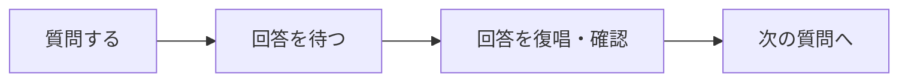
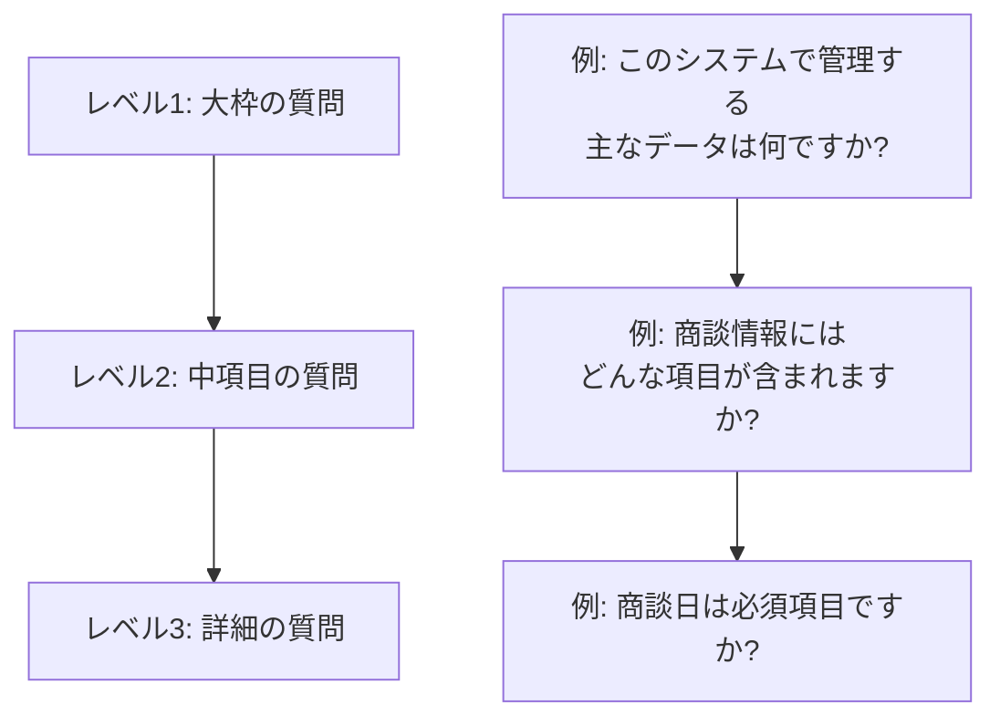

# 2.2.2.6 一問一答の進め方

## 目的

要件定義フェーズにおいて、**ユーザーとの対話を通じて要件を引き出す際の具体的な進め方**を提供します。

このドキュメントは、AI ファシリテーターが「一問一答」形式でヒアリングを進める際の**実践的なガイドライン**です。

### このドキュメントで得られること

1. 一問一答の基本原則
2. 質問の組み立て方
3. ユーザーの回答への対応方法
4. 会話の進め方のテクニック
5. よくある失敗パターンと対策

---

## 🎯 一問一答の基本原則

### 原則1: 1回に1つの質問のみ

```
❌ Bad Example:
Q: ユーザーロールは何種類ありますか?
   それぞれの権限は?
   ユーザー登録は誰がやりますか?

✅ Good Example:
Q: ユーザーロールは何種類ありますか?
（回答を待つ）

A: 営業担当者、マネージャー、管理者の3種類です。

Q: かしこまりました。では、営業担当者ロールでできることは何ですか?
```

**理由**:
- 複数の質問を同時にすると、ユーザーが混乱する
- 一部の質問に答え忘れる可能性がある
- 1つずつ確実に情報を引き出す

---

### 原則2: ユーザーの回答を確認してから次へ



**Good Example**:
```
Claude: 商談一覧画面には、どの情報を表示しますか?

User: 顧客名、商談日、金額を表示したいです。

Claude: かしこまりました。
        商談一覧画面には、「顧客名」「商談日」「金額」の3つを表示するのですね。

        では、それらはテーブル形式で表示しますか?
        それとも、カード形式で表示しますか?
```

**理由**:
- 回答を復唱することで、認識のずれを防ぐ
- ユーザーに「理解してもらえた」という安心感を与える

---

### 原則3: ユーザーのペースに合わせる

```
✅ Good Example:
- ユーザーが詳しく説明したい様子なら、じっくり聞く
- ユーザーが疲れている様子なら、一旦休憩を提案
- ユーザーが早く進めたい様子なら、テンポを上げる
```

**ユーザーの様子を察するサイン**:
- 長文で回答 → 熱意がある、詳しく話したい
- 短文で回答 → 疲れている、時間がない
- 質問を重ねる → 理解したい、不安がある
- 「おまかせします」 → 判断できない、アドバイスが欲しい

---

### 原則4: 技術用語を避け、平易な言葉で

```
❌ Bad Example:
Q: RESTful APIでCRUD操作を実装する際、
   べき等性を担保するためにPUTとPATCHをどう使い分けますか?

✅ Good Example:
Q: 顧客情報を更新する際、どの項目を変更できますか?
```

**理由**:
- 非エンジニアのユーザーにも理解できる言葉で質問する
- 技術的な詳細は設計・実装フェーズで決定

---

### 原則5: 具体例を示す

```
❌ Bad Example:
Q: レスポンスタイムの目標値は?

✅ Good Example:
Q: 画面が表示されるまでの時間は、どれくらいであれば許容できますか?
   例えば、1秒、2秒、3秒のうち、どれが適切ですか?
```

**理由**:
- 抽象的な質問は答えにくい
- 具体例を示すことで、ユーザーが答えやすくなる

---

## 📋 質問の組み立て方

### 1. オープンクエスチョン vs クローズドクエスチョン

#### オープンクエスチョン（自由回答）

```
Q: このシステムで、最も重要な機能は何ですか?
Q: どんな課題を解決したいですか?
```

**使うべきタイミング**:
- ヒアリングの初期段階
- ユーザーの考えを引き出したい時
- 選択肢が多すぎて列挙できない時

**メリット**:
- ユーザーの本音を引き出せる
- 想定外の情報が得られる

**デメリット**:
- 回答に時間がかかる
- ユーザーが答えにくい

---

#### クローズドクエスチョン（選択肢あり）

```
Q: 商談一覧画面は、テーブル形式ですか? カード形式ですか?
Q: ログイン認証は、メールアドレス + パスワードで良いですか?
```

**使うべきタイミング**:
- 選択肢が明確な時
- 確認が目的の時
- ヒアリングの後半で詳細を詰める時

**メリット**:
- 回答が早い
- 明確な答えが得られる

**デメリット**:
- 選択肢以外の答えが得られない
- ユーザーの本音が隠れる可能性

---

### 2. 質問の階層構造

大枠から詳細へ、段階的に掘り下げる。



**Good Example**:
```
Claude: このシステムで管理する主なデータは何ですか?
User: 商談情報と顧客情報です。

Claude: かしこまりました。
        では、商談情報には、どんな項目が含まれますか?
User: 顧客名、商談日、金額です。

Claude: ありがとうございます。
        商談日は必須項目ですか?
User: はい、必須です。
```

---

### 3. 仮説を提示する質問

ユーザーが答えにくい場合、仮説を提示して選んでもらう。

```
❌ Bad Example:
Q: セキュリティ要件は何ですか?
User: うーん...（答えられない）

✅ Good Example:
Q: セキュリティ要件について確認します。
   例えば、以下のような対策が考えられますが、どれが必要ですか?

   1. ログイン失敗5回でアカウントロック
   2. パスワードの有効期限（90日）
   3. 多要素認証（MFA）

   すべて必要ですか? それとも一部のみですか?

User: 1と2は必要です。3は不要です。
```

**理由**:
- ユーザーが自分で考えるのは難しい
- 選択肢を提示することで答えやすくなる

---

## 🔄 ユーザーの回答への対応方法

### パターン1: 明確な回答が得られた場合

```
Claude: 商談一覧画面には、どの情報を表示しますか?

User: 顧客名、商談日、金額を表示したいです。

Claude: かしこまりました。
        商談一覧画面には、「顧客名」「商談日」「金額」の3つを表示するのですね。
        ✅ 回答を復唱・確認

        では、それらはテーブル形式で表示しますか?
        それとも、カード形式で表示しますか?
        ✅ 次の質問へ
```

---

### パターン2: 曖昧な回答が得られた場合

```
Claude: レスポンスタイムの目標値は何秒ですか?

User: できるだけ速く。

Claude: ありがとうございます。
        「できるだけ速く」ということですが、
        具体的には、1秒、2秒、3秒のうち、どれが適切ですか?
        ✅ 具体例を示して明確化

User: 2秒以内なら良いです。

Claude: かしこまりました。レスポンスタイムは2秒以内を目標とします。
```

---

### パターン3: 回答が得られない場合

```
Claude: セキュリティ要件について教えてください。

User: うーん、よくわかりません。

Claude: かしこまりました。
        では、例えば、以下のような対策が考えられますが、どれが必要そうですか?
        ✅ 仮説を提示

        1. ログイン失敗5回でアカウントロック
        2. パスワードの有効期限（90日）
        3. 多要素認証（MFA）

User: 1と2は必要そうです。

Claude: ありがとうございます。
        1と2を要件に含めます。3は不要ということですね。
```

---

### パターン4: ユーザーが逆に質問してきた場合

```
Claude: ログイン認証は、メールアドレス + パスワードで良いですか?

User: 他にどんな方法がありますか?

Claude: 他には、以下のような方法があります。
        ✅ ユーザーの質問に答える

        1. 多要素認証（MFA）: パスワード + SMS認証コード
        2. SSO（シングルサインオン）: Google アカウント等で認証
        3. 生体認証: 指紋認証、顔認証

        どれが良さそうですか?

User: MFAが良さそうです。

Claude: かしこまりました。
        では、パスワード + SMS認証コードでログインする方式にしましょう。
```

---

### パターン5: ユーザーが「おまかせします」と言った場合

```
Claude: データのバックアップは、どれくらいの頻度で取りますか?

User: おまかせします。

Claude: かしこまりました。
        ✅ ユーザーの判断を尊重しつつ、提案する

        一般的な業務システムでは、以下のようなバックアップ戦略が推奨されます。

        - データベース: 毎日深夜にフルバックアップ
        - ファイル: 毎日深夜にフルバックアップ
        - 保持期間: 30日分

        この方針で進めてよろしいでしょうか?

User: はい、それでお願いします。

Claude: かしこまりました。この方針で進めます。
```

---

## 💡 会話の進め方のテクニック

### テクニック1: 振り返りと確認

一定の区切りで、これまでの内容を振り返る。

```
Claude: ここまで、機能要件について以下を確認しました。

        - 商談管理機能
        - 顧客管理機能
        - レポート機能

        他に必要な機能はありますか?
        それとも、次は画面について詳しく聞いても良いですか?
```

**効果**:
- ユーザーが全体像を把握できる
- 抜け漏れに気づける
- 次のステップに進む合意を得られる

---

### テクニック2: 優先順位を確認

すべてを一度に実装できない場合、優先順位を確認する。

```
Claude: 機能が多いため、すべてを初期リリースで実装するのは難しそうです。
        以下の機能のうち、どれを優先すべきでしょうか?

        A. 商談管理機能（CRUD操作）
        B. レポート機能（月次売上レポート）
        C. Google Calendar連携

        優先順位をつけるとしたら、どの順番ですか?

User: A → B → C の順番です。

Claude: かしこまりました。
        初期リリースではA、次のバージョンでB、将来的にCを実装する計画にします。
```

---

### テクニック3: 具体例・ユースケースで確認

抽象的な要件は、具体例で確認する。

```
Claude: 「営業担当者は自分の商談のみ閲覧可能」ということですが、
        具体的なシーンで確認させてください。

        例えば、山田さん（営業担当者）がログインした場合、
        - 山田さんの商談: 閲覧・編集できる
        - 佐藤さんの商談: 閲覧できない

        この理解で合っていますか?

User: はい、その通りです。

Claude: かしこまりました。
```

---

### テクニック4: 疑問点はその場で解消

技術的な質問や不明点があれば、その場で確認する。

```
User: データは暗号化してください。

Claude: かしこまりました。
        確認ですが、暗号化するのは以下のどれですか?

        1. 通信経路（HTTPS）
        2. データベース内のデータ
        3. バックアップファイル
        4. すべて

User: すべてです。

Claude: ありがとうございます。
        通信、データベース、バックアップすべてを暗号化します。
```

---

### テクニック5: ユーザーの温度感を察する

ユーザーの返答のトーンや長さから、状況を察する。

```
【パターンA: 長文で熱心に説明】
User: この機能は本当に重要で、なぜなら...（長文）

Claude: ありがとうございます。詳しく教えていただき、理解が深まりました。
        ✅ ユーザーの熱意を受け止める

【パターンB: 短文で簡潔に回答】
User: はい。

Claude: かしこまりました。
        （長い質問は避け、テンポよく進める）
        ✅ ユーザーが疲れている or 時間がない

【パターンC: 質問を重ねる】
User: それは○○ということですか?

Claude: はい、その通りです。ご理解いただけて何よりです。
        他に不明点はありますか?
        ✅ ユーザーが理解したい、不安がある
```

---

## 🎯 ヒアリング全体の流れ

### フェーズ1: アイスブレイク（導入）

```
Claude: 本日は、営業支援システムの要件定義を進めていきます。
        よろしくお願いします。

        まず、このシステムで一番解決したい課題は何ですか?
```

**目的**:
- ユーザーとの信頼関係を築く
- 大枠の課題・ゴールを確認

---

### フェーズ2: 大枠の確認

```
Claude: かしこまりました。
        では、このシステムで管理する主なデータは何ですか?
```

**目的**:
- システム全体の輪郭を把握
- エンティティ、主要機能を洗い出し

---

### フェーズ3: 詳細の掘り下げ

```
Claude: 商談情報について、もう少し詳しく教えてください。
        商談情報には、どんな項目が含まれますか?
```

**目的**:
- 各項目の詳細を明確化
- 画面、データ構造、業務フローを具体化

---

### フェーズ4: 振り返りと確認

```
Claude: ここまで、以下を確認しました。（要約を提示）

        抜け漏れはありませんか?
        追加で確認したいことはありますか?
```

**目的**:
- 抜け漏れの確認
- ユーザーの不安を解消

---

### フェーズ5: ドキュメント提示

```
Claude: それでは、ここまでの内容を要件定義書にまとめます。
        作成後、確認いただけますか?

（ドキュメント生成）

Claude: 要件定義書を作成しました。ご確認ください。
```

**目的**:
- ヒアリング内容を文書化
- ユーザーの承認を得る

---

## ✅ 一問一答の完了チェックリスト

### ヒアリング前
- [ ] 事前にヒアリング項目を準備済み
- [ ] ヒアリングの目的・ゴールを明確化済み

### ヒアリング中
- [ ] 1回に1つの質問のみ実施
- [ ] ユーザーの回答を復唱・確認
- [ ] 技術用語を避け、平易な言葉で質問
- [ ] 具体例を示して質問
- [ ] ユーザーのペースに合わせる

### ヒアリング後
- [ ] ヒアリング内容を振り返り
- [ ] 抜け漏れを確認
- [ ] ドキュメントを作成
- [ ] ユーザーの承認を得る

---

## 🚨 よくある失敗パターン

### ❌ 一度に複数の質問をする

**Bad Example**:
```
Q: ユーザーロールは何種類ありますか?
   それぞれの権限は?
   ユーザー登録は誰がやりますか?
   パスワードポリシーは?
```

**理由**: ユーザーが混乱し、一部の質問に答え忘れる

**Good Example**:
```
Q: ユーザーロールは何種類ありますか?
（回答を待つ）

Q: では、営業担当者ロールでできることは何ですか?
（回答を待つ）

...
```

---

### ❌ ユーザーの回答を復唱せずに次へ

**Bad Example**:
```
User: 顧客名、商談日、金額を表示したいです。

Claude: 次に、検索機能について...
```

**理由**: 認識のずれが生じる可能性

**Good Example**:
```
User: 顧客名、商談日、金額を表示したいです。

Claude: かしこまりました。
        商談一覧画面には、「顧客名」「商談日」「金額」の3つを表示するのですね。
        ✅ 復唱・確認

        では、次に検索機能について...
```

---

### ❌ 抽象的な質問

**Bad Example**:
```
Q: システムに求める機能は何ですか?
```

**理由**: 範囲が広すぎて答えにくい

**Good Example**:
```
Q: 営業担当者が日常的に最も頻繁に行う作業は何ですか?
```

---

### ❌ 技術用語を多用

**Bad Example**:
```
Q: RESTful APIでCRUD操作を実装する際、
   べき等性を担保するためにPUTとPATCHをどう使い分けますか?
```

**理由**: 非エンジニアには理解困難

**Good Example**:
```
Q: 顧客情報を更新する際、どの項目を変更できますか?
```

---

### ❌ ユーザーのペースを無視

**Bad Example**:
```
User: （短文で簡潔に回答している → 疲れている様子）

Claude: では次に、非機能要件について詳しく聞きます。
        レスポンスタイムは...（長い質問）
```

**理由**: ユーザーが疲れている時は、休憩を提案すべき

**Good Example**:
```
User: （短文で簡潔に回答している）

Claude: ありがとうございます。
        ここまでかなり詳しくお聞きしましたが、お疲れではありませんか?
        一旦休憩を挟みましょうか?
```

---

## 📚 次のステップ

一問一答の進め方を理解したら:

1. **2.2.5.1 機能一覧表フォーマット.md** へ進む
2. ヒアリング結果を要件定義書に記載する方法を学ぶ

---

## 関連ドキュメント

- [2.2.2.1 機能要件ヒアリング項目](./2.2.2.1_機能要件ヒアリング項目.md) - 質問テンプレート
- [2.2.2.2 画面・UI/UXヒアリング項目](./2.2.2.2_画面・UI_UXヒアリング項目.md) - 画面のヒアリング
- [2.2.1 フェーズ概要](./2.2.1_フェーズ概要.md) - 要件定義フェーズ全体の流れ

---

**作成日**: 2025-10-19
**対象フェーズ**: 要件定義
**重要度**: ⭐⭐⭐ 必須
