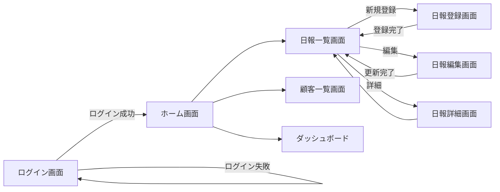
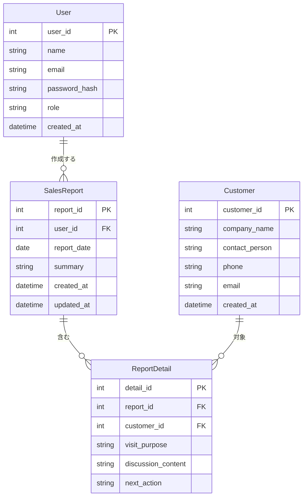
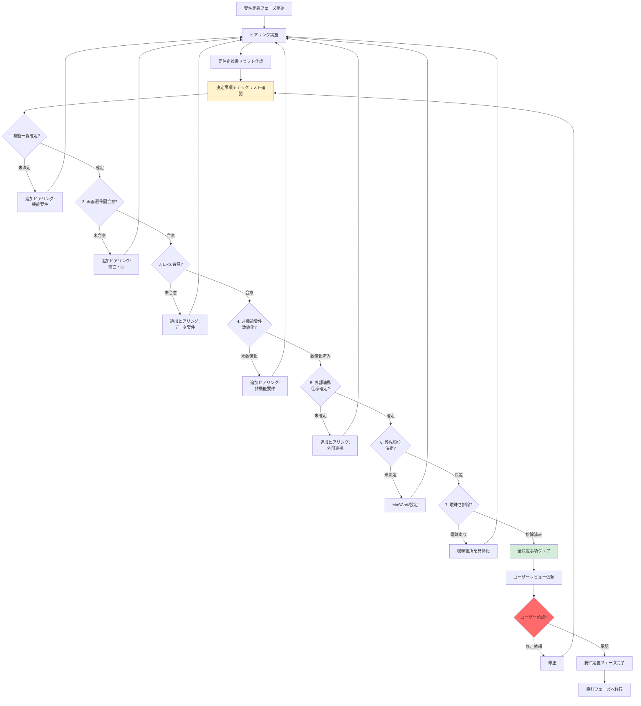

# 2.2.3 決定事項チェックリスト（要件定義フェーズ）

## 📋 このドキュメントの目的

要件定義フェーズで**必ず決定すべき事項**を明確化し、抜け漏れなく確認する。

**重要:** このチェックリストの全項目が決定されるまで、設計フェーズには進まない。

---

## ✅ 必須決定事項（7項目）

### 1. 機能一覧の確定

#### 決定すべき内容

- [ ] **機能一覧表が作成されている**
  - 機能ID、機能名、機能概要、ユーザー種別、優先度
  - すべての機能が網羅されている

- [ ] **機能の粒度が適切**
  - 大機能/中機能/小機能の階層化
  - 実装可能な粒度まで分解されている

- [ ] **優先順位が決定されている（MoSCoW）**
  - Must: 必須機能（MVP）
  - Should: 重要機能（フェーズ1完成まで）
  - Could: 可能であれば（フェーズ2以降）
  - Won't: 今回は実装しない

#### Good Example

```markdown
| 機能ID | 機能名 | 機能概要 | ユーザー種別 | 優先度 |
|--------|--------|----------|--------------|--------|
| F-001 | ログイン機能 | ID/PWでログイン | 全ユーザー | Must |
| F-002 | 営業日報登録 | 訪問先・商談内容を記録 | 営業担当 | Must |
| F-003 | 営業日報検索 | 期間・担当者で検索 | 営業担当・管理者 | Must |
| F-004 | ダッシュボード | 営業実績をグラフ表示 | 管理者 | Should |
| F-005 | 顧客情報CSV出力 | 顧客一覧をCSV出力 | 管理者 | Could |
| F-006 | Slack連携通知 | 日報登録時にSlack通知 | - | Won't |
```

#### Bad Example

```markdown
❌ 「営業支援機能」（粒度が大きすぎる）
❌ 「便利な機能」（曖昧）
❌ 優先順位なし（何から作るか不明）
```

---

### 2. 画面遷移図の合意

#### 決定すべき内容

- [ ] **画面一覧が確定している**
  - 画面ID、画面名、画面概要
  - すべての画面が網羅されている

- [ ] **画面遷移フローが確定している**
  - Mermaid図で可視化
  - 遷移条件が明確

- [ ] **主要画面のイメージが共有されている**
  - ワイヤーフレーム or 参考サイト
  - レイアウトイメージの合意

#### Good Example



**画面一覧**:
```markdown
| 画面ID | 画面名 | 画面概要 | 遷移元 |
|--------|--------|----------|--------|
| S-001 | ログイン画面 | ID/PWでログイン | - |
| S-002 | ホーム画面 | メニュー表示 | ログイン画面 |
| S-003 | 日報一覧画面 | 日報の一覧表示 | ホーム画面 |
| S-004 | 日報登録画面 | 新規日報登録 | 日報一覧画面 |
```

#### Bad Example

```markdown
❌ 画面遷移図なし（ユーザーが全体像を把握できない）
❌ 「いくつか画面があります」（具体的な数が不明）
❌ 遷移条件が曖昧（「ボタンを押したら次の画面」）
```

---

### 3. データモデル（ER図）の合意

#### 決定すべき内容

- [ ] **管理対象のデータ（エンティティ）が確定**
  - すべてのエンティティが洗い出されている
  - エンティティ名が明確

- [ ] **データ項目（属性）が確定**
  - 各エンティティの属性が明確
  - データ型、必須/任意が明確

- [ ] **データ間の関連（リレーション）が確定**
  - 1:1、1:N、N:Nの関係が明確
  - 外部キーの関係が明確

- [ ] **データ量が把握されている**
  - 各エンティティの想定レコード数
  - データ保持期間

#### Good Example



**データ量**:
```markdown
| エンティティ | 想定レコード数 | 保持期間 |
|-------------|---------------|----------|
| User | 100名 | 無期限 |
| Customer | 5,000社 | 無期限 |
| SalesReport | 10,000件/年 | 5年間 |
| ReportDetail | 30,000件/年 | 5年間 |
```

#### Bad Example

```markdown
❌ 「データベースに保存します」（エンティティ不明）
❌ 「ユーザー情報」だけ（属性が不明）
❌ リレーションなし（データの関連が不明）
❌ データ量不明（スケーラビリティ不明）
```

---

### 4. 非機能要件の数値目標決定

#### 決定すべき内容

- [ ] **性能要件が数値化されている**
  - レスポンスタイム（秒）
  - スループット（同時ユーザー数）
  - データ処理量（件/秒）

- [ ] **可用性要件が数値化されている**
  - 稼働時間（24/7 or 営業時間のみ）
  - 目標稼働率（99.9%等）
  - RTO/RPO（障害復旧目標）

- [ ] **セキュリティ要件が明確**
  - 認証方式
  - 認可・権限管理
  - データ暗号化要件
  - 監査ログ要件

- [ ] **運用要件が明確**
  - バックアップ要件（頻度、世代管理）
  - 監視要件
  - ログ保持期間

#### Good Example

**性能要件**:
```markdown
| 項目 | 目標値 | 測定条件 |
|------|--------|----------|
| 画面表示 | 3秒以内 | 通常時 |
| 検索処理 | 5秒以内 | 1,000件ヒット時 |
| 同時ユーザー数 | 100ユーザー | ピーク時 |
| データ登録 | 1秒以内 | 通常時 |
```

**可用性要件**:
```markdown
| 項目 | 目標値 |
|------|--------|
| 稼働時間 | 平日 9:00-18:00 |
| 目標稼働率 | 99.5%以上（業務時間内） |
| RTO | 4時間以内 |
| RPO | 1時間以内 |
```

**セキュリティ要件**:
```markdown
| 項目 | 要件 |
|------|------|
| 認証 | ID/パスワード + 多要素認証（SMS） |
| 認可 | ロールベースアクセス制御（管理者/一般ユーザー） |
| 暗号化（保存時） | AES-256 |
| 暗号化（転送時） | TLS 1.2以上 |
| 監査ログ | ログイン、データ更新、削除を記録、1年間保持 |
```

**運用要件**:
```markdown
| 項目 | 要件 |
|------|------|
| バックアップ | 日次フルバックアップ、7世代管理 |
| 監視 | CPU/メモリ/ディスク使用率を5分間隔で監視 |
| ログ保持 | アプリケーションログ90日間保持 |
```

#### Bad Example

```markdown
❌ 「速く動作すること」（数値なし）
❌ 「高い可用性」（数値なし）
❌ 「セキュアであること」（具体性なし）
❌ 「バックアップする」（頻度・世代不明）
```

---

### 5. 外部システム連携仕様の確定

#### 決定すべき内容

- [ ] **連携先システムが特定されている**
  - システム名、連携目的

- [ ] **連携方式が決定されている**
  - API連携 / ファイル連携 / DB連携

- [ ] **連携タイミングが決定されている**
  - リアルタイム / バッチ（頻度）

- [ ] **連携データ項目が確定されている**
  - データ項目、データ型、必須/任意

- [ ] **エラー時の対応が決定されている**
  - リトライ方針、エラー通知

#### Good Example

```markdown
## 外部連携仕様

### 連携1: 会計システムとの連携

| 項目 | 内容 |
|------|------|
| 連携先 | 会計システム（○○会計） |
| 連携目的 | 売上データの連携 |
| 連携方式 | ファイル連携（CSV） |
| 連携タイミング | 日次バッチ（毎日 23:00） |
| 連携データ | 売上日、顧客名、金額、担当者 |
| エラー時対応 | 管理者にメール通知、翌日再実行 |

### 連携2: Salesforceとの連携

| 項目 | 内容 |
|------|------|
| 連携先 | Salesforce |
| 連携目的 | 顧客情報の同期 |
| 連携方式 | REST API |
| 連携タイミング | リアルタイム（顧客情報更新時） |
| 連携データ | 顧客ID、会社名、担当者、電話番号 |
| エラー時対応 | 3回リトライ、失敗時はログ記録 |
```

#### Bad Example

```markdown
❌ 「他のシステムと連携します」（システム名不明）
❌ 「データを送ります」（連携方式不明）
❌ 「たまに連携します」（タイミング不明）
❌ エラー時の対応なし
```

---

### 6. 優先順位の決定（MoSCoW）

#### 決定すべき内容

- [ ] **Must（必須）が明確**
  - MVP（Minimum Viable Product）として必要な機能
  - これがないとシステムとして成立しない

- [ ] **Should（重要）が明確**
  - フェーズ1完成までに実装したい機能
  - ビジネス価値が高い

- [ ] **Could（可能であれば）が明確**
  - フェーズ2以降で検討
  - あると便利だが必須ではない

- [ ] **Won't（今回は実装しない）が明確**
  - スコープ外として明示
  - ステークホルダーと合意

#### Good Example

```markdown
## 優先順位（MoSCoW）

### Must（必須） - MVP
- ユーザー認証（ログイン/ログアウト）
- 営業日報登録
- 営業日報一覧表示
- 営業日報検索
- 顧客情報管理

### Should（重要） - フェーズ1完成まで
- ダッシュボード（営業実績グラフ）
- CSV出力
- 権限管理（管理者/一般ユーザー）

### Could（可能であれば） - フェーズ2以降
- モバイルアプリ
- 音声入力機能
- AI提案機能

### Won't（今回は実装しない）
- Slack連携通知（外部連携の優先度低）
- 多言語対応（国内利用のみ）
- ダークモード
```

**優先順位の理由**:
```markdown
- Must: 営業日報管理の基本機能。これがないと業務が回らない。
- Should: 営業実績の可視化。マネージャーの要望が強い。
- Could: 将来的にはあると便利だが、今回は見送り。
- Won't: スコープ外として明示。ステークホルダーと合意済み。
```

#### Bad Example

```markdown
❌ すべて「Must」（優先順位なし）
❌ 「なるべく全部実装したい」（スコープが曖昧）
❌ Won't が明示されていない（スコープ外が不明確）
```

---

### 7. 要件の曖昧さ排除の確認

#### 決定すべき内容

- [ ] **曖昧な表現が残っていない**
  - 「速く」「多く」「高い」などの曖昧表現を排除
  - すべて数値化・具体化されている

- [ ] **解釈の余地がない**
  - 読み手によって解釈が変わらない
  - 実装者が迷わない

- [ ] **前提条件が明記されている**
  - 「○○の場合」の条件が明確

#### Good Example

```markdown
✅ 「検索結果は3秒以内に表示される」（具体的）
✅ 「同時100ユーザーのアクセスに対応」（具体的）
✅ 「ログイン失敗3回でアカウントロック」（具体的）
✅ 「日次バックアップを7世代管理」（具体的）
```

#### Bad Example

```markdown
❌ 「速く動作する」
❌ 「たくさんのユーザーが使える」
❌ 「セキュアである」
❌ 「適切にバックアップする」
```

---

## 🔍 決定事項チェックフロー



---

## 📋 決定事項チェックシート

### プロジェクト名: _______________

### チェック実施日: _______________

| # | 決定事項 | 状態 | 備考 |
|---|---------|------|------|
| 1 | 機能一覧の確定 | ☐ 確定 / ☐ 未決定 | |
| 2 | 画面遷移図の合意 | ☐ 合意 / ☐ 未合意 | |
| 3 | データモデル（ER図）の合意 | ☐ 合意 / ☐ 未合意 | |
| 4 | 非機能要件の数値目標決定 | ☐ 決定 / ☐ 未決定 | |
| 5 | 外部システム連携仕様の確定 | ☐ 確定 / ☐ 未確定 / ☐ 該当なし | |
| 6 | 優先順位の決定（MoSCoW） | ☐ 決定 / ☐ 未決定 | |
| 7 | 要件の曖昧さ排除の確認 | ☐ 排除済み / ☐ 曖昧あり | |

### 総合判定

- [ ] **全項目が決定済み** → 設計フェーズへ進んでよい
- [ ] **未決定あり** → 追加ヒアリング必要

---

## 💡 よくある未決定パターンと対処法

### パターン1: 非機能要件が曖昧

**症状**:
- 「速く動けばいい」
- 「障害時は復旧する」

**対処法**:
```markdown
AI: 「速く」とは、具体的に何秒以内でしょうか？
ユーザー: 3秒くらいかな。
AI: ありがとうございます。「検索結果は3秒以内に表示される」と記載します。

AI: 障害時の復旧について、目標復旧時間（RTO）はどのくらいでしょうか？
ユーザー: 半日以内には復旧したい。
AI: 承知しました。「RTO: 4時間以内」と記載します。
```

---

### パターン2: 優先順位が決まっていない

**症状**:
- すべて「重要」
- どれから実装するか不明

**対処法**:
```markdown
AI: すべて重要な機能ですが、まずMVP（最小限の機能）を決めましょう。
   「これがないとシステムとして成立しない」機能は何でしょうか？

ユーザー: ログインと日報登録・検索は必須です。

AI: ありがとうございます。それをMust（必須）としますね。
   次に、「フェーズ1完成までに実装したい」機能は何でしょうか？

ユーザー: ダッシュボードがあるとマネージャーが喜ぶと思います。

AI: 承知しました。それをShould（重要）としますね。
```

---

### パターン3: 外部連携の詳細が不明

**症状**:
- 「会計システムと連携する」（方式不明）
- 「データを送る」（タイミング不明）

**対処法**:
```markdown
AI: 会計システムとの連携について、連携方式は決まっていますか？
   API連携、ファイル連携、DB連携のいずれでしょうか？

ユーザー: 会計システムのAPIは提供されていないので、ファイル連携になると思います。

AI: 承知しました。連携タイミングはリアルタイムですか、バッチですか？

ユーザー: 毎日夜にまとめて送れば大丈夫です。

AI: ありがとうございます。「日次バッチ（毎日23:00）」と記載します。
```

---

## 📝 まとめ

### 決定事項チェックリストの重要性

**この7項目が決まっていない = 要件が不明確**

1. 機能一覧の確定 → 何を作るかが決まる
2. 画面遷移図の合意 → ユーザー体験が決まる
3. ER図の合意 → データ設計が決まる
4. 非機能要件の数値目標決定 → 品質基準が決まる
5. 外部連携仕様の確定 → システム間連携が決まる
6. 優先順位の決定 → 実装順序が決まる
7. 曖昧さ排除の確認 → 解釈の余地がなくなる

**全項目が決定されて初めて、設計フェーズに進める。**

---

### AIファシリテーターとしての心構え

1. **妥協しない** - 曖昧なまま次フェーズに進まない
2. **一問一答で確認** - ユーザーと一緒に決定事項を埋める
3. **数値化を徹底** - 「速く」「多く」「高い」を排除
4. **ユーザー承認を必ず取得** - 決定事項を共有・合意

---

**最終更新**: 2025-10-19
**作成者**: Claude (AI開発ファシリテーター)
