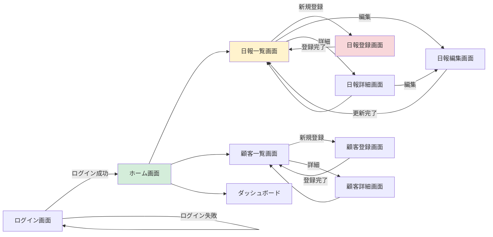
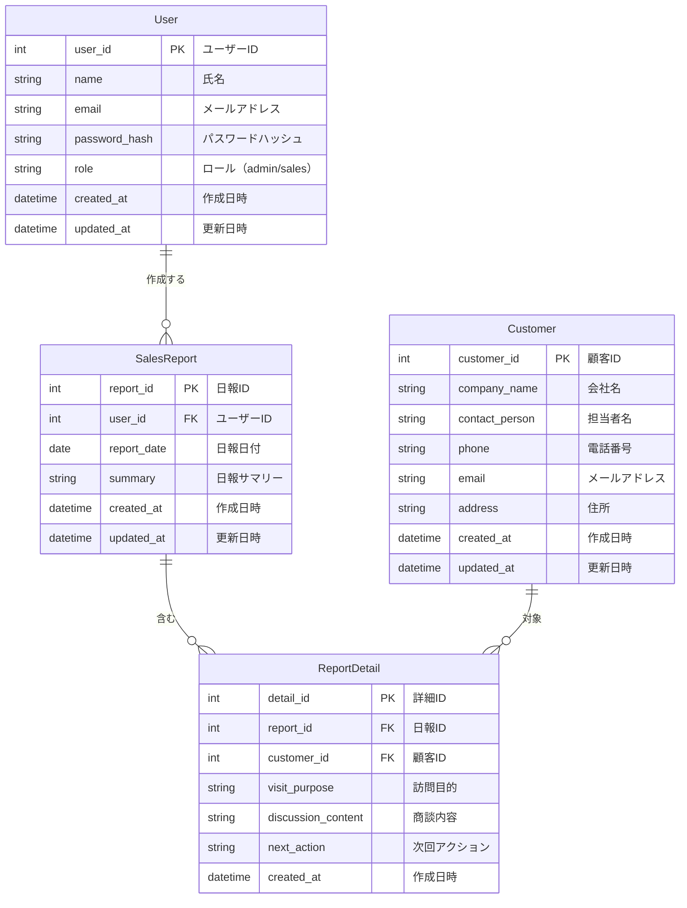

# 2.2.4 製造物_要件定義書構成

## 📋 このドキュメントの目的

要件定義フェーズで生成する**要件定義書の標準テンプレート**と各セクションの記述方法を定義する。

**重要:** このテンプレートに従うことで、受託開発納品レベルの品質を担保する。

---

## 📄 要件定義書の標準目次構成

### 保存先

**ファイルパス**: `docs/02_要件定義書.md`

### 標準目次

```markdown
# 要件定義書

## 1. はじめに
### 1.1 本書の目的
### 1.2 本書の対象読者
### 1.3 用語・略語

## 2. プロジェクト概要
### 2.1 プロジェクト名
### 2.2 ビジネス背景
### 2.3 現状の課題
### 2.4 プロジェクトの目的
### 2.5 期待される効果
### 2.6 成功基準（KPI）

## 3. 機能要件
### 3.1 機能一覧
### 3.2 機能詳細仕様
### 3.3 画面遷移図
### 3.4 ユーザーストーリー（オプション）

## 4. 非機能要件
### 4.1 性能要件
### 4.2 可用性要件
### 4.3 セキュリティ要件
### 4.4 運用要件
### 4.5 保守性要件
### 4.6 拡張性要件

## 5. データ要件
### 5.1 データモデル（ER図）
### 5.2 データ項目定義
### 5.3 データ量
### 5.4 データ保持期間
### 5.5 データ移行要件（該当する場合）

## 6. 外部連携仕様
### 6.1 連携先システム一覧
### 6.2 連携方式
### 6.3 連携データ項目
### 6.4 エラー時の対応

## 7. 制約事項
### 7.1 技術制約
### 7.2 スケジュール制約
### 7.3 予算制約
### 7.4 法令・規制制約

## 8. 優先順位（MoSCoW）
### 8.1 Must（必須機能）
### 8.2 Should（重要機能）
### 8.3 Could（可能であれば）
### 8.4 Won't（今回は実装しない）

## 9. 用語集

## 10. 参考資料

## 11. 改訂履歴
```

---

## 📝 各セクションの記述方法

### 1. はじめに

#### 1.1 本書の目的

**目的**: 要件定義書の位置づけを明確にする

**Good Example**:
```markdown
本書は、○○システムの要件定義書である。
本書では、システムが実現すべき機能要件、非機能要件、データ要件、外部連携仕様を定義する。

本書に記載された要件は、ステークホルダーとの合意を経て確定したものであり、
設計フェーズ以降の作業の基準となる。
```

**Bad Example**:
```markdown
❌ 「この文書は要件定義書です。」（目的不明確）
```

---

#### 1.2 本書の対象読者

**目的**: 誰が読むべきかを明確にする

**Good Example**:
```markdown
本書の対象読者は以下の通り。

- プロジェクトオーナー
- エンドユーザー
- 設計・開発担当者
- テスト担当者
- 保守・運用担当者
```

**Bad Example**:
```markdown
❌ 「関係者全員」（曖昧）
```

---

#### 1.3 用語・略語

**目的**: プロジェクト固有の用語を定義

**Good Example**:
```markdown
| 用語 | 説明 |
|------|------|
| MVP | Minimum Viable Product（最小限の機能を持つプロダクト） |
| RTO | Recovery Time Objective（目標復旧時間） |
| RPO | Recovery Point Objective（目標復旧時点） |
| SLA | Service Level Agreement（サービスレベル契約） |
```

---

### 2. プロジェクト概要

#### 2.1~2.6 の記述

**目的**: 企画書から転記し、プロジェクトの背景・目的を明確にする

**Good Example**:
```markdown
### 2.2 ビジネス背景

当社は営業部門が50名規模に拡大し、営業活動の可視化・管理が課題となっている。
現状はExcelで営業日報を管理しているが、以下の課題がある：

- 日報の提出率が低い（60%程度）
- 商談情報の共有が遅れる（週次報告会まで共有されない）
- 営業実績の集計に時間がかかる（月次集計に3日間）

この課題を解決し、営業活動の効率化・可視化を実現するため、
営業支援システムを構築する。
```

**Bad Example**:
```markdown
❌ 「営業を効率化したい。」（背景不明確）
```

---

### 3. 機能要件

#### 3.1 機能一覧

**目的**: システムが提供するすべての機能を網羅

**Good Example**:
```markdown
| 機能ID | 大機能 | 中機能 | 小機能 | 機能概要 | ユーザー種別 | 優先度 |
|--------|--------|--------|--------|----------|--------------|--------|
| F-001 | 認証 | ログイン | - | ID/PWでログイン | 全ユーザー | Must |
| F-002 | 認証 | ログアウト | - | ログアウト | 全ユーザー | Must |
| F-003 | 日報管理 | 日報登録 | - | 営業日報を登録 | 営業担当 | Must |
| F-004 | 日報管理 | 日報検索 | 期間検索 | 期間で日報を検索 | 営業担当・管理者 | Must |
| F-005 | 日報管理 | 日報検索 | 担当者検索 | 担当者で日報を検索 | 管理者 | Must |
| F-006 | 日報管理 | 日報編集 | - | 自分の日報を編集 | 営業担当 | Must |
| F-007 | 日報管理 | 日報削除 | - | 自分の日報を削除 | 営業担当 | Must |
| F-008 | 顧客管理 | 顧客登録 | - | 顧客情報を登録 | 営業担当 | Must |
| F-009 | 顧客管理 | 顧客検索 | - | 顧客情報を検索 | 営業担当・管理者 | Must |
| F-010 | ダッシュボード | 実績グラフ | - | 営業実績をグラフ表示 | 管理者 | Should |
| F-011 | CSV出力 | 日報CSV出力 | - | 日報をCSV出力 | 管理者 | Could |
```

**Bad Example**:
```markdown
❌ 「日報管理機能」（粒度が大きすぎる）
❌ 機能IDなし（追跡不可能）
❌ 優先度なし（実装順序不明）
```

---

#### 3.2 機能詳細仕様

**目的**: 各機能の詳細を記述

**Good Example**:
```markdown
#### F-003: 日報登録機能

**機能概要**:
営業担当者が訪問先・商談内容を記録する機能。

**前提条件**:
- ユーザーがログイン済みであること

**基本フロー**:
1. ユーザーが「日報登録」ボタンをクリック
2. 日報登録画面が表示される
3. ユーザーが以下の項目を入力:
   - 日報日付（必須）
   - 訪問先顧客（必須、顧客マスタから選択）
   - 訪問目的（必須、テキスト入力、最大200文字）
   - 商談内容（必須、テキスト入力、最大1000文字）
   - 次回アクション（任意、テキスト入力、最大500文字）
4. ユーザーが「登録」ボタンをクリック
5. システムが入力内容をバリデーション
6. 問題なければデータベースに保存
7. 「登録しました」メッセージを表示
8. 日報一覧画面に遷移

**代替フロー**:
- 入力エラーの場合:
  - エラーメッセージを表示
  - 入力画面に戻る
  - 入力内容は保持される

**事後条件**:
- 日報データがデータベースに保存される
- 日報一覧画面で登録した日報が確認できる

**非機能要件**:
- レスポンスタイム: 登録処理は1秒以内
```

**Bad Example**:
```markdown
❌ 「日報を登録できる。」（手順不明確）
```

---

#### 3.3 画面遷移図

**目的**: ユーザーの操作フローを可視化

**Good Example**:


**画面一覧**:
```markdown
| 画面ID | 画面名 | 画面概要 | 遷移元 |
|--------|--------|----------|--------|
| S-001 | ログイン画面 | ID/PWでログイン | - |
| S-002 | ホーム画面 | メニュー表示 | ログイン画面 |
| S-003 | 日報一覧画面 | 日報の一覧表示・検索 | ホーム画面 |
| S-004 | 日報登録画面 | 新規日報登録 | 日報一覧画面 |
| S-005 | 日報編集画面 | 日報編集 | 日報一覧・詳細画面 |
| S-006 | 日報詳細画面 | 日報の詳細表示 | 日報一覧画面 |
| S-007 | 顧客一覧画面 | 顧客の一覧表示・検索 | ホーム画面 |
| S-008 | 顧客登録画面 | 新規顧客登録 | 顧客一覧画面 |
| S-009 | 顧客詳細画面 | 顧客の詳細表示 | 顧客一覧画面 |
| S-010 | ダッシュボード | 営業実績グラフ表示 | ホーム画面 |
```

**Bad Example**:
```markdown
❌ 画面遷移図なし（ユーザー体験不明確）
```

---

### 4. 非機能要件

#### 4.1 性能要件

**目的**: システムの性能基準を数値化

**Good Example**:
```markdown
| 項目 | 目標値 | 測定条件 |
|------|--------|----------|
| 画面表示 | 3秒以内 | 通常時（ピーク時除く） |
| 検索処理 | 5秒以内 | 検索結果1,000件ヒット時 |
| 同時ユーザー数 | 100ユーザー | ピーク時（平日9:00-10:00） |
| データ登録 | 1秒以内 | 通常時 |
| バッチ処理 | 30分以内 | 日次集計処理（10,000件） |
```

**Bad Example**:
```markdown
❌ 「速く動作すること」（数値なし）
```

---

#### 4.2 可用性要件

**目的**: システムの稼働時間・可用性を定義

**Good Example**:
```markdown
| 項目 | 要件 |
|------|------|
| 稼働時間 | 平日 9:00-18:00（土日祝休止） |
| 目標稼働率 | 99.5%以上（業務時間内） |
| 計画メンテナンス | 月1回、日曜日 2:00-4:00 |
| RTO（目標復旧時間） | 4時間以内 |
| RPO（目標復旧時点） | 1時間以内（日次バックアップから復旧） |
```

**Bad Example**:
```markdown
❌ 「高い可用性」（数値なし）
```

---

#### 4.3 セキュリティ要件

**目的**: セキュリティ対策を明確化

**Good Example**:
```markdown
| 項目 | 要件 |
|------|------|
| **認証** | |
| 認証方式 | ID/パスワード認証 + 多要素認証（SMS） |
| パスワードポリシー | 8文字以上、英数字記号混在、90日ごとに変更 |
| ログイン失敗時 | 3回失敗でアカウントロック（30分間） |
| **認可** | |
| 権限管理 | ロールベースアクセス制御（RBAC） |
| ロール | 管理者、営業担当 |
| 権限 | 管理者: 全機能利用可<br/>営業担当: 自分の日報のみ編集可 |
| **暗号化** | |
| 保管時暗号化 | 個人情報・パスワードをAES-256で暗号化 |
| 転送時暗号化 | TLS 1.2以上 |
| **監査ログ** | |
| ログ記録対象 | ログイン、データ更新、データ削除 |
| ログ項目 | 日時、ユーザーID、操作内容、IPアドレス |
| ログ保持期間 | 1年間 |
```

**Bad Example**:
```markdown
❌ 「セキュアであること」（具体性なし）
```

---

#### 4.4 運用要件

**目的**: 運用に必要な要件を定義

**Good Example**:
```markdown
| 項目 | 要件 |
|------|------|
| **バックアップ** | |
| バックアップ対象 | データベース全体 |
| バックアップ頻度 | 日次フルバックアップ（毎日 23:00） |
| 世代管理 | 7世代（過去7日分） |
| バックアップ保管場所 | AWS S3（別リージョン） |
| **監視** | |
| 監視項目 | CPU使用率、メモリ使用率、ディスク使用率、エラー率 |
| 監視間隔 | 5分間隔 |
| アラート閾値 | CPU 80%超過、メモリ 80%超過、エラー率 5%超過 |
| アラート通知先 | ops-team@example.com |
| **ログ** | |
| アプリケーションログ | INFO レベル以上を記録 |
| ログ保持期間 | 90日間 |
| ログ保管場所 | CloudWatch Logs |
```

**Bad Example**:
```markdown
❌ 「適切にバックアップする」（頻度・世代不明）
```

---

### 5. データ要件

#### 5.1 データモデル（ER図）

**目的**: データ構造を可視化

**Good Example**:


**Bad Example**:
```markdown
❌ ER図なし（データ構造不明確）
```

---

#### 5.2 データ項目定義

**目的**: 各テーブルの詳細を定義

**Good Example**:
```markdown
### Userテーブル

| カラム名 | データ型 | 必須 | 制約 | 説明 |
|---------|---------|------|------|------|
| user_id | INT | ✅ | PK, AUTO_INCREMENT | ユーザーID |
| name | VARCHAR(100) | ✅ | - | 氏名 |
| email | VARCHAR(255) | ✅ | UNIQUE | メールアドレス |
| password_hash | VARCHAR(255) | ✅ | - | パスワードハッシュ（bcrypt） |
| role | ENUM('admin', 'sales') | ✅ | DEFAULT 'sales' | ロール |
| created_at | DATETIME | ✅ | DEFAULT CURRENT_TIMESTAMP | 作成日時 |
| updated_at | DATETIME | ✅ | ON UPDATE CURRENT_TIMESTAMP | 更新日時 |
```

**Bad Example**:
```markdown
❌ 「ユーザー情報を保存」（データ型不明）
```

---

#### 5.3 データ量

**目的**: データ規模を把握

**Good Example**:
```markdown
| エンティティ | 想定レコード数 | 増加率 | 保持期間 |
|-------------|---------------|--------|----------|
| User | 100名 | 10名/年 | 無期限 |
| Customer | 5,000社 | 500社/年 | 無期限 |
| SalesReport | 10,000件/年 | - | 5年間 |
| ReportDetail | 30,000件/年 | - | 5年間 |

**5年後の想定データ量**:
- User: 150名
- Customer: 7,500社
- SalesReport: 50,000件
- ReportDetail: 150,000件
```

**Bad Example**:
```markdown
❌ データ量不明（スケーラビリティ不明）
```

---

### 6. 外部連携仕様

**目的**: 外部システムとの連携を定義

**Good Example**:
```markdown
### 連携1: 会計システムとの連携

| 項目 | 内容 |
|------|------|
| 連携先 | 会計システム（○○会計） |
| 連携目的 | 売上データの連携 |
| 連携方式 | ファイル連携（CSV） |
| 連携タイミング | 日次バッチ（毎日 23:00） |
| 連携データフォーマット | CSV（UTF-8, カンマ区切り） |
| 連携データ項目 | 売上日、顧客名、金額、担当者 |
| ファイル配置場所 | SFTP サーバー（/upload/sales/） |
| エラー時対応 | 管理者にメール通知、翌日再実行 |
| リトライ回数 | 3回 |

**データサンプル**:
```csv
売上日,顧客名,金額,担当者
2025-01-27,ABC株式会社,1000000,田中太郎
2025-01-27,XYZ株式会社,500000,鈴木一郎
```
```

**Bad Example**:
```markdown
❌ 「会計システムと連携」（方式・タイミング不明）
```

---

### 7. 制約事項

**目的**: プロジェクトの制約を明確化

**Good Example**:
```markdown
### 7.1 技術制約

- 既存システムとの互換性:
  - 会計システムとの連携はCSVファイル連携に限定
  - 顧客マスタは会計システムのマスタに準拠

### 7.2 スケジュール制約

- 開発期間: 2025年2月1日～2025年5月31日（4ヶ月）
- 本番リリース: 2025年6月1日

### 7.3 予算制約

- 開発予算: 500万円
- インフラコスト: 月額3万円以内

### 7.4 法令・規制制約

- 個人情報保護法に準拠
- 顧客情報は日本国内のデータセンターに保管
```

**Bad Example**:
```markdown
❌ 制約事項なし（実現可能性不明）
```

---

### 8. 優先順位（MoSCoW）

**目的**: 実装の優先順位を明確化

**Good Example**:
```markdown
### 8.1 Must（必須機能） - MVP

- F-001: ログイン機能
- F-002: ログアウト機能
- F-003: 日報登録機能
- F-004: 日報検索機能（期間検索）
- F-005: 日報検索機能（担当者検索）
- F-006: 日報編集機能
- F-007: 日報削除機能
- F-008: 顧客登録機能
- F-009: 顧客検索機能

**MVP完成で実現できること**:
- 営業日報の登録・検索・編集・削除
- 顧客情報の管理

### 8.2 Should（重要機能） - フェーズ1完成まで

- F-010: ダッシュボード（営業実績グラフ）

**フェーズ1完成で実現できること**:
- 営業実績の可視化

### 8.3 Could（可能であれば） - フェーズ2以降

- F-011: CSV出力機能
- F-012: モバイル対応

### 8.4 Won't（今回は実装しない）

- Slack連携通知（外部連携の優先度低）
- 多言語対応（国内利用のみ）
- ダークモード
```

**Bad Example**:
```markdown
❌ すべて「重要」（優先順位なし）
```

---

## 📝 要件定義書作成のチェックリスト

### 全体構成

- [ ] 標準目次構成に従っている
- [ ] すべてのセクションが記述されている
- [ ] 改訂履歴が記録されている

### 機能要件

- [ ] 機能一覧表が作成されている
- [ ] すべての機能に機能IDが付与されている
- [ ] 機能詳細仕様が記述されている
- [ ] 画面遷移図が作成されている
- [ ] 優先順位（MoSCoW）が決定されている

### 非機能要件

- [ ] 性能要件が数値化されている
- [ ] 可用性要件が数値化されている（RTO/RPO含む）
- [ ] セキュリティ要件が具体的に記述されている
- [ ] 運用要件が具体的に記述されている

### データ要件

- [ ] ER図が作成されている
- [ ] データ項目定義が作成されている
- [ ] データ量が把握されている
- [ ] データ保持期間が決定されている

### 外部連携

- [ ] 連携先システムが特定されている
- [ ] 連携方式が決定されている
- [ ] 連携データ項目が確定されている
- [ ] エラー時の対応が決定されている

### 曖昧さ排除

- [ ] 「速く」「多く」「高い」などの曖昧な表現がない
- [ ] すべて数値化・具体化されている
- [ ] 解釈の余地がない

### ユーザー承認

- [ ] ステークホルダーレビューを実施した
- [ ] ユーザー承認を取得した

---

## 📚 参考資料

### テンプレートファイル

完成した要件定義書のサンプル:
- `docs/02_要件定義書.md`

### 関連ドキュメント

- `2.2.3_決定事項チェックリスト.md` - 決定すべき事項
- `2.2.5_機能要件の記述方法/` - 機能要件の詳細
- `2.2.6_非機能要件の記述方法/` - 非機能要件の詳細
- `2.2.7_Mermaid図パターン/` - 図表の作成方法

---

**最終更新**: 2025-10-19
**作成者**: Claude (AI開発ファシリテーター)
