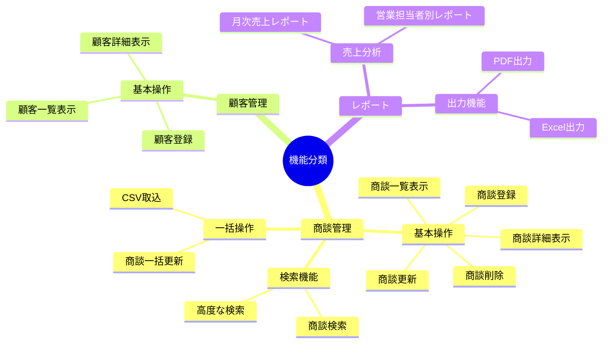
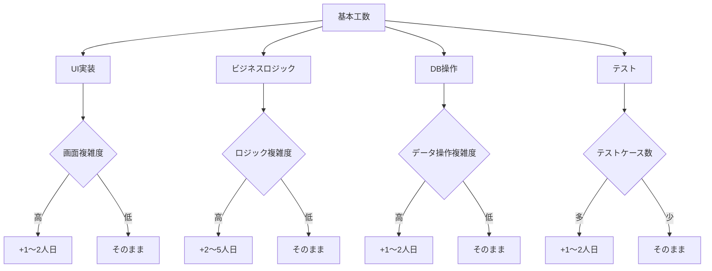

# 2.2.5.1 機能一覧表フォーマット

## 目的

ヒアリングで収集した**機能要件を一覧表形式で整理・記述する方法**を提供します。

機能一覧表は、要件定義書の中核となるドキュメントであり、システムが提供するすべての機能を網羅的に記載します。

### このドキュメントで得られること

1. 機能一覧表の標準フォーマット
2. 機能の分類・階層化の方法
3. 優先順位付けの方法
4. 見積もり工数の記載方法

---

## 📋 機能一覧表の基本構成

### 標準フォーマット

機能一覧表は、以下の列で構成されます：

| 列名 | 説明 | 必須 |
|------|------|------|
| 機能ID | 機能の一意識別子 | ⭐⭐⭐ 必須 |
| 大分類 | 機能の大カテゴリ | ⭐⭐⭐ 必須 |
| 中分類 | 機能の中カテゴリ | ⭐⭐ 推奨 |
| 機能名 | 機能の名称 | ⭐⭐⭐ 必須 |
| 機能概要 | 機能の簡潔な説明 | ⭐⭐⭐ 必須 |
| ユーザー | この機能を使うユーザーロール | ⭐⭐⭐ 必須 |
| 優先度 | 実装の優先度（高/中/低） | ⭐⭐⭐ 必須 |
| 工数見積 | 概算の開発工数（人日） | ⭐⭐ 推奨 |
| 備考 | 補足情報 | ⭐ オプション |

---

## 📊 機能一覧表のサンプル

### Good Example: 営業支援システムの機能一覧表

| 機能ID | 大分類 | 中分類 | 機能名 | 機能概要 | ユーザー | 優先度 | 工数見積 | 備考 |
|--------|-------|-------|--------|---------|---------|--------|---------|------|
| F-001 | 商談管理 | 基本操作 | 商談一覧表示 | 商談の一覧を表示する。検索・ソート・ページネーション機能を含む。 | 営業担当者、マネージャー | 高 | 3人日 | - |
| F-002 | 商談管理 | 基本操作 | 商談詳細表示 | 商談の詳細情報を表示する。過去の履歴も含む。 | 営業担当者、マネージャー | 高 | 2人日 | - |
| F-003 | 商談管理 | 基本操作 | 商談登録 | 新規商談を登録する。顧客選択、商談日、金額等を入力。 | 営業担当者 | 高 | 3人日 | - |
| F-004 | 商談管理 | 基本操作 | 商談更新 | 既存商談の情報を更新する。ステータス変更、メモ追加等。 | 営業担当者 | 高 | 2人日 | - |
| F-005 | 商談管理 | 基本操作 | 商談削除 | 商談を削除する（論理削除）。管理者のみ実行可能。 | 管理者 | 中 | 1人日 | 論理削除 |
| F-006 | 商談管理 | 検索機能 | 商談検索 | 顧客名、期間、ステータス、担当者で商談を検索する。 | 営業担当者、マネージャー | 高 | 2人日 | - |
| F-007 | 商談管理 | 一括操作 | 商談一括更新 | 複数の商談のステータスを一括更新する。 | マネージャー | 中 | 3人日 | CSV取込も検討 |
| F-008 | 顧客管理 | 基本操作 | 顧客一覧表示 | 顧客の一覧を表示する。 | 営業担当者、マネージャー | 高 | 2人日 | - |
| F-009 | 顧客管理 | 基本操作 | 顧客詳細表示 | 顧客の詳細情報と、関連する商談一覧を表示する。 | 営業担当者、マネージャー | 高 | 2人日 | - |
| F-010 | 顧客管理 | 基本操作 | 顧客登録 | 新規顧客を登録する。 | 営業担当者 | 高 | 2人日 | - |
| F-011 | レポート | 売上分析 | 月次売上レポート | 月次の売上実績をグラフで表示する。 | マネージャー | 中 | 5人日 | グラフライブラリ必要 |
| F-012 | レポート | 売上分析 | 営業担当者別レポート | 営業担当者別の売上実績を表示する。 | マネージャー | 中 | 3人日 | - |
| F-013 | レポート | 出力機能 | レポートPDF出力 | レポートをPDF形式で出力する。 | マネージャー | 低 | 3人日 | PDF生成ライブラリ必要 |
| F-014 | 外部連携 | 会計システム | 受注情報送信 | 受注確定時、会計システムにデータを送信する。 | システム（自動） | 高 | 5人日 | REST API連携 |
| F-015 | ユーザー管理 | 認証・認可 | ログイン | メールアドレス + パスワードでログインする。 | 全ユーザー | 高 | 2人日 | - |
| F-016 | ユーザー管理 | 認証・認可 | ログアウト | ログアウトする。 | 全ユーザー | 高 | 0.5人日 | - |
| F-017 | ユーザー管理 | ユーザー管理 | ユーザー一覧表示 | ユーザーの一覧を表示する。 | 管理者 | 中 | 2人日 | - |
| F-018 | ユーザー管理 | ユーザー管理 | ユーザー登録 | 新規ユーザーを登録する。 | 管理者 | 中 | 2人日 | - |

**合計工数見積**: 約45人日

---

## 🎯 機能IDの採番ルール

機能IDは、以下のルールで採番します：

### パターン1: プレフィックス + 連番

```
F-001, F-002, F-003, ...
```

**メリット**:
- シンプルで管理しやすい
- 機能の追加・削除に柔軟に対応

**デメリット**:
- IDから機能の分類が分からない

---

### パターン2: 階層的な採番

```
1.1.1, 1.1.2, 1.2.1, 2.1.1, ...

1. 商談管理
  1.1 基本操作
    1.1.1 商談一覧表示
    1.1.2 商談詳細表示
  1.2 検索機能
    1.2.1 商談検索
2. 顧客管理
  2.1 基本操作
    2.1.1 顧客一覧表示
```

**メリット**:
- 階層構造が明確
- IDから分類が分かる

**デメリット**:
- 機能の追加・削除時に採番がずれる可能性

---

### パターン3: プレフィックス + 分類コード + 連番

```
SLS-001, SLS-002, CUS-001, RPT-001, ...

SLS: 商談管理 (Sales)
CUS: 顧客管理 (Customer)
RPT: レポート (Report)
USR: ユーザー管理 (User)
INT: 外部連携 (Integration)
```

**メリット**:
- 分類が分かりやすい
- 機能の追加に柔軟

**デメリット**:
- プレフィックスの定義が必要

---

### 推奨: パターン1（シンプルな連番）

要件定義フェーズでは、**パターン1（F-001, F-002, ...）** を推奨します。

**理由**:
- シンプルで管理しやすい
- 機能の追加・削除が頻繁に発生するため

---

## 🏷️ 機能の分類方法

機能は、以下の観点で分類します：

### 1. ユーザー機能 vs システム機能

| 種別 | 説明 | 例 |
|------|------|-----|
| ユーザー機能 | ユーザーが直接操作する機能 | 商談登録、商談検索、レポート表示 |
| システム機能 | システムが自動実行する機能 | バッチ処理、外部連携、通知送信 |

---

### 2. 業務機能 vs 共通機能

| 種別 | 説明 | 例 |
|------|------|-----|
| 業務機能 | 業務固有の機能 | 商談管理、顧客管理、レポート |
| 共通機能 | システム全体で共通の機能 | ログイン、ユーザー管理、マスタ管理 |

---

### 3. 大分類・中分類・小分類



---

## ⚡ 優先度の付け方

優先度は、以下の基準で決定します：

### 優先度の定義

| 優先度 | 定義 | 判断基準 |
|--------|------|---------|
| 高 | 初期リリースで必須 | ・コア機能<br>・日常的に使う機能<br>・システムの存在意義に直結 |
| 中 | 初期リリースに含めたい | ・重要だが、なくても運用可能<br>・使用頻度が中程度 |
| 低 | 将来的に実装 | ・あると便利<br>・使用頻度が低い<br>・他機能で代替可能 |

---

### MoSCoW法による優先順位付け

より詳細に優先度を付けたい場合は、**MoSCoW法**を使用します：

| 優先度 | 略称 | 意味 | 説明 |
|--------|------|------|------|
| Must | M | 必須 | 初期リリースで絶対に必要 |
| Should | S | 重要 | できれば初期リリースに含めたい |
| Could | C | あると良い | 余裕があれば実装 |
| Won't | W | 対象外 | 今回は実装しない |

**Good Example**:

| 機能ID | 機能名 | MoSCoW | 備考 |
|--------|--------|--------|------|
| F-001 | 商談一覧表示 | M | コア機能 |
| F-003 | 商談登録 | M | コア機能 |
| F-011 | 月次売上レポート | S | 重要だが、Excelで代替可能 |
| F-013 | レポートPDF出力 | C | Excel出力で代替可能 |
| F-019 | AI商談予測機能 | W | 将来のフェーズで検討 |

---

## 💰 工数見積の記載方法

工数見積は、**概算**を記載します（詳細見積は設計フェーズで実施）。

### 工数の単位

- **人日**: 1人が1日（8時間）で実施できる作業量
- **人月**: 1人が1ヶ月（20営業日）で実施できる作業量

要件定義フェーズでは、**人日**単位で記載します。

---

### 工数見積の目安

| 機能の複雑度 | 工数見積（人日） | 例 |
|------------|----------------|-----|
| 簡単 | 0.5〜2人日 | 一覧表示、詳細表示、ログアウト |
| 普通 | 2〜5人日 | 登録・更新・削除、検索機能 |
| 複雑 | 5〜10人日 | レポート生成、外部連携、一括処理 |
| 非常に複雑 | 10人日以上 | 複雑なアルゴリズム、AI機能 |

**注意**: これはあくまで目安です。プロジェクトの状況に応じて調整してください。

---

### 工数見積の考え方



---

## 📝 備考欄の活用

備考欄には、以下の情報を記載します：

### 記載すべき情報

1. **技術的な制約・前提**
   - 例: "PDF生成ライブラリが必要"
   - 例: "既存の会計システムとREST API連携"

2. **業務上の注意点**
   - 例: "管理者のみ実行可能"
   - 例: "論理削除（物理削除しない）"

3. **代替案・将来の拡張**
   - 例: "CSV取込も検討"
   - 例: "将来的にExcel出力も実装予定"

4. **他機能との関連**
   - 例: "F-003（商談登録）に依存"
   - 例: "F-014（外部連携）と連動"

---

## ✅ 機能一覧表作成のチェックリスト

### 必須項目
- [ ] すべての機能にIDを付与済み
- [ ] 機能名が明確
- [ ] 機能概要が簡潔（1〜2文）
- [ ] ユーザーロールを記載済み
- [ ] 優先度を設定済み

### 推奨項目
- [ ] 大分類・中分類で整理済み
- [ ] 工数見積を記載済み
- [ ] 重要な機能に備考を記載済み

### 品質確認
- [ ] 抜け漏れがない（ヒアリング内容をすべて反映）
- [ ] 重複がない
- [ ] 機能の粒度が適切（大きすぎず、小さすぎず）

---

## 🚨 よくある失敗パターン

### ❌ 機能の粒度が大きすぎる

**Bad Example**:

| 機能ID | 機能名 | 機能概要 |
|--------|--------|---------|
| F-001 | 商談管理 | 商談に関するすべての機能 |

**理由**: 範囲が広すぎて、工数見積や実装計画が立てられない

**Good Example**:

| 機能ID | 機能名 | 機能概要 |
|--------|--------|---------|
| F-001 | 商談一覧表示 | 商談の一覧を表示する |
| F-002 | 商談詳細表示 | 商談の詳細情報を表示する |
| F-003 | 商談登録 | 新規商談を登録する |

---

### ❌ 機能の粒度が小さすぎる

**Bad Example**:

| 機能ID | 機能名 | 機能概要 |
|--------|--------|---------|
| F-001 | 商談一覧画面の「検索」ボタン表示 | 検索ボタンを表示する |
| F-002 | 商談一覧画面の「検索」ボタン押下処理 | 検索ボタン押下時の処理 |

**理由**: 細かすぎて管理が大変

**Good Example**:

| 機能ID | 機能名 | 機能概要 |
|--------|--------|---------|
| F-001 | 商談検索 | 顧客名、期間、ステータスで商談を検索する |

---

### ❌ 機能概要が曖昧

**Bad Example**:

| 機能ID | 機能名 | 機能概要 |
|--------|--------|---------|
| F-001 | 商談登録 | 商談を登録する機能 |

**理由**: 機能名の繰り返しで、具体的な内容が不明

**Good Example**:

| 機能ID | 機能名 | 機能概要 |
|--------|--------|---------|
| F-001 | 商談登録 | 顧客選択、商談日、ステータス、金額等を入力し、新規商談を登録する。入力エラーはリアルタイムで表示。 |

---

### ❌ ユーザーロールが不明確

**Bad Example**:

| 機能ID | 機能名 | ユーザー |
|--------|--------|---------|
| F-001 | 商談登録 | 全員 |

**理由**: 「全員」では、具体的に誰が使えるのか不明

**Good Example**:

| 機能ID | 機能名 | ユーザー |
|--------|--------|---------|
| F-001 | 商談登録 | 営業担当者 |
| F-005 | 商談削除 | 管理者 |

---

## 📚 次のステップ

機能一覧表を作成したら:

1. **2.2.5.2 ユースケース記述方法.md** へ進む
2. 各機能の詳細をユースケース形式で記述
3. **2.2.5.3 ユーザーストーリー形式.md** でアジャイル開発向けの記述方法を学ぶ

---

## 関連ドキュメント

- [2.2.2.1 機能要件ヒアリング項目](./2.2.2.1_機能要件ヒアリング項目.md) - ヒアリング項目
- [2.2.5.2 ユースケース記述方法](./2.2.5.2_ユースケース記述方法.md) - 詳細な記述方法
- [2.2.5.3 ユーザーストーリー形式](./2.2.5.3_ユーザーストーリー形式.md) - アジャイル向け記述
- [2.2.4 製造物_要件定義書構成](./2.2.4_製造物_要件定義書構成.md) - 要件定義書の構成

---

**作成日**: 2025-10-19
**対象フェーズ**: 要件定義
**重要度**: ⭐⭐⭐ 必須
