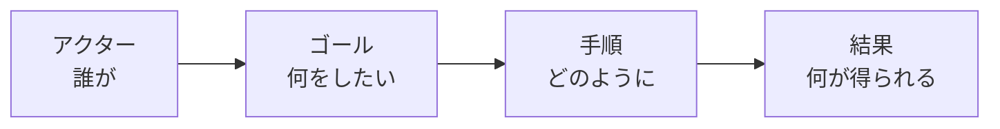
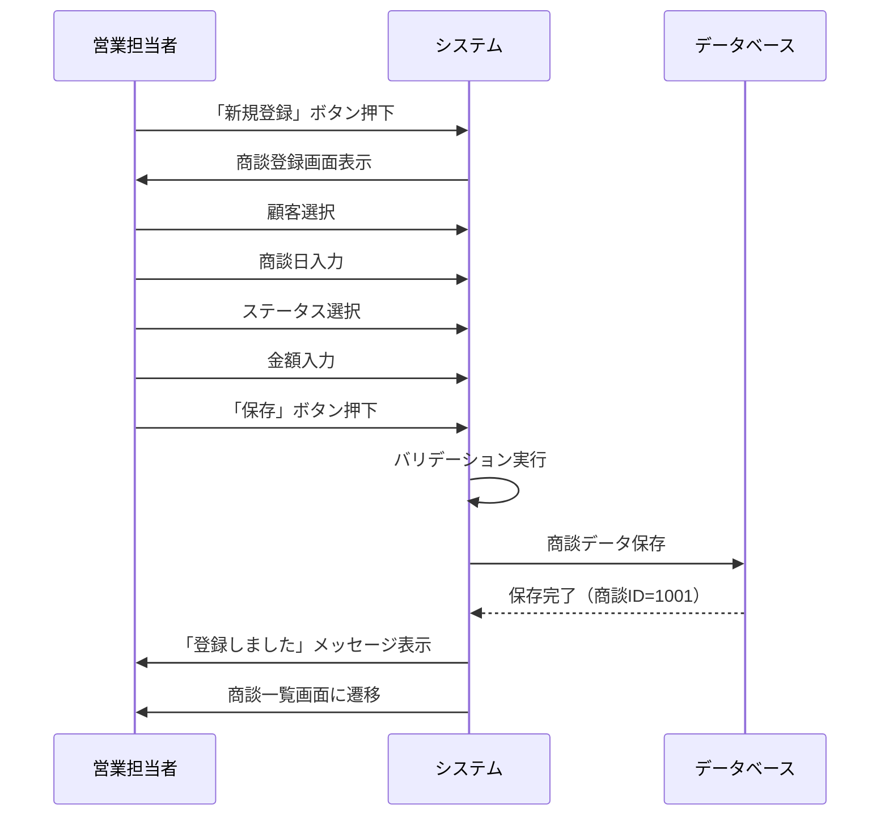
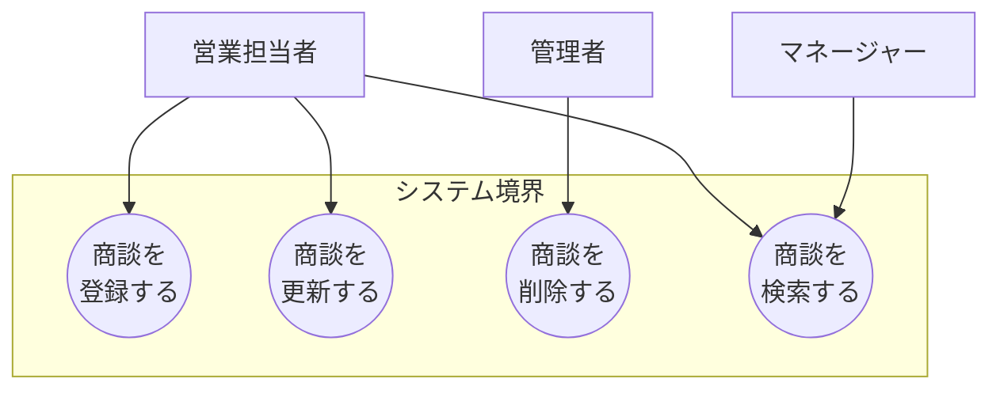
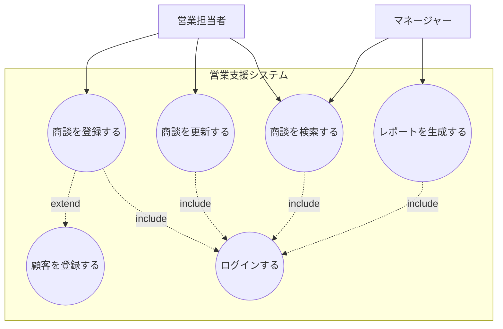

# 2.2.5.2 ユースケース記述方法

## 目的

機能一覧表で整理した**機能の詳細をユースケース形式で記述する方法**を提供します。

ユースケースは、ユーザーの視点から「誰が」「何をするか」「どのように実現するか」を具体的に記述する手法です。

### このドキュメントで得られること

1. ユースケースの標準フォーマット
2. 正常系・異常系の書き方
3. 事前条件・事後条件の定義方法
4. ユースケース図の書き方

---

## 📋 ユースケースとは

### 定義

**ユースケース（Use Case）** = ユーザーがシステムを使って達成したい目的とその手順



---

### ユースケースの構成要素

| 要素 | 説明 | 例 |
|------|------|-----|
| ユースケース名 | 達成したい目的 | "商談を登録する" |
| アクター | このユースケースを実行するユーザー | 営業担当者 |
| 事前条件 | 実行前に満たすべき条件 | ログイン済み |
| 基本フロー | 正常系の手順 | 1. 顧客を選択<br/>2. 商談日を入力<br/>... |
| 代替フロー | 異常系・例外の手順 | 顧客が存在しない場合 |
| 事後条件 | 実行後の状態 | 商談が登録される |

---

## 📝 ユースケースの標準フォーマット

### テンプレート

```markdown
## ユースケース名: [目的を表す動詞 + 名詞]

### 基本情報
- **ユースケースID**: UC-001
- **アクター**: 営業担当者
- **概要**: [1〜2文で簡潔に説明]
- **事前条件**:
  - ログイン済み
  - 顧客マスタに顧客が登録されている
- **事後条件**:
  - 商談が登録される
  - 商談IDが採番される

### 基本フロー（正常系）
1. ユーザーが「新規登録」ボタンを押下する
2. システムが商談登録画面を表示する
3. ユーザーが顧客を選択する
4. ユーザーが商談日を入力する
5. ユーザーが「保存」ボタンを押下する
6. システムが入力内容をバリデーションする
7. システムが商談を登録する
8. システムが「登録しました」とメッセージを表示する
9. システムが商談一覧画面に遷移する

### 代替フロー（異常系・例外）

#### A1: 入力エラー（ステップ6で発生）
1. システムがエラーメッセージを表示する
2. ユーザーが入力を修正する
3. ステップ5に戻る

#### A2: 保存失敗（ステップ7で発生）
1. システムがエラーメッセージを表示する
2. ユーザーが「再試行」または「キャンセル」を選択する
3. 「再試行」の場合、ステップ7に戻る
4. 「キャンセル」の場合、商談一覧画面に遷移する

### UI仕様
- 商談登録画面: [画面遷移図参照](link)
- 入力項目: 顧客、商談日、ステータス、金額、メモ

### ビジネスルール
- 商談日は過去日も入力可能
- 金額は0以上の整数
- ステータスのデフォルトは「初回訪問」

### 非機能要件
- レスポンスタイム: 保存完了まで1秒以内
- 同時実行: 同じ顧客に対して複数の営業担当者が同時に商談登録可能
```

---

## ✅ Good Example: 商談登録ユースケース

### ユースケース名: 商談を登録する

#### 基本情報
- **ユースケースID**: UC-001
- **アクター**: 営業担当者
- **概要**: 営業担当者が顧客訪問後、商談情報をシステムに登録する
- **事前条件**:
  - 営業担当者としてログイン済み
  - 顧客マスタに顧客が登録されている
- **事後条件**:
  - 商談が登録され、商談IDが採番される
  - 商談一覧に表示される

#### 基本フロー（正常系）



**手順**:
1. ユーザーが商談一覧画面で「新規登録」ボタンを押下する
2. システムが商談登録画面を表示する
3. ユーザーが顧客をドロップダウンから選択する
   - インクリメンタルサーチで顧客名を検索可能
4. ユーザーが商談日をカレンダーから選択する
   - デフォルトは今日の日付
5. ユーザーがステータスをラジオボタンから選択する
   - デフォルトは「初回訪問」
6. ユーザーが受注見込み金額を入力する（任意）
7. ユーザーが商談メモを入力する（任意）
8. ユーザーが「保存」ボタンを押下する
9. システムが入力内容をバリデーションする
   - 必須項目のチェック
   - データ型のチェック
   - 範囲のチェック
10. システムが商談をデータベースに保存する
    - 商談IDを自動採番
    - 作成日時を自動設定
    - 作成者（ログインユーザー）を自動設定
11. システムが「登録しました」とトーストメッセージを表示する
12. システムが商談一覧画面に遷移する

#### 代替フロー（異常系・例外）

##### A1: 必須項目未入力（ステップ9で発生）

**トリガー**: 顧客または商談日が未入力

**手順**:
1. システムが未入力の項目を赤枠で表示する
2. システムが画面上部に「顧客は必須です」とエラーメッセージを表示する
3. ユーザーが未入力の項目を入力する
4. ステップ8に戻る

---

##### A2: 不正な日付形式（ステップ9で発生）

**トリガー**: 商談日が日付形式ではない（通常、カレンダー選択のため発生しない）

**手順**:
1. システムが「商談日は正しい日付形式で入力してください」とエラーメッセージを表示する
2. ユーザーが商談日を修正する
3. ステップ8に戻る

---

##### A3: データベース保存失敗（ステップ10で発生）

**トリガー**: データベース接続エラー、タイムアウト等

**手順**:
1. システムがエラーログに記録する
2. システムが「保存に失敗しました。もう一度お試しください。」とエラーメッセージを表示する
3. ユーザーが「再試行」または「キャンセル」を選択する
4. 「再試行」の場合、ステップ8に戻る
5. 「キャンセル」の場合、商談一覧画面に遷移する（データは保存されない）

---

##### A4: 顧客が存在しない（ステップ3で発生）

**トリガー**: 顧客ドロップダウンに該当する顧客がいない

**手順**:
1. ユーザーが「新規顧客を登録」ボタンを押下する
2. システムが顧客登録画面を別ウィンドウで表示する
3. ユーザーが顧客情報を入力し、保存する
4. システムが顧客登録画面を閉じる
5. システムが商談登録画面の顧客ドロップダウンを更新する
6. ステップ3に戻る（新規登録した顧客が選択可能）

---

#### UI仕様

**商談登録画面**:

```
┌────────────────────────────────────────┐
│  商談登録                              │
├────────────────────────────────────────┤
│ 顧客 *                                 │
│ [顧客を選択▼] [新規顧客を登録]         │
│                                        │
│ 商談日 *                               │
│ [2025-01-15 📅]                        │
│                                        │
│ ステータス *                           │
│ ○ 初回訪問 ○ ニーズヒアリング          │
│ ○ 提案中   ○ 受注 ○ 失注              │
│                                        │
│ 受注見込み金額                         │
│ [________] 円                          │
│                                        │
│ 商談メモ                               │
│ [___________________________________]  │
│ [___________________________________]  │
│                                        │
│ [保存] [キャンセル]                    │
└────────────────────────────────────────┘

* = 必須項目
```

---

#### ビジネスルール

1. **商談日**:
   - 過去日も入力可能
   - 未来日も入力可能

2. **受注見込み金額**:
   - 0以上の整数
   - カンマ区切りで表示（例: 1,000,000）

3. **商談メモ**:
   - 最大1000文字
   - 改行可能

4. **営業担当者**:
   - ログインユーザーが自動設定
   - 変更不可（登録後、管理者のみ変更可能）

---

#### 非機能要件

- **レスポンスタイム**: 保存ボタン押下から完了まで1秒以内
- **同時実行**: 同じ顧客に対して複数の営業担当者が同時に商談登録可能
- **バリデーション**: リアルタイムバリデーション + 保存時バリデーション

---

## 🎯 ユースケースの粒度

ユースケースの粒度は、**ユーザーの1つのゴール**を基準にします。

### Good Example（適切な粒度）

```
✅ ユースケース: 商談を登録する
   - 1つの明確なゴール
   - 複数のステップからなる
```

### Bad Example（粒度が大きすぎる）

```
❌ ユースケース: 商談管理
   - 範囲が広すぎる
   - 複数のゴールが含まれる
```

### Bad Example（粒度が小さすぎる）

```
❌ ユースケース: 商談登録画面の「保存」ボタンを押下する
   - 1つのステップに過ぎない
   - ゴールではない
```

---

## 📐 基本フローと代替フローの書き分け

### 基本フロー（Main Flow）

**定義**: 最も一般的な、正常な流れ

**書き方**:
- 1ステップ1行で記述
- 主語は「ユーザー」または「システム」
- 能動態で記述（「〜する」）

**Good Example**:
```
1. ユーザーが「保存」ボタンを押下する
2. システムが入力内容をバリデーションする
3. システムが商談を登録する
```

---

### 代替フロー（Alternative Flow）

**定義**: 異常系、例外、条件分岐

**書き方**:
- 代替フローID（A1, A2, ...）を付与
- どのステップで発生するかを明記
- トリガー（発生条件）を明記

**Good Example**:
```
A1: 入力エラー（ステップ2で発生）
トリガー: 必須項目が未入力

1. システムがエラーメッセージを表示する
2. ユーザーが入力を修正する
3. ステップ1に戻る
```

---

## 🔄 ユースケース図の書き方

ユースケース図は、システムの機能概要を視覚化します。

### 基本要素



**要素の説明**:
- **アクター（人型）**: システムを使うユーザー
- **ユースケース（楕円）**: システムの機能
- **関連（線）**: アクターがどのユースケースを実行できるか

---

### 複雑なユースケース図



**include関係（必須）**:
- 破線矢印 + `<<include>>`
- あるユースケースが常に別のユースケースを含む
- 例: 商談登録は常にログインを含む

**extend関係（任意）**:
- 破線矢印 + `<<extend>>`
- あるユースケースが条件付きで別のユースケースを含む
- 例: 商談登録時、顧客が存在しない場合は顧客登録を実行

---

## ✅ ユースケース記述のチェックリスト

### 基本情報
- [ ] ユースケース名が明確（動詞 + 名詞）
- [ ] アクターが明確
- [ ] 概要が簡潔（1〜2文）
- [ ] 事前条件を記載済み
- [ ] 事後条件を記載済み

### 基本フロー
- [ ] ステップごとに番号を付与
- [ ] 主語（ユーザー/システム）を明記
- [ ] 能動態で記述
- [ ] 正常系の流れを記述

### 代替フロー
- [ ] 主要な異常系を網羅
- [ ] トリガー（発生条件）を明記
- [ ] どのステップで発生するかを明記

### その他
- [ ] UI仕様を記載（該当する場合）
- [ ] ビジネスルールを記載（該当する場合）
- [ ] 非機能要件を記載（該当する場合）

---

## 🚨 よくある失敗パターン

### ❌ 主語が不明確

**Bad Example**:
```
1. 商談登録画面を表示する
2. 顧客を選択する
3. 保存する
```

**理由**: 誰が何をするのか不明確

**Good Example**:
```
1. システムが商談登録画面を表示する
2. ユーザーが顧客を選択する
3. ユーザーが「保存」ボタンを押下する
4. システムが商談を保存する
```

---

### ❌ 技術的な詳細を書きすぎる

**Bad Example**:
```
5. システムがPOSTリクエストを/api/ordersエンドポイントに送信する
6. バックエンドがバリデーションを実行する
7. データベースにINSERT文を発行する
```

**理由**: 要件定義フェーズでは実装の詳細は不要

**Good Example**:
```
5. システムが入力内容をバリデーションする
6. システムが商談を登録する
```

---

### ❌ 代替フローを書かない

**Bad Example**:
```
基本フローのみ記述（異常系なし）
```

**理由**: 実装時にエラーハンドリングが不明確

**Good Example**:
```
基本フロー + 代替フロー（入力エラー、保存失敗等）を記述
```

---

## 📚 次のステップ

ユースケース記述が完了したら:

1. **2.2.5.3 ユーザーストーリー形式.md** へ進む
2. アジャイル開発向けのより簡潔な記述方法を学ぶ
3. **2.2.7.4 ユースケース図パターン.md** でユースケース図の詳細を学ぶ

---

## 関連ドキュメント

- [2.2.5.1 機能一覧表フォーマット](./2.2.5.1_機能一覧表フォーマット.md) - 機能の一覧化
- [2.2.5.3 ユーザーストーリー形式](./2.2.5.3_ユーザーストーリー形式.md) - アジャイル向け記述
- [2.2.7.4 ユースケース図パターン](./2.2.7.4_ユースケース図パターン.md) - ユースケース図の詳細
- [2.2.7.5 シーケンス図（業務フロー）](./2.2.7.5_シーケンス図（業務フロー）.md) - 業務フローの図示

---

**作成日**: 2025-10-19
**対象フェーズ**: 要件定義
**重要度**: ⭐⭐⭐ 必須
