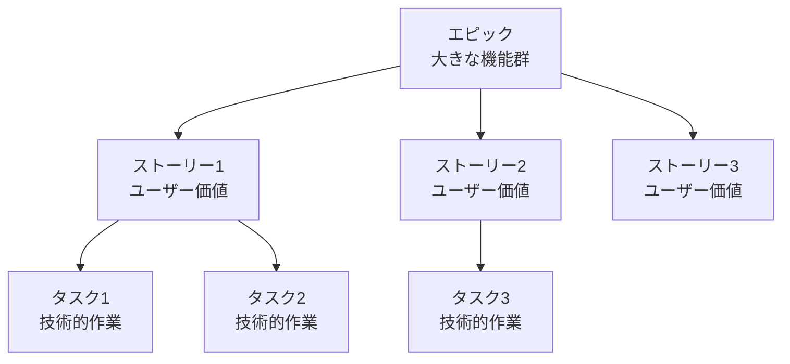
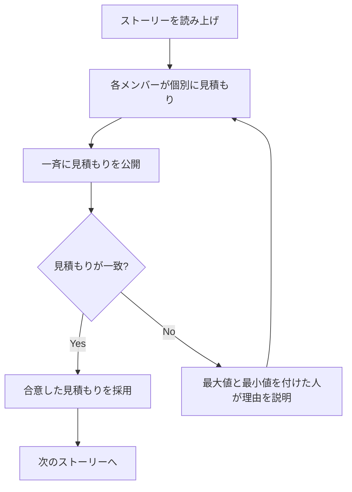
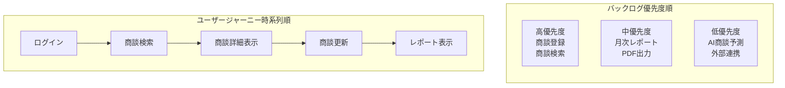

# 2.2.5.3 ユーザーストーリー形式

## 目的

アジャイル開発において、**要件をユーザーストーリー形式で簡潔に記述する方法**を提供します。

ユーザーストーリーは、ユースケースよりも簡潔で、アジャイル開発のスプリント計画に適した記述方法です。

### このドキュメントで得られること

1. ユーザーストーリーの標準フォーマット
2. INVEST原則に基づく良いストーリーの書き方
3. ストーリーポイントの見積もり方
4. エピック・ストーリー・タスクの階層構造

---

## 📋 ユーザーストーリーとは

### 定義

**ユーザーストーリー（User Story）** = ユーザーの視点から「誰が」「何をしたいか」「なぜ」を簡潔に記述したもの


---

### 標準フォーマット

```
As a [ユーザーの役割],
I want to [実現したいこと],
So that [その理由・得られる価値].
```

**日本語版**:
```
[ユーザーの役割]として、
[実現したいこと]をしたい。
なぜなら、[その理由・得られる価値]だから。
```

---

## ✅ Good Example: ユーザーストーリー

### Example 1: 商談登録

```
As a 営業担当者,
I want to 新規商談を登録する,
So that 顧客訪問後すぐに商談情報を記録できる.
```

**日本語版**:
```
営業担当者として、
新規商談を登録したい。
なぜなら、顧客訪問後すぐに商談情報を記録できるから。
```

---

### Example 2: 商談検索

```
As a マネージャー,
I want to 商談を顧客名・期間・ステータスで検索する,
So that チーム全体の商談状況を把握できる.
```

---

### Example 3: レポート出力

```
As a マネージャー,
I want to 月次売上レポートをPDFで出力する,
So that 経営会議で売上状況を報告できる.
```

---

## 🎯 INVEST原則

良いユーザーストーリーは、**INVEST原則**を満たします。

| 原則 | 英語 | 日本語 | 説明 |
|------|------|--------|------|
| I | Independent | 独立している | 他のストーリーに依存しない |
| N | Negotiable | 交渉可能 | 詳細は実装時に調整可能 |
| V | Valuable | 価値がある | ユーザーに価値を提供する |
| E | Estimable | 見積もり可能 | 工数見積もりができる |
| S | Small | 小さい | 1スプリントで完成できる |
| T | Testable | テスト可能 | 受け入れ基準が明確 |

---

### I: Independent（独立している）

**Good Example**:
```
✅ ストーリー1: 商談を登録する
✅ ストーリー2: 商談を検索する
```

**理由**: 2つのストーリーは独立しており、どちらから実装しても良い

**Bad Example**:
```
❌ ストーリー1: 商談登録画面のUI作成
❌ ストーリー2: 商談登録のバックエンドAPI作成
```

**理由**: ストーリー2はストーリー1に依存している（独立していない）

---

### N: Negotiable（交渉可能）

**Good Example**:
```
✅ 営業担当者として、商談を検索したい。なぜなら、過去の商談を確認できるから。

実装時の調整:
- 検索条件: 顧客名、期間、ステータス（実装時に決定）
- 検索結果の表示形式: テーブル or カード（実装時に決定）
```

**Bad Example**:
```
❌ 営業担当者として、商談を顧客名・期間・ステータス・担当者・金額・
   商品カテゴリ・受注予定日・作成日時で検索し、結果をテーブル形式で
   20件/ページで表示し、CSV出力機能も含める。
```

**理由**: 詳細すぎて、実装時の調整の余地がない

---

### V: Valuable（価値がある）

**Good Example**:
```
✅ マネージャーとして、月次売上レポートを表示したい。
   なぜなら、チームの売上目標達成度を確認できるから。
```

**Bad Example**:
```
❌ 開発者として、データベースにインデックスを作成したい。
   なぜなら、クエリのパフォーマンスが向上するから。
```

**理由**: ユーザー（マネージャー、営業担当者）に直接的な価値を提供していない（技術的なタスク）

---

### E: Estimable（見積もり可能）

**Good Example**:
```
✅ 営業担当者として、商談を登録したい。
   なぜなら、顧客訪問後すぐに商談情報を記録できるから。

見積もり: 3ストーリーポイント
```

**Bad Example**:
```
❌ 営業担当者として、商談を管理したい。
   なぜなら、業務効率が上がるから。

見積もり: ???（範囲が広すぎて見積もり不可）
```

---

### S: Small（小さい）

**Good Example**:
```
✅ 営業担当者として、商談を登録したい。

見積もり: 3ストーリーポイント（1スプリント内で完成）
```

**Bad Example**:
```
❌ 営業担当者として、商談管理機能（登録・更新・削除・検索・
   レポート・外部連携）をすべて実装したい。

見積もり: 50ストーリーポイント（1スプリントで完成不可）
```

**解決策**: エピックに分割し、複数のストーリーに分ける

---

### T: Testable（テスト可能）

**Good Example**:
```
✅ 営業担当者として、商談を登録したい。

受け入れ基準:
- 顧客、商談日を入力して保存すると、商談一覧に表示される
- 必須項目が未入力の場合、エラーメッセージが表示される
```

**Bad Example**:
```
❌ 営業担当者として、使いやすい商談登録機能が欲しい。

受け入れ基準: ???（「使いやすい」は主観的で、テスト不可）
```

---

## 📊 エピック・ストーリー・タスクの階層構造

アジャイル開発では、要件を階層的に管理します。



---

### エピック（Epic）

**定義**: 複数のストーリーからなる大きな機能群

**例**:
```
エピック: 商談管理機能
- ストーリー1: 商談を登録する
- ストーリー2: 商談を更新する
- ストーリー3: 商談を削除する
- ストーリー4: 商談を検索する
- ストーリー5: 商談詳細を表示する
```

**特徴**:
- 1スプリントでは完成しない（複数スプリントにまたがる）
- ビジネス価値の大きなまとまり

---

### ストーリー（Story）

**定義**: ユーザーに価値を提供する1つの機能

**例**:
```
ストーリー: 商談を登録する

As a 営業担当者,
I want to 新規商談を登録する,
So that 顧客訪問後すぐに商談情報を記録できる.
```

**特徴**:
- 1スプリント内で完成できる
- ユーザーに価値を提供
- 独立している

---

### タスク（Task）

**定義**: ストーリーを実現するための技術的作業

**例（ストーリー: 商談を登録する）**:
```
タスク1: 商談登録画面のUIを作成
タスク2: 商談登録APIを実装
タスク3: バリデーション処理を実装
タスク4: 単体テストを作成
タスク5: 結合テストを作成
```

**特徴**:
- 技術的な作業単位
- ユーザーに直接的な価値は提供しない
- 数時間〜1日で完成

---

## 🔢 ストーリーポイントの見積もり

ストーリーポイントは、ストーリーの**複雑さ・作業量・不確実性**を相対的に表す指標です。

### フィボナッチ数列を使用

```
1, 2, 3, 5, 8, 13, 21, ...
```

**理由**: 大きなストーリーほど不確実性が高いため、細かい差は意味がない

---

### ストーリーポイントの目安

| ポイント | 複雑度 | 説明 | 例 |
|---------|-------|------|-----|
| 1 | 非常に簡単 | 数時間で完成 | ログアウト機能 |
| 2 | 簡単 | 半日で完成 | 商談詳細表示 |
| 3 | 普通 | 1日で完成 | 商談登録 |
| 5 | やや複雑 | 2〜3日で完成 | 商談検索（複数条件） |
| 8 | 複雑 | 3〜5日で完成 | レポート生成 |
| 13 | 非常に複雑 | 5日以上 | 外部システム連携 |
| 21以上 | 巨大 | エピックに分割すべき | - |

**注意**: ポイントは相対的な指標であり、絶対的な時間ではありません。

---

### プランニングポーカー

チームでストーリーポイントを見積もる手法：



---

## 📝 ユーザーストーリーのテンプレート

### 標準テンプレート

```markdown
## ストーリーID: US-001

### ユーザーストーリー

As a [ユーザーの役割],
I want to [実現したいこと],
So that [その理由・得られる価値].

### 受け入れ基準

- [ ] [基準1]
- [ ] [基準2]
- [ ] [基準3]

### ストーリーポイント

[ポイント数]

### 優先度

高 / 中 / 低

### 備考

[補足情報]
```

---

### Good Example: 商談登録ストーリー

```markdown
## ストーリーID: US-001

### ユーザーストーリー

As a 営業担当者,
I want to 新規商談を登録する,
So that 顧客訪問後すぐに商談情報を記録できる.

### 受け入れ基準

- [ ] 商談一覧画面に「新規登録」ボタンが表示される
- [ ] 「新規登録」ボタン押下で商談登録画面が表示される
- [ ] 顧客、商談日、ステータスを入力して「保存」ボタンを押すと、商談が登録される
- [ ] 登録後、「登録しました」とメッセージが表示される
- [ ] 登録後、商談一覧画面に遷移し、登録した商談が表示される
- [ ] 必須項目（顧客、商談日）が未入力の場合、エラーメッセージが表示される
- [ ] 保存ボタン押下から完了まで1秒以内

### ストーリーポイント

3

### 優先度

高

### 備考

- 営業担当者は自動設定（ログインユーザー）
- ステータスのデフォルトは「初回訪問」
```

---

## 🎯 ユーザーストーリーマッピング

ユーザーストーリーを時系列・優先度で整理する手法：



---

## ✅ ユーザーストーリー作成のチェックリスト

### INVEST原則
- [ ] Independent（独立している）
- [ ] Negotiable（交渉可能）
- [ ] Valuable（価値がある）
- [ ] Estimable（見積もり可能）
- [ ] Small（小さい）
- [ ] Testable（テスト可能）

### 記述内容
- [ ] As a [役割] を明記
- [ ] I want to [実現したいこと] を明記
- [ ] So that [理由・価値] を明記
- [ ] 受け入れ基準を明記（3〜7項目）
- [ ] ストーリーポイントを見積もり済み
- [ ] 優先度を設定済み

---

## 🚨 よくある失敗パターン

### ❌ 技術的なタスクをストーリーとして書く

**Bad Example**:
```
❌ As a 開発者,
   I want to データベースにインデックスを作成する,
   So that クエリが高速化される.
```

**理由**: ユーザー（営業担当者、マネージャー）に価値を提供していない

**Good Example**:
```
✅ As a 営業担当者,
   I want to 商談検索結果が2秒以内に表示される,
   So that 素早く過去の商談を確認できる.
```

---

### ❌ ストーリーが大きすぎる

**Bad Example**:
```
❌ As a マネージャー,
   I want to 商談管理機能全体を使いたい,
   So that チーム全体の商談を管理できる.
```

**理由**: エピックレベルで、1スプリントで完成しない

**Good Example**:
```
✅ エピック: 商談管理機能
   ストーリー1: 商談を登録する（3ポイント）
   ストーリー2: 商談を更新する（2ポイント）
   ストーリー3: 商談を検索する（5ポイント）
```

---

### ❌ 受け入れ基準が曖昧

**Bad Example**:
```
受け入れ基準:
- [ ] 商談登録機能が使いやすい
- [ ] レスポンスが速い
```

**理由**: 「使いやすい」「速い」は主観的でテストできない

**Good Example**:
```
受け入れ基準:
- [ ] 商談登録画面に必須項目が明示されている（*マーク）
- [ ] 保存ボタン押下から完了まで1秒以内
```

---

## 📚 次のステップ

ユーザーストーリー作成が完了したら:

1. **2.2.5.4 受け入れ基準の書き方.md** へ進む
2. ストーリーの受け入れ基準を詳細化
3. **2.2.5.5 Good_Bad_Example集.md** で実例を確認

---

## 関連ドキュメント

- [2.2.5.1 機能一覧表フォーマット](./2.2.5.1_機能一覧表フォーマット.md) - 機能の一覧化
- [2.2.5.2 ユースケース記述方法](./2.2.5.2_ユースケース記述方法.md) - 詳細な記述方法
- [2.2.5.4 受け入れ基準の書き方](./2.2.5.4_受け入れ基準の書き方.md) - 受け入れ基準の詳細
- [2.2.2.1 機能要件ヒアリング項目](./2.2.2.1_機能要件ヒアリング項目.md) - ヒアリング項目

---

**作成日**: 2025-10-19
**対象フェーズ**: 要件定義
**重要度**: ⭐⭐⭐ 必須（アジャイル開発の場合）
