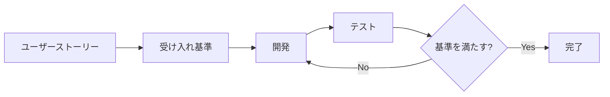
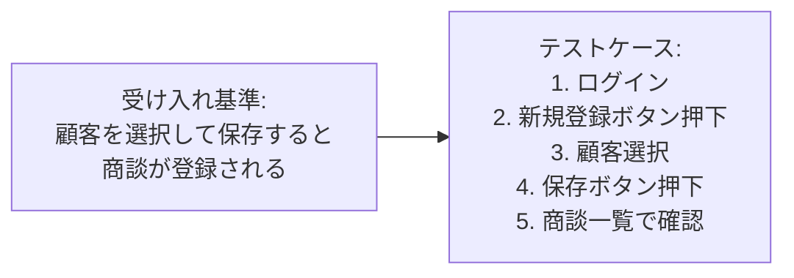

# 2.2.5.4 受け入れ基準の書き方

## 目的

ユーザーストーリーやユースケースに対して、**機能が完成したと判断するための具体的な基準**を定義する方法を提供します。

受け入れ基準は、開発者・テスター・ユーザーが「この機能は完成した」と合意するための明確な判断基準です。

### このドキュメントで得られること

1. 受け入れ基準の標準フォーマット
2. Given-When-Then形式の書き方
3. テスト可能な基準の書き方
4. 非機能要件の受け入れ基準

---

## 📋 受け入れ基準とは

### 定義

**受け入れ基準（Acceptance Criteria）** = 機能が完成したと判断するための、テスト可能な具体的な条件



---

### 受け入れ基準の役割

| 役割 | 説明 |
|------|------|
| 完成の定義 | 「この機能は完成した」と判断する基準 |
| テストケースの基礎 | 受け入れ基準からテストケースを作成 |
| コミュニケーション | 開発者・テスター・ユーザー間の共通理解 |
| スコープの明確化 | この機能に何が含まれ、何が含まれないか |

---

## 📝 受け入れ基準の書き方

### パターン1: チェックリスト形式

最もシンプルで使いやすい形式。

**フォーマット**:
```
- [ ] [テスト可能な条件1]
- [ ] [テスト可能な条件2]
- [ ] [テスト可能な条件3]
```

**Good Example（商談登録）**:
```
受け入れ基準:
- [ ] 商談一覧画面に「新規登録」ボタンが表示される
- [ ] 「新規登録」ボタン押下で商談登録画面が表示される
- [ ] 顧客、商談日を入力して「保存」ボタンを押すと、商談が登録される
- [ ] 登録後、「登録しました」とメッセージが表示される
- [ ] 登録後、商談一覧画面に遷移し、登録した商談が表示される
- [ ] 必須項目が未入力の場合、エラーメッセージが表示される
- [ ] 保存ボタン押下から完了まで1秒以内
```

---

### パターン2: Given-When-Then形式（BDD形式）

より詳細に、前提条件・操作・期待結果を明確にする形式。

**フォーマット**:
```
Given [前提条件]
When [操作]
Then [期待結果]
```

**Good Example（商談登録）**:

```
Scenario: 正常に商談を登録できる

Given 営業担当者としてログイン済み
And 顧客マスタに「A社」が登録されている
When 商談一覧画面で「新規登録」ボタンを押下する
And 顧客に「A社」を選択する
And 商談日に「2025-01-15」を入力する
And 「保存」ボタンを押下する
Then 「登録しました」とメッセージが表示される
And 商談一覧画面に遷移する
And 商談一覧に「A社」「2025-01-15」の商談が表示される
```

```
Scenario: 必須項目未入力でエラーになる

Given 営業担当者としてログイン済み
When 商談一覧画面で「新規登録」ボタンを押下する
And 顧客を選択せずに「保存」ボタンを押下する
Then 「顧客は必須です」とエラーメッセージが表示される
And 商談は登録されない
```

---

### パターン3: 表形式

複数のケースを網羅的にテストする場合に使用。

**Good Example（商談検索）**:

| 検索条件 | 検索結果 |
|---------|---------|
| 顧客名「A社」 | A社の商談が表示される |
| 期間「2025-01-01〜2025-01-31」 | 1月の商談が表示される |
| ステータス「受注」 | 受注ステータスの商談が表示される |
| 条件なし | すべての商談が表示される |
| 該当なし | 「該当する商談がありません」と表示される |

---

## 🎯 受け入れ基準の書き方のコツ

### コツ1: 具体的に書く

**Bad Example**:
```
❌ システムが高速に動作する
❌ ユーザーフレンドリーなUIである
```

**理由**: 「高速」「ユーザーフレンドリー」は主観的で、テストできない

**Good Example**:
```
✅ 保存ボタン押下から完了まで1秒以内
✅ 必須項目に「*」マークが表示される
```

---

### コツ2: テスト可能に書く

受け入れ基準は、**実際にテストできる内容**でなければなりません。

**Bad Example**:
```
❌ システムが安定している
❌ セキュリティが高い
```

**Good Example**:
```
✅ 同時に100人がアクセスしても、エラーが発生しない
✅ ログイン失敗5回でアカウントがロックされる
```

---

### コツ3: 正常系と異常系の両方を書く

**Good Example**:
```
正常系:
- [ ] 正しい入力で商談が登録される

異常系:
- [ ] 必須項目未入力でエラーメッセージが表示される
- [ ] 不正な日付形式でエラーメッセージが表示される
- [ ] データベース接続エラー時にエラーメッセージが表示される
```

---

### コツ4: ユーザーの視点で書く

**Bad Example**:
```
❌ データベースにINSERT文が実行される
❌ APIが200ステータスコードを返す
```

**理由**: 技術的な詳細ではなく、ユーザーが体験することを書く

**Good Example**:
```
✅ 商談が登録され、商談一覧に表示される
✅ 「登録しました」とメッセージが表示される
```

---

### コツ5: 数値を明記する

**Bad Example**:
```
❌ レスポンスが速い
❌ 大量のデータを処理できる
```

**Good Example**:
```
✅ 保存ボタン押下から完了まで1秒以内
✅ 10,000件の商談を検索できる
```

---

## 📊 受け入れ基準のカテゴリ

受け入れ基準は、以下のカテゴリで網羅的に記載します。

### 1. 機能的な基準

```
- [ ] ○○ボタンを押すと、××画面が表示される
- [ ] △△を入力して保存すると、データが登録される
- [ ] 検索条件に□□を入力すると、該当するデータが表示される
```

---

### 2. UI/UXの基準

```
- [ ] 必須項目に「*」マークが表示される
- [ ] エラーメッセージが赤文字で表示される
- [ ] 保存ボタン押下後、ボタンがグレーアウトされる（連打防止）
- [ ] ローディング中、スピナーが表示される
```

---

### 3. バリデーションの基準

```
- [ ] 必須項目が未入力の場合、「○○は必須です」とエラーが表示される
- [ ] 金額に負の数を入力すると、「0以上の数値を入力してください」とエラーが表示される
- [ ] メールアドレス形式が不正な場合、「正しいメールアドレスを入力してください」とエラーが表示される
```

---

### 4. 性能の基準

```
- [ ] 保存ボタン押下から完了まで1秒以内
- [ ] 10,000件のデータを検索しても、2秒以内に結果が表示される
- [ ] 100人が同時にアクセスしても、エラーが発生しない
```

---

### 5. セキュリティの基準

```
- [ ] ログインしていない状態では、商談一覧画面にアクセスできない（ログイン画面にリダイレクト）
- [ ] 営業担当者は自分の商談のみ閲覧できる（他人の商談は閲覧不可）
- [ ] 管理者のみ商談を削除できる（一般ユーザーは削除不可）
```

---

### 6. データ整合性の基準

```
- [ ] 商談を登録すると、商談IDが自動採番される
- [ ] 商談を更新すると、更新日時が自動設定される
- [ ] 商談を削除すると、関連する商談履歴も削除される
```

---

## ✅ Good Example: 商談検索の受け入れ基準

### ユーザーストーリー

```
As a マネージャー,
I want to 商談を顧客名・期間・ステータスで検索する,
So that チーム全体の商談状況を把握できる.
```

### 受け入れ基準（チェックリスト形式）

```
機能:
- [ ] 商談一覧画面に検索フォームが表示される
- [ ] 検索条件: 顧客名（部分一致）、期間（開始日〜終了日）、ステータス（複数選択）
- [ ] 「検索」ボタンを押すと、検索条件に一致する商談が表示される
- [ ] 検索条件を入力せずに「検索」ボタンを押すと、すべての商談が表示される
- [ ] 該当する商談がない場合、「該当する商談がありません」と表示される

UI/UX:
- [ ] 検索結果が100件を超える場合、ページネーションが表示される
- [ ] 検索中、ローディングスピナーが表示される
- [ ] 検索条件がクリアされると、すべての商談が再表示される

性能:
- [ ] 10,000件の商談データから検索しても、2秒以内に結果が表示される

セキュリティ:
- [ ] 営業担当者は自分が担当する商談のみ検索結果に表示される
- [ ] マネージャーは全員の商談が検索結果に表示される
```

---

### 受け入れ基準（Given-When-Then形式）

```
Scenario: 顧客名で検索できる

Given マネージャーとしてログイン済み
And 商談データに「A社」「B社」の商談が存在する
When 検索フォームの顧客名に「A社」を入力する
And 「検索」ボタンを押下する
Then 検索結果に「A社」の商談が表示される
And 「B社」の商談は表示されない
```

```
Scenario: 期間で検索できる

Given マネージャーとしてログイン済み
And 商談データに「2025-01-15」「2025-02-15」の商談が存在する
When 検索フォームの期間に「2025-01-01〜2025-01-31」を入力する
And 「検索」ボタンを押下する
Then 検索結果に「2025-01-15」の商談が表示される
And 「2025-02-15」の商談は表示されない
```

```
Scenario: 該当なしの場合

Given マネージャーとしてログイン済み
And 商談データに「A社」の商談が存在する
When 検索フォームの顧客名に「Z社」を入力する
And 「検索」ボタンを押下する
Then 「該当する商談がありません」と表示される
```

---

## 🚨 よくある失敗パターン

### ❌ 曖昧な表現

**Bad Example**:
```
❌ システムが使いやすい
❌ レスポンスが速い
❌ セキュリティが高い
```

**理由**: 主観的で、テストできない

**Good Example**:
```
✅ 必須項目に「*」マークが表示される
✅ 保存ボタン押下から完了まで1秒以内
✅ ログイン失敗5回でアカウントがロックされる
```

---

### ❌ 技術的な詳細を書く

**Bad Example**:
```
❌ データベースにINSERT文が実行される
❌ APIが200ステータスコードを返す
❌ RedisにキャッシュされるORDER```

**理由**: 受け入れ基準は、ユーザーが体験することを書く

**Good Example**:
```
✅ 商談が登録され、商談一覧に表示される
✅ 検索結果が2秒以内に表示される
```

---

### ❌ 正常系のみで異常系がない

**Bad Example**:
```
受け入れ基準:
- [ ] 正しい入力で商談が登録される
```

**理由**: 異常系のテストができない

**Good Example**:
```
受け入れ基準:
正常系:
- [ ] 正しい入力で商談が登録される

異常系:
- [ ] 必須項目未入力でエラーメッセージが表示される
- [ ] 不正な日付形式でエラーメッセージが表示される
```

---

### ❌ 数値がない

**Bad Example**:
```
❌ 大量のデータを処理できる
❌ 多数のユーザーがアクセスしても動作する
```

**理由**: 「大量」「多数」は人によって解釈が異なる

**Good Example**:
```
✅ 10,000件のデータを検索できる
✅ 100人が同時にアクセスしても、エラーが発生しない
```

---

## 📚 受け入れ基準から受け入れテストへ

受け入れ基準は、**受け入れテスト（Acceptance Test）** の基礎になります。

### 受け入れ基準 → テストケース



**受け入れ基準**:
```
- [ ] 顧客、商談日を入力して保存すると、商談が登録される
```

**テストケース**:
```
1. 営業担当者としてログイン
2. 商談一覧画面で「新規登録」ボタンを押下
3. 顧客に「A社」を選択
4. 商談日に「2025-01-15」を入力
5. 「保存」ボタンを押下
6. 「登録しました」とメッセージが表示されることを確認
7. 商談一覧画面に遷移することを確認
8. 商談一覧に「A社」「2025-01-15」の商談が表示されることを確認
```

---

## ✅ 受け入れ基準作成のチェックリスト

### 必須項目
- [ ] 具体的に書かれている
- [ ] テスト可能である
- [ ] ユーザーの視点で書かれている
- [ ] 正常系と異常系の両方を含む

### 推奨項目
- [ ] 数値を明記している
- [ ] UI/UXの基準を含む
- [ ] 性能の基準を含む
- [ ] セキュリティの基準を含む

### 品質確認
- [ ] 曖昧な表現がない
- [ ] 技術的な詳細が含まれていない
- [ ] チームメンバー全員が理解できる

---

## 📚 次のステップ

受け入れ基準の書き方を理解したら:

1. **2.2.5.5 Good_Bad_Example集.md** へ進む
2. 実際のプロジェクトで使える豊富な実例を確認
3. テストフェーズで受け入れテストを実施

---

## 関連ドキュメント

- [2.2.5.2 ユースケース記述方法](./2.2.5.2_ユースケース記述方法.md) - ユースケースの書き方
- [2.2.5.3 ユーザーストーリー形式](./2.2.5.3_ユーザーストーリー形式.md) - ユーザーストーリーの書き方
- [2.2.5.5 Good_Bad_Example集](./2.2.5.5_Good_Bad_Example集.md) - 実例集
- [2.5 テストフェーズ](../../2.5_テストフェーズ/INDEX.md) - 受け入れテストの実施

---

**作成日**: 2025-10-19
**対象フェーズ**: 要件定義
**重要度**: ⭐⭐⭐ 必須
