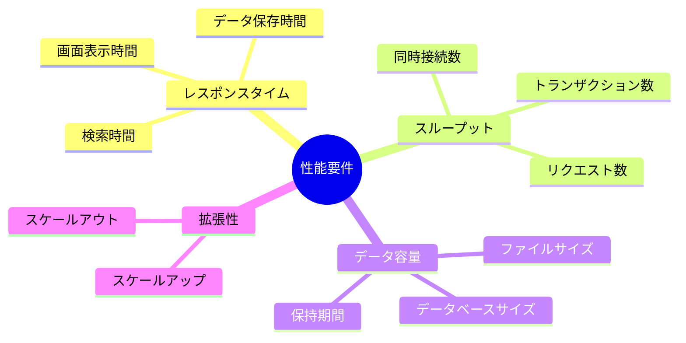

# 2.2.6.1 性能要件の記述方法

## 目的

**性能・拡張性に関する非機能要件を具体的に記述する方法**を提供します。

性能要件は、システムのレスポンスタイム、スループット、データ容量などを定義し、ユーザー体験に直結する重要な要件です。

### このドキュメントで得られること

1. 性能要件の標準フォーマット
2. 具体的な数値目標の設定方法
3. 測定方法・テスト方法の定義
4. よくある性能要件のパターン

---

## 📋 性能要件のカテゴリ

性能要件は、以下のカテゴリに分類されます：



---

## 📝 性能要件の標準フォーマット

### テンプレート

```markdown
## [カテゴリ]: [項目名]

### 要件
[具体的な数値目標]

### 測定方法
[どのように測定するか]

### 測定条件
[どのような条件で測定するか]

### 優先度
高 / 中 / 低

### 備考
[補足情報]
```

---

## 🎯 レスポンスタイム要件

### 定義

**レスポンスタイム** = ユーザーが操作してから、システムが応答するまでの時間

---

### Good Example 1: 画面表示時間

```markdown
## レスポンスタイム: 商談一覧画面の表示時間

### 要件
商談一覧画面が2秒以内に表示されること

### 測定方法
ユーザーが「商談一覧」メニューをクリックしてから、画面が完全に表示されるまでの時間を計測

### 測定条件
- 商談データ: 10,000件
- ネットワーク: 100Mbps
- 同時アクセス数: 10人
- クライアント: Chrome最新版、Windows 10

### 優先度
高

### 備考
- 初回表示は3秒以内を許容
- 2回目以降（キャッシュあり）は1秒以内を目標
```

---

### Good Example 2: データ保存時間

```markdown
## レスポンスタイム: 商談登録の保存時間

### 要件
商談登録の「保存」ボタン押下から完了まで1秒以内

### 測定方法
「保存」ボタンを押下してから、「登録しました」とメッセージが表示されるまでの時間を計測

### 測定条件
- 入力データ: 標準的な商談情報（顧客、商談日、金額、メモ500文字）
- データベース接続: 同一リージョン内
- 同時保存数: 10件/秒

### 優先度
高

### 備考
- ネットワーク遅延が大きい場合（100ms以上）は2秒以内を許容
```

---

### レスポンスタイムの目安

| 操作種別 | 目標時間 | 許容時間 | 理由 |
|---------|---------|---------|------|
| 画面表示 | 1〜2秒 | 3秒 | ユーザーが待たされる感覚がない |
| データ保存 | 1秒以内 | 2秒 | 即座にフィードバックが必要 |
| 検索結果表示 | 2秒以内 | 5秒 | 待ち時間が長いとストレス |
| レポート生成 | 10秒以内 | 30秒 | ローディングインジケーター表示で許容 |
| バッチ処理 | 数分〜数時間 | - | 夜間実行で許容 |

---

## 📊 スループット要件

### 定義

**スループット** = 単位時間あたりに処理できる量（同時接続数、トランザクション数等）

---

### Good Example 1: 同時接続数

```markdown
## スループット: 同時接続ユーザー数

### 要件
同時に100人のユーザーがアクセスしても、レスポンスタイムが2倍以内に収まること

### 測定方法
負荷テストツール（JMeter等）で100人が同時にアクセスするシナリオを実行し、レスポンスタイムを計測

### 測定条件
- 通常時のレスポンスタイム: 2秒
- 100人同時アクセス時の許容レスポンスタイム: 4秒以内

### 優先度
高

### 備考
- ピーク時（朝9時、夕方17時）の想定
- 150人以上のアクセスは想定外（将来のスケールアウトで対応）
```

---

### Good Example 2: トランザクション数

```markdown
## スループット: 商談登録のトランザクション数

### 要件
1秒あたり10件の商談登録を処理できること

### 測定方法
負荷テストツールで1秒間に10件の商談登録リクエストを送信し、すべて正常に処理されることを確認

### 測定条件
- データベース: 商談データ10,000件が既に登録されている状態
- 各商談の入力データ: 標準的なサイズ

### 優先度
中

### 備考
- 通常時は2件/秒程度を想定
- イベント時（営業会議後など）に一時的に10件/秒が発生する可能性
```

---

## 💾 データ容量要件

### 定義

**データ容量** = システムが保持するデータの量と保持期間

---

### Good Example: データベース容量

```markdown
## データ容量: データベースのストレージ容量

### 要件
5年間のデータを保持できる容量を確保すること

### データ量見積もり

| データ種別 | 初期 | 年間増加量 | 5年後 |
|-----------|------|-----------|-------|
| 商談データ | 0件 | 10,000件 × 10KB = 100MB | 500MB |
| 顧客データ | 500件 × 1KB = 0.5MB | 100件 × 1KB = 0.1MB | 1MB |
| ユーザーデータ | 50件 × 0.5KB = 25KB | 10件 × 0.5KB = 5KB | 50KB |
| 添付ファイル | 0 | 500件 × 1MB = 500MB | 2.5GB |
| 合計 | 約1MB | 約600MB/年 | 約3GB |

### 必要容量
- データベース: 5GB（余裕を持たせて約2倍）
- ファイルストレージ: 10GB（余裕を持たせて約4倍）

### 測定方法
- 四半期ごとにデータベースサイズを監視
- 想定の80%に達した場合、拡張を検討

### 優先度
中

### 備考
- バックアップも含めると、実際には2倍の容量が必要
```

---

## 🔄 拡張性要件

### 定義

**拡張性（スケーラビリティ）** = 将来、ユーザー数やデータ量が増えた場合に対応できる能力

---

### Good Example: 拡張性

```markdown
## 拡張性: ユーザー数・データ量の増加への対応

### 要件
3年後にユーザー数が2倍、データ量が3倍になっても、レスポンスタイムの劣化が20%以内に収まること

### 現状
- ユーザー数: 50人
- 商談データ: 1万件/年
- レスポンスタイム: 2秒

### 3年後の想定
- ユーザー数: 100人（2倍）
- 商談データ: 3万件/年（3倍）
- 許容レスポンスタイム: 2.4秒以内（20%増以内）

### 拡張方針
- スケールアップ: サーバースペックを上げる（CPU、メモリ増強）
- データベース最適化: インデックス追加、パーティショニング
- キャッシュ導入: Redis等でよく使うデータをキャッシュ

### 測定方法
- 年1回、想定データ量でパフォーマンステストを実施
- レスポンスタイムが許容値を超えた場合、拡張を実施

### 優先度
中

### 備考
- スケールアウト（サーバー台数を増やす）は当面不要
- 5年後（ユーザー200人超）の場合はスケールアウトを検討
```

---

## 📐 測定方法・テスト方法

### 性能テストの種類

| テスト種別 | 目的 | 実施タイミング |
|-----------|------|---------------|
| ベースラインテスト | 通常時の性能を測定 | 開発完了後 |
| 負荷テスト | 想定負荷での性能を測定 | 開発完了後 |
| ストレステスト | 限界性能を測定 | 開発完了後 |
| スパイクテスト | 急激な負荷増加への対応を測定 | 本番前 |
| 耐久テスト | 長時間運用での性能劣化を測定 | 本番前 |

---

### Good Example: 負荷テストシナリオ

```markdown
## 負荷テスト: 商談管理システム

### テストシナリオ

**シナリオ1: 通常時**
- 仮想ユーザー数: 20人
- 操作内容:
  - 商談一覧表示（40%）
  - 商談詳細表示（30%）
  - 商談登録（20%）
  - 商談検索（10%）
- 実行時間: 30分
- 期待結果: すべての操作が2秒以内に完了

**シナリオ2: ピーク時**
- 仮想ユーザー数: 100人
- 操作内容: シナリオ1と同じ
- 実行時間: 30分
- 期待結果: すべての操作が4秒以内に完了

**シナリオ3: ストレステスト**
- 仮想ユーザー数: 200人（想定の2倍）
- 操作内容: シナリオ1と同じ
- 実行時間: 10分
- 期待結果: システムがエラーなく動作（レスポンスタイムは許容範囲外でも可）

### 測定項目
- レスポンスタイム（平均、90パーセンタイル、最大）
- スループット（リクエスト数/秒）
- エラー率
- CPU使用率、メモリ使用率
- データベース接続数

### ツール
- JMeter または Gatling
```

---

## ✅ 性能要件記述のチェックリスト

### 必須項目
- [ ] 具体的な数値目標を記載
- [ ] 測定方法を明記
- [ ] 測定条件を明記
- [ ] 優先度を設定

### 推奨項目
- [ ] 現状と将来の想定を記載
- [ ] 許容値を記載（目標値の1.5倍程度）
- [ ] 測定ツールを明記

### 品質確認
- [ ] 曖昧な表現がない（「速い」ではなく「2秒以内」）
- [ ] テスト可能である
- [ ] 実現可能な目標値である

---

## 🚨 よくある失敗パターン

### ❌ Bad Example: 曖昧な表現

```
❌ システムが高速に動作すること
❌ レスポンスができるだけ速いこと
```

**理由**: 「高速」「できるだけ速い」は人によって解釈が異なる

**Good Example**:
```
✅ 商談一覧画面が2秒以内に表示されること
✅ 保存ボタン押下から完了まで1秒以内
```

---

### ❌ Bad Example: 測定方法が不明

```
❌ 商談一覧画面が2秒以内に表示されること
```

**理由**: 「2秒以内」は測定できるが、具体的な測定方法が不明

**Good Example**:
```
✅ 要件: 商談一覧画面が2秒以内に表示されること

測定方法:
- ユーザーが「商談一覧」メニューをクリックしてから、
  画面が完全に表示されるまでの時間を計測
- ブラウザのPerformance APIで測定

測定条件:
- 商談データ: 10,000件
- ネットワーク: 100Mbps
- クライアント: Chrome最新版
```

---

### ❌ Bad Example: 非現実的な目標値

```
❌ 10万件のデータを0.1秒で検索できること
```

**理由**: データベースの物理的な限界を考慮していない

**Good Example**:
```
✅ 10,000件のデータを2秒以内で検索できること
（将来的に10万件に増えた場合は、パーティショニング等で対応）
```

---

## 📚 次のステップ

性能要件の記述方法を理解したら:

1. **2.2.6.2 可用性要件の記述方法.md** へ進む
2. システムの稼働率・復旧時間等の要件を学ぶ
3. 実際のプロジェクトで性能要件を定義

---

## 関連ドキュメント

- [2.2.2.4 非機能要件ヒアリング項目](./2.2.2.4_非機能要件ヒアリング項目.md) - ヒアリング項目
- [2.2.6.2 可用性要件の記述方法](./2.2.6.2_可用性要件の記述方法.md) - 可用性要件
- [2.2.6.5 Good_Bad_Example集](./2.2.6.5_Good_Bad_Example集.md) - 実例集
- [2.5 テストフェーズ](../../2.5_テストフェーズ/INDEX.md) - 性能テストの実施

---

**作成日**: 2025-10-19
**対象フェーズ**: 要件定義
**重要度**: ⭐⭐⭐ 必須
