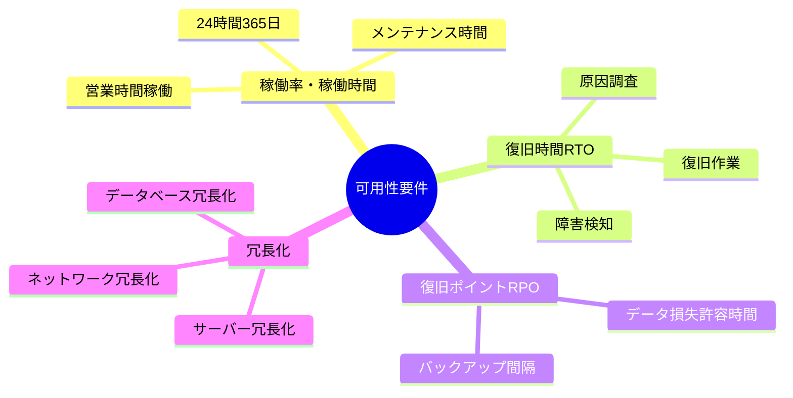
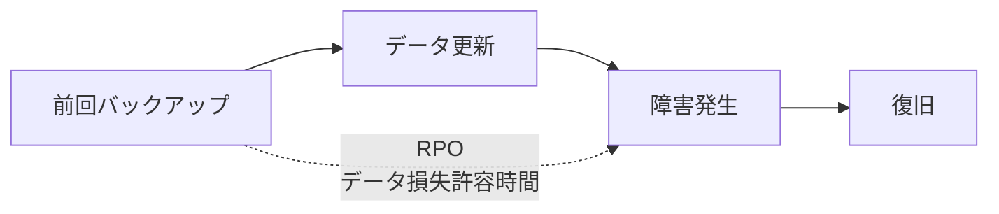
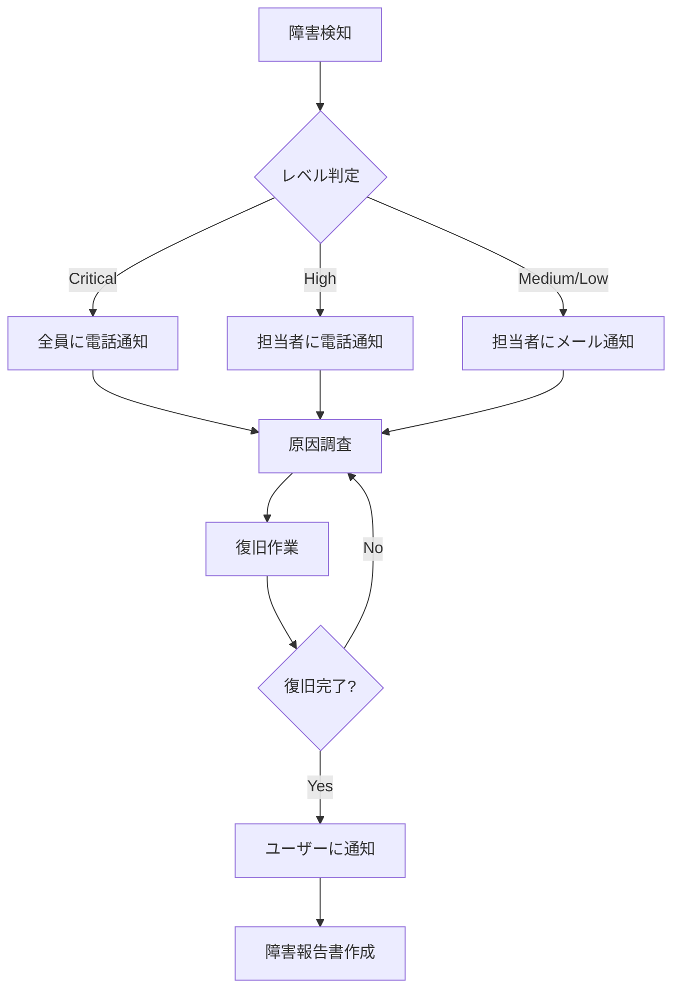

# 2.2.6.2 可用性要件の記述方法

## 目的

**可用性（システムの稼働率・信頼性）に関する非機能要件を具体的に記述する方法**を提供します。

可用性要件は、システムがどれだけ安定して動作し続けるか、障害時にどれだけ早く復旧できるかを定義します。

### このドキュメントで得られること

1. 稼働率・稼働時間の定義方法
2. RTO（復旧時間目標）・RPO（復旧ポイント目標）の設定方法
3. 障害対応・冗長化の要件定義
4. バックアップ・リストア要件の記述方法

---

## 📋 可用性要件のカテゴリ



---

## 📝 稼働率・稼働時間要件

### 稼働率の定義

**稼働率（Availability）** = システムが正常に動作している時間の割合

```
稼働率 = 正常稼働時間 / (正常稼働時間 + 停止時間) × 100%
```

---

### 稼働率の目安

| 稼働率 | 年間停止時間 | 月間停止時間 | 適用例 |
|-------|------------|------------|--------|
| 90% | 36.5日 | 3日 | 個人向けサービス |
| 95% | 18.25日 | 1.5日 | 一般的なWebアプリ |
| 99% | 3.65日 | 7.2時間 | 業務システム |
| 99.5% | 1.83日 | 3.6時間 | 重要な業務システム |
| 99.9% (Three Nine) | 8.76時間 | 43.2分 | ミッションクリティカル |
| 99.99% (Four Nine) | 52.6分 | 4.32分 | 金融システム |
| 99.999% (Five Nine) | 5.26分 | 25.9秒 | 通信インフラ |

---

### Good Example 1: 稼働時間・稼働率

```markdown
## 可用性: 稼働時間・稼働率

### 要件
営業時間中（平日9:00-18:00）の稼働率99.5%以上を保証すること

### 稼働時間
- 営業時間: 平日9:00-18:00（1日9時間）
- 月間営業時間: 約180時間（20営業日 × 9時間）
- 年間営業時間: 約2,160時間（240営業日 × 9時間）

### 許容停止時間
- 月間: 0.9時間（54分）以内
- 年間: 10.8時間以内

### メンテナンス時間
- 定期メンテナンス: 毎月第2土曜日 0:00-6:00（営業時間外）
- 緊急メンテナンス: 営業時間外に実施（やむを得ない場合のみ営業時間中）

### 測定方法
- 監視ツールで稼働状況を記録
- 月次で稼働率をレポート

### 優先度
高

### 備考
- 営業時間外（18:00-9:00、土日祝）は停止許容
- ただし、データバックアップ・バッチ処理は実行可能であること
```

---

### Good Example 2: 24時間365日稼働

```markdown
## 可用性: 24時間365日稼働

### 要件
年間稼働率99.9%以上を保証すること

### 稼働時間
- 24時間365日稼働

### 許容停止時間
- 年間: 8.76時間以内
- 月間: 43.2分以内

### メンテナンス時間
- 計画停止: 年4回まで、各2時間以内（深夜2:00-4:00）
- 無停止メンテナンス: 可能な限りローリングアップデート等で対応

### 測定方法
- 監視ツールで24時間365日稼働状況を記録
- 月次・年次で稼働率をレポート

### 優先度
高

### 備考
- ECサイト等、顧客が24時間いつでもアクセスする可能性がある
- メンテナンス時はメンテナンス画面を表示
```

---

## ⏱️ RTO（復旧時間目標）

### 定義

**RTO（Recovery Time Objective）** = 障害発生から復旧完了までの目標時間


---

### Good Example: RTO要件

```markdown
## 可用性: 復旧時間目標（RTO）

### 要件
障害発生から1時間以内に復旧すること

### 復旧手順の内訳

| フェーズ | 目標時間 | 内容 |
|---------|---------|------|
| 障害検知 | 5分以内 | 監視ツールでアラート |
| 原因調査 | 15分以内 | ログ確認、エラー内容特定 |
| 復旧作業 | 35分以内 | 再起動、ロールバック等 |
| 動作確認 | 5分以内 | 正常動作を確認 |
| **合計** | **60分以内** | **RTO** |

### 対象時間帯
- 営業時間中（平日9:00-18:00）: 1時間以内 ⭐⭐⭐ 必須
- 営業時間外（18:00-9:00）: 翌朝9時まで（最大15時間）

### 復旧手段
- 自動フェイルオーバー（データベース、Webサーバー）
- 手動ロールバック（アプリケーション更新時のトラブル）
- バックアップからのリストア（データ破損時）

### 測定方法
- 障害対応ログを記録
- 障害発生から復旧までの時間を測定
- 四半期ごとにRTOの達成状況をレビュー

### 優先度
高

### 備考
- 重大な障害（データ損失等）の場合は、RTO延長もやむを得ない
- その場合は経営層・ユーザーに速やかに連絡
```

---

## 💾 RPO（復旧ポイント目標）

### 定義

**RPO（Recovery Point Objective）** = 障害発生時に許容できるデータ損失の時間



---

### Good Example: RPO要件

```markdown
## 可用性: 復旧ポイント目標（RPO）

### 要件
データ損失が1時間以内に収まること

### バックアップ戦略

| データ種別 | バックアップ方式 | 頻度 | RPO |
|-----------|---------------|------|-----|
| データベース | 増分バックアップ | 1時間ごと | 1時間 |
| データベース | フルバックアップ | 毎日AM 3:00 | 24時間 |
| ファイル | フルバックアップ | 毎日AM 4:00 | 24時間 |

### 最悪シナリオ
- 11:55に障害発生
- 11:00の増分バックアップから復旧
- データ損失: 55分間（許容範囲内）

### バックアップ保存先
- プライマリ: AWS S3（東京リージョン）
- セカンダリ: AWS S3（大阪リージョン）

### バックアップ世代管理
- 増分バックアップ: 7日分保持
- フルバックアップ: 30日分保持

### リストアテスト
- 月1回、バックアップからのリストアテストを実施
- リストア時間: 30分以内

### 測定方法
- バックアップログを記録
- リストアテストの結果を記録

### 優先度
高

### 備考
- データベースのトランザクションログも保存し、ポイントインタイムリカバリ可能
```

---

## 🔄 冗長化要件

### 定義

**冗長化** = システムの一部が故障しても、他の部分で動作を継続できる構成

---

### Good Example: 冗長化要件

```markdown
## 可用性: システム冗長化

### 要件
単一障害点（SPOF: Single Point of Failure）を排除すること

### 冗長化構成

#### Webサーバー
- 構成: 2台以上のWebサーバーをロードバランサー配下に配置
- 障害時の動作: 1台が故障しても、残りのサーバーで継続稼働
- 自動フェイルオーバー: あり（ヘルスチェック30秒ごと）

#### データベース
- 構成: プライマリ1台 + スタンバイ1台（ホットスタンバイ）
- 同期方式: 準同期レプリケーション
- 障害時の動作: プライマリ故障時、スタンバイに自動昇格
- 自動フェイルオーバー: あり（60秒以内）

#### ロードバランサー
- 構成: AWSのELB（可用性ゾーン2つ以上）
- AWSが冗長化を保証

#### ネットワーク
- 構成: マルチAZ（複数のアベイラビリティゾーン）
- 1つのAZが故障しても、他のAZで継続

### フェイルオーバーテスト
- 四半期ごとに実施
- プライマリサーバーを意図的に停止し、スタンバイに切り替わることを確認

### 優先度
高

### 備考
- コスト増加とのバランスを考慮
- 3台以上の冗長化は当面不要
```

---

## 📊 障害対応要件

### Good Example: 障害対応フロー

```markdown
## 可用性: 障害対応フロー

### 障害レベルの定義

| レベル | 定義 | 対応時間 | 通知先 |
|-------|------|---------|--------|
| Critical | サービス全停止 | 即座（24時間365日） | 全員（電話） |
| High | 主要機能が使用不可 | 営業時間中: 1時間以内 | 担当者（電話） |
| Medium | 一部機能が使用不可 | 営業時間中: 4時間以内 | 担当者（メール） |
| Low | 軽微な不具合 | 1営業日以内 | 担当者（メール） |

### 障害対応フロー



### エスカレーション

- 1時間以内に復旧できない場合: マネージャーに報告
- 4時間以内に復旧できない場合: 経営層に報告

### 優先度
高

### 備考
- 障害対応手順書を別途作成
- 定期的に訓練を実施（年2回）
```

---

## ✅ 可用性要件記述のチェックリスト

### 必須項目
- [ ] 稼働率または稼働時間を明記
- [ ] RTOを明記
- [ ] RPOを明記
- [ ] バックアップ戦略を明記

### 推奨項目
- [ ] 冗長化構成を明記
- [ ] 障害対応フローを明記
- [ ] フェイルオーバーテストの実施計画を明記

### 品質確認
- [ ] 具体的な数値目標がある
- [ ] 測定方法が明確
- [ ] 実現可能な目標値である

---

## 🚨 よくある失敗パターン

### ❌ Bad Example: 曖昧な表現

```
❌ システムが安定して動作すること
❌ 障害時に速やかに復旧すること
```

**理由**: 「安定」「速やかに」は人によって解釈が異なる

**Good Example**:
```
✅ 営業時間中の稼働率99.5%以上
✅ 障害発生から1時間以内に復旧
```

---

### ❌ Bad Example: 非現実的な目標

```
❌ 稼働率100%を保証すること
```

**理由**: メンテナンス・障害を考慮すると100%は不可能

**Good Example**:
```
✅ 営業時間中の稼働率99.5%以上
（月間54分以内の停止を許容）
```

---

### ❌ Bad Example: バックアップのみでRPOがない

```
❌ 毎日バックアップを取得すること
```

**理由**: バックアップ頻度だけでは、データ損失の許容範囲が不明

**Good Example**:
```
✅ RPO: 1時間以内
バックアップ頻度: 1時間ごとに増分バックアップ
```

---

## 📚 次のステップ

可用性要件の記述方法を理解したら:

1. **2.2.6.3 セキュリティ要件の記述方法.md** へ進む
2. 認証・認可・暗号化等のセキュリティ要件を学ぶ
3. 実際のプロジェクトで可用性要件を定義

---

## 関連ドキュメント

- [2.2.2.4 非機能要件ヒアリング項目](./2.2.2.4_非機能要件ヒアリング項目.md) - ヒアリング項目
- [2.2.6.1 性能要件の記述方法](./2.2.6.1_性能要件の記述方法.md) - 性能要件
- [2.2.6.4 運用要件の記述方法](./2.2.6.4_運用要件の記述方法.md) - 運用要件
- [2.2.6.5 Good_Bad_Example集](./2.2.6.5_Good_Bad_Example集.md) - 実例集

---

**作成日**: 2025-10-19
**対象フェーズ**: 要件定義
**重要度**: ⭐⭐⭐ 必須
