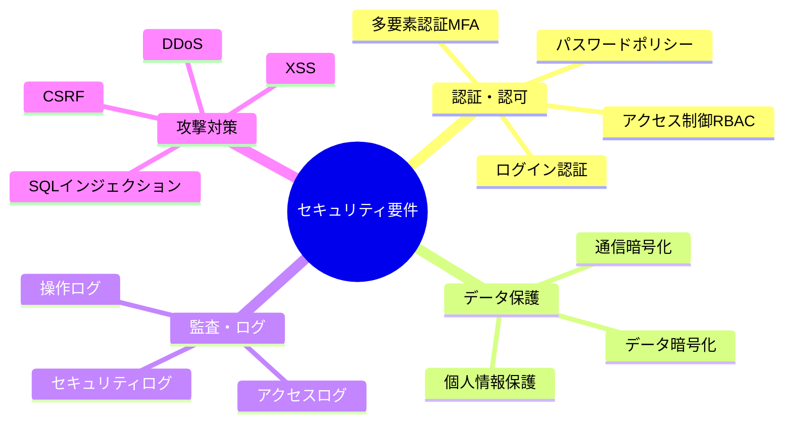
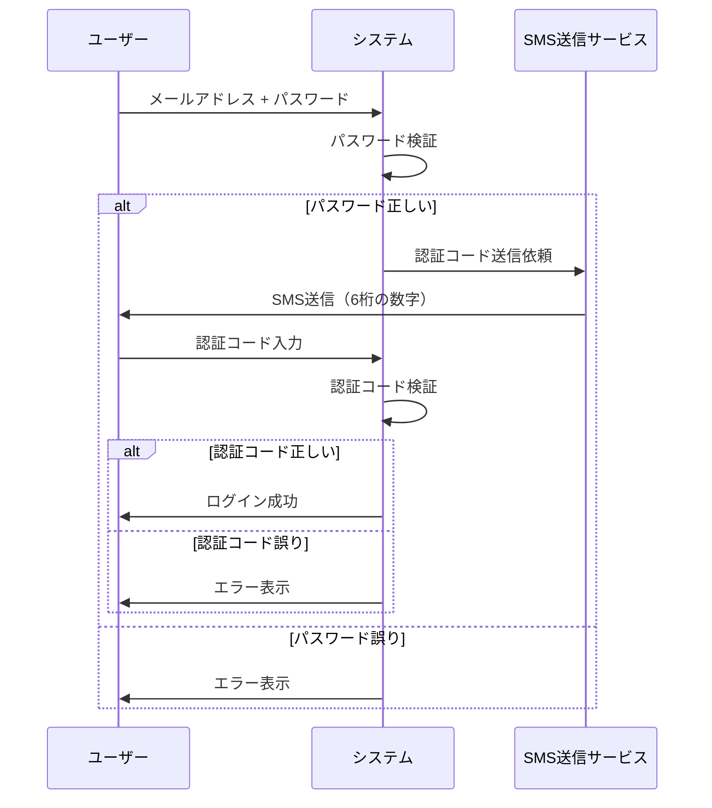

# 2.2.6.3 セキュリティ要件の記述方法

## 目的

**セキュリティに関する非機能要件を具体的に記述する方法**を提供します。

セキュリティ要件は、システムと データを不正アクセス・改ざん・漏洩から守るための重要な要件です。

### このドキュメントで得られること

1. 認証・認可要件の定義方法
2. データ暗号化要件の記述方法
3. 監査ログ要件の定義方法
4. セキュリティ対策（攻撃対策）の記述方法

---

## 📋 セキュリティ要件のカテゴリ



---

## 🔐 認証・認可要件

### 認証（Authentication）

**認証** = 「あなたは誰ですか?」を確認すること

---

### Good Example 1: ログイン認証

```markdown
## セキュリティ: ログイン認証

### 要件
メールアドレス + パスワードでログインすること

### パスワードポリシー

| 項目 | 要件 |
|------|------|
| 最小長 | 8文字以上 |
| 複雑性 | 英大文字・小文字・数字・記号のうち3種類以上 ⭐⭐⭐ 必須 |
| 有効期限 | 90日（変更を促す通知） |
| 再利用禁止 | 過去3回分のパスワードは使用不可 |
| ロックアウト | ログイン失敗5回でアカウントロック（30分間） ⭐⭐⭐ 必須 |

### パスワード保存方式
- ハッシュ化: bcryptでハッシュ化 ⭐⭐⭐ 必須
- ソルト: ユーザーごとにランダムなソルトを付与
- 平文保存禁止 ⭐⭐⭐ 必須

### セッション管理
- セッションタイムアウト: 30分間操作がない場合、自動ログアウト
- 同時ログイン: 同一ユーザーの複数デバイスからのログインは許可
- セッションID: ランダムで推測不可能な値

### 優先度
高

### 備考
- 初回ログイン時はパスワード変更を強制
- パスワードリセット機能を提供（メールでリンク送信）
```

---

### Good Example 2: 多要素認証（MFA）

```markdown
## セキュリティ: 多要素認証（MFA）

### 要件
管理者ログイン時は、パスワード + SMS認証コードによる2段階認証を必須とすること

### 認証フロー



### 認証コード仕様
- 桁数: 6桁の数字
- 有効期限: 5分間
- 再送信: 1分後に可能

### 対象ユーザー
- 管理者: 必須 ⭐⭐⭐
- 一般ユーザー: オプション（ユーザーが設定可能）

### 優先度
高

### 備考
- SMS送信サービスはTwilio等の外部サービスを利用
```

---

### 認可（Authorization）

**認可** = 「あなたは何ができますか?」を制御すること

---

### Good Example: ロールベースアクセス制御（RBAC）

```markdown
## セキュリティ: アクセス制御（RBAC）

### 要件
ユーザーのロールに応じて、アクセスできる機能・データを制限すること

### ロール定義

| ロール | 説明 | 人数 |
|--------|------|------|
| 営業担当者 | 自分の商談を管理 | 40名 |
| マネージャー | チーム全体の商談を閲覧・分析 | 5名 |
| 管理者 | システム全体の管理 | 5名 |

### アクセス制御マトリクス

| 機能 | 営業担当者 | マネージャー | 管理者 |
|------|-----------|-------------|--------|
| 商談登録 | ○ | × | ○ |
| 商談更新（自分） | ○ | × | ○ |
| 商談更新（他人） | × | × | ○ |
| 商談閲覧（自分） | ○ | × | ○ |
| 商談閲覧（チーム全体） | × | ○ | ○ |
| 商談削除 | × | × | ○ |
| ユーザー管理 | × | × | ○ |
| レポート閲覧 | × | ○ | ○ |

### 実装方式
- ロールはデータベースで管理
- 各機能の実行前に、ロールをチェック
- 権限がない場合、403 Forbiddenエラーを返す

### 優先度
高

### 備考
- ロールは将来的に追加・変更可能な設計にする
```

---

## 🔒 データ保護要件

### Good Example 1: 通信暗号化

```markdown
## セキュリティ: 通信暗号化

### 要件
すべての通信をHTTPS（TLS 1.2以上）で暗号化すること ⭐⭐⭐ 必須

### 対象
- クライアント ⇔ Webサーバー間のすべての通信
- Webサーバー ⇔ データベース間の通信
- Webサーバー ⇔ 外部API間の通信

### TLSバージョン
- TLS 1.2以上を使用 ⭐⭐⭐ 必須
- TLS 1.0, 1.1は使用禁止（脆弱性あり）

### 証明書
- 正規の認証局（Let's Encrypt等）から取得した証明書を使用
- 自己署名証明書は使用禁止

### HTTPSへのリダイレクト
- HTTPでアクセスされた場合、自動的にHTTPSにリダイレクト
- HSTSヘッダーを設定（Strict-Transport-Security）

### 優先度
高

### 備考
- HTTP通信は開発環境のみ許可
- 本番環境では必ずHTTPS
```

---

### Good Example 2: データ暗号化

```markdown
## セキュリティ: データ暗号化

### 要件
個人情報・機密情報をデータベースで暗号化して保存すること

### 暗号化対象データ

| データ種別 | 暗号化 | 暗号化方式 |
|-----------|-------|-----------|
| 顧客の電話番号 | ○ | AES-256 |
| 顧客のメールアドレス | ○ | AES-256 |
| クレジットカード番号 | ○ | AES-256 ⭐⭐⭐ 必須 |
| パスワード | ○ | bcrypt（ハッシュ化） ⭐⭐⭐ 必須 |
| 商談メモ | × | - |
| 売上金額 | × | - |

### 暗号化方式
- 暗号化アルゴリズム: AES-256
- 鍵管理: AWS KMS（Key Management Service）で管理 ⭐⭐⭐ 推奨
- 鍵のローテーション: 年1回

### バックアップの暗号化
- バックアップファイルも暗号化して保存 ⭐⭐⭐ 必須

### 優先度
高

### 備考
- 鍵はコードにハードコード禁止 ⭐⭐⭐ 必須
- 環境変数またはKMSで管理
```

---

## 📝 監査ログ要件

### Good Example: 監査ログ

```markdown
## セキュリティ: 監査ログ

### 要件
セキュリティ上重要な操作をすべてログに記録すること ⭐⭐⭐ 必須

### ログ記録対象

| 操作種別 | ログ記録 | 重要度 |
|---------|---------|--------|
| ログイン・ログアウト | ○ | 高 |
| ログイン失敗 | ○ | 高 |
| データの作成・更新・削除 | ○ | 高 |
| 権限変更 | ○ | 高 |
| 設定変更 | ○ | 中 |
| 検索操作 | × | - |

### ログ記録内容

| 項目 | 必須 | 例 |
|------|------|-----|
| 日時 | ○ | 2025-01-15 14:30:00 |
| ユーザーID | ○ | user_001 |
| ユーザー名 | ○ | 山田太郎 |
| IPアドレス | ○ | 192.168.1.100 |
| 操作内容 | ○ | 商談ID=1001を更新 |
| 変更前の値 | △ | ステータス: 提案中 |
| 変更後の値 | △ | ステータス: 受注 |
| 結果 | ○ | 成功 / 失敗 |

### ログ保存先
- データベース: セキュリティログテーブル
- ファイル: ログファイル（日次ローテーション）

### ログ保持期間
- オンライン: 1年間
- アーカイブ: 7年間（法律上の保存義務期間） ⭐⭐⭐ 必須

### ログの改ざん防止
- ログは追記のみ（更新・削除不可）
- ログファイルの改ざん検知（ハッシュ値を記録）

### 優先度
高

### 備考
- ログは定期的にレビュー（月1回）
- 不正アクセスの兆候を監視
```

---

## 🛡️ 攻撃対策要件

### Good Example: Webアプリケーションのセキュリティ対策

```markdown
## セキュリティ: Webアプリケーション攻撃対策

### 要件
OWASP Top 10の脆弱性に対策すること ⭐⭐⭐ 必須

### 対策一覧

#### 1. SQLインジェクション対策
- プリペアドステートメント（パラメータ化クエリ）を使用 ⭐⭐⭐ 必須
- ORMを使用（SQLを直接書かない）
- 入力値のバリデーション

#### 2. XSS（クロスサイトスクリプティング）対策
- 出力時のHTMLエスケープ処理 ⭐⭐⭐ 必須
- Content Security Policy（CSP）ヘッダーを設定
- innerHTML等の使用を避ける

#### 3. CSRF（クロスサイトリクエストフォージェリ）対策
- CSRFトークンの使用 ⭐⭐⭐ 必須
- SameSite Cookie属性を設定

#### 4. 認証の脆弱性対策
- パスワードのハッシュ化（bcrypt） ⭐⭐⭐ 必須
- ログイン失敗5回でアカウントロック
- セッションタイムアウト（30分）

#### 5. 機密データの露出対策
- 通信の暗号化（HTTPS） ⭐⭐⭐ 必須
- データベースの暗号化
- エラーメッセージに機密情報を含めない

#### 6. アクセス制御の不備対策
- ロールベースアクセス制御（RBAC）
- URLでの権限チェック（画面だけでなくAPIでもチェック）

#### 7. セキュリティ設定のミス対策
- デフォルトパスワードの変更を強制
- 不要なサービス・ポートを無効化
- HTTPセキュリティヘッダーを設定

#### 8. インジェクション対策
- 入力値のバリデーション
- ホワイトリスト方式での検証

#### 9. 不適切なログとモニタリング対策
- セキュリティログの記録 ⭐⭐⭐ 必須
- ログの定期レビュー

#### 10. サーバーサイドリクエストフォージェリ（SSRF）対策
- URLのバリデーション
- 内部ネットワークへのアクセス制限

### 脆弱性診断
- 本番リリース前に脆弱性診断を実施 ⭐⭐⭐ 推奨
- 年1回、定期的に脆弱性診断を実施

### 優先度
高

### 備考
- OWASP ZAPなどのツールで自動チェック
```

---

### Good Example: DDoS攻撃対策

```markdown
## セキュリティ: DDoS攻撃対策

### 要件
大量のリクエストによるサービス停止を防ぐこと

### 対策

#### レート制限
- 1IPアドレスあたり100リクエスト/分まで
- 超過した場合、429 Too Many Requestsエラーを返す

#### WAF（Web Application Firewall）の導入
- AWS WAF等を導入 ⭐⭐⭐ 推奨
- 既知の攻撃パターンをブロック

#### CDN（Content Delivery Network）の利用
- CloudFront等のCDNを利用
- 静的コンテンツをキャッシュし、オリジンサーバーへの負荷を軽減

### 優先度
中

### 備考
- 小規模システムでは、レート制限のみで十分な場合もある
```

---

## ✅ セキュリティ要件記述のチェックリスト

### 必須項目
- [ ] 認証方式を明記
- [ ] 認可（アクセス制御）を明記
- [ ] 通信暗号化（HTTPS）を明記
- [ ] パスワードポリシーを明記
- [ ] 監査ログ要件を明記

### 推奨項目
- [ ] データ暗号化要件を明記
- [ ] 攻撃対策を明記
- [ ] 脆弱性診断の実施計画を明記

### 品質確認
- [ ] 具体的な対策方法が明記されている
- [ ] 業界標準（OWASP等）に準拠している
- [ ] 法令（個人情報保護法等）に準拠している

---

## 🚨 よくある失敗パターン

### ❌ Bad Example: 曖昧な表現

```
❌ セキュリティを高めること
❌ 安全にデータを保護すること
```

**理由**: 具体的な対策が不明

**Good Example**:
```
✅ 通信をHTTPS（TLS 1.2以上）で暗号化すること
✅ パスワードをbcryptでハッシュ化すること
```

---

### ❌ Bad Example: 対策が不十分

```
❌ パスワードを暗号化して保存すること
```

**理由**: パスワードは「暗号化」ではなく「ハッシュ化」すべき

**Good Example**:
```
✅ パスワードをbcryptでハッシュ化し、ソルトを付与して保存すること
（暗号化ではなくハッシュ化） ⭐⭐⭐ 重要
```

---

### ❌ Bad Example: ログがない

```
（監査ログ要件の記載なし）
```

**理由**: 不正アクセスの検知・追跡ができない

**Good Example**:
```
✅ ログイン・ログアウト、データ変更をすべてログに記録すること
✅ ログは7年間保持すること
```

---

## 📚 次のステップ

セキュリティ要件の記述方法を理解したら:

1. **2.2.6.4 運用要件の記述方法.md** へ進む
2. バックアップ・監視・メンテナンス等の運用要件を学ぶ
3. 実際のプロジェクトでセキュリティ要件を定義

---

## 関連ドキュメント

- [2.2.2.4 非機能要件ヒアリング項目](./2.2.2.4_非機能要件ヒアリング項目.md) - ヒアリング項目
- [2.2.6.1 性能要件の記述方法](./2.2.6.1_性能要件の記述方法.md) - 性能要件
- [2.2.6.4 運用要件の記述方法](./2.2.6.4_運用要件の記述方法.md) - 運用要件
- [2.2.6.5 Good_Bad_Example集](./2.2.6.5_Good_Bad_Example集.md) - 実例集

---

**作成日**: 2025-10-19
**対象フェーズ**: 要件定義
**重要度**: ⭐⭐⭐ 必須
