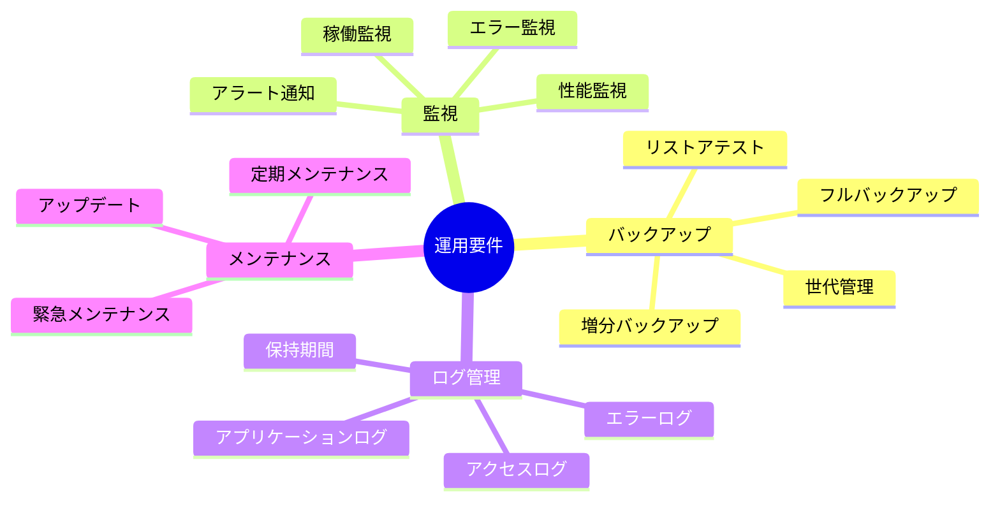

# 2.2.6.4 運用要件の記述方法

## 目的

**システム運用・保守に関する非機能要件を具体的に記述する方法**を提供します。

運用要件は、システムを安定的に稼働させるためのバックアップ・監視・メンテナンス等を定義します。

### このドキュメントで得られること

1. バックアップ・リストア要件の定義方法
2. 監視・アラート要件の記述方法
3. ログ管理要件の定義方法
4. メンテナンス要件の記述方法

---

## 📋 運用要件のカテゴリ



---

## 💾 バックアップ要件

### Good Example: バックアップ戦略

```markdown
## 運用: バックアップ戦略

### 要件
データ損失を最小限に抑えるため、定期的にバックアップを取得すること

### バックアップ対象

| データ種別 | バックアップ方式 | 頻度 | 実行時間 |
|-----------|---------------|------|---------|
| データベース（フル） | フルバックアップ | 毎日 | AM 3:00 |
| データベース（増分） | 増分バックアップ | 1時間ごと | 毎時0分 |
| ファイル | フルバックアップ | 毎日 | AM 4:00 |
| 設定ファイル | フルバックアップ | 変更時 | 手動 |

### バックアップ保存先
- プライマリ: AWS S3（東京リージョン）
- セカンダリ: AWS S3（大阪リージョン） ⭐⭐⭐ 推奨（地理的冗長性）

### 世代管理

| バックアップ種別 | 保持世代 |
|---------------|---------|
| 増分バックアップ | 7日分 |
| フルバックアップ（日次） | 30日分 |
| 月次バックアップ | 12ヶ月分 |

### バックアップの暗号化
- すべてのバックアップを暗号化（AES-256） ⭐⭐⭐ 必須

### リストアテスト
- 頻度: 月1回
- 方法: バックアップからテスト環境にリストアし、正常動作を確認
- 目標リストア時間: 30分以内

### バックアップ容量見積もり
- データベース: 500MB/日 → 月15GB
- ファイル: 100MB/日 → 月3GB
- 合計: 月18GB → 年間約220GB

### 優先度
高

### 備考
- バックアップ失敗時は管理者にメール通知
- RPO（復旧ポイント目標）: 1時間
```

---

## 📊 監視要件

### Good Example: システム監視

```markdown
## 運用: システム監視

### 要件
システムの異常を早期に検知し、速やかに対応すること

### 監視項目

#### サーバー監視

| 監視項目 | 閾値（警告） | 閾値（エラー） | 確認頻度 |
|---------|-------------|---------------|---------|
| CPU使用率 | 70% | 80% | 1分ごと |
| メモリ使用率 | 70% | 80% | 1分ごと |
| ディスク使用率 | 80% | 90% | 5分ごと |
| ディスクI/O待機時間 | 10秒 | 30秒 | 1分ごと |

#### アプリケーション監視

| 監視項目 | 閾値（警告） | 閾値（エラー） | 確認頻度 |
|---------|-------------|---------------|---------|
| レスポンスタイム | 3秒 | 5秒 | 1分ごと |
| エラー率 | 3% | 5% | 1分ごと |
| 同時接続数 | 80人 | 100人 | 1分ごと |

#### データベース監視

| 監視項目 | 閾値（警告） | 閾値（エラー） | 確認頻度 |
|---------|-------------|---------------|---------|
| 接続数 | 80接続 | 100接続 | 1分ごと |
| スロークエリ | 3秒超 | 5秒超 | 常時 |
| レプリケーション遅延 | 10秒 | 30秒 | 1分ごと |

#### 稼働監視（ヘルスチェック）

- 方法: HTTPSでヘルスチェックエンドポイントにアクセス
- エンドポイント: /health
- レスポンス: 200 OK + {"status": "healthy"}
- 頻度: 1分ごと
- タイムアウト: 10秒

### アラート通知

| 通知レベル | 通知先 | 通知方法 | 対応時間 |
|-----------|-------|---------|---------|
| Critical | 全員 | 電話 + メール + Slack | 即座 |
| Error | 担当者 | メール + Slack | 営業時間中: 1時間以内 |
| Warning | 担当者 | Slack | 1営業日以内 |

### 監視ツール
- CloudWatch（AWS）またはDatadog

### 優先度
高

### 備考
- 営業時間外のCriticalアラートは、オンコール担当者に電話通知
```

---

## 📝 ログ管理要件

### Good Example: ログ管理

```markdown
## 運用: ログ管理

### 要件
トラブルシューティング・監査のため、ログを適切に記録・保存すること

### ログ種別

#### アプリケーションログ

- レベル: ERROR, WARN, INFO, DEBUG
- 記録内容: エラー内容、スタックトレース、リクエストID
- 保存先: ログファイル（日次ローテーション）
- 保持期間: 90日間
- ファイル名: app-YYYY-MM-DD.log

#### アクセスログ

- 記録内容: リクエストURL、IPアドレス、ユーザーID、レスポンスタイム、ステータスコード
- 保存先: ログファイル（日次ローテーション）
- 保持期間: 1年間
- ファイル名: access-YYYY-MM-DD.log

#### エラーログ

- 記録内容: エラーの詳細、発生日時、ユーザーID、スタックトレース
- 保存先: ログファイル + データベース
- 保持期間: 1年間

#### セキュリティログ（監査ログ）

- 記録内容: ログイン・ログアウト、データ変更、権限変更
- 保存先: データベース
- 保持期間: 7年間 ⭐⭐⭐ 必須（法律上の保存義務）

### ログ集約
- CloudWatch Logs（AWS）にログを集約 ⭐⭐⭐ 推奨
- ログ検索・分析が可能

### ログローテーション
- 日次でログファイルをローテーション
- 古いログはgzip圧縮して保存
- 保持期間を過ぎたログは自動削除

### ログのフォーマット
- JSON形式で記録 ⭐⭐ 推奨（検索・分析が容易）

```json
{
  "timestamp": "2025-01-15T14:30:00Z",
  "level": "ERROR",
  "message": "Database connection failed",
  "requestId": "req-12345",
  "userId": "user-001",
  "ipAddress": "192.168.1.100"
}
```

### 優先度
高

### 備考
- 本番環境ではDEBUGレベルのログは記録しない（パフォーマンス考慮）
```

---

## 🔧 メンテナンス要件

### Good Example: メンテナンス計画

```markdown
## 運用: メンテナンス計画

### 要件
システムの安定稼働のため、定期的にメンテナンスを実施すること

### 定期メンテナンス

- 頻度: 月1回（第2土曜日）
- 時間帯: 深夜0:00-6:00
- 停止時間: 最大6時間
- 事前通知: 1週間前にユーザーに通知（メール + 画面内通知）

#### メンテナンス内容
- OSのセキュリティパッチ適用
- ミドルウェアのアップデート
- データベースの最適化（VACUUM、インデックス再構築）
- ディスク容量の確認・クリーンアップ
- バックアップの整合性確認

### 緊急メンテナンス

- トリガー:
  - 重大な脆弱性が発見された場合
  - システム障害が発生した場合
- 対応: 可能な限り無停止で実施
- 停止が必要な場合: 最小限の時間で実施
- 事前通知: 可能な限り早く通知（最低1時間前）

### アプリケーションアップデート

- 小規模な機能追加・バグ修正: 月1回の定期メンテナンス時
- 大規模な機能追加: 四半期に1回
  - ユーザーへの事前説明会を実施（オンライン）
  - リリースノートを公開

### メンテナンス画面
- メンテナンス中は、メンテナンス画面を表示
- 表示内容: 「メンテナンス中です。6:00までに完了予定です。」

### ロールバック計画
- メンテナンス失敗時は、30分以内にロールバック
- ロールバック手順書を事前に準備

### 優先度
中

### 備考
- ゼロダウンタイムデプロイ（ブルーグリーンデプロイ等）は将来的に検討
```

---

## 📈 容量管理要件

### Good Example: 容量管理

```markdown
## 運用: 容量管理

### 要件
ディスク容量・データベース容量を監視し、不足前に拡張すること

### 監視項目

| 項目 | 現在 | 閾値（警告） | 閾値（拡張） |
|------|------|-------------|-------------|
| データベース容量 | 5GB | 4GB（80%） | 4.5GB（90%） |
| ファイルストレージ容量 | 10GB | 8GB（80%） | 9GB（90%） |
| ログファイル容量 | 1GB | 0.8GB（80%） | - |

### 容量予測
- 四半期ごとにデータ増加量を分析
- 1年後の容量を予測
- 必要に応じて拡張計画を立てる

### データ削除・アーカイブ
- 3年以上前の商談データ: アーカイブ（別DBに移動）
- 1年以上前のログファイル: 削除

### 優先度
中
```

---

## ✅ 運用要件記述のチェックリスト

### 必須項目
- [ ] バックアップ戦略を明記
- [ ] 監視項目・閾値を明記
- [ ] ログ管理要件を明記
- [ ] メンテナンス計画を明記

### 推奨項目
- [ ] リストアテストの実施計画を明記
- [ ] アラート通知先・通知方法を明記
- [ ] 容量管理要件を明記

### 品質確認
- [ ] 具体的な数値目標がある
- [ ] 実施頻度が明確
- [ ] 実現可能な計画である

---

## 🚨 よくある失敗パターン

### ❌ Bad Example: バックアップ頻度が不明

```
❌ 定期的にバックアップを取得すること
```

**理由**: 「定期的」では頻度が不明

**Good Example**:
```
✅ データベースは毎日AM 3:00にフルバックアップ、1時間ごとに増分バックアップ
```

---

### ❌ Bad Example: リストアテストがない

```
（リストアテストの記載なし）
```

**理由**: バックアップが壊れていても気づかない

**Good Example**:
```
✅ 月1回、バックアップからテスト環境にリストアし、正常動作を確認
```

---

## 📚 次のステップ

運用要件の記述方法を理解したら:

1. **2.2.6.5 Good_Bad_Example集.md** へ進む
2. 非機能要件の実例を確認
3. 実際のプロジェクトで運用要件を定義

---

## 関連ドキュメント

- [2.2.6.2 可用性要件の記述方法](./2.2.6.2_可用性要件の記述方法.md) - 可用性要件
- [2.2.6.3 セキュリティ要件の記述方法](./2.2.6.3_セキュリティ要件の記述方法.md) - セキュリティ要件
- [2.2.6.5 Good_Bad_Example集](./2.2.6.5_Good_Bad_Example集.md) - 実例集

---

**作成日**: 2025-10-19
**対象フェーズ**: 要件定義
**重要度**: ⭐⭐⭐ 必須
