# 2.2.7.1 画面遷移図パターン（Mermaid）

## 目的

要件定義フェーズで、**画面遷移を視覚的に表現**するためのMermaid図パターンを提供します。

### このドキュメントで得られること

1. すぐに使えるMermaid画面遷移図のテンプレート
2. ドメインごとの具体例
3. よくある失敗パターンと改善方法

---

## 📊 基本パターン

### シンプルな画面遷移

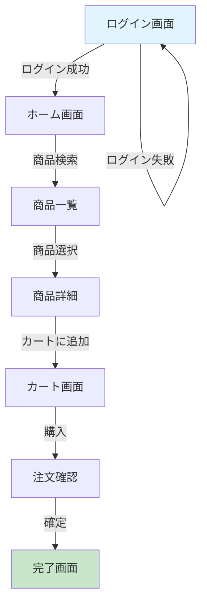

**使い方**:
- 矩形 `[画面名]` で画面を表現
- 矢印 `-->` で遷移を表現
- `|アクション|` で遷移条件を記述

---

## 🎯 ドメイン別パターン

### 1. ECサイト

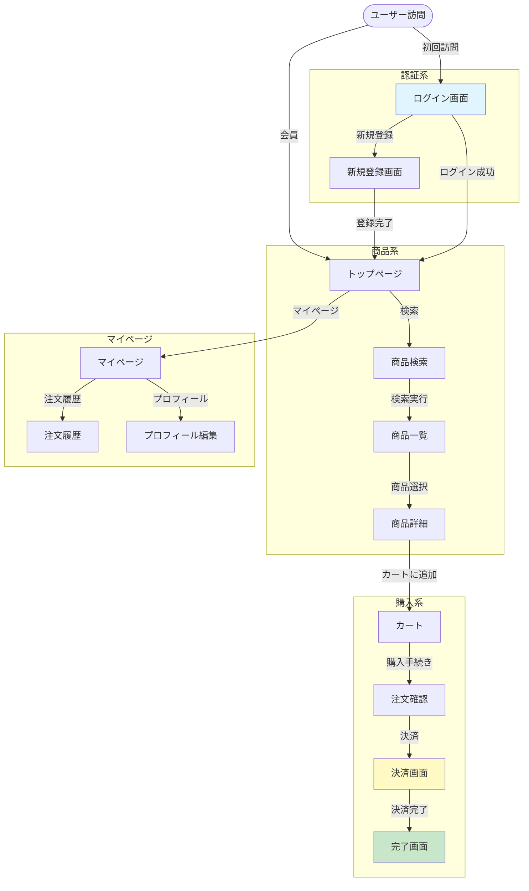

**ポイント**:
- `subgraph` で機能をグルーピング
- 色分けで重要な画面を強調
- 開始/終了を明確に

---

### 2. 予約システム

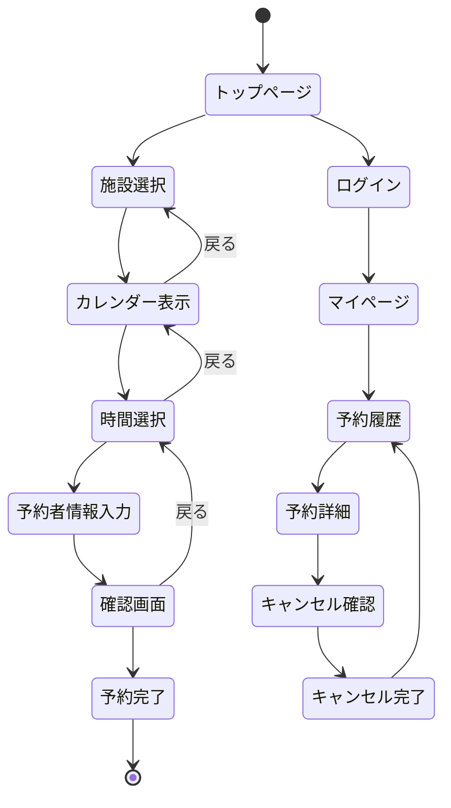

**ポイント**:
- `stateDiagram-v2` で状態遷移を表現
- 戻るボタンの動線も明記
- キャンセルフローを含める

---

### 3. 業務システム（商談管理）

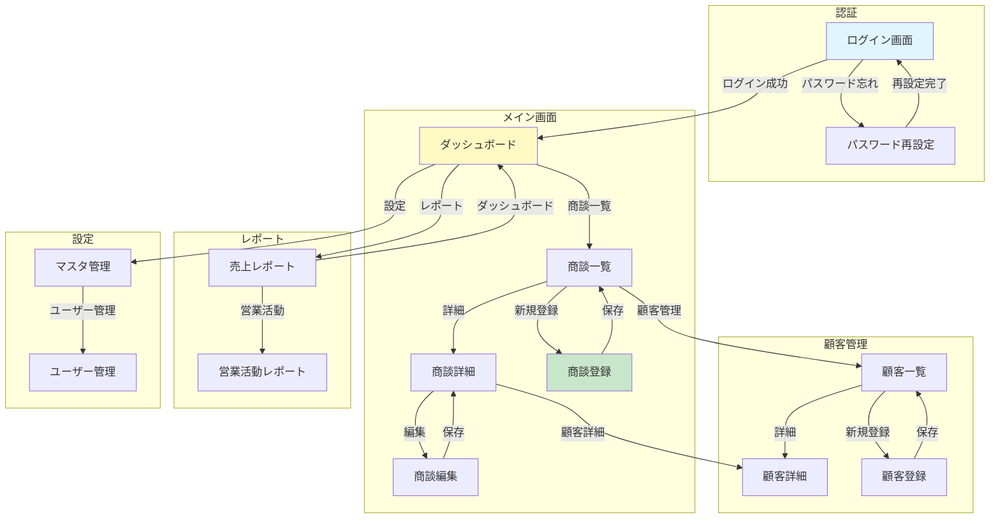

**ポイント**:
- 業務の役割ごとにsubgraphで整理
- CRUD操作の流れを明確に
- マスタ管理・設定画面も含める

---

### 4. SNS・コミュニティサイト

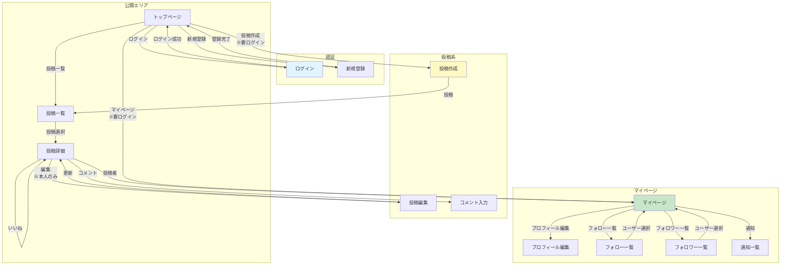

**ポイント**:
- ログイン有無での動作の違いを明記
- 権限に応じた画面遷移を記載（「※本人のみ」等）
- ソーシャル機能（フォロー、いいね）を含める

---

## 🔄 条件分岐のパターン

### ログイン状態による分岐

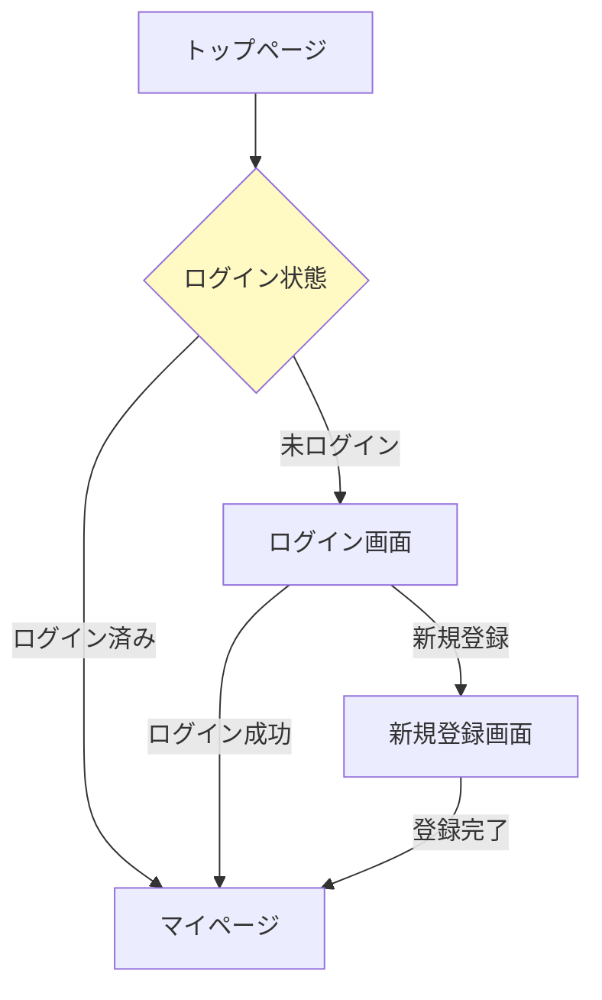

**使い方**:
- 菱形 `{}` で条件分岐を表現
- 条件を `|条件|` で記述

---

### 権限による分岐

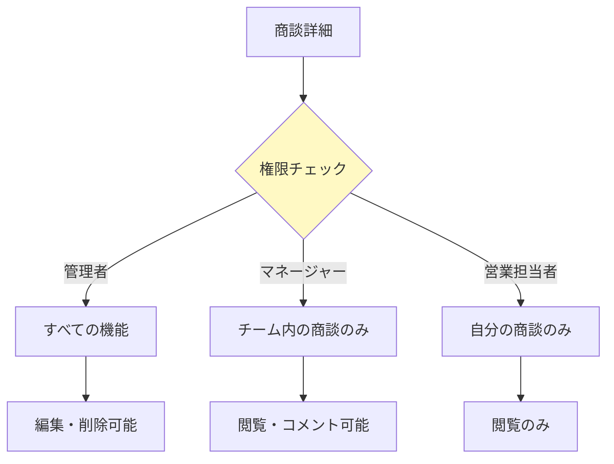

---

### エラー時の分岐

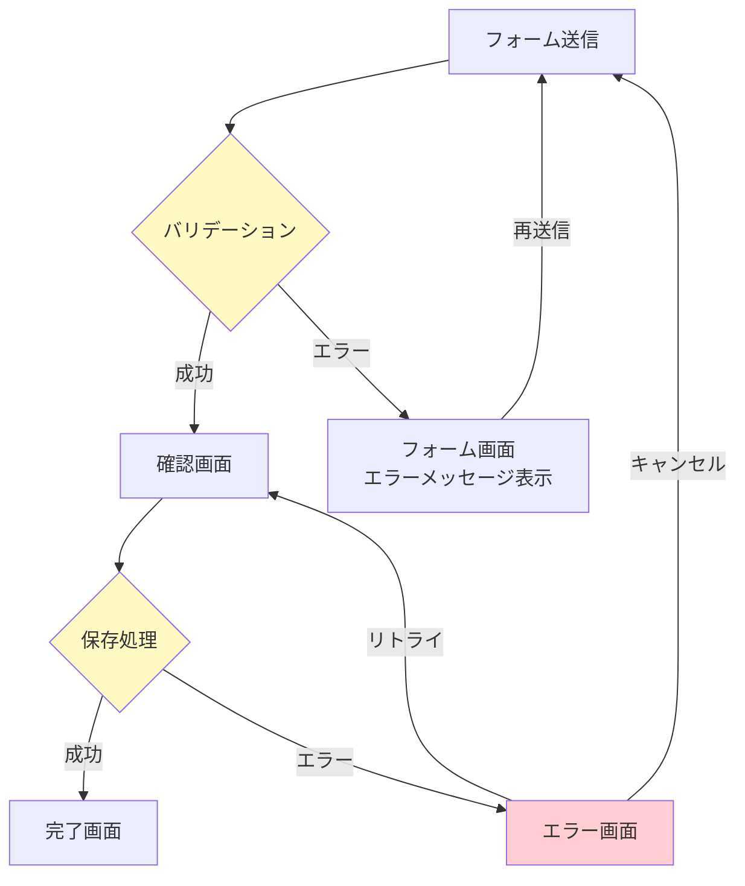

**ポイント**:
- バリデーションエラーとシステムエラーを分ける
- リトライ・キャンセルの動線を明記
- エラー画面は赤系で強調

---

## ❌ Bad Example: よくある失敗パターン

### 問題1: 矢印が多すぎて読めない

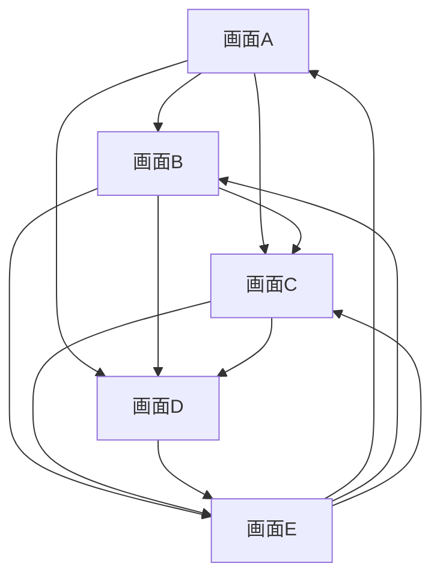

**問題点**:
- 矢印が交差して複雑
- 全体の流れが不明

---

### ✅ Good Example: subgraphで整理

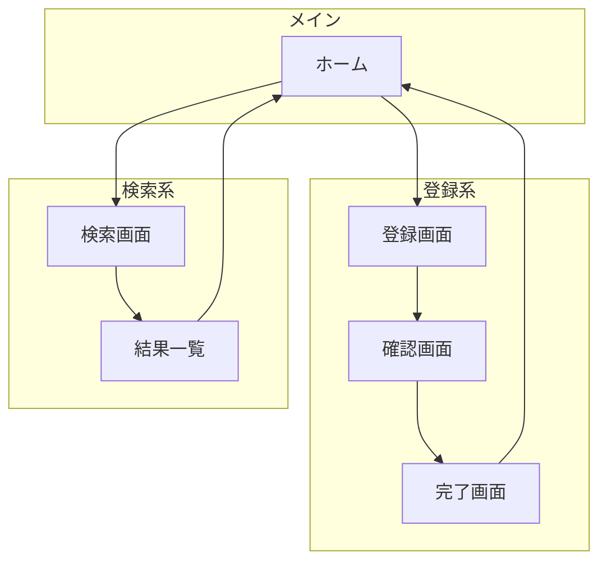

**改善点**:
- subgraphで機能をグルーピング
- 一方向の流れを意識
- 戻る動線を最小限に

---

### 問題2: 遷移条件が不明

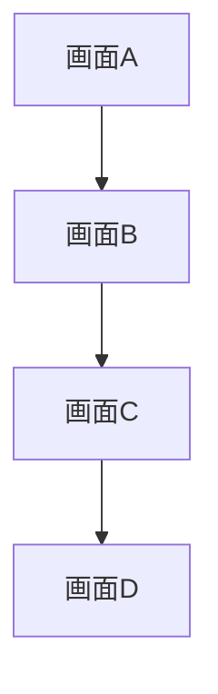

**問題点**:
- どのボタンを押したら遷移するのか不明
- ユーザーアクションが不明

---

### ✅ Good Example: アクションを明記

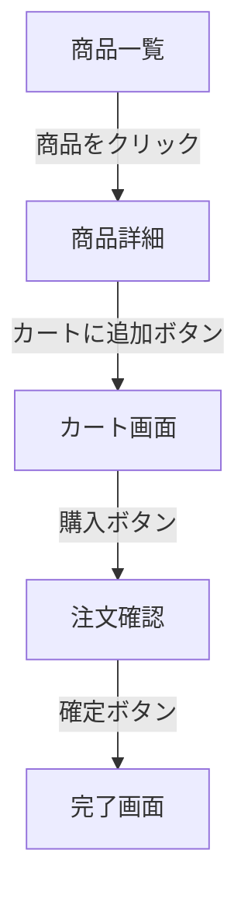

**改善点**:
- ボタン名・アクション名を明記
- 開発者が実装しやすい

---

## 🎨 スタイリングのベストプラクティス

### 色分けルール

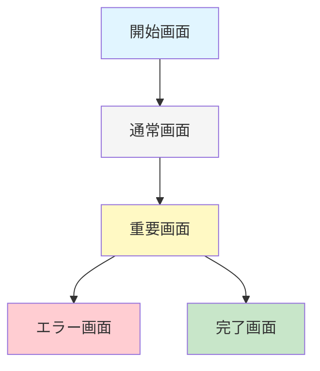

**推奨色**:
- **開始画面**: 水色 `#e1f5ff`
- **通常画面**: グレー `#f5f5f5`
- **重要画面**: 黄色 `#fff9c4`
- **エラー画面**: 赤 `#ffcdd2`
- **完了画面**: 緑 `#c8e6c9`

---

## 📝 テンプレート

### 基本テンプレート

```markdown
## 画面遷移図

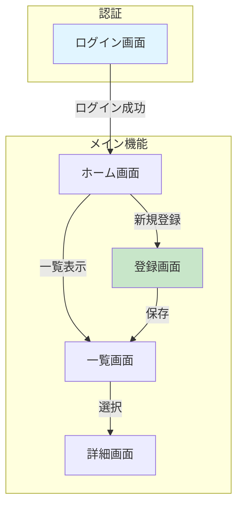

**説明**:
- 主な画面遷移を記述
- ユーザーの主要な動線を明示
```

---

## 🔧 実装時の注意点

### 1. Mermaid図の制限

- **ブラウザバック**: 記載不要（暗黙の動作）
- **モーダル**: 別図で表現
- **タブ切り替え**: 同一画面内の動作なので記載不要

### 2. 粒度の調整

**要件定義では**:
- 画面単位で記載
- 細かい入力項目は記載不要

**詳細設計では**:
- モーダル、タブも含める
- 状態遷移も詳細に

### 3. ツールとの連携

生成したMermaid図は以下で確認:
- **Mermaid Live Editor**: https://mermaid.live/
- **VS Code拡張機能**: Mermaid Preview
- **技術標準**: Mermaid埋め込み可能

---

## 📚 次のステップ

画面遷移図を理解したら:

1. **2.2.7.2 ER図パターン.md** へ進む
2. データベース設計の可視化を学ぶ
3. 実際のプロジェクトで画面遷移図を作成

---

## 関連ドキュメント

- [2.2.2.2 画面・UI/UXヒアリング項目](./2.2.2.2_画面・UI_UXヒアリング項目.md)
- [2.2.5.2 ユースケース記述方法](./2.2.5.2_ユースケース記述方法.md)
- [2.2.7.5 シーケンス図（業務フロー）](./2.2.7.5_シーケンス図（業務フロー）.md)

---

**作成日**: 2025-10-19
**対象フェーズ**: 要件定義
**重要度**: ⭐⭐ 推奨（画面遷移の可視化）
