# 2.2.7.2 ER図パターン（Mermaid）

## 目的

要件定義フェーズで、**データ構造とエンティティ間の関係**を視覚的に表現するためのMermaid ER図パターンを提供します。

### このドキュメントで得られること

1. すぐに使えるMermaid ER図のテンプレート
2. ドメインごとの具体例
3. カーディナリティ（1:1, 1:N, N:N）の表現方法

---

## 📊 基本パターン

### シンプルなER図

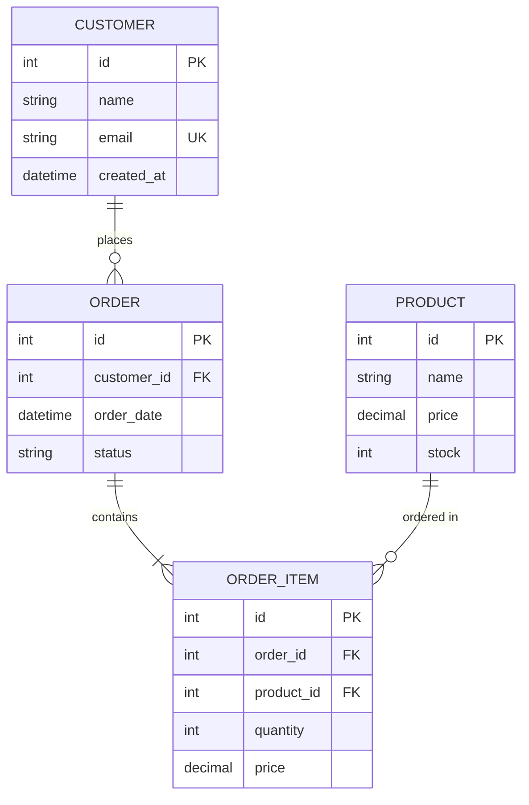

**記法**:
- `||--o{` : 1対多（1つの顧客が複数の注文）
- `||--|{` : 1対多必須
- `PK` : Primary Key
- `FK` : Foreign Key
- `UK` : Unique Key

---

## 🎯 カーディナリティの表現

### 1対1 (1:1)

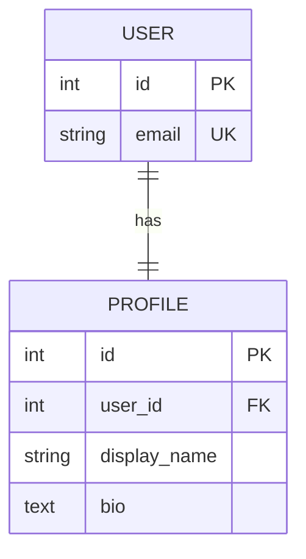

**解説**: 1人のユーザーに1つのプロフィール

---

### 1対多 (1:N)

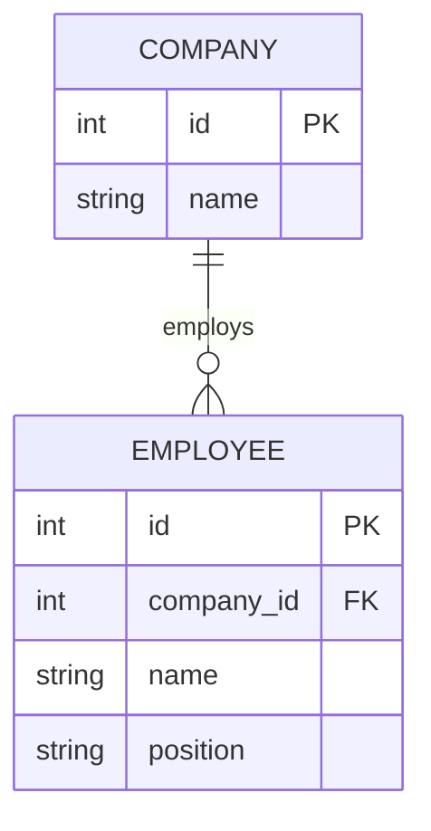

**解説**: 1つの会社が複数の従業員を雇用

---

### 多対多 (N:N)

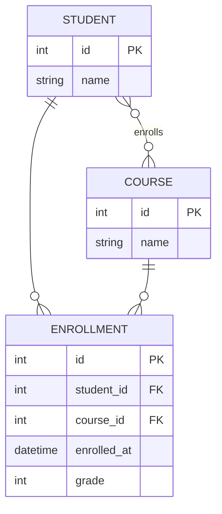

**解説**:
- 学生と授業は多対多
- 中間テーブル `ENROLLMENT` で実現
- 中間テーブルに追加情報（成績等）も保存可能

---

## 🏢 ドメイン別パターン

### 1. ECサイト

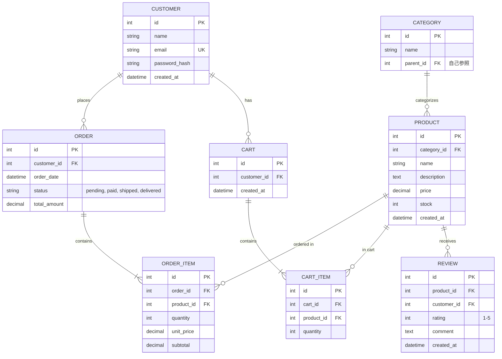

**ポイント**:
- カート機能を含める
- レビュー機能も含める
- カテゴリの階層構造（parent_id）

---

### 2. 予約システム

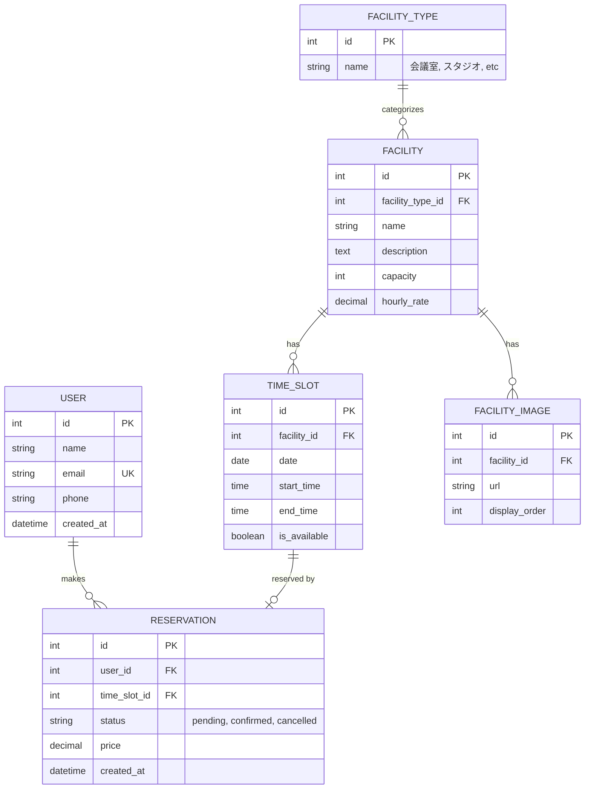

**ポイント**:
- TIME_SLOTで時間枠を管理
- 予約状態（pending, confirmed, cancelled）
- 施設画像の複数保存

---

### 3. 業務システム（商談管理CRM）

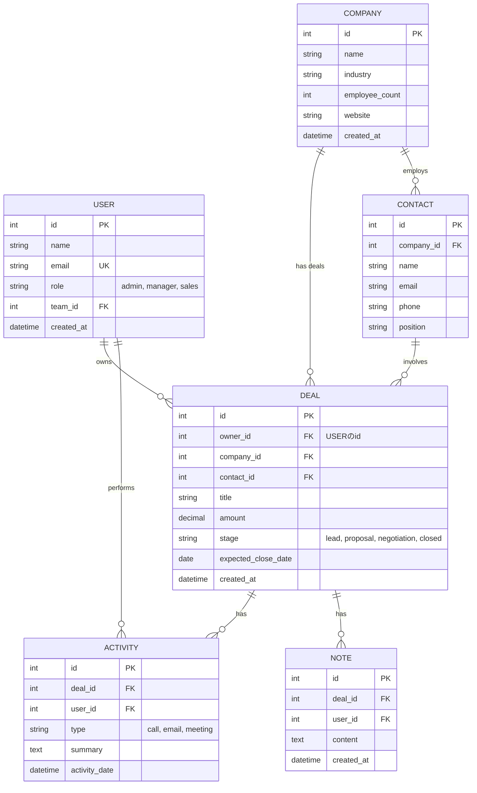

**ポイント**:
- 商談の進捗管理（stage）
- アクティビティ記録（電話、メール、ミーティング）
- ノート・メモ機能

---

### 4. SNS・コミュニティサイト

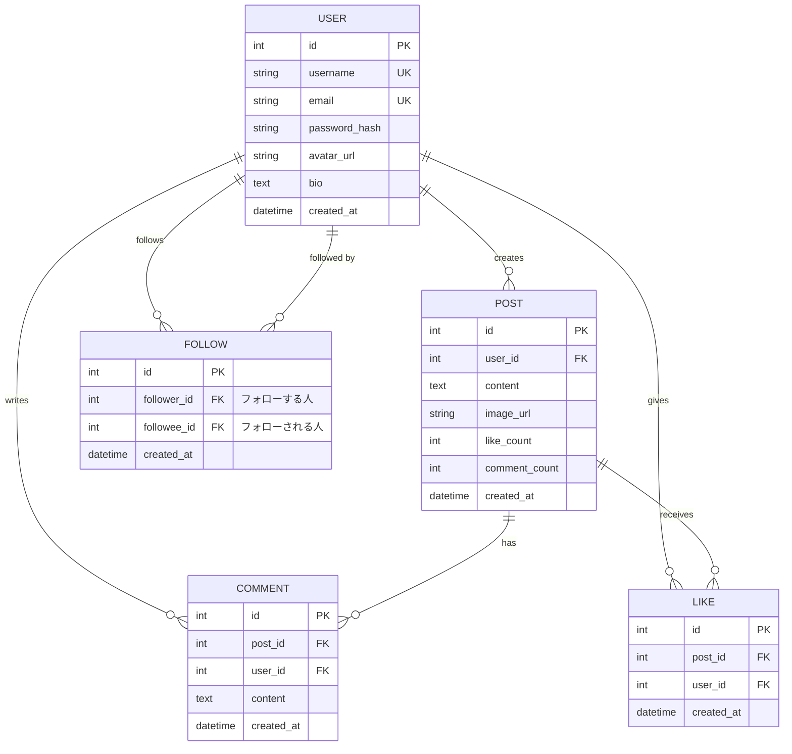

**ポイント**:
- FOLLOW は自己参照（USER → USER）
- いいね数・コメント数は非正規化（パフォーマンス重視）
- 複合ユニーク制約が必要（post_id + user_id）

---

### 5. 金融系（送金システム）

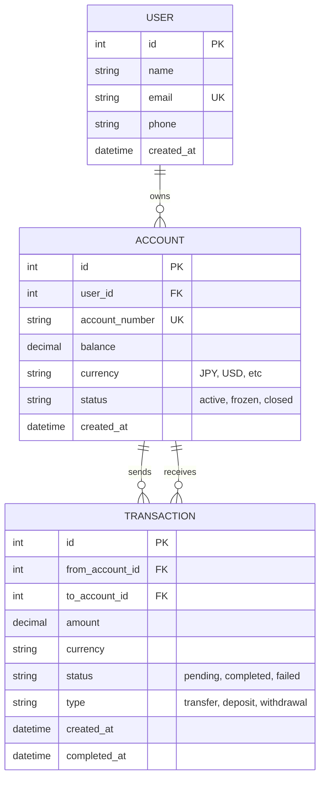

**ポイント**:
- 送金元・送金先の両方を記録
- トランザクション状態の管理（pending, completed, failed）
- 通貨の明示

---

## 🔄 自己参照のパターン

### カテゴリの階層構造

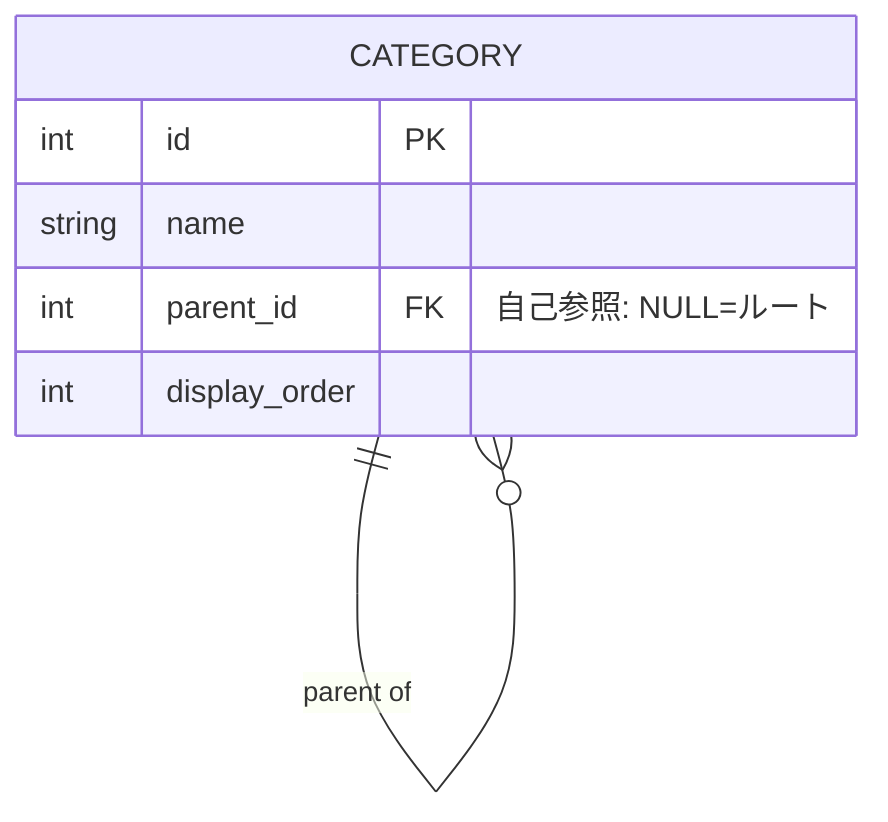

**例**:
```
家電（parent_id=NULL）
├── テレビ（parent_id=1）
│   ├── 液晶テレビ（parent_id=2）
│   └── 有機ELテレビ（parent_id=2）
└── 冷蔵庫（parent_id=1）
```

---

### 組織の階層構造

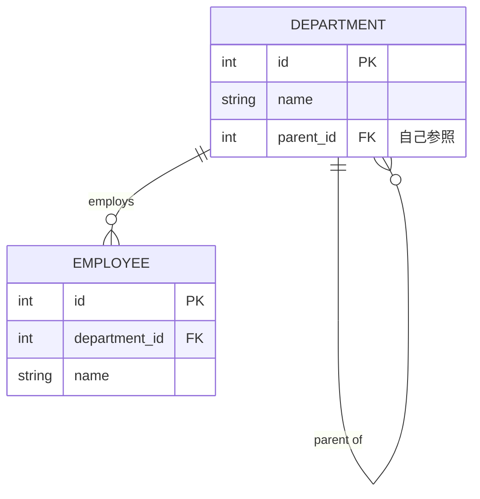

---

## ❌ Bad Example: よくある失敗パターン

### 問題1: 多対多を直接結ぶ

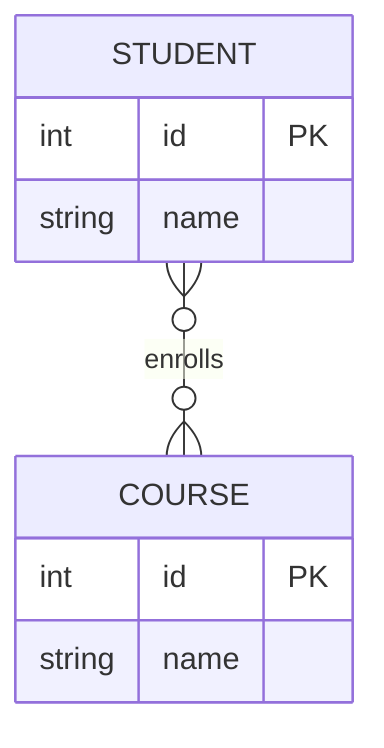

**問題点**:
- 中間テーブルがない
- 成績等の追加情報を保存できない
- 実装が困難

---

### ✅ Good Example: 中間テーブルを作る

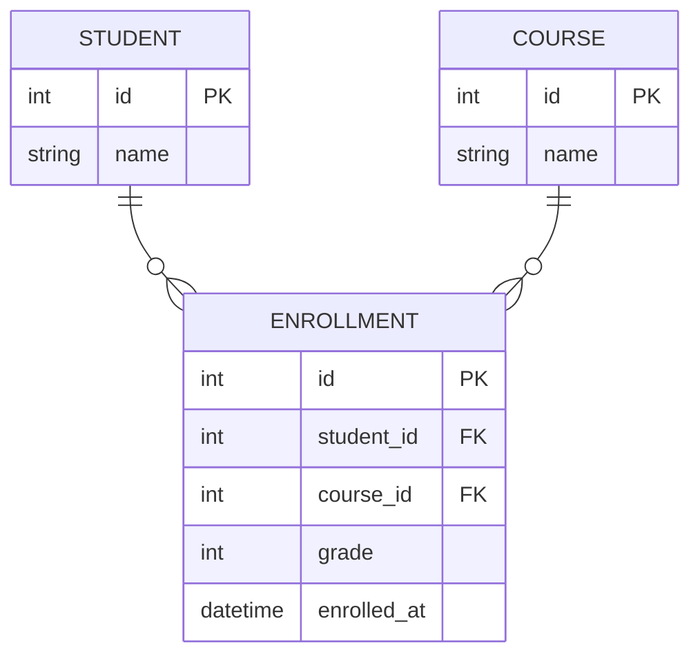

**改善点**:
- 中間テーブル `ENROLLMENT` で多対多を実現
- 成績等の追加情報を保存可能

---

### 問題2: データ型・制約が不明

```mermaid
erDiagram
    USER {
        id
        name
        email
    }
```

**問題点**:
- データ型がない
- PK/FK/UKの指定がない
- 実装時に混乱

---

### ✅ Good Example: データ型・制約を明記

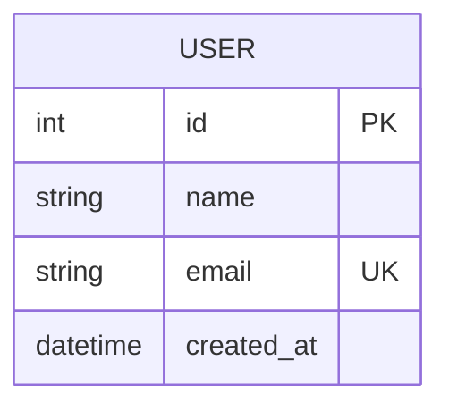

**改善点**:
- データ型を明記
- PK/UK/FKを明記
- 実装者が迷わない

---

## 📝 テンプレート

### 基本テンプレート

```markdown
## ER図

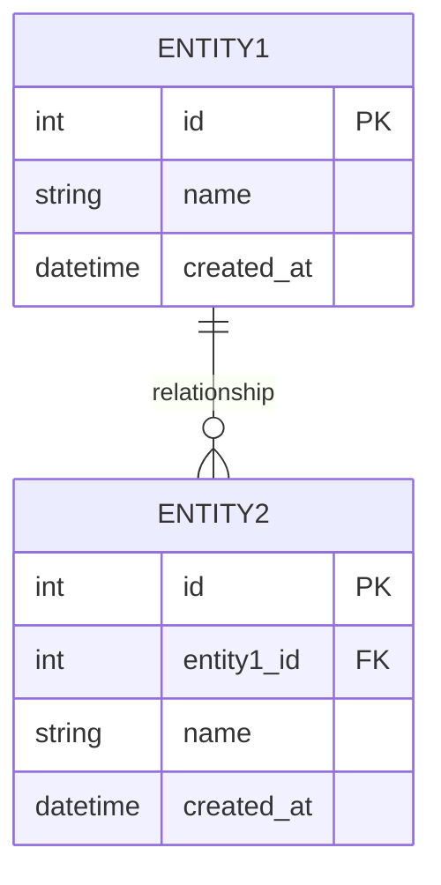

**説明**:
- エンティティ間の関係を記述
- データ型・制約を明記
```

---

## 🔧 実装時の注意点

### 1. 論理設計と物理設計

**要件定義（論理設計）**:
- エンティティ名は業務用語（日本語でもOK）
- 正規化を重視
- 概念的なER図

**詳細設計（物理設計）**:
- テーブル名は英語（小文字＋アンダースコア）
- インデックス・パーティションも考慮
- パフォーマンスのための非正規化も検討

### 2. Mermaid ER図の制限

Mermaidでは以下が表現できない:
- **複合主キー**: コメントで補足
- **インデックス**: 別途ドキュメント化
- **CHECK制約**: 属性の説明欄に記載

### 3. 推奨データ型

| 用途 | データ型 |
|------|---------|
| ID | `int` または `bigint` |
| 名前・タイトル | `string (varchar)` |
| 長文 | `text` |
| 日時 | `datetime` または `timestamp` |
| 日付のみ | `date` |
| 金額 | `decimal` |
| フラグ | `boolean` |

---

## 📚 次のステップ

ER図を理解したら:

1. **2.2.7.3 システム構成図（概念レベル）.md** へ進む
2. システム全体のアーキテクチャ可視化を学ぶ
3. 実際のプロジェクトでER図を作成

---

## 関連ドキュメント

- [2.2.2.3 データ要件ヒアリング項目](./2.2.2.3_データ要件ヒアリング項目.md)
- [2.2.7.1 画面遷移図パターン](./2.2.7.1_画面遷移図パターン.md)
- [2.2.7.6 Good_Bad_Example集](./2.2.7.6_Good_Bad_Example集.md)

---

**作成日**: 2025-10-19
**対象フェーズ**: 要件定義
**重要度**: ⭐⭐⭐ 必須（データ構造の可視化）
