# 2.2.7.3 システム構成図（概念レベル）

## 目的

要件定義フェーズで、**システム全体の構成を概念レベルで視覚化**するためのMermaid図パターンを提供します。

### このドキュメントで得られること

1. システム構成図の基本パターン
2. クラウド・オンプレミスの構成例
3. 外部連携を含めた全体像の描き方

---

## 📊 基本パターン

### シンプルな3層アーキテクチャ

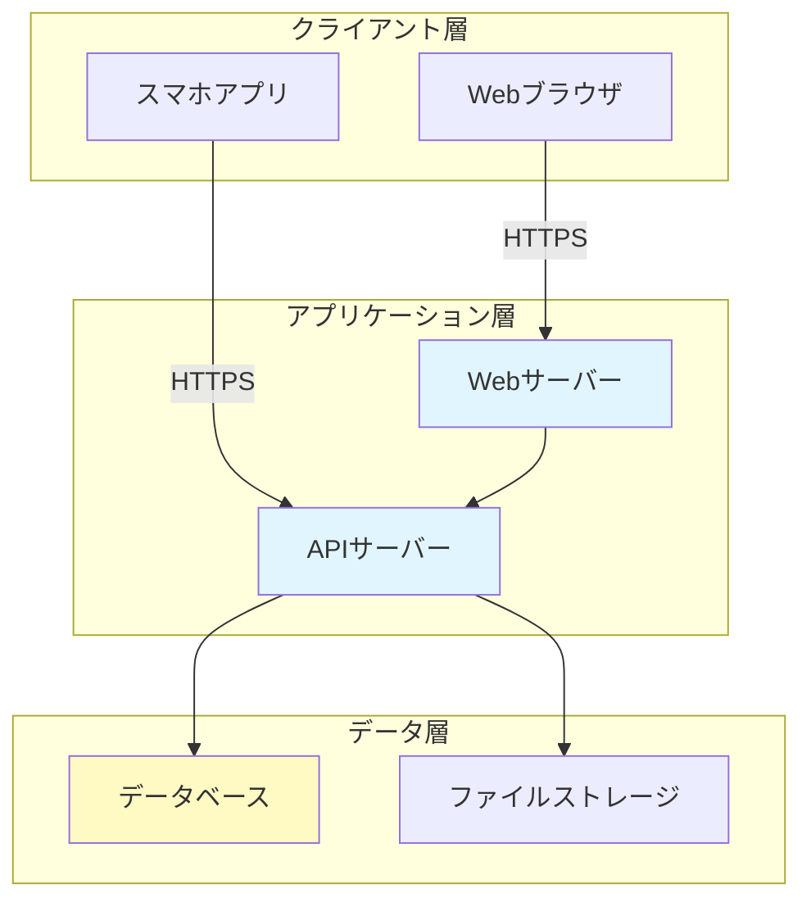

**ポイント**:
- 3層（プレゼンテーション・ビジネスロジック・データ）
- 通信プロトコルを明記（HTTPS等）
- 各層の役割を明確に

---

## 🏢 ドメイン別パターン

### 1. ECサイト（AWSクラウド構成）

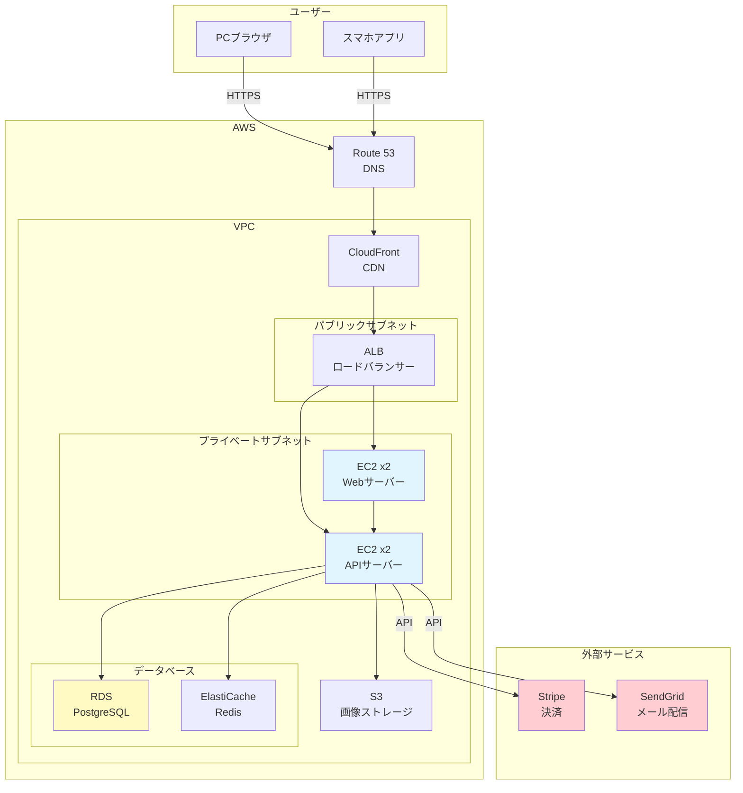

**ポイント**:
- VPCでネットワーク分離
- パブリック/プライベートサブネット
- 冗長構成（EC2 x2）
- 外部サービス連携を明記

---

### 2. 予約システム（シンプル構成）

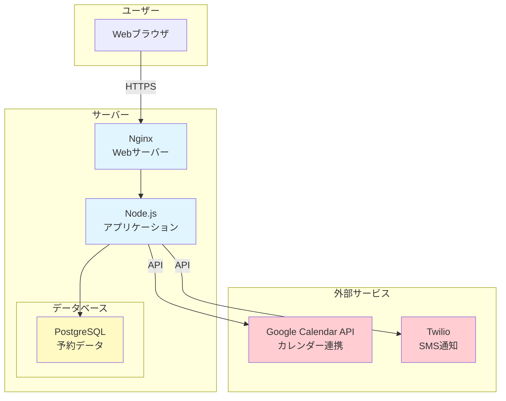

**ポイント**:
- 小規模システムのシンプル構成
- 外部API連携を明記
- 通知機能（SMS）の明示

---

### 3. 業務システム（オンプレミス + クラウド）

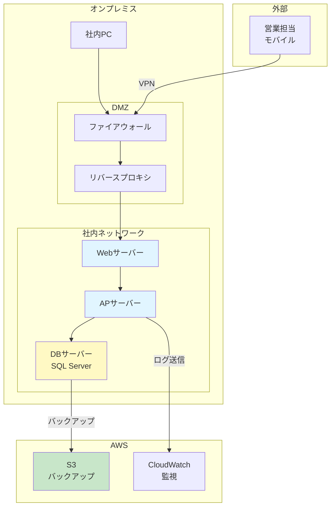

**ポイント**:
- オンプレミスとクラウドのハイブリッド構成
- DMZ（非武装地帯）でセキュリティ強化
- VPN接続でリモートアクセス
- バックアップをクラウドに

---

### 4. マイクロサービス構成（大規模システム）

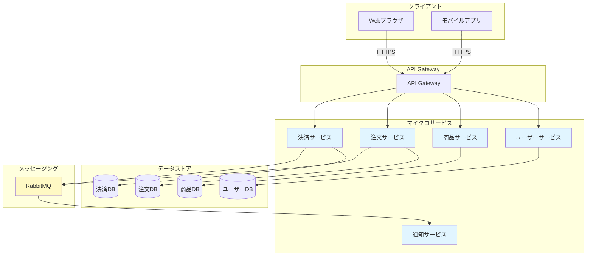

**ポイント**:
- サービスごとに独立したDB
- API Gatewayで統一エンドポイント
- メッセージキューで非同期処理
- 疎結合なアーキテクチャ

---

### 5. SaaS型サービス（マルチテナント）

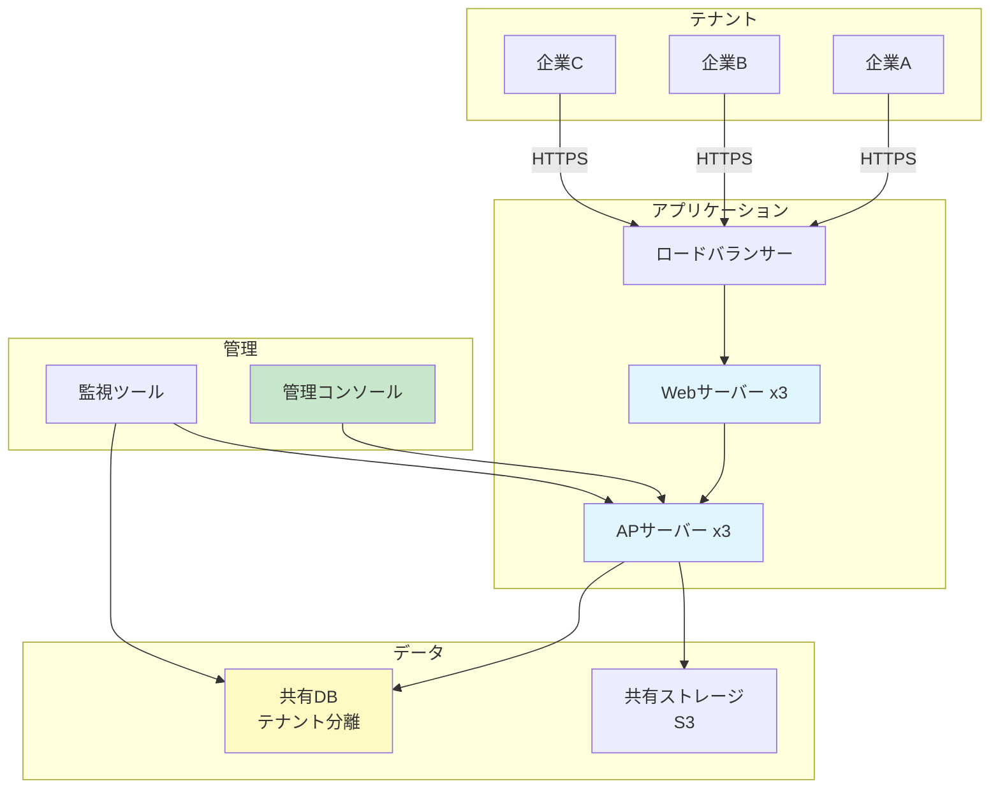

**ポイント**:
- マルチテナント（複数企業が同一システムを利用）
- テナントIDでデータ分離
- スケーラビリティ（サーバー複数台）
- 管理コンソールで運用

---

## 🔐 セキュリティ要素を含む構成図

### ファイアウォール・WAF構成

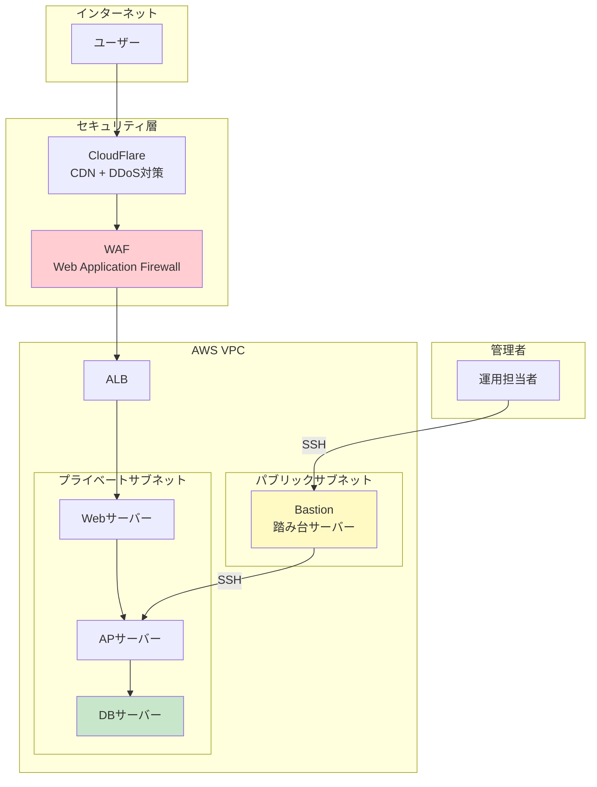

**ポイント**:
- WAFで攻撃防御
- Bastion（踏み台）経由でのみサーバーアクセス
- プライベートサブネットで保護

---

## 🔄 バックアップ・DR構成

### 災害対策（Disaster Recovery）

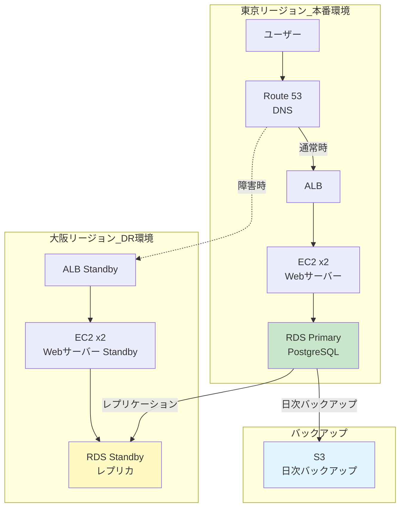

**ポイント**:
- マルチリージョン構成
- DBレプリケーション
- DNS切り替えで障害時対応
- 日次バックアップをS3に

---

## 🔧 データフロー図

### バッチ処理を含む構成

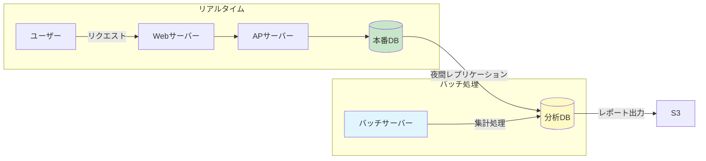

**ポイント**:
- リアルタイム処理とバッチ処理を分離
- 本番DBと分析DBを分ける
- 夜間レプリケーション

---

## ❌ Bad Example: よくある失敗パターン

### 問題1: 詳細すぎて読めない

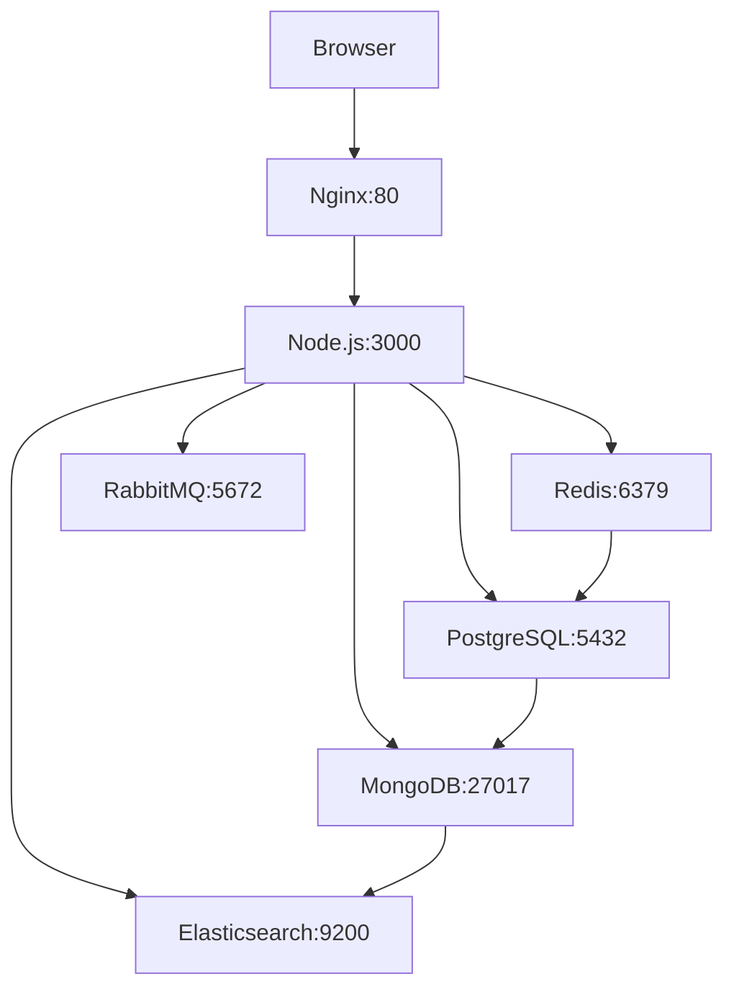

**問題点**:
- ポート番号等の詳細すぎる情報
- 要件定義フェーズには不要
- 全体像が見えない

---

### ✅ Good Example: 概念レベルで表現

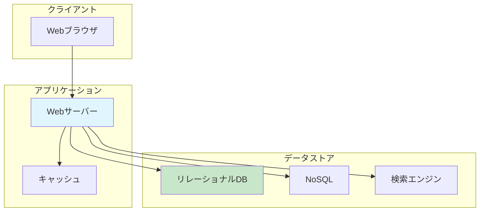

**改善点**:
- 概念レベルで表現
- 役割を明確に（「検索エンジン」等）
- 全体像が見やすい

---

### 問題2: 外部連携が不明

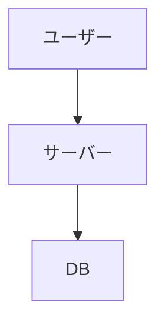

**問題点**:
- 外部サービス連携が不明
- 決済・メール送信等が抜けている

---

### ✅ Good Example: 外部連携を明記

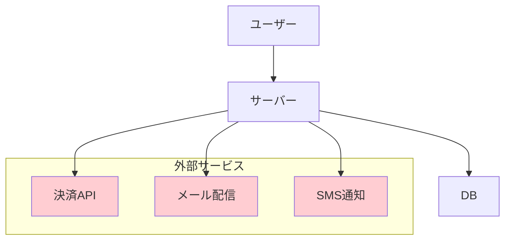

**改善点**:
- 外部サービスを明記
- 依存関係を明確に
- 色分けで外部を強調

---

## 📝 テンプレート

### 基本テンプレート

```markdown
## システム構成図

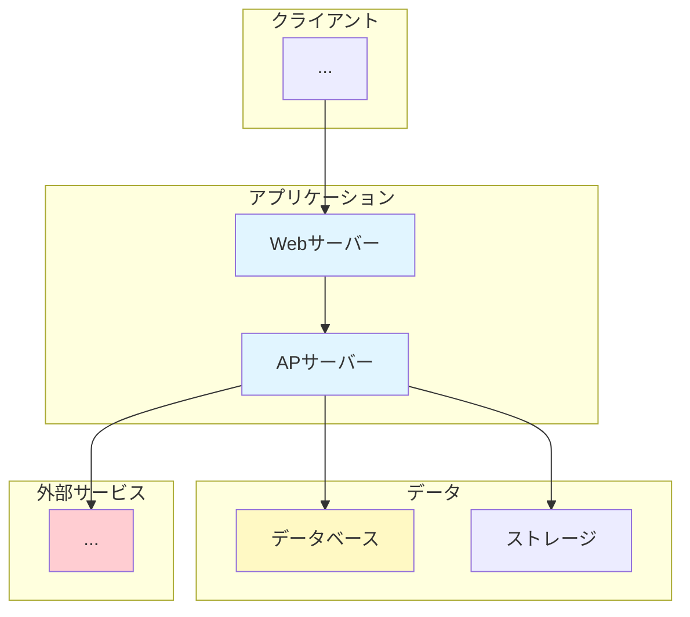

**説明**:
- システム全体の構成を概念レベルで記述
- 外部連携を明記
```

---

## 🔧 実装時の注意点

### 1. 要件定義 vs 詳細設計

**要件定義（このドキュメント）**:
- 概念レベル（「Webサーバー」「データベース」等）
- 全体の構成を俯瞰
- 非エンジニアにも理解できる

**詳細設計**:
- 具体的な製品名（「Nginx 1.21」「PostgreSQL 14」）
- ポート番号、ネットワーク設定
- インフラエンジニア向け

### 2. クラウド vs オンプレミス

**クラウド**:
- AWSサービス名を明記（EC2、RDS、S3等）
- マネージドサービスを活用

**オンプレミス**:
- サーバー台数を明記
- ネットワーク構成（DMZ等）を明記

### 3. スケーラビリティ

将来の拡張性を考慮:
- ロードバランサーを挟む
- サーバーを複数台構成
- キャッシュレイヤーを追加

---

## 📚 次のステップ

システム構成図を理解したら:

1. **2.2.7.4 ユースケース図パターン.md** へ進む
2. ユーザーとシステムの相互作用を学ぶ
3. 実際のプロジェクトでシステム構成図を作成

---

## 関連ドキュメント

- [2.2.2.5 外部連携要件ヒアリング項目](./2.2.2.5_外部連携要件ヒアリング項目.md)
- [2.2.6.2 可用性要件の記述方法](./2.2.6.2_可用性要件の記述方法.md)
- [2.2.6.3 セキュリティ要件の記述方法](./2.2.6.3_セキュリティ要件の記述方法.md)

---

**作成日**: 2025-10-19
**対象フェーズ**: 要件定義
**重要度**: ⭐⭐⭐ 必須（システム全体像の可視化）
