# 2.2.7.4 ユースケース図パターン（Mermaid）

## 目的

要件定義フェーズで、**ユーザー（アクター）とシステムの相互作用**を視覚的に表現するためのMermaid図パターンを提供します。

### このドキュメントで得られること

1. すぐに使えるMermaidユースケース図のテンプレート
2. ドメインごとの具体例
3. アクターと機能の関係の描き方

---

## 📊 基本パターン

### シンプルなユースケース図

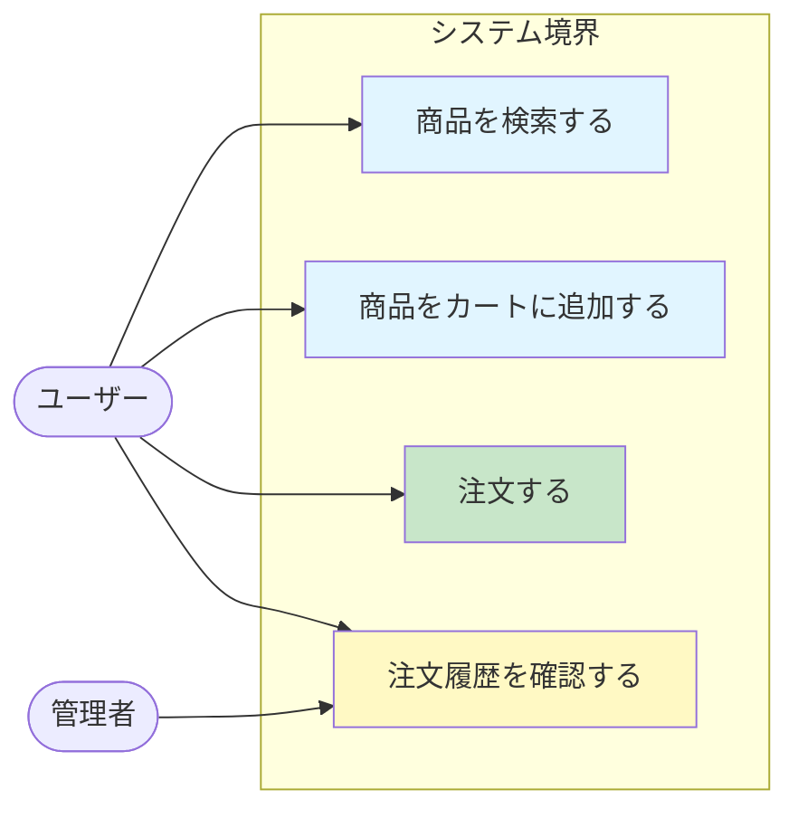

**ポイント**:
- アクター（ユーザー、管理者）を明確に
- システム境界内にユースケースを配置
- 矢印でアクターと機能を結ぶ

---

## 🎯 ドメイン別パターン

### 1. ECサイト

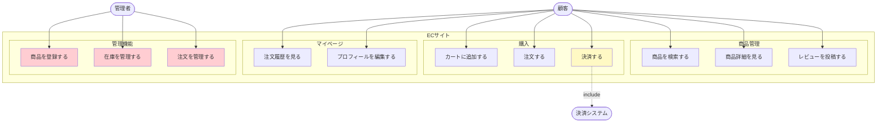

**ポイント**:
- 機能をカテゴリ別にsubgraphでグルーピング
- 外部システム（決済）も記載
- `include`関係を点線で表現

---

### 2. 予約システム

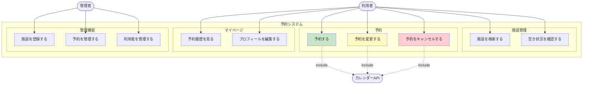

**ポイント**:
- 予約・変更・キャンセルを色分け
- 外部APIとの連携を明記

---

### 3. 業務システム（商談管理CRM）

```mermaid
flowchart TB
    subgraph 商談管理システム
        direction TB

        subgraph 商談管理
            UC1[商談を登録する]
            UC2[商談を編集する]
            UC3[商談を検索する]
            UC4[商談詳細を見る]
        end

        subgraph 顧客管理
            UC5[顧客を登録する]
            UC6[顧客情報を編集する]
            UC7[顧客を検索する]
        end

        subgraph 活動管理
            UC8[活動を記録する]
            UC9[活動履歴を見る]
        end

        subgraph レポート
            UC10[売上レポートを見る]
            UC11[営業活動レポートを見る]
        end

        subgraph 承認フロー
            UC12[商談を承認する]
            UC13[承認依頼を送る]
        end
    end

    Sales([営業担当者])
    Manager([マネージャー])
    Admin([管理者])

    Sales --> UC1
    Sales --> UC2
    Sales --> UC3
    Sales --> UC4
    Sales --> UC5
    Sales --> UC6
    Sales --> UC7
    Sales --> UC8
    Sales --> UC9
    Sales --> UC13

    Manager --> UC3
    Manager --> UC4
    Manager --> UC9
    Manager --> UC10
    Manager --> UC11
    Manager --> UC12

    Admin --> UC1
    Admin --> UC2
    Admin --> UC3
    Admin --> UC4
    Admin --> UC10
    Admin --> UC11

    style UC12 fill:#fff9c4
    style UC13 fill:#fff9c4
```

**ポイント**:
- 役割ごとのアクセス権限を明確に
- 承認フローを強調
- レポート機能を分離

---

### 4. SNS・コミュニティサイト

```mermaid
flowchart TB
    subgraph SNS
        direction TB

        subgraph 投稿
            UC1[投稿を作成する]
            UC2[投稿を編集する]
            UC3[投稿を削除する]
            UC4[投稿を検索する]
        end

        subgraph インタラクション
            UC5[いいねする]
            UC6[コメントする]
            UC7[シェアする]
        end

        subgraph フォロー
            UC8[ユーザーをフォローする]
            UC9[フォローを解除する]
            UC10[フォロワーを見る]
        end

        subgraph マイページ
            UC11[プロフィールを編集する]
            UC12[通知を見る]
        end

        subgraph モデレーション
            UC13[投稿を削除する<br/>（不適切コンテンツ）]
            UC14[ユーザーを停止する]
        end
    end

    User([ユーザー])
    Moderator([モデレーター])

    User --> UC1
    User --> UC2
    User --> UC3
    User --> UC4
    User --> UC5
    User --> UC6
    User --> UC7
    User --> UC8
    User --> UC9
    User --> UC10
    User --> UC11
    User --> UC12

    Moderator --> UC13
    Moderator --> UC14

    style UC13 fill:#ffcdd2
    style UC14 fill:#ffcdd2
```

**ポイント**:
- ソーシャル機能（いいね、コメント、フォロー）
- モデレーション機能を分離
- 不適切コンテンツ削除を強調

---

## 🔄 関係性のパターン

### Include関係（必須の依存）

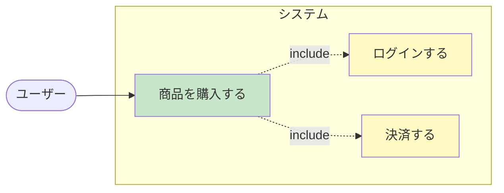

**解説**:
- 「商品を購入する」には「ログイン」と「決済」が必須
- `include`は点線で表現

---

### Extend関係（オプションの拡張）

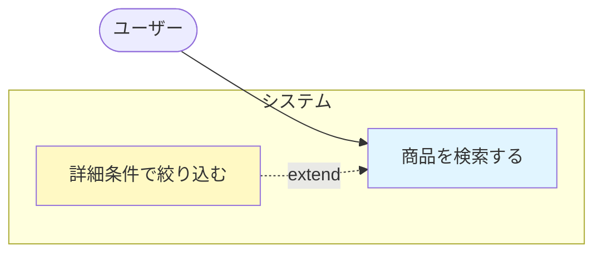

**解説**:
- 「詳細条件で絞り込む」は「商品を検索する」のオプション機能
- `extend`は点線で表現

---

### 汎化関係（継承）

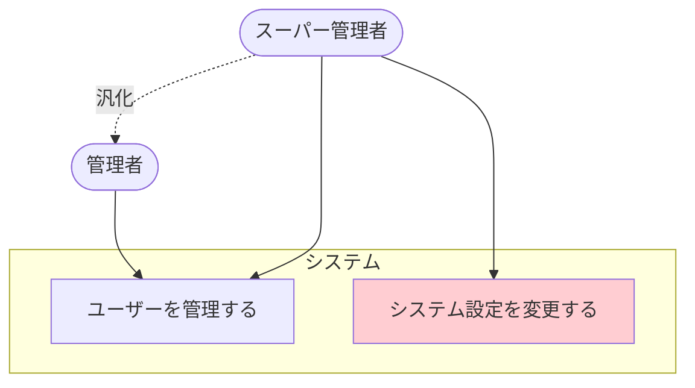

**解説**:
- スーパー管理者は管理者の権限を継承
- 追加で「システム設定を変更する」権限も持つ

---

## ❌ Bad Example: よくある失敗パターン

### 問題1: アクターが不明確

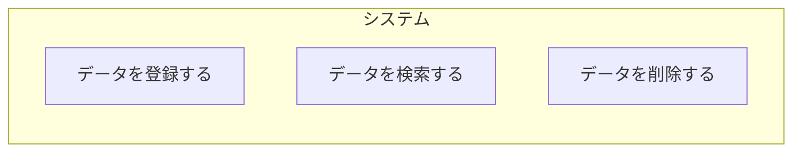

**問題点**:
- アクター（誰が使うか）が不明
- 権限管理が不明確

---

### ✅ Good Example: アクターを明記

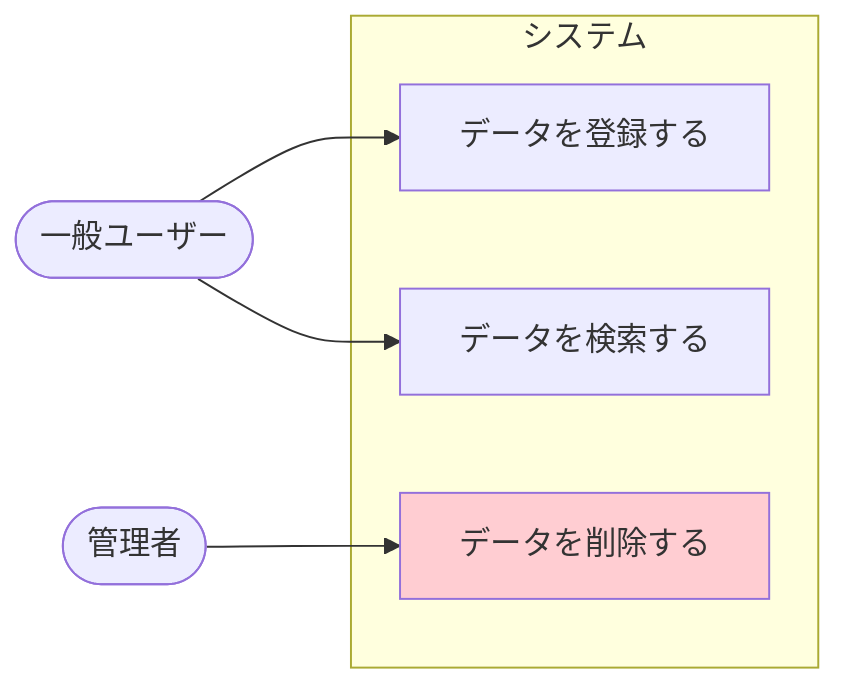

**改善点**:
- 誰が何をできるかが明確
- 削除は管理者のみ

---

### 問題2: 機能が多すぎて読めない

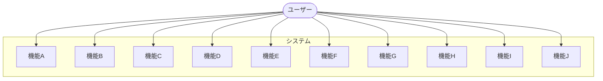

**問題点**:
- 機能が多すぎて全体像が見えない

---

### ✅ Good Example: カテゴリ別にグルーピング

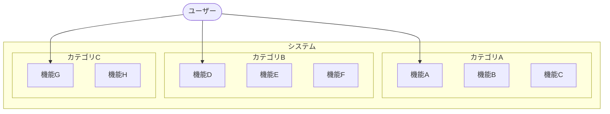

**改善点**:
- subgraphで機能をグルーピング
- 主要な動線のみを記載

---

## 📝 テンプレート

### 基本テンプレート

```markdown
## ユースケース図

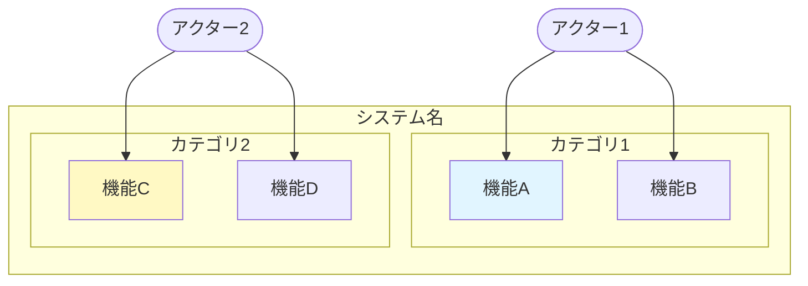

**説明**:
- アクターとユースケースの関係を記述
- 機能をカテゴリ別にグルーピング
```

---

## 🔧 実装時の注意点

### 1. Mermaidの制限

Mermaid flowchartでユースケース図を表現するため:
- UML標準のユースケース図（楕円形）とは異なる
- flowchartで代用
- 内容は同じ（アクターと機能の関係）

### 2. 粒度の調整

**要件定義では**:
- 主要なユースケースのみ
- 細かい機能は省略

**詳細設計では**:
- すべてのユースケースを記載
- include/extend関係も詳細に

### 3. アクターの種類

- **人間**: ユーザー、管理者、営業担当者等
- **外部システム**: 決済API、カレンダーAPI等
- **時間**: バッチ処理（夜間実行等）

---

## 📚 次のステップ

ユースケース図を理解したら:

1. **2.2.7.5 シーケンス図（業務フロー）.md** へ進む
2. 時系列での処理の流れを学ぶ
3. 実際のプロジェクトでユースケース図を作成

---

## 関連ドキュメント

- [2.2.5.2 ユースケース記述方法](./2.2.5.2_ユースケース記述方法.md)
- [2.2.7.1 画面遷移図パターン](./2.2.7.1_画面遷移図パターン.md)
- [2.2.7.5 シーケンス図（業務フロー）](./2.2.7.5_シーケンス図（業務フロー）.md)

---

**作成日**: 2025-10-19
**対象フェーズ**: 要件定義
**重要度**: ⭐⭐ 推奨（ユーザーとシステムの関係を可視化）
