# 2.2.7.5 シーケンス図（業務フロー）

## 目的

要件定義フェーズで、**時系列での処理の流れ・業務フロー**を視覚的に表現するためのMermaidシーケンス図パターンを提供します。

### このドキュメントで得られること

1. すぐに使えるMermaidシーケンス図のテンプレート
2. ドメインごとの具体例
3. 非同期処理・分岐の表現方法

---

## 📊 基本パターン

### シンプルなシーケンス図

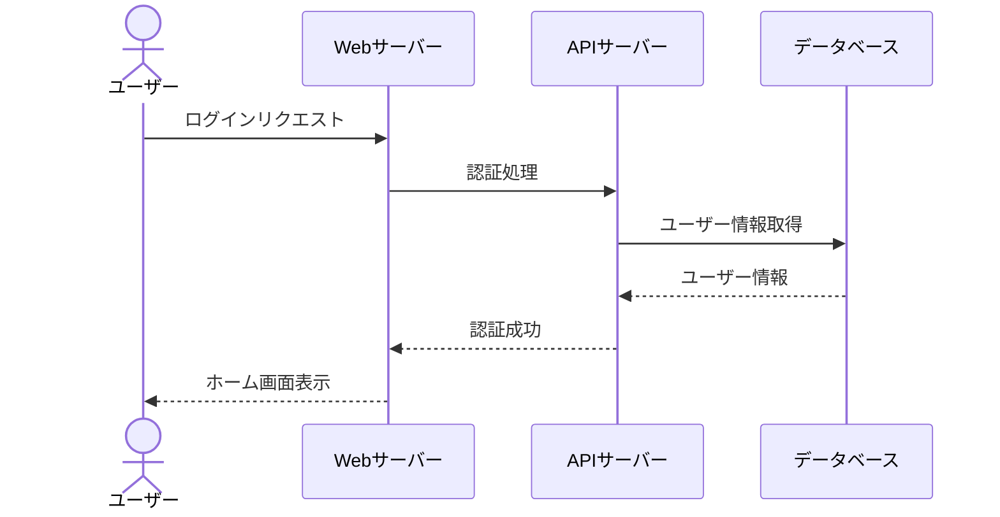

**記法**:
- `actor` : 人間のアクター
- `participant` : システムコンポーネント
- `->>` : 同期呼び出し（矢印）
- `-->>` : 応答（点線矢印）

---

## 🎯 ドメイン別パターン

### 1. ECサイト - 商品購入フロー

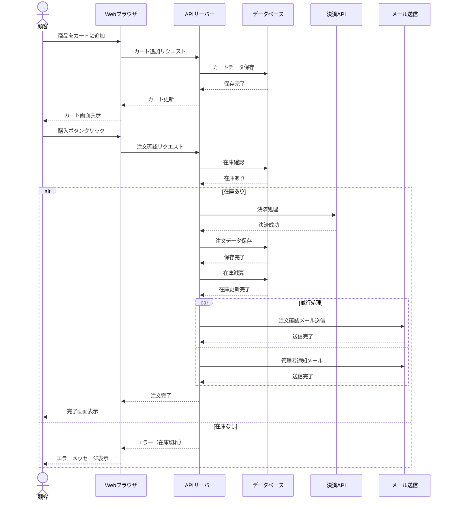

**ポイント**:
- `alt/else` で条件分岐
- `par/and` で並行処理
- 外部API（決済）との連携を明記

---

### 2. 予約システム - 予約フロー

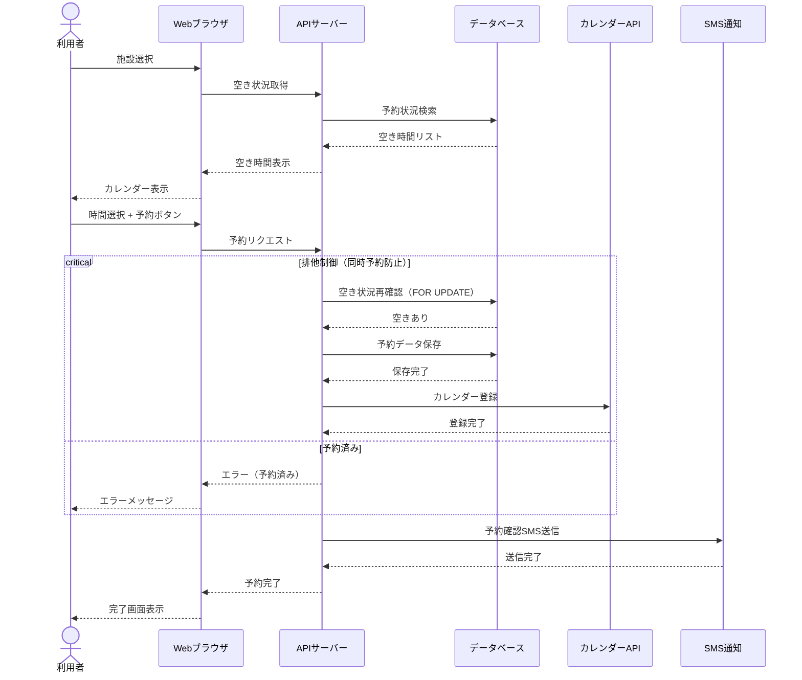

**ポイント**:
- `critical/option` で排他制御を表現
- 同時予約の防止処理を明記
- 外部API連携（カレンダー、SMS）

---

### 3. 業務システム - 商談登録フロー

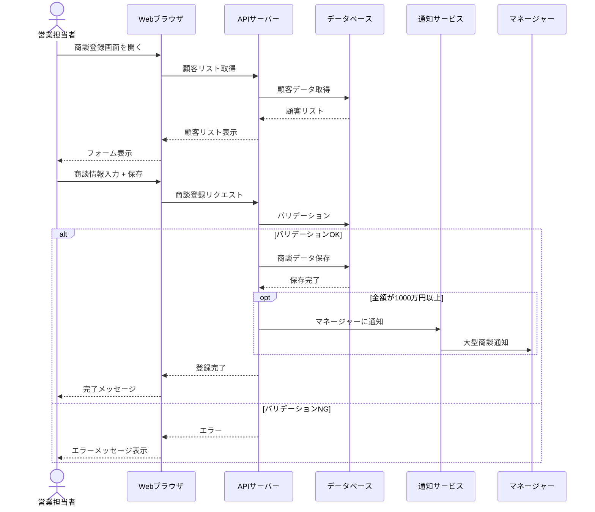

**ポイント**:
- `opt` で条件付き処理（金額が大きい場合のみ通知）
- バリデーション処理を明記
- マネージャーへの通知フロー

---

### 4. SNS - 投稿フロー

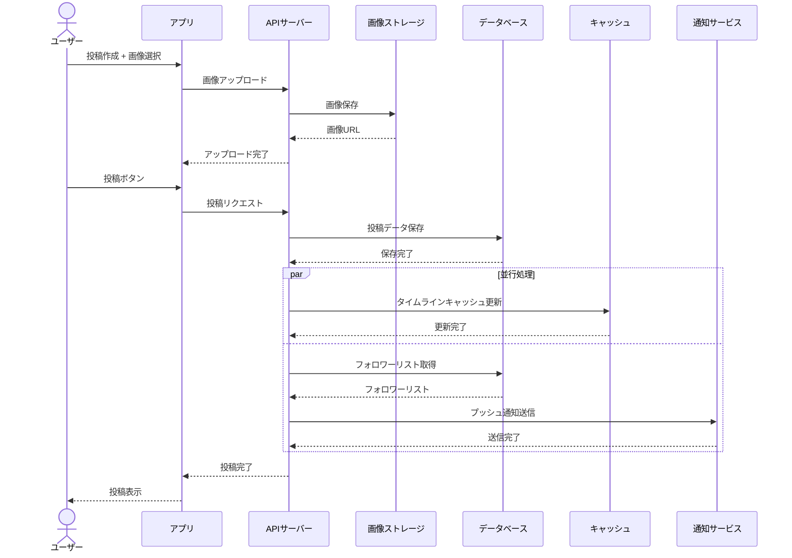

**ポイント**:
- 画像アップロードの流れ
- キャッシュ更新とプッシュ通知を並行処理
- フォロワーへの通知

---

### 5. 金融系 - 送金フロー

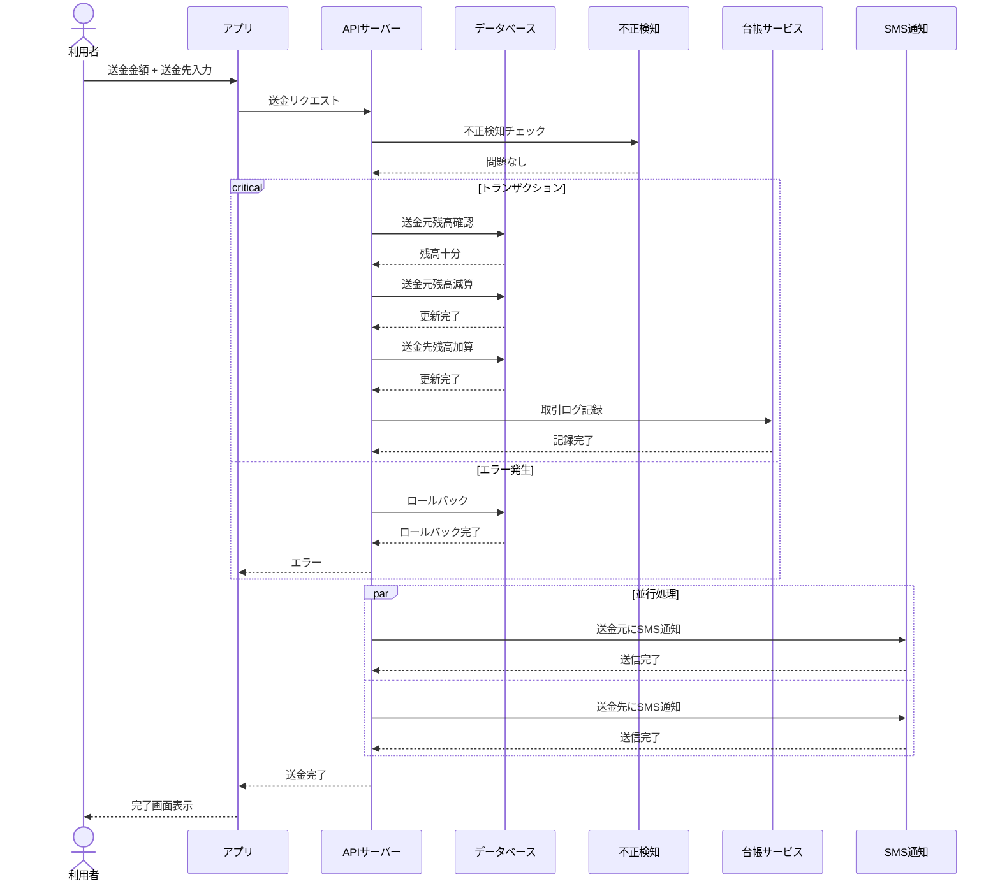

**ポイント**:
- `critical` でトランザクション処理を表現
- 不正検知チェック
- 送金元・送金先への通知
- エラー時のロールバック

---

## 🔄 高度なパターン

### ループ処理

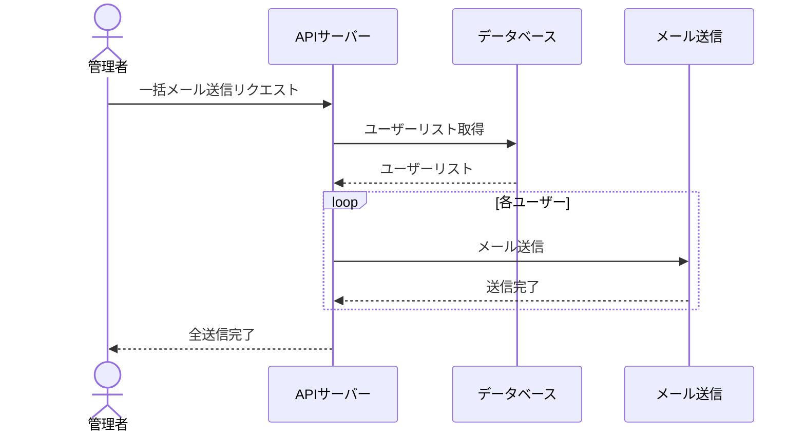

**使い方**: `loop` で繰り返し処理を表現

---

### 非同期処理（バックグラウンド）

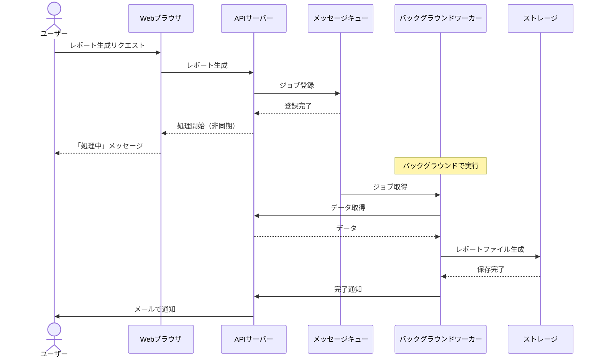

**ポイント**:
- メッセージキューで非同期処理
- `Note` でコメント追加

---

## ❌ Bad Example: よくある失敗パターン

### 問題1: 応答が書かれていない

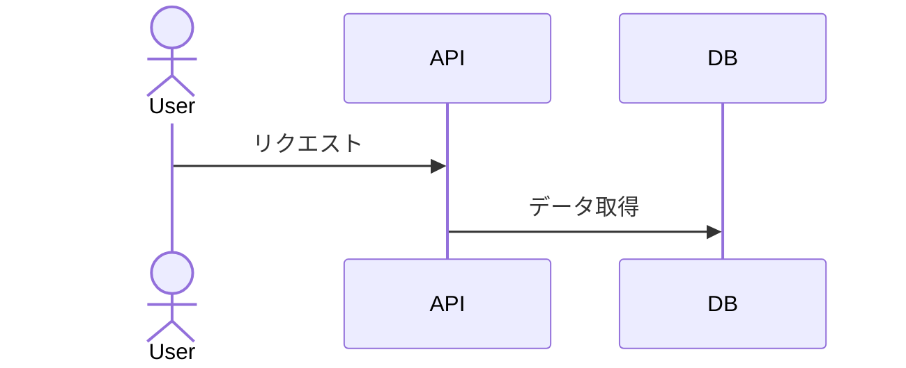

**問題点**:
- 応答（戻り矢印）がない
- 処理の完了が不明

---

### ✅ Good Example: 応答を明記

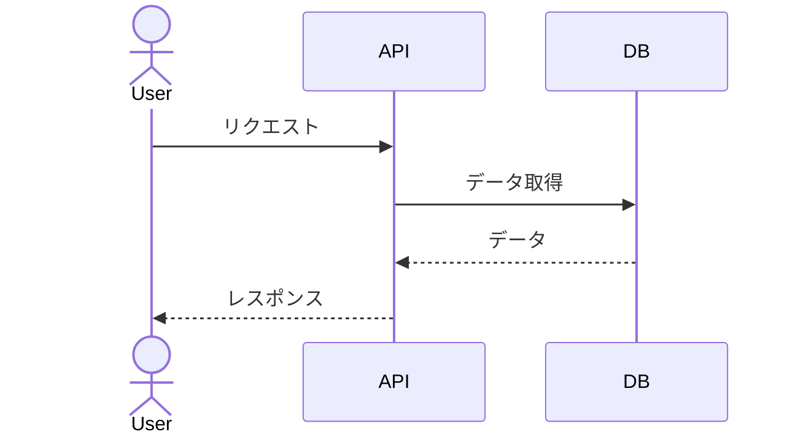

**改善点**:
- `-->>` で応答を明記
- 処理の完了が明確

---

### 問題2: 参加者が多すぎて読めない

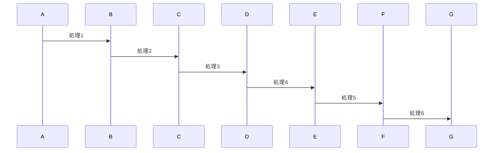

**問題点**:
- 参加者が多すぎる
- 全体の流れが見えない

---

### ✅ Good Example: 重要な部分のみ記載

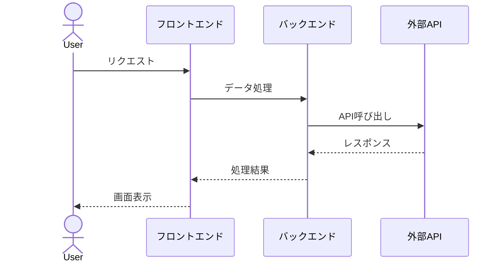

**改善点**:
- レイヤーごとにまとめる
- 詳細な内部処理は省略

---

## 📝 テンプレート

### 基本テンプレート

```markdown
## シーケンス図

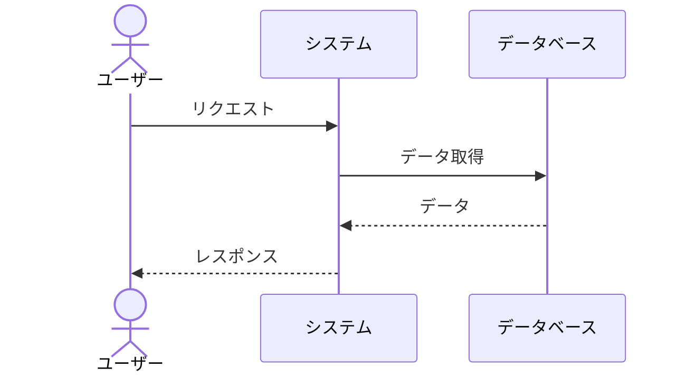

**説明**:
- 時系列での処理の流れを記述
- 応答を必ず記載
```

---

## 🔧 実装時の注意点

### 1. 粒度の調整

**要件定義では**:
- 業務フローレベル（ユーザー視点）
- 主要な処理のみ

**詳細設計では**:
- メソッドレベル
- すべての分岐・エラー処理

### 2. alt/opt/par/loopの使い分け

| 記法 | 用途 | 例 |
|------|------|-----|
| `alt/else` | 条件分岐 | 在庫あり/なし |
| `opt` | 条件付き実行 | 大型商談のみ通知 |
| `par/and` | 並行処理 | メール送信と通知 |
| `loop` | 繰り返し | 各ユーザーに送信 |
| `critical` | 排他制御 | トランザクション処理 |

### 3. 非同期処理の表現

- メッセージキューを明記
- `Note` でバックグラウンド処理を説明
- 通知方法を明示（メール、プッシュ通知等）

---

## 📚 次のステップ

シーケンス図を理解したら:

1. **2.2.7.6 Good_Bad_Example集.md** へ進む
2. Mermaid図のベストプラクティスを学ぶ
3. 実際のプロジェクトでシーケンス図を作成

---

## 関連ドキュメント

- [2.2.5.2 ユースケース記述方法](./2.2.5.2_ユースケース記述方法.md)
- [2.2.7.1 画面遷移図パターン](./2.2.7.1_画面遷移図パターン.md)
- [2.2.7.3 システム構成図（概念レベル）](./2.2.7.3_システム構成図（概念レベル）.md)

---

**作成日**: 2025-10-19
**対象フェーズ**: 要件定義
**重要度**: ⭐⭐⭐ 必須（業務フローの可視化）
