# 2.2.7.6 Good_Bad_Example集（Mermaid図）

## 目的

Mermaid図作成における、**Good Example（良い例）とBad Example（悪い例）を対比**し、実践的な学習を提供します。

### このドキュメントで得られること

1. よくある失敗パターンと改善方法
2. 読みやすい図の作り方
3. ドキュメントとしての品質向上

---

## 🎨 全体的な原則

### ❌ Bad Example: 情報が不足

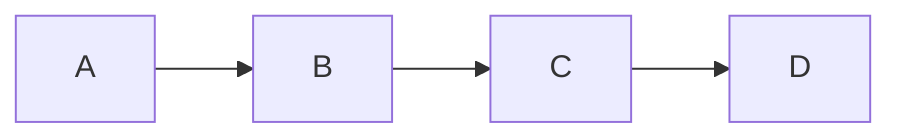

**問題点**:
- ノード名が不明
- 遷移条件が不明
- 何の図か分からない

---

### ✅ Good Example: 明確な情報

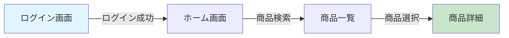

**改善点**:
- ノード名を明記（日本語でOK）
- 遷移条件を `|条件|` で記述
- 色分けで重要な画面を強調

---

## 📊 画面遷移図のGood/Bad

### ❌ Bad Example: 矢印が交差して複雑

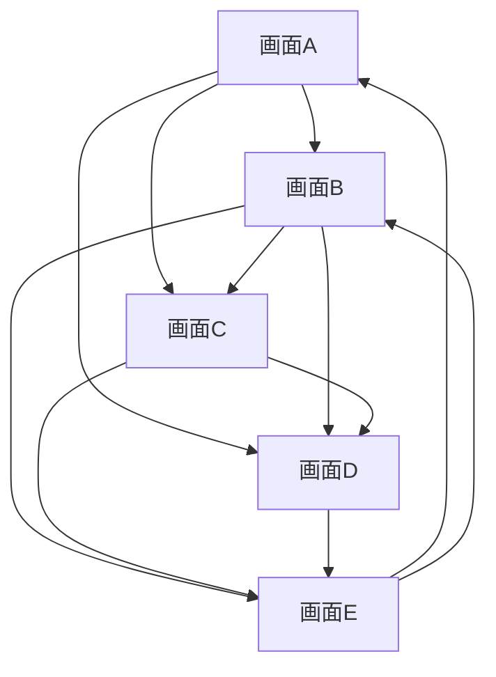

**問題点**:
- 矢印が交差して読みにくい
- 全体の流れが不明
- 「戻る」動線が複雑

---

### ✅ Good Example: subgraphで整理

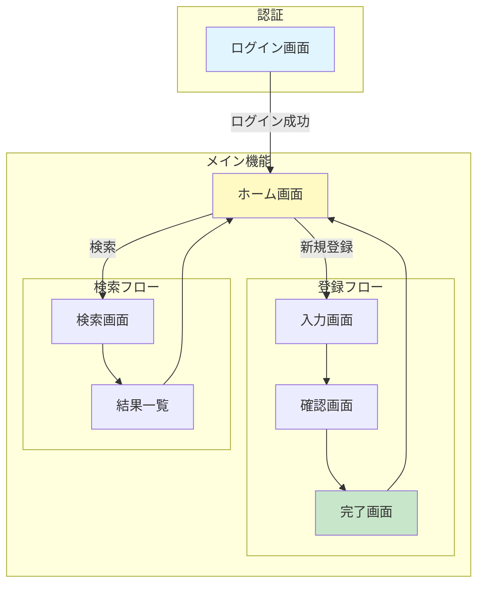

**改善点**:
- subgraphで機能をグルーピング
- 一方向の流れを意識
- 「戻る」動線を最小限に

---

### ❌ Bad Example: 遷移条件が不明

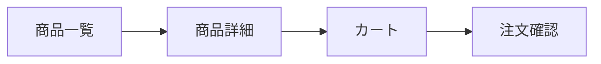

**問題点**:
- どのボタン・アクションで遷移するか不明
- 開発者が実装できない

---

### ✅ Good Example: アクションを明記

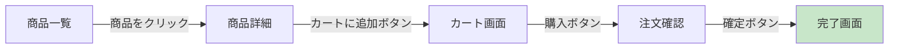

**改善点**:
- ボタン名・アクション名を明記
- 実装者が迷わない

---

## 🗄️ ER図のGood/Bad

### ❌ Bad Example: データ型・制約が不明

```mermaid
erDiagram
    USER {
        id
        name
        email
    }

    ORDER {
        id
        user_id
        total
    }
```

**問題点**:
- データ型がない
- PK/FK/UKの指定がない
- 実装時に混乱

---

### ✅ Good Example: データ型・制約を明記

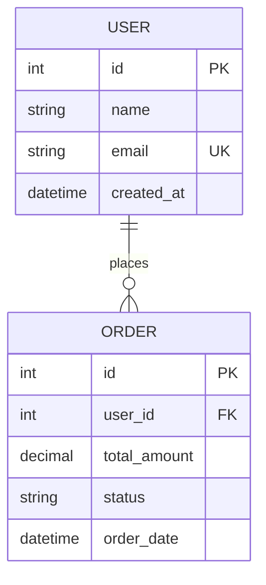

**改善点**:
- データ型を明記（int, string, decimal等）
- PK/FK/UKを明記
- カーディナリティを明記（1対多）
- 日時フィールドも含める

---

### ❌ Bad Example: 多対多を直接結ぶ

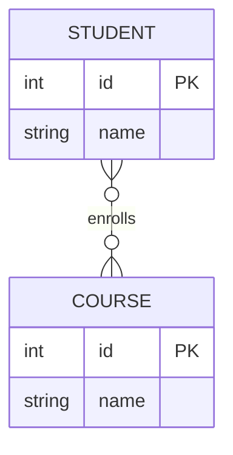

**問題点**:
- 中間テーブルがない
- 成績等の追加情報を保存できない
- 実装が困難

---

### ✅ Good Example: 中間テーブルを作る

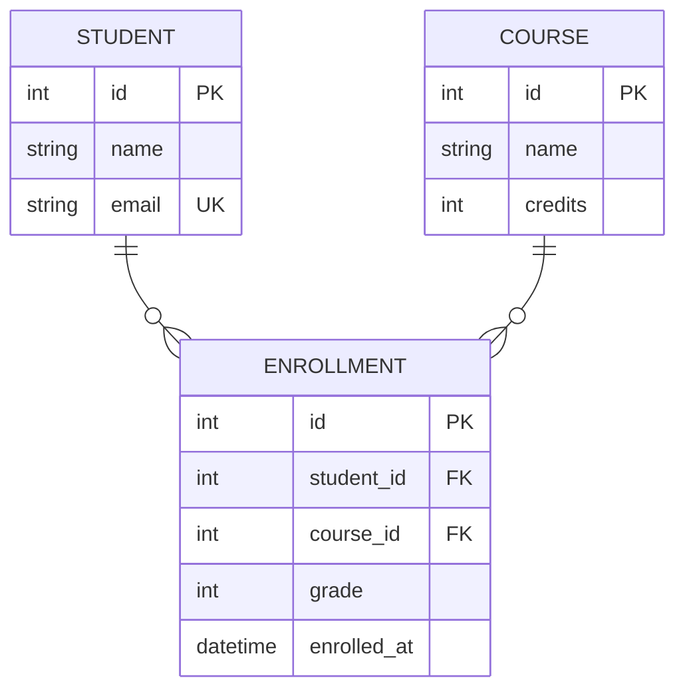

**改善点**:
- 中間テーブル `ENROLLMENT` で多対多を実現
- 成績等の追加情報を保存可能
- 履修日時も記録

---

## 🏗️ システム構成図のGood/Bad

### ❌ Bad Example: 詳細すぎて読めない

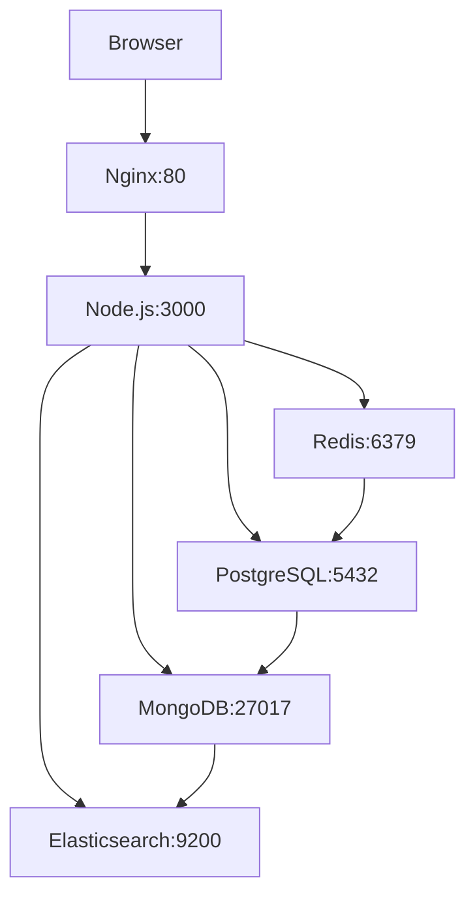

**問題点**:
- ポート番号等の詳細すぎる情報
- 要件定義フェーズには不要
- 全体像が見えない

---

### ✅ Good Example: 概念レベルで表現

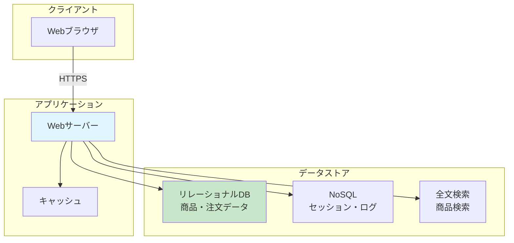

**改善点**:
- 概念レベルで表現
- 役割を明確に（コメント追加）
- subgraphでレイヤー分け
- 通信プロトコルを明記（HTTPS）

---

### ❌ Bad Example: 外部連携が不明

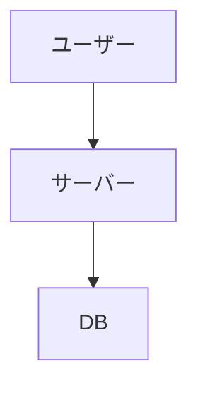

**問題点**:
- 外部サービス連携が不明
- 決済・メール送信等が抜けている
- 実装時に「聞いていない」となる

---

### ✅ Good Example: 外部連携を明記

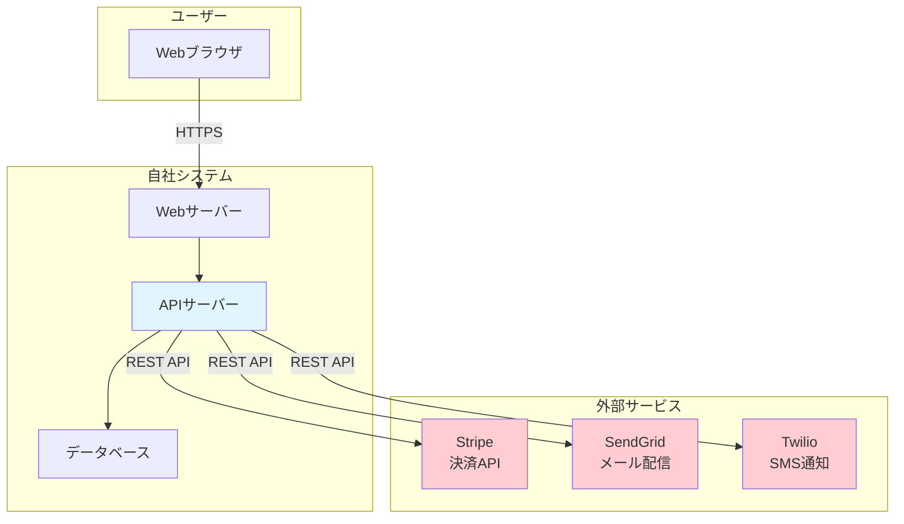

**改善点**:
- 外部サービスを明記
- 依存関係を明確に
- 色分けで外部を強調（赤系）
- 通信方式を明記（REST API等）

---

## 🔄 シーケンス図のGood/Bad

### ❌ Bad Example: 応答が書かれていない

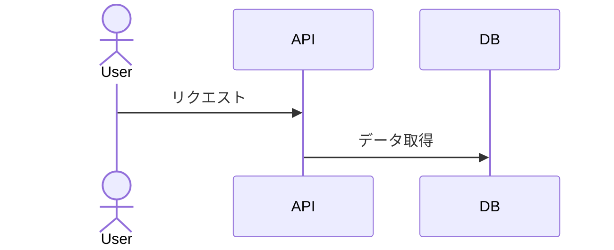

**問題点**:
- 応答（戻り矢印）がない
- 処理の完了が不明
- ユーザーに何が返るか不明

---

### ✅ Good Example: 応答を明記

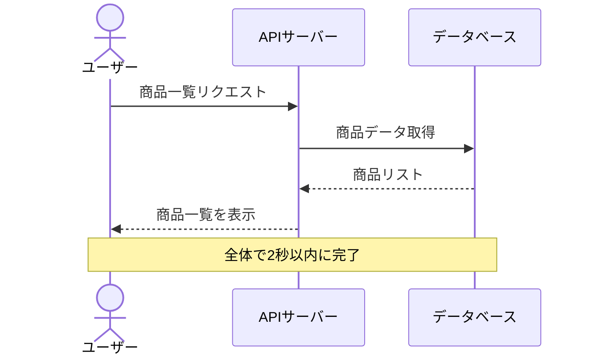

**改善点**:
- `-->>` で応答を明記
- 処理の完了が明確
- `Note` でパフォーマンス要件を追記
- 日本語のラベル（as）を使用

---

### ❌ Bad Example: 参加者が多すぎて読めない

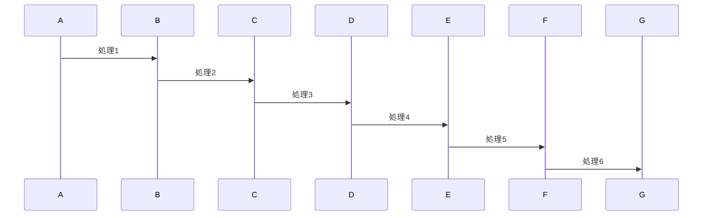

**問題点**:
- 参加者が多すぎる
- 全体の流れが見えない
- 詳細すぎる

---

### ✅ Good Example: 重要な部分のみ記載

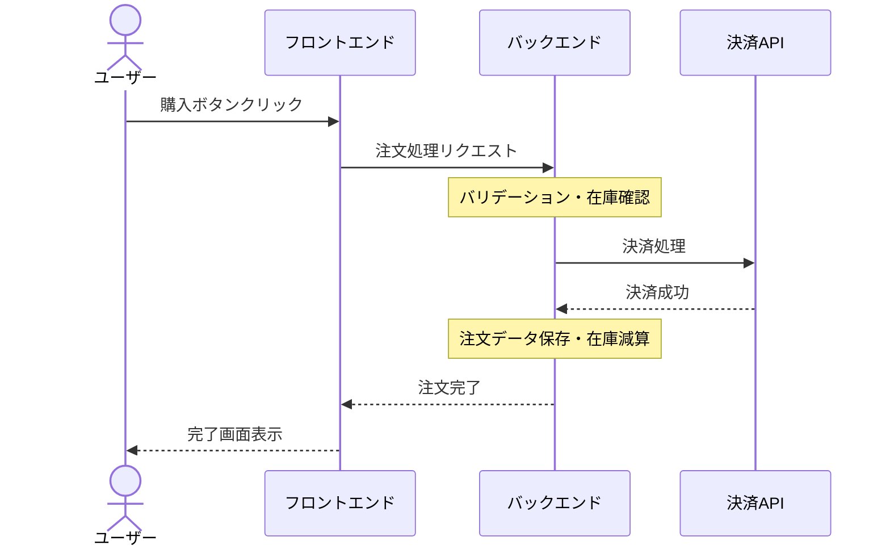

**改善点**:
- レイヤーごとにまとめる
- 詳細な内部処理は `Note` で補足
- 重要な外部API呼び出しのみ記載

---

### ❌ Bad Example: エラー処理が不明

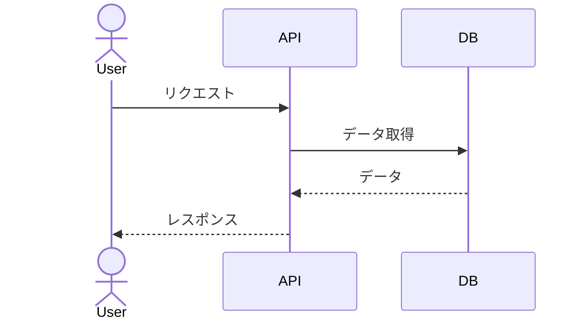

**問題点**:
- エラー時の処理が不明
- 在庫切れ、決済失敗等のケースがない

---

### ✅ Good Example: エラー処理を明記

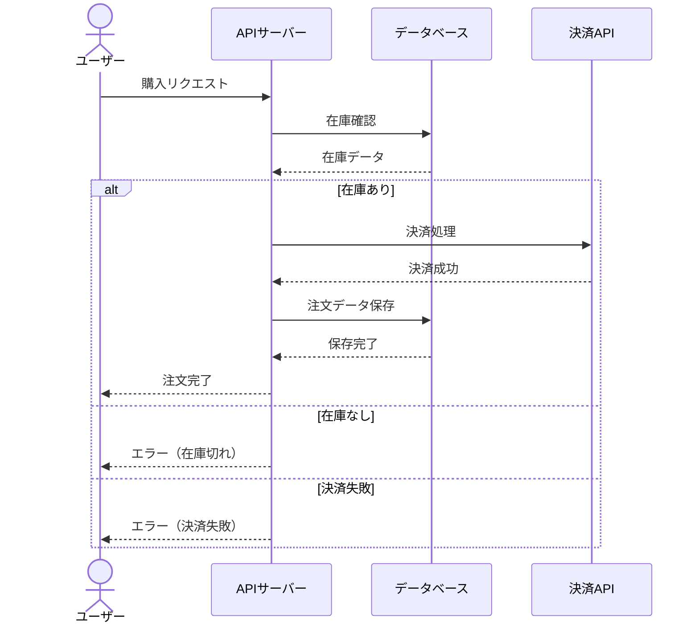

**改善点**:
- `alt/else` で条件分岐を明記
- エラーケースを網羅
- 各ケースでの応答を明確に

---

## 🎯 ユースケース図のGood/Bad

### ❌ Bad Example: アクターが不明

```mermaid
flowchart LR
    subgraph システム
        UC1[データを登録する]
        UC2[データを検索する]
        UC3[データを削除する]
    end
```

**問題点**:
- アクター（誰が使うか）が不明
- 権限管理が不明確

---

### ✅ Good Example: アクターを明記

```mermaid
flowchart LR
    User([一般ユーザー])
    Admin([管理者])

    subgraph システム
        UC1[データを登録する]
        UC2[データを検索する]
        UC3[データを削除する]
    end

    User --> UC1
    User --> UC2
    Admin --> UC3

    style UC3 fill:#ffcdd2
```

**改善点**:
- 誰が何をできるかが明確
- 削除は管理者のみ（色で強調）

---

## 🎨 色使いのGood/Bad

### ❌ Bad Example: 色を使わない

```mermaid
flowchart TB
    A[開始] --> B[処理1]
    B --> C[処理2]
    C --> D[エラー]
    C --> E[完了]
```

**問題点**:
- すべて同じ色
- 重要な画面が目立たない

---

### ✅ Good Example: 色分けで強調

```mermaid
flowchart TB
    A[開始] --> B[処理1]
    B --> C[処理2]
    C --> D[エラー]
    C --> E[完了]

    style A fill:#e1f5ff
    style D fill:#ffcdd2
    style E fill:#c8e6c9
```

**改善点**:
- 開始: 水色 `#e1f5ff`
- エラー: 赤 `#ffcdd2`
- 完了: 緑 `#c8e6c9`
- 重要な状態が一目で分かる

---

## 📚 推奨色パレット

| 用途 | 色 | カラーコード |
|------|-----|-------------|
| 開始・入口 | 水色 | `#e1f5ff` |
| 通常処理 | グレー | `#f5f5f5` |
| 重要・注意 | 黄色 | `#fff9c4` |
| エラー・削除 | 赤 | `#ffcdd2` |
| 完了・成功 | 緑 | `#c8e6c9` |
| 外部サービス | オレンジ | `#ffe0b2` |

---

## 📝 まとめ

### Good Exampleの共通点

1. **明確なラベル**: ノード名、遷移条件を日本語で明記
2. **適切な粒度**: 詳細すぎず、概念レベルを保つ
3. **subgraphでグルーピング**: 機能やレイヤーごとに整理
4. **色分け**: 重要な要素を視覚的に強調
5. **応答を明記**: シーケンス図では必ず戻り矢印を記載
6. **エラー処理**: alt/elseで分岐を明記
7. **外部連携**: 外部サービス・APIを明記

### Bad Exampleの共通パターン

1. **情報不足**: ラベルがない、遷移条件が不明
2. **詳細すぎる**: ポート番号等、要件定義には不要
3. **複雑すぎる**: 矢印が交差、参加者が多すぎる
4. **色がない**: すべて同じ色で重要度が不明
5. **応答がない**: シーケンス図で戻り矢印がない
6. **エラー処理がない**: 正常系のみで異常系が不明
7. **外部連携が不明**: 外部サービスが抜けている

---

## 📚 次のステップ

Mermaid図のGood/Bad Exampleを理解したら:

1. **2.2 要件定義フェーズ完了** ✅
2. **2.3 設計フェーズへ進む**
3. 実際のプロジェクトで図を作成・改善

---

## 関連ドキュメント

- [2.2.7.1 画面遷移図パターン](./2.2.7.1_画面遷移図パターン.md)
- [2.2.7.2 ER図パターン](./2.2.7.2_ER図パターン.md)
- [2.2.7.3 システム構成図（概念レベル）](./2.2.7.3_システム構成図（概念レベル）.md)
- [2.2.7.4 ユースケース図パターン](./2.2.7.4_ユースケース図パターン.md)
- [2.2.7.5 シーケンス図（業務フロー）](./2.2.7.5_シーケンス図（業務フロー）.md)

---

**作成日**: 2025-10-19
**対象フェーズ**: 要件定義
**重要度**: ⭐⭐ 推奨（実例集として活用）
