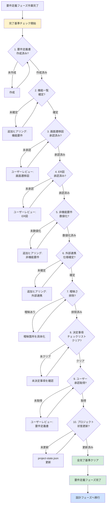

# 2.2.8 フェーズ完了基準（要件定義フェーズ）

## 📋 このドキュメントの目的

要件定義フェーズを**完了してよい条件**を明確化し、次の設計フェーズに進む前に必要な確認事項を定義する。

**重要:** この完了基準を満たさない限り、設計フェーズには進まない。

---

## ✅ 必須完了条件（10項目）

### 1. 要件定義書が作成されている

#### 確認内容

- [ ] **要件定義書ファイルが存在する**
  - ファイルパス: `docs/02_要件定義書.md`
  - 標準目次構成に従っている

- [ ] **すべてのセクションが記述されている**
  - はじめに
  - プロジェクト概要
  - 機能要件
  - 非機能要件
  - データ要件
  - 外部連携仕様
  - 制約事項
  - 優先順位（MoSCoW）
  - 用語集
  - 改訂履歴

---

### 2. 機能一覧が確定している

#### 確認内容

- [ ] **機能一覧表が作成されている**
  - 機能ID、機能名、機能概要、ユーザー種別、優先度が記載
  - すべての機能が網羅されている

- [ ] **機能の粒度が適切**
  - 大機能/中機能/小機能に階層化
  - 実装可能な粒度まで分解されている

- [ ] **優先順位（MoSCoW）が決定されている**
  - Must（必須）が明確
  - Should（重要）が明確
  - Could（可能であれば）が明確
  - Won't（今回は実装しない）が明確

---

### 3. 画面遷移図が承認されている

#### 確認内容

- [ ] **画面一覧が確定している**
  - 画面ID、画面名、画面概要が記載
  - すべての画面が網羅されている

- [ ] **画面遷移図が作成されている**
  - Mermaid図で可視化
  - 遷移条件が明確
  - ユーザーの操作フローが理解できる

- [ ] **ユーザー承認を取得している**
  - ステークホルダーが画面遷移を確認
  - 承認を得ている

---

### 4. ER図が承認されている

#### 確認内容

- [ ] **ER図が作成されている**
  - Mermaid erDiagram で可視化
  - すべてのエンティティが記載
  - リレーションが明確

- [ ] **データ項目定義が作成されている**
  - 各テーブルのカラム定義
  - データ型、必須/任意、制約が明確

- [ ] **ユーザー承認を取得している**
  - ステークホルダーがデータ構造を確認
  - 承認を得ている

---

### 5. 非機能要件が数値化されている

#### 確認内容

- [ ] **性能要件が数値化されている**
  - レスポンスタイム（秒）
  - スループット（同時ユーザー数）
  - データ処理量（件/秒）

- [ ] **可用性要件が数値化されている**
  - 稼働時間（24/7 or 営業時間のみ）
  - 目標稼働率（99.9%等）
  - RTO/RPO（障害復旧目標）

- [ ] **セキュリティ要件が明確**
  - 認証方式
  - 認可・権限管理
  - データ暗号化要件
  - 監査ログ要件

- [ ] **運用要件が明確**
  - バックアップ要件（頻度、世代管理）
  - 監視要件
  - ログ保持期間

---

### 6. 外部連携仕様が確定されている（該当する場合）

#### 確認内容

- [ ] **連携先システムが特定されている**
  - システム名、連携目的が記載

- [ ] **連携方式が決定されている**
  - API連携 / ファイル連携 / DB連携

- [ ] **連携タイミングが決定されている**
  - リアルタイム / バッチ（頻度）

- [ ] **連携データ項目が確定されている**
  - データ項目、データ型、必須/任意

- [ ] **エラー時の対応が決定されている**
  - リトライ方針、エラー通知

---

### 7. 曖昧な表現が残っていない

#### 確認内容

- [ ] **数値化されている**
  - 「速く」→「3秒以内」
  - 「多く」→「同時100ユーザー」
  - 「高い」→「99.9%以上」

- [ ] **具体化されている**
  - 「セキュアである」→「ID/PW + 多要素認証（SMS）」
  - 「バックアップする」→「日次フルバックアップ、7世代管理」

- [ ] **解釈の余地がない**
  - 読み手によって解釈が変わらない
  - 実装者が迷わない

---

### 8. 決定事項チェックリストをクリアしている

#### 確認内容

- [ ] **決定事項チェックリスト（2.2.3）の全項目が決定済み**
  1. 機能一覧の確定
  2. 画面遷移図の合意
  3. データモデル（ER図）の合意
  4. 非機能要件の数値目標決定
  5. 外部システム連携仕様の確定
  6. 優先順位の決定（MoSCoW）
  7. 要件の曖昧さ排除の確認

---

### 9. ユーザー承認を取得している

#### 確認内容

- [ ] **要件定義書をユーザーに提示した**
  - レビュー依頼を実施

- [ ] **フィードバックを反映した**
  - ユーザーからの修正依頼を反映
  - 再レビューを実施

- [ ] **最終承認を取得した**
  - ユーザーが「この内容で進めてよい」と承認
  - 承認日時を記録

---

### 10. プロジェクト状態が更新されている

#### 確認内容

- [ ] **`.claude-state/project-state.json` が更新されている**
  - currentPhase: "requirements"
  - status: "completed"
  - completedPhases に "requirements" が追加
  - artifacts に要件定義書のパスが記録

---

## 🔍 完了チェックフロー



---

## 📋 完了チェックシート

### プロジェクト名: _______________

### チェック実施日: _______________

### チェック実施者: _______________

| # | 完了基準 | 状態 | 備考 |
|---|---------|------|------|
| 1 | 要件定義書が作成されている | ☐ 完了 / ☐ 未完了 | |
| 2 | 機能一覧が確定している | ☐ 完了 / ☐ 未完了 | |
| 3 | 画面遷移図が承認されている | ☐ 完了 / ☐ 未完了 | |
| 4 | ER図が承認されている | ☐ 完了 / ☐ 未完了 | |
| 5 | 非機能要件が数値化されている | ☐ 完了 / ☐ 未完了 | |
| 6 | 外部連携仕様が確定されている | ☐ 完了 / ☐ 未完了 / ☐ 該当なし | |
| 7 | 曖昧な表現が残っていない | ☐ 完了 / ☐ 未完了 | |
| 8 | 決定事項チェックリストをクリアしている | ☐ 完了 / ☐ 未完了 | |
| 9 | ユーザー承認を取得している | ☐ 完了 / ☐ 未完了 | |
| 10 | プロジェクト状態が更新されている | ☐ 完了 / ☐ 未完了 | |

### 総合判定

- [ ] **全項目が完了** → 設計フェーズへ進んでよい ✅
- [ ] **未完了あり** → 未完了事項を解消してから次フェーズへ ❌

### 承認

**承認日**: _______________

**承認者**: _______________

**サイン**: _______________

---

## ⚠️ よくある未完了パターンと対処法

### パターン1: 曖昧な表現が残っている

**症状**:
- 「速く動作する」
- 「高い可用性」
- 「セキュアである」

**対処法**:
```markdown
AIによる自己レビュー:
1. 要件定義書を全文検索
2. 「速く」「多く」「高い」などの曖昧な単語を抽出
3. それぞれを数値化・具体化
4. ユーザーに確認

例:
❌ 「速く動作する」
→ 「具体的には何秒以内でしょうか？」とヒアリング
✅ 「検索結果は3秒以内に表示される」
```

---

### パターン2: ユーザー承認を取得していない

**症状**:
- 要件定義書を作成したが、ユーザーレビューを実施していない
- ユーザーから「聞いていない」と言われる

**対処法**:
```markdown
AIによる確認:
1. 要件定義書を提示する前に会話を振り返る
2. 抜け漏れチェック
3. 「もっといい提案」を準備
4. ユーザーに要件定義書を提示
5. レビュー依頼
6. フィードバック反映
7. 最終承認取得

重要: 必ず「承認します」という明示的な言葉をもらう
```

---

### パターン3: 非機能要件が曖昧

**症状**:
- 「速く動けばいい」
- 「障害時は復旧する」

**対処法**:
```markdown
AIによる追加ヒアリング:
1. 「速く」とは、具体的に何秒以内でしょうか？
2. 障害時の復旧について、目標復旧時間（RTO）はどのくらいでしょうか？
3. 同時何ユーザーのアクセスを想定していますか？
4. 稼働時間は24時間365日ですか、それとも営業時間のみですか？

すべて数値化・具体化する
```

---

### パターン4: 外部連携の詳細が不明

**症状**:
- 「会計システムと連携する」（方式不明）
- 「データを送る」（タイミング不明）

**対処法**:
```markdown
AIによる追加ヒアリング:
1. 連携方式は API連携、ファイル連携、DB連携のいずれですか？
2. 連携タイミングはリアルタイムですか、バッチですか？
3. バッチの場合、頻度はどのくらいですか？
4. 連携するデータ項目は何ですか？
5. エラー時の対応はどうしますか？

すべて具体化する
```

---

## 📝 設計フェーズへの移行条件

### 移行可能

以下の条件を**すべて満たす**場合のみ、設計フェーズに進む：

1. ✅ 完了チェックシートの全10項目が「完了」
2. ✅ ユーザーから明示的な承認を取得
3. ✅ `.claude-state/project-state.json` が更新済み

### 移行不可

以下の場合は、設計フェーズに進まない：

- ❌ 完了チェックシートに「未完了」が1つでもある
- ❌ ユーザー承認が取得できていない
- ❌ 曖昧な表現が残っている
- ❌ 非機能要件が数値化されていない

**AIファシリテーターは、この条件を厳守する。**

---

## 🎯 設計フェーズへの準備

### 要件定義フェーズ完了後の確認

完了基準をクリアしたら、以下を確認：

#### 1. 成果物の確認

- [ ] `docs/02_要件定義書.md` が存在する
- [ ] `docs/diagrams/` に画面遷移図・ER図が保存されている
- [ ] `.claude-state/project-state.json` が更新されている

#### 2. 次フェーズへの引継ぎ事項を確認

**参照**: `2.2.9_次フェーズへの引継ぎ事項.md`

- [ ] 引き継ぐべき情報が整理されている
- [ ] 設計フェーズで参照すべき情報が明確

#### 3. ユーザーへの説明

```markdown
AI: 要件定義フェーズが完了しました。

次の設計フェーズでは、以下を実施します：
- 技術スタックの選定（言語、フレームワーク、データベース、インフラ）
- アーキテクチャ設計
- データベーススキーマ設計
- API設計

⭐⭐⭐ 設計フェーズでは、技術標準（`.claude/docs/40_standards/`）を参照します。
- Python規約
- AWS CloudFormation規約
- セキュリティ・運用基準

これにより、社内標準に準拠した高品質な設計を実現します。

設計フェーズに進んでよろしいでしょうか？
```

---

## 📚 関連ドキュメント

### 必ず参照

- `2.2.3_決定事項チェックリスト.md` - 決定すべき事項
- `2.2.4_製造物_要件定義書構成.md` - 要件定義書テンプレート
- `2.2.9_次フェーズへの引継ぎ事項.md` - 設計フェーズへの引継ぎ

### 必要に応じて参照

- `2.2.2_ヒアリング項目定義/` - 追加ヒアリング時
- `2.2.5_機能要件の記述方法/` - 機能要件の見直し時
- `2.2.6_非機能要件の記述方法/` - 非機能要件の見直し時
- `2.2.7_Mermaid図パターン/` - 図表の修正時

---

## 💡 AIファシリテーターとしての心構え

### 妥協しない

- **曖昧なまま次フェーズに進まない**
- 完了基準を満たすまで、丁寧にヒアリング
- ユーザーの「まあいいか」を許さない

### ユーザーの成長を支援

- なぜこの完了基準が必要なのかを説明
- 曖昧さが残るとどんな問題が起きるかを説明
- ユーザーが納得した上で進める

### 次フェーズの成功を保証

- 要件定義が曖昧だと、設計・実装でブレが生じる
- この段階で徹底的に固めることで、後工程がスムーズ
- 「要件定義の品質 = プロジェクトの成功」を意識

---

**最終更新**: 2025-10-19
**作成者**: Claude (AI開発ファシリテーター)
