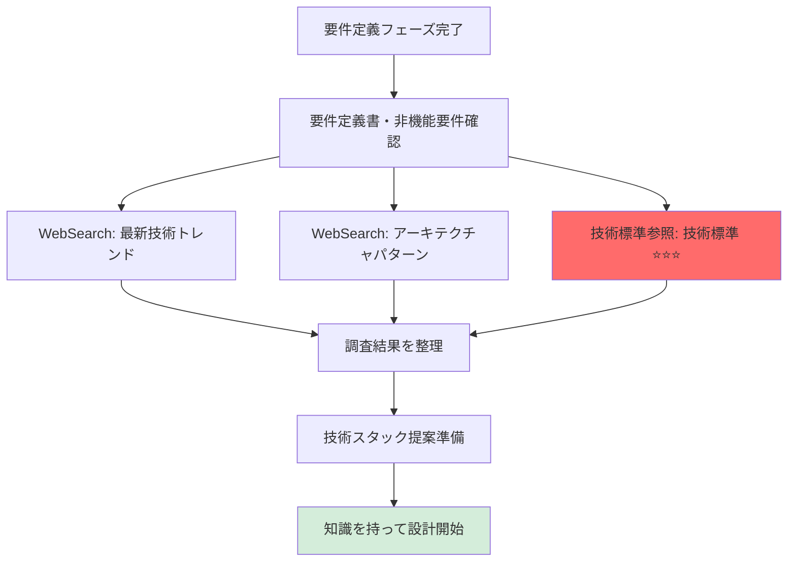
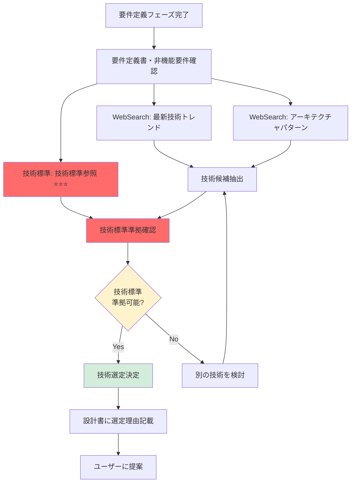

# 2.3.0 事前調査（設計フェーズ）

## 📋 このドキュメントの目的

設計フェーズを開始する**前に**、AIが自律的に調査を行い、技術選定・アーキテクチャ設計の質を高める。

**これがAI開発ファシリテーターの真価** ⭐⭐⭐

**重要:** このフェーズから **技術標準（`.claude/docs/40_standards/`）の参照が開始** ⭐⭐⭐

---

## 🎯 なぜ事前調査が重要なのか

### 設計フェーズでの事前調査の意義

**これまでのフェーズとの違い:**
- **企画フェーズ（2.1.0）**: 業界動向・類似事例の調査
- **要件定義フェーズ（2.2.0）**: 要件テンプレート・事例の調査
- **設計フェーズ（2.3.0）**: **最新技術トレンド + 技術標準（`.claude/docs/40_standards/`）** ⭐⭐⭐

### 事前調査の効果

**Before（事前調査なし）:**
```
AI: 技術スタックを決めましょう
User: 何がいいですか？
AI: （何も提案できない）
```

**After（事前調査あり）:**
```
AI: （WebSearch + 技術標準参照済み）
   要件定義書の非機能要件を確認しました：
   - 同時アクセス: 20ユーザー
   - レスポンスタイム: 3秒以内
   - 稼働時間: 平日9:00-18:00

   この要件を満たす技術スタックとして、以下を提案します：

   【バックエンド】
   - Python (FastAPI) ← 技術標準（`.claude/docs/40_standards/`）に準拠
   - 理由: 開発効率が高く、技術標準が整備済み

   【データベース】
   - PostgreSQL
   - 理由: 性能・信頼性が高く、非機能要件を満たせる

   【インフラ】
   - オンプレミス（Windows Server）
   - 理由: 制約条件（クラウド禁止）に準拠

   この提案で問題ないですか？

→ ユーザー: 「いいですね、その方向で進めましょう」
```

---

## 📝 事前調査の実行タイミング

### いつ実行するか

**タイミング:** 要件定義フェーズ完了後、設計フェーズ開始直前

**フロー:**


**重要:** 技術標準（`.claude/docs/40_standards/`）を**必ず参照**してから技術選定 ⭐⭐⭐

---

## 🔍 事前調査の項目

### 1. 最新技術トレンド調査（WebSearch）

#### 調査内容

```
- 「2025 〇〇システム 技術スタック トレンド」で検索
- 「2025 Python FastAPI ベストプラクティス」で検索
- 「2025 PostgreSQL 最新機能」で検索
```

#### WebSearch実行例

```
WebSearch: "2025 営業支援システム 技術スタック"
WebSearch: "2025 Python FastAPI 最新バージョン"
WebSearch: "2025 PostgreSQL 16 新機能"
WebSearch: "2025 Webアプリケーション アーキテクチャ トレンド"
```

#### 記録すべき情報

```markdown
## 最新技術トレンド（2025年）

### バックエンド技術

#### Python (FastAPI)
- **最新バージョン**: FastAPI 0.110+
- **新機能**:
  - パフォーマンス向上（20%高速化）
  - 型ヒント強化
  - OpenAPI 3.1完全対応
- **採用理由**:
  - 開発効率が高い
  - 型安全性
  - 自動ドキュメント生成

#### Node.js (TypeScript + Express)
- **最新バージョン**: Node.js 20 LTS
- **新機能**:
  - パフォーマンス向上
  - ESM対応強化
- **採用理由**:
  - フロントエンドとの親和性
  - エコシステムが豊富

### データベース技術

#### PostgreSQL
- **最新バージョン**: PostgreSQL 16
- **新機能**:
  - 並列処理性能向上
  - パーティショニング強化
- **採用理由**:
  - 性能・信頼性が高い
  - トランザクション処理が強力

### フロントエンド技術

#### React
- **最新バージョン**: React 18+
- **新機能**:
  - Server Components
  - Concurrent Rendering
- **採用理由**:
  - エコシステムが最も豊富
  - 人材確保が容易
```

---

### 2. 技術標準（`.claude/docs/40_standards/`）の参照 ⭐⭐⭐**最重要**

#### 参照すべき技術標準ファイル

**アプリケーション開発:**
- `4.5 Python規約` ← 要件定義でPythonを想定している場合
- `4.6 Node.js/TypeScript規約` ← TypeScriptを想定している場合
- `4.7 C# .NET Core規約` ← C#を想定している場合
- `4.8 Go言語規約` ← Goを想定している場合

**インフラ開発:**
- `4.3 AWS CloudFormation規約`
- `4.4 Terraform規約`

**セキュリティ（全プロジェクト必須）:**
- `4.9 セキュリティ・運用基準` ⭐⭐⭐必ず参照

#### 技術標準参照の実行

```
# 設計フェーズ開始時に必ず実行

1. 要件定義書から想定される技術を確認
   例: Python + PostgreSQL + React

2. 該当する技術標準（`.claude/docs/40_standards/`）ページを開く
   - `.claude/docs/40_standards/41_python.md` Python規約
   - `.claude/docs/40_standards/49_security.md` セキュリティ・運用基準

3. 以下を確認:
   - プロジェクト構成
   - コーディング規約
   - ベストプラクティス
   - Good/Bad Example
   - 推奨ライブラリ

4. 技術標準に準拠できる技術を選定
```

#### 記録すべき情報

```markdown
## 技術標準（`.claude/docs/40_standards/`）の参照結果

### 参照したページ

- **`.claude/docs/40_standards/41_python.md` Python規約**
  - プロジェクト構成: src/ tests/ pyproject.toml
  - 推奨フレームワーク: FastAPI
  - 型ヒント必須
  - pytest使用

- **`.claude/docs/40_standards/49_security.md` セキュリティ・運用基準**
  - 認証: ID/PW + 多要素認証推奨
  - 暗号化: TLS 1.2以上、AES-256
  - シークレット管理: AWS Secrets Manager推奨
  - 監査ログ: 必須

### 技術標準との整合性確認

✅ Python (FastAPI): 技術標準に準拠可能
✅ PostgreSQL: 技術標準に記載あり
✅ セキュリティ要件: 技術標準に準拠

→ **技術選定OK、技術標準に準拠している**
```

---

### 3. アーキテクチャパターン調査（WebSearch）

#### 調査内容

```
- 「〇〇システム アーキテクチャ パターン 2025」で検索
- 「モノリス vs マイクロサービス 選定基準」で検索
- 「レイヤードアーキテクチャ ベストプラクティス」で検索
```

#### WebSearch実行例

```
WebSearch: "営業支援システム アーキテクチャ 2025"
WebSearch: "小規模Webアプリケーション アーキテクチャ選定"
WebSearch: "レイヤードアーキテクチャ Python FastAPI"
```

#### 記録すべき情報

```markdown
## アーキテクチャパターン

### アーキテクチャ選定基準

#### モノリス vs マイクロサービス

**モノリスが適している場合:**
- チーム規模: 10名以下
- システム規模: 小〜中規模
- 開発スピード優先

**マイクロサービスが適している場合:**
- チーム規模: 10名以上
- システム規模: 大規模
- スケーラビリティ優先

**本プロジェクトの判断:**
→ **モノリスアーキテクチャ**
- 理由: チーム規模小、開発スピード優先

### レイヤードアーキテクチャ

**推奨構成:**
```
src/
├── presentation/    # プレゼンテーション層（API）
├── application/     # アプリケーション層（ビジネスロジック）
├── domain/          # ドメイン層（エンティティ）
└── infrastructure/  # インフラ層（DB、外部API）
```

→ `.claude/docs/40_standards/41_python.md` Python規約に準拠
```

---

### 4. インフラ設計パターン調査（WebSearch + 技術標準）

#### 調査内容

```
- 「オンプレミス Webアプリケーション インフラ構成」で検索
- 「Windows Server Webアプリケーション 構成」で検索
- `.claude/docs/40_standards/45_cloudformation.md` CloudFormation規約 or 4.4 Terraform規約を参照
```

#### WebSearch実行例

```
WebSearch: "オンプレミス Webアプリケーション 構成 2025"
WebSearch: "Windows Server Python FastAPI 構成"
WebSearch: "IIS FastAPI 構成"
```

#### 記録すべき情報

```markdown
## インフラ設計パターン

### オンプレミス構成（制約条件に準拠）

**構成:**
```
[ロードバランサー]
    ↓
[Webサーバー (IIS)]
    ↓
[アプリケーションサーバー (FastAPI)]
    ↓
[データベースサーバー (PostgreSQL)]
```

**制約条件:**
- クラウド禁止
- オンプレミス必須
- Windows Server必須

**技術標準との整合性:**
- セキュリティ基準: `.claude/docs/40_standards/49_security.md`に準拠
- 監視・ログ: `.claude/docs/40_standards/49_security.md`に準拠
```

---

## 💡 調査結果の活用方法

### 1. 技術スタック提案

#### Good Example

```
AI: 要件定義書と制約条件を確認し、以下の技術スタックを提案します。

   【バックエンド】
   - Python 3.12 + FastAPI 0.110+
   - 理由:
     ✅ 技術標準（`.claude/docs/40_standards/`）（4.5 Python規約）に準拠
     ✅ 開発効率が高い
     ✅ 型安全性

   【データベース】
   - PostgreSQL 16
   - 理由:
     ✅ 非機能要件（同時20ユーザー）を満たせる
     ✅ 性能・信頼性が高い

   【フロントエンド】
   - React 18 + TypeScript
   - 理由:
     ✅ エコシステムが豊富
     ✅ 人材確保が容易

   【インフラ】
   - オンプレミス（Windows Server）
   - 理由:
     ✅ 制約条件（クラウド禁止）に準拠

   この提案で問題ないですか？
```

---

### 2. アーキテクチャ提案

#### Good Example

```
AI: アーキテクチャについて、以下を提案します。

   【アーキテクチャパターン】
   - モノリスアーキテクチャ
   - 理由: チーム規模小、開発スピード優先

   【レイヤー構成】
   - プレゼンテーション層（API）
   - アプリケーション層（ビジネスロジック）
   - ドメイン層（エンティティ）
   - インフラ層（DB、外部API）

   → `.claude/docs/40_standards/41_python.md` Python規約に準拠

   この構成で問題ないですか？
```

---

### 3. セキュリティ設計提案

#### Good Example

```
AI: セキュリティ設計について、`.claude/docs/40_standards/49_security.md`に準拠した提案をします。

   【認証】
   - ID/パスワード認証
   - （推奨: 多要素認証）

   【暗号化】
   - 転送中: TLS 1.2以上
   - 保管中: AES-256

   【シークレット管理】
   - 環境変数で管理
   - （推奨: AWS Secrets Manager）
     ※ただし、制約条件でクラウド禁止のため、環境変数を使用

   【監査ログ】
   - ログイン、データ更新、削除を記録
   - 保持期間: 1年間

   → すべて`.claude/docs/40_standards/49_security.md` セキュリティ・運用基準に準拠

   この設計で問題ないですか？
```

---

## ✅ 事前調査チェックリスト

### 調査実施チェック

- [ ] 要件定義書を確認した
- [ ] 非機能要件を確認した
- [ ] 制約条件を確認した
- [ ] WebSearchで最新技術トレンドを調査した
- [ ] WebSearchでアーキテクチャパターンを調査した
- [ ] **技術標準（`.claude/docs/40_standards/`）を参照した** ⭐⭐⭐
- [ ] 技術標準との整合性を確認した
- [ ] 技術選定の提案を準備した

### 技術標準参照チェック ⭐⭐⭐

- [ ] 該当する言語規約を参照した（4.5/4.6/4.7/4.8）
- [ ] セキュリティ・運用基準を参照した（4.9）
- [ ] インフラ規約を参照した（4.3/4.4）
- [ ] Good/Bad Exampleを確認した
- [ ] プロジェクト構成を確認した
- [ ] ベストプラクティスを確認した

---

## 🔄 調査フロー全体像



---

## ⚠️ 注意事項

### 1. 技術標準（`.claude/docs/40_standards/`）は必須 ⭐⭐⭐

**重要:**
```
設計フェーズで技術標準（`.claude/docs/40_standards/`）を参照しないと、
実装フェーズで規約違反のコードを生成してしまう
```

**Good:**
```
AI: `.claude/docs/40_standards/41_python.md` Python規約を確認し、FastAPIを選定しました
```

**Bad:**
```
AI: Pythonを選定しました（技術標準未確認）
→ 実装フェーズで「技術標準と違う！」となる
```

---

### 2. 制約条件を優先

**例:**
```
制約条件: クラウド禁止

→ AWS Secrets Manager推奨（`.claude/docs/40_standards/49_security.md`）だが、
  制約条件のため環境変数を使用

→ ユーザーに説明:
  「技術標準ではAWS Secrets Manager推奨ですが、
   制約条件（クラウド禁止）のため、環境変数で管理します」
```

---

### 3. 最新情報 + 社内標準 の融合

**WebSearch（最新情報）:**
- FastAPI 0.110の新機能
- PostgreSQL 16の新機能

**技術標準（`.claude/docs/40_standards/`）:**
- プロジェクト構成
- コーディング規約
- セキュリティ基準

**→ 両者を融合して最適解を提案**

---

## 📝 まとめ

### 事前調査の本質（設計フェーズ）

**「最新技術 + 技術標準（`.claude/docs/40_standards/`） = 最適な技術選定」**

- WebSearchで最新技術トレンドを調査
- **技術標準（`.claude/docs/40_standards/`）を必ず参照** ⭐⭐⭐
- 両者を融合して技術選定
- 技術標準に準拠した設計

これにより、**品質の高い設計書を作成できる**

### AIファシリテーターの真価

**各フェーズの事前調査:**

| フェーズ | WebSearch | 技術標準参照 | 目的 |
|---------|-----------|------------|------|
| 企画（2.1.0） | 業界動向・事例 | - | ビジネス理解 |
| 要件（2.2.0） | 要件テンプレート | - | 要件提案 |
| 設計（2.3.0） | 最新技術 | **技術標準** ⭐ | 技術選定 |
| 実装（2.4.0） | 最新ライブラリ | **コーディング規約** ⭐ | コード生成 |
| テスト（2.5.0） | テスト手法 | **テスト規約** | テスト設計 |
| 運用（2.6.0） | 運用BP | **運用基準** | 運用設計 |

これが「生きた規約」の実現 ⭐⭐⭐

---

**最終更新**: 2025-10-19
**作成者**: Claude (AI開発ファシリテーター)
