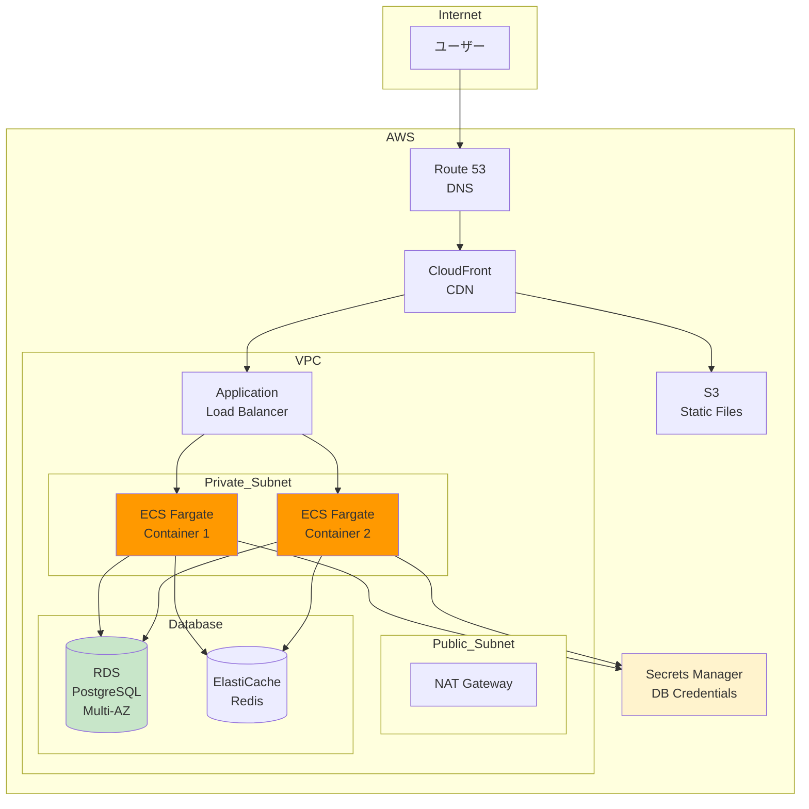

# 2.3.9.1 システム構成図（詳細）

## 目的

システム構成図（技術詳細レベル）のMermaid記述パターンを提供します。

---

## 📊 AWS構成例

```mermaid
flowchart TB
    subgraph Internet
        User[ユーザー]
    end

    subgraph AWS
        Route53[Route 53<br/>DNS]
        CloudFront[CloudFront<br/>CDN]

        subgraph VPC
            ALB[Application<br/>Load Balancer]

            subgraph Public_Subnet
                NAT[NAT Gateway]
            end

            subgraph Private_Subnet
                ECS1[ECS Fargate<br/>Container 1]
                ECS2[ECS Fargate<br/>Container 2]
            end

            subgraph Database
                RDS[(RDS<br/>PostgreSQL<br/>Multi-AZ)]
                Redis[(ElastiCache<br/>Redis)]
            end
        end

        S3[S3<br/>Static Files]
        Secrets[Secrets Manager<br/>DB Credentials]
    end

    User --> Route53
    Route53 --> CloudFront
    CloudFront --> ALB
    CloudFront --> S3
    ALB --> ECS1
    ALB --> ECS2
    ECS1 --> RDS
    ECS2 --> RDS
    ECS1 --> Redis
    ECS2 --> Redis
    ECS1 --> Secrets
    ECS2 --> Secrets

    style ECS1 fill:#ff9900
    style ECS2 fill:#ff9900
    style RDS fill:#c8e6c9
    style Secrets fill:#fff3cd
```

---

**作成日**: 2025-10-19
**対象フェーズ**: 設計
**重要度**: ⭐⭐⭐ 必須
