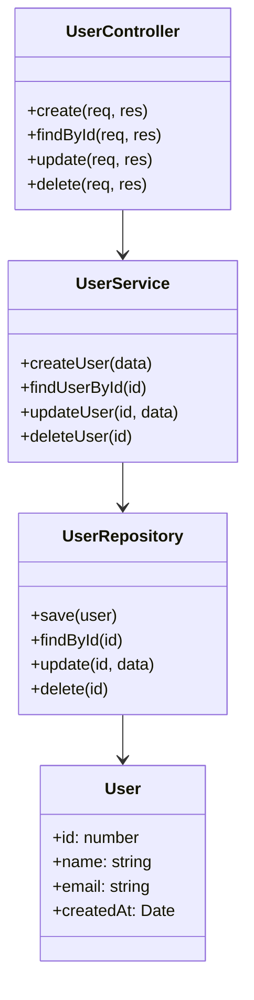

# 2.3.9.2 クラス図パターン

## 目的

クラス図のMermaid記述パターンを提供します。

---

## 📊 レイヤードアーキテクチャ例

```mermaid
classDiagram
    class UserController {
        +create(req, res)
        +findById(req, res)
        +update(req, res)
        +delete(req, res)
    }

    class UserService {
        +createUser(data)
        +findUserById(id)
        +updateUser(id, data)
        +deleteUser(id)
    }

    class UserRepository {
        +save(user)
        +findById(id)
        +update(id, data)
        +delete(id)
    }

    class User {
        +id: number
        +name: string
        +email: string
        +createdAt: Date
    }

    UserController --> UserService
    UserService --> UserRepository
    UserRepository --> User
```

---

**作成日**: 2025-10-19
**対象フェーズ**: 設計
**重要度**: ⭐⭐ 推奨
