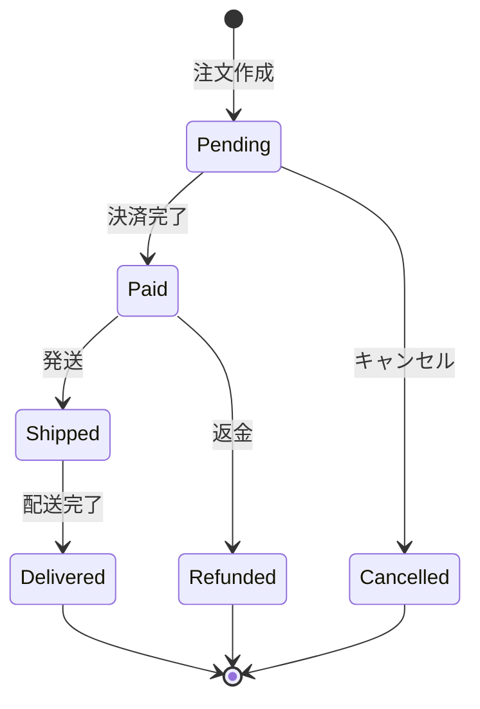

# 2.3.9.4 状態遷移図パターン

## 目的

状態遷移図のMermaid記述パターンを提供します。

---

## 📊 注文状態遷移例

```mermaid
stateDiagram-v2
    [*] --> Pending: 注文作成
    Pending --> Paid: 決済完了
    Pending --> Cancelled: キャンセル
    Paid --> Shipped: 発送
    Shipped --> Delivered: 配送完了
    Delivered --> [*]
    Cancelled --> [*]

    Paid --> Refunded: 返金
    Refunded --> [*]
```

---

**作成日**: 2025-10-19
**対象フェーズ**: 設計
**重要度**: ⭐⭐ 推奨
