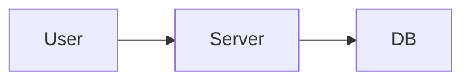
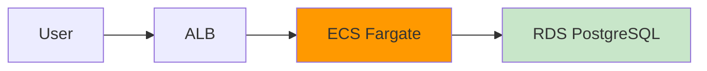

# 2.3.9.5 Good_Bad_Example集（Mermaid図）

## 目的

設計フェーズのMermaid図のGood/Bad例を提供します。

---

## ❌ Bad Example: 技術詳細が不足

**問題点:**
- 具体的なAWSサービス名がない
- ネットワーク構成が不明

---

## ✅ Good Example: 技術詳細を明記

**改善点:**
- 具体的なAWSサービス名を明記
- 色分けで視認性向上

---

**作成日**: 2025-10-19
**対象フェーズ**: 設計
**重要度**: ⭐⭐ 推奨
