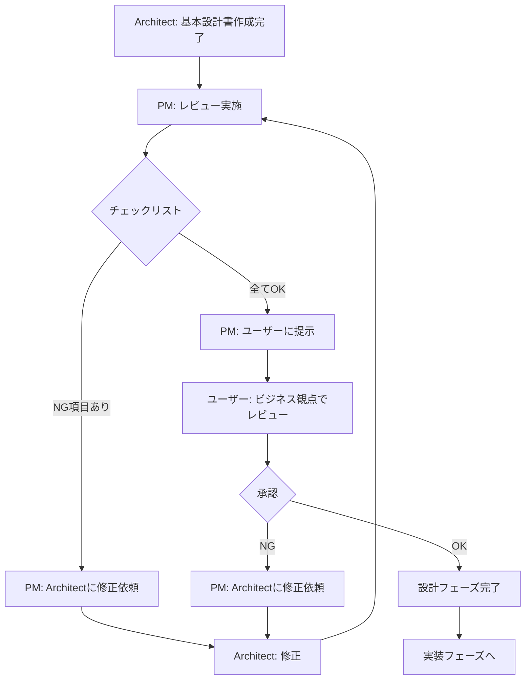

# 2.3.11 設計書レビュープロセス

## 📋 概要

**目的**: 設計書の不備による実装フェーズでの独自判断・技術標準違反を防ぐ

**背景**:
- 設計書にディレクトリ構成が未記載 → 実装者が独自判断で production/, staging/ フォルダを作成
- 設計書と技術標準が不整合 → 実装者が技術標準を参照せず設計書のみで実装
- レビュー時に技術標準との照合を怠る → 不完全な設計書が承認される

**影響**:
- ✅ ゲート品質向上
- ✅ 後戻り防止
- ✅ 技術標準準拠の徹底

---

## 🎯 レビュータイミング

### 1. Architect 提出時（PM レビュー）

**タイミング**: Architect が基本設計書（13ファイル）を作成完了した直後

**レビュー担当**: PM（オーケストレーター）

**目的**: ユーザー提示前に技術的な不備をキャッチ

### 2. ユーザー承認時

**タイミング**: PM がユーザーに基本設計書を提示するとき

**レビュー担当**: ユーザー（ビジネス観点）

**目的**: ビジネス要件との整合性、コスト、スコープ確認

---

## 📊 PM レビューチェックリスト

### 1. 設計書完全性チェック

#### ✅ ディレクトリ構成の明記（IaC使用時は必須）

- [ ] **CloudFormation/Terraform使用時**: ディレクトリ構成が明記されているか？
  - `templates/` の配置
  - `parameters/` の配置
  - `stacks/` の配置
  - 環境別の管理方法（テンプレート共通 + パラメータで差分管理）

**確認方法**:
設計書（例: `10_CloudFormation構成方針.md`）に以下の記載があるか確認：

```markdown
## ディレクトリ構成

### 推奨構成（技術標準準拠）

\```
infra/cloudformation/
├── stacks/          # デプロイ単位（親スタック）
├── templates/       # 再利用可能なテンプレート（環境共通）⭐
└── parameters/      # 環境差分を集約 ⭐
    ├── production.json
    └── staging.json
\```

### 重要原則
- ✅ テンプレートは環境共通（`templates/`）
- ✅ 環境差分はパラメーターで管理（`parameters/`）
- ❌ 環境別にテンプレートを複製しない
```

**NG例**（設計書に記載なし）:
- パラメータファイルの配置のみ記載
- テンプレートの配置場所が未記載
- 環境別管理方法が曖昧

#### ✅ 技術標準との整合性確認

- [ ] 使用する技術の標準ドキュメント（`.claude/docs/40_standards/`）が参照されているか？
- [ ] 設計書の内容が技術標準に準拠しているか？
- [ ] 技術標準と異なる設計をする場合、ADRで理由が記載されているか？

**確認方法**:
1. 設計書で使用している技術を特定（例: CloudFormation）
2. 対応する技術標準（`.claude/docs/40_standards/42_infra/iac/cloudformation.md`）を開く
3. 設計書の記述と技術標準を照合

**NG例**:
- 技術標準では `templates/` + `parameters/` を推奨しているのに、設計書では `production/`, `staging/` を使用
- 理由の記載なし（ADRなし）

#### ✅ 環境差分管理の明確化

- [ ] 環境別（dev/stg/prd）の差分をどう管理するか明記されているか？
  - パラメータファイルで管理
  - 環境変数で管理
  - Terraformワークスペースで管理
  - など

**確認方法**:
設計書に環境差分管理の方針が明記されているか確認。

**OK例**:
```markdown
## 環境差分管理

### 管理方針
- テンプレートは環境共通（templates/）
- 環境差分はパラメータファイルで管理（parameters/production.json, parameters/staging.json）

### パラメータ例
- VPC CIDR: production = 10.0.0.0/16, staging = 10.1.0.0/16
- RDS インスタンスタイプ: production = db.r5.large, staging = db.t3.small
```

**NG例**:
- 「環境別に管理します」（具体的な方法が不明）
- 記載なし

#### ✅ 実装者向けガイドの記載

- [ ] 実装開始時に参照すべきドキュメントが明記されているか？
  - 技術標準のパス
  - サンプルコードの場所
  - ディレクトリ構成の図

**確認方法**:
設計書に「実装時の参照ドキュメント」セクションがあるか確認。

**OK例**:
```markdown
## 実装時の参照ドキュメント

### 技術標準
- `.claude/docs/40_standards/42_infra/iac/cloudformation.md`（CloudFormation技術標準）
- `.claude/docs/40_standards/49_common/security.md`（セキュリティ標準）

### サンプルコード
- `.claude/templates/cloudformation/`（CloudFormationテンプレートサンプル）

### ディレクトリ構成
[上記の「ディレクトリ構成」セクション参照]
```

**NG例**:
- 記載なし
- 「技術標準を参照してください」（具体的なパスが不明）

---

### 2. ADR（技術選定理由）の明確性チェック

- [ ] 技術選定の理由が明記されているか？
- [ ] 代替案との比較が記載されているか？
- [ ] トレードオフ（メリット・デメリット）が明記されているか？

**確認方法**:
ADRファイルを確認（例: `docs/03_基本設計/ADR/ADR-001.md`）

**OK例**:
```markdown
# ADR-001: データベースにPostgreSQLを採用

## ステータス
採用

## コンテキスト
トランザクション整合性が必要な注文システム

## 決定
PostgreSQL 15 を採用

## 理由
1. ACID保証が必須
2. JSON型サポート
3. RDSでマネージド運用可能

## 代替案
- MySQL: JSON型サポートが弱い
- DynamoDB: ACID保証なし

## 結果
トランザクション整合性を確保できた
```

**NG例**:
- 「PostgreSQLを採用します」（理由なし）
- 代替案の記載なし

---

### 3. システム構成図の正確性チェック

- [ ] Mermaid図/draw.io図は技術的に正確か？
- [ ] コンポーネント間の関係は正しいか？
- [ ] ネットワーク構成に誤りはないか？

**確認方法**:
システム構成図を目視確認。

**NG例**:
- NAT Gateway がプライベートサブネットに配置されている（パブリックサブネットが正しい）
- ALB がプライベートサブネットに配置されている（パブリックサブネットが正しい）

---

### 4. アーキテクチャ設計の整合性チェック

- [ ] 13ファイル間で矛盾はないか？
- [ ] VPC CIDR、サブネット設計等の整合性は取れているか？

**確認方法**:
複数の設計書を照合。

**NG例**:
- `01_システムアーキテクチャ.md` では VPC CIDR = 10.0.0.0/16
- `02_ネットワーク設計.md` では VPC CIDR = 10.1.0.0/16
- → 不一致

---

## 🚨 レビュー結果のフォーマット

### PM → Architect へのフィードバック

```markdown
## 基本設計書レビュー結果

### 設計書完全性チェック
✅ ディレクトリ構成: 明記あり（`10_CloudFormation構成方針.md` L50-70）
✅ 技術標準との整合性: CloudFormation技術標準に準拠
✅ 環境差分管理: パラメータファイルで管理（明記あり）
❌ 実装者向けガイド: 技術標準パスが未記載

### ADR の明確性
✅ ADR-001〜006: 理由明確
⚠️ ADR-007: ダウンタイム許容の根拠が弱い

### システム構成図の正確性
❌ Mermaid図: NAT Gateway の配置が誤っている（プライベートサブネットではなくパブリックサブネット）

### 整合性チェック
❌ 01_システムアーキテクチャ と 02_ネットワーク設計 でVPC CIDRが不一致

---

**修正依頼事項**:
1. `10_CloudFormation構成方針.md` に実装時の参照ドキュメントを追記
2. ADR-007 にダウンタイム許容の根拠を追記
3. Mermaid図のNAT Gateway配置を修正
4. VPC CIDR を統一（10.0.0.0/16 に統一してください）

修正後、再提出をお願いします。
```

---

## 🔄 レビューフロー



---

## 📊 レビュープロセスのメリット

### ✅ 技術標準違反の防止

設計書レビュー時に技術標準との照合を徹底することで、実装フェーズでの技術標準違反を防ぐ。

### ✅ 後戻りの防止

設計書の不備を実装前に発見することで、実装後の大幅な手戻りを防ぐ。

### ✅ 実装者の迷いを防ぐ

設計書にディレクトリ構成等が明記されていることで、実装者が独自判断で誤った実装をすることを防ぐ。

---

## 🔗 関連ドキュメント

- [Architect AGENT.md](../../agents/architect/AGENT.md) - 設計書完全性チェックリスト
- [技術標準](../40_standards/) - 各技術の標準ドキュメント

---

**作成日**: 2025-11-09
**対象フェーズ**: 設計フェーズ
**対象エージェント**: PM, Architect
