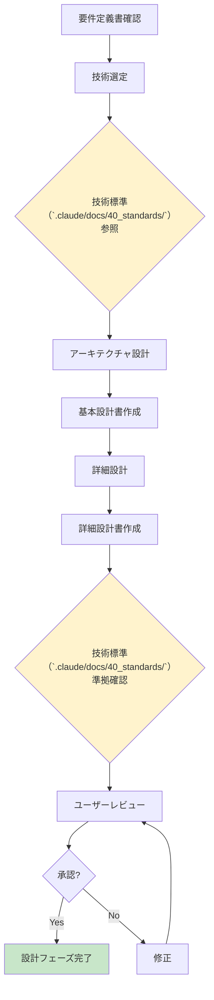

# 2.3.1 設計フェーズ - フェーズ概要

## 目的

**設計フェーズの目的を明確にし、実施すべき活動とアウトプットを定義します。**

このフェーズで「**どう作るか**」を決定します。

---

## 🎯 フェーズの目的

### メインゴール

**要件定義書をもとに、「どのように実装するか」の青写真を描く**

### 具体的には

1. **技術スタックの決定**
   - プログラミング言語、フレームワーク
   - データベース
   - インフラ（AWS/GCP/オンプレミス）

2. **アーキテクチャの決定**
   - モノリス vs マイクロサービス
   - レイヤードアーキテクチャ
   - API設計方針（REST/GraphQL）

3. **詳細設計**
   - クラス設計・モジュール設計
   - データベーススキーマ設計
   - API仕様書作成
   - インフラ設計

4. **技術標準（`.claude/docs/40_standards/`）への準拠確認** ⭐⭐⭐
   - 選定した技術が技術標準に準拠しているか確認
   - 実装フェーズでの規約違反を防ぐ

---

## 📥 インプット（このフェーズで参照するもの）

### 必須インプット

1. **要件定義書**
   - 機能一覧
   - 画面遷移図
   - データモデル（ER図）
   - 非機能要件（性能、可用性、セキュリティ、運用）
   - 外部連携仕様

2. **企画書**
   - プロジェクトゴール
   - 制約条件（予算、納期）

3. **技術標準（`.claude/docs/40_standards/`）** ⭐⭐⭐
   - `4.3 CloudFormation規約`
   - `4.4 Terraform規約`
   - `4.5 Python規約`
   - `4.6 Node.js/TypeScript規約`
   - `4.7 C# .NET Core規約`
   - `4.8 Go言語規約`
   - `4.9 セキュリティ・運用基準`（全プロジェクト必須）

### 任意インプット

- チームの技術習熟度
- 既存システムとの連携要件
- 社内標準・規約

---

## 📤 アウトプット（このフェーズで作成するもの）

### 必須アウトプット

1. **基本設計書**
   - システム概要
   - アーキテクチャ設計
   - 技術スタック選定理由
   - **参照した技術標準（`.claude/docs/40_standards/`）** ⭐
   - システム構成図
   - データフロー図
   - ER図（詳細版）
   - API設計方針
   - セキュリティ設計
   - 運用設計
   - インフラ設計
   - 非機能要件への対応方針

2. **詳細設計書**
   - モジュール設計
   - ディレクトリ構成
   - クラス設計・モジュール設計
   - API仕様書（エンドポイント一覧、リクエスト/レスポンス仕様）
   - データベース設計（テーブル定義、インデックス設計）
   - シーケンス図（処理フロー）
   - 状態遷移図
   - エラーハンドリング設計
   - ログ設計

3. **技術選定ドキュメント**
   - 選定した技術スタック
   - 選定理由
   - **技術標準（`.claude/docs/40_standards/`）との整合性確認結果** ⭐
   - 代替案との比較

4. **Mermaid図集**
   - システム構成図（詳細）
   - クラス図
   - シーケンス図（技術詳細）
   - 状態遷移図

---

## 🏃 主要活動

### 1. 技術選定

**実施内容:**
- 要件定義書の非機能要件を確認
- 技術候補の抽出
- **技術標準（`.claude/docs/40_standards/`）の参照** ⭐⭐⭐
- 技術選定の決定
- 選定理由のドキュメント化

**成果物:**
- 技術選定ドキュメント

---

### 2. アーキテクチャ設計

**実施内容:**
- アーキテクチャパターンの選定（モノリス/マイクロサービス等）
- レイヤー構成の決定（プレゼンテーション層、ビジネスロジック層、データアクセス層）
- API設計方針の決定（REST/GraphQL/gRPC）
- データフロー設計

**成果物:**
- アーキテクチャ設計書（基本設計書の一部）
- システム構成図
- データフロー図

---

### 3. データベース設計

**実施内容:**
- 論理設計（ER図の詳細化）
- 物理設計（テーブル定義、データ型、制約）
- インデックス設計
- パーティショニング戦略

**成果物:**
- データベース設計書（詳細設計書の一部）
- ER図（詳細版）
- テーブル定義書

---

### 4. API設計

**実施内容:**
- エンドポイント一覧作成
- リクエスト/レスポンス仕様定義
- エラーレスポンス定義
- 認証・認可方式の決定

**成果物:**
- API仕様書（詳細設計書の一部）

---

### 5. セキュリティ設計

**実施内容:**
- **技術標準 `4.9 セキュリティ・運用基準` の参照** ⭐⭐⭐必須
- 認証・認可設計
- データ暗号化設計（転送中・保管中）
- シークレット管理設計
- ネットワークセキュリティ設計
- 監査ログ設計

**成果物:**
- セキュリティ設計書（基本設計書の一部）
- セキュリティ設計チェックリスト（完了）

---

### 6. インフラ設計

**実施内容:**
- インフラ選定（AWS/GCP/Azure/オンプレミス）
- **技術標準 `4.3 CloudFormation規約` または `4.4 Terraform規約` の参照** ⭐
- ネットワーク設計（VPC、サブネット、セキュリティグループ）
- コンピューティング設計（ECS/Lambda/EC2）
- データベース設計（RDS/Aurora/DynamoDB）
- ストレージ設計（S3）
- 監視・ログ設計

**成果物:**
- インフラ設計書（基本設計書の一部）
- システム構成図（詳細）

---

### 7. 詳細設計

**実施内容:**
- クラス設計・モジュール設計
- ディレクトリ構成の決定
- **技術標準（`.claude/docs/40_standards/`）の参照**（言語規約に準拠したディレクトリ構成）
- シーケンス図作成（処理フロー）
- 状態遷移図作成
- エラーハンドリング設計
- ログ設計

**成果物:**
- 詳細設計書

---

### 8. ドキュメントレビュー・承認

**実施内容:**
- AIによる自己レビュー
- **技術標準（`.claude/docs/40_standards/`）準拠確認** ⭐
- ユーザーレビュー
- 修正・再レビュー
- ユーザー承認取得

**成果物:**
- 承認済み基本設計書
- 承認済み詳細設計書

---

## 🔄 フェーズの流れ



---

## ⚖️ このフェーズで決めること / 決めないこと

### ✅ このフェーズで決めること

1. **技術スタック**
   - プログラミング言語
   - フレームワーク
   - データベース
   - インフラ（クラウドベンダー、サービス）

2. **アーキテクチャ**
   - アーキテクチャパターン（モノリス/マイクロサービス）
   - レイヤー構成
   - API設計方針

3. **詳細設計**
   - クラス設計・モジュール設計
   - データベーススキーマ
   - API仕様
   - ディレクトリ構成

4. **セキュリティ設計**
   - 認証・認可方式
   - データ暗号化方式
   - シークレット管理方式

5. **インフラ設計**
   - ネットワーク構成
   - コンピューティングリソース
   - ストレージ構成

---

### ❌ このフェーズで決めないこと

1. **実装の詳細**
   - 具体的なコード
   - ライブラリの細かい使い方
   → 実装フェーズで決定

2. **テストコード**
   - テストケースの詳細
   - テストコードの実装
   → テストフェーズで決定

---

## 🔑 技術標準（`.claude/docs/40_standards/`）の参照 ⭐⭐⭐

### なぜ設計フェーズで参照するのか

**理由:** 実装フェーズで規約違反のコードを生成しないため

**フロー:**
```
要件定義 → 技術選定 → 技術標準（`.claude/docs/40_standards/`）確認 → 実装
                      ⬆ ここで参照！
```

### 参照タイミング

| タイミング | 参照する技術標準ファイル | 目的 |
|-----------|---------------------|------|
| 技術選定時 | 4.5/4.6/4.7/4.8（言語規約） | 制約・規約の確認 |
| 技術選定時 | 4.3/4.4（インフラ規約） | インフラ制約の確認 |
| 設計書作成時 | 4.9（セキュリティ・運用基準） | セキュリティ設計の確認 |
| 設計レビュー時 | すべての該当ページ | 規約準拠の最終確認 |

### 参照結果の記録

設計書に以下を明記：
```markdown
## 参照した技術標準（`.claude/docs/40_standards/`）

- **4.6 Node.js/TypeScript規約** ⭐
  - TypeScript + Express を選定
  - ディレクトリ構成は技術標準に準拠
  - linter/formatter設定も技術標準に準拠

- **4.9 セキュリティ・運用基準** ⭐⭐⭐
  - 認証: JWT + bcrypt（技術標準推奨）
  - 暗号化: TLS 1.3 + AES-256（技術標準推奨）
  - シークレット管理: AWS Secrets Manager（技術標準推奨）
```

---

## 📊 完了基準

### このフェーズを完了してよい条件

- [ ] 技術スタックが決定している
- [ ] **技術標準（`.claude/docs/40_standards/`）との整合性を確認済み** ⭐⭐⭐
- [ ] アーキテクチャが決定している
- [ ] 基本設計書が作成されている
- [ ] 詳細設計書が作成されている
- [ ] データベーススキーマが確定している
- [ ] API仕様が確定している
- [ ] セキュリティ設計が完了している（技術標準 `4.9` 準拠）
- [ ] インフラ設計が完了している
- [ ] ユーザー承認を取得している

---

## 🔗 次フェーズへの引継ぎ

### 実装フェーズで必要な情報

1. **基本設計書**
2. **詳細設計書**
3. **技術スタック情報**
4. **参照すべき技術標準（`.claude/docs/40_standards/`）のリスト** ⭐⭐⭐
5. **データベーススキーマ**
6. **API仕様書**
7. **ディレクトリ構成**

詳細は [2.3.11_次フェーズへの引継ぎ事項.md](./2.3.11_次フェーズへの引継ぎ事項.md) を参照。

---

## 📚 関連ドキュメント

- [2.3.2 アーキテクチャ選定プロセス](./2.3.2_アーキテクチャ選定プロセス.md)
- [2.3.3 技術標準参照ガイド](./2.3.3_技術標準参照ガイド.md) ⭐⭐⭐最重要
- [2.3.4 決定事項チェックリスト](./2.3.4_決定事項チェックリスト.md)
- [2.3.5 製造物_基本設計書構成](./2.3.5_製造物_基本設計書構成.md)
- [2.3.6 製造物_詳細設計書構成](./2.3.6_製造物_詳細設計書構成.md)

---

**作成日**: 2025-10-19
**対象フェーズ**: 設計
**重要度**: ⭐⭐⭐ 必須（フェーズの全体像）
