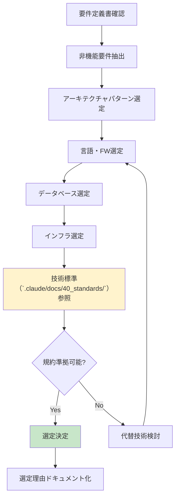
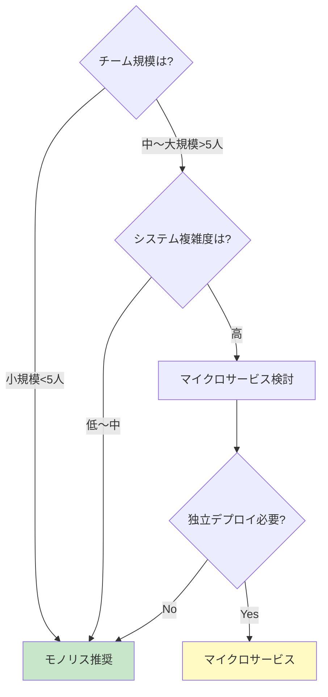
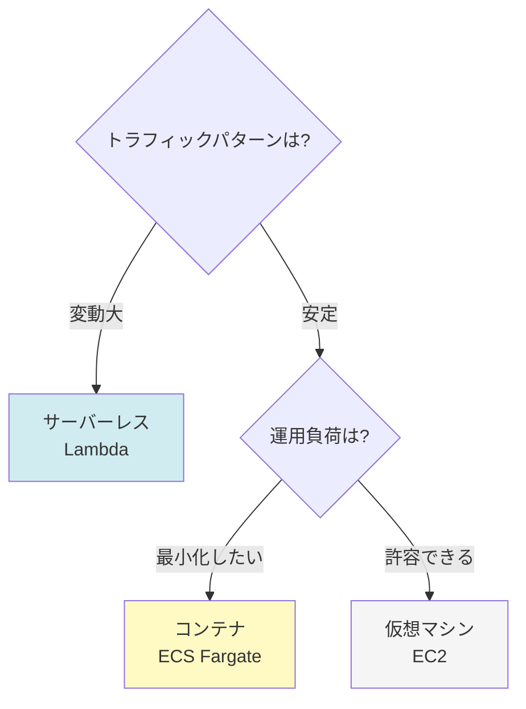
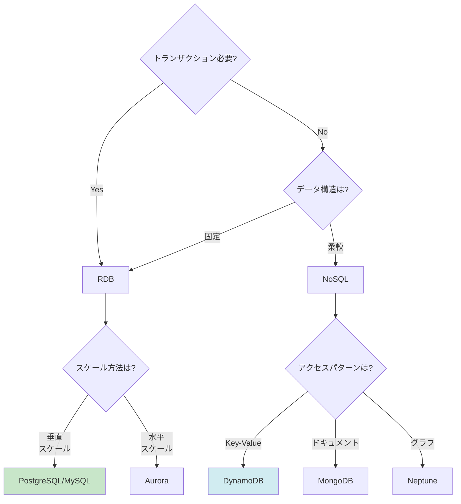
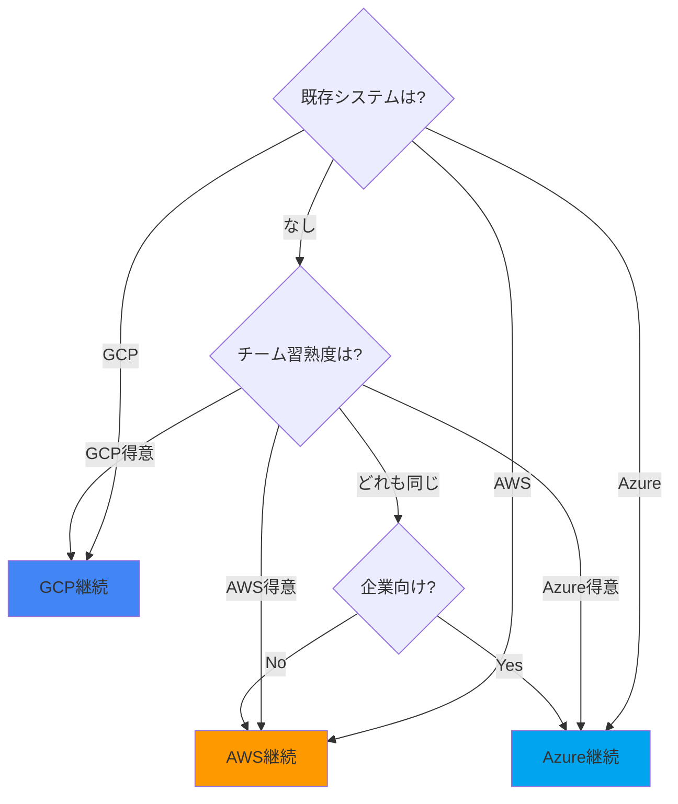

# 2.3.2 アーキテクチャ選定プロセス

## 目的

要件定義書をもとに、**技術スタック・アーキテクチャを選定する方法**を定義します。

---

## 🔄 選定フロー全体像



---

## 📋 要件から技術選定へのマッピング

### 非機能要件 → インフラ選定

| 非機能要件 | 推奨インフラ | 理由 |
|-----------|-------------|------|
| 同時アクセス < 100 | 小規模構成（EC2 1台） | コスト効率 |
| 同時アクセス 100～1000 | 中規模構成（ALB + EC2複数台） | スケーラビリティ |
| 同時アクセス > 1000 | 大規模構成（ECS/EKS） | 高スケーラビリティ |
| 稼働率 99.9%以上 | マルチAZ構成 | 高可用性 |
| グローバル展開 | CloudFront + マルチリージョン | 低レイテンシ |

### データ要件 → データベース選定

| データ要件 | 推奨データベース | 理由 |
|-----------|----------------|------|
| トランザクション必須 | PostgreSQL/MySQL（RDS） | ACID特性 |
| 大量データ・高速読み取り | DynamoDB | スケーラビリティ |
| 全文検索 | Elasticsearch | 検索性能 |
| キャッシュ | Redis（ElastiCache） | 高速アクセス |

### 外部連携要件 → API設計方針

| 外部連携要件 | 推奨API設計 | 理由 |
|-------------|------------|------|
| RESTful API | REST | 標準的・シンプル |
| リアルタイム通信 | WebSocket | 双方向通信 |
| 複雑なクエリ | GraphQL | 柔軟なデータ取得 |
| マイクロサービス間通信 | gRPC | 高性能・型安全 |

---

## 🏗️ アーキテクチャパターン選定

### モノリス vs マイクロサービス



**判断基準:**
- **モノリス推奨**:
  - チーム規模: 小規模（5人以下）
  - システム複雑度: 低～中
  - 独立デプロイ不要
  - 開発速度重視

- **マイクロサービス推奨**:
  - チーム規模: 大規模（5人以上）
  - システム複雑度: 高
  - 独立デプロイ必要
  - スケーラビリティ重視

---

### サーバーレス vs コンテナ vs 仮想マシン



**判断基準:**
- **Lambda（サーバーレス）**:
  - トラフィック変動大
  - コールドスタート許容
  - イベント駆動処理

- **ECS Fargate（コンテナ）**:
  - トラフィック安定
  - 運用負荷最小化
  - Docker経験あり

- **EC2（仮想マシン）**:
  - カスタマイズ必要
  - 既存資産あり
  - 運用ノウハウあり

---

## 💻 言語・フレームワーク選定基準

### 選定基準の優先順位

1. **技術標準（`.claude/docs/40_standards/`）への準拠** ⭐⭐⭐
2. チーム習熟度
3. エコシステム
4. 性能要件
5. 保守性

### 言語選定マトリクス

| 言語 | 得意分野 | 技術標準 | 推奨FW |
|------|---------|-----------|--------|
| Python | API、データ処理、AI/ML | 4.5 Python規約 | FastAPI, Django |
| TypeScript | フロントエンド、API | 4.6 TypeScript規約 | Express, NestJS |
| C# | エンタープライズ、Windows | 4.7 C# .NET Core規約 | ASP.NET Core |
| Go | マイクロサービス、高性能 | 4.8 Go言語規約 | Gin, Echo |

---

## 🗄️ データベース選定基準

### RDB vs NoSQL



### 選定マトリクス

| データベース | 用途 | トランザクション | スケーラビリティ |
|------------|------|----------------|----------------|
| PostgreSQL | 汎用RDB | ✅ | 中 |
| MySQL | 汎用RDB | ✅ | 中 |
| Aurora | 高性能RDB | ✅ | 高 |
| DynamoDB | NoSQL | ❌ | 高 |
| ElastiCache（Redis） | キャッシュ | ❌ | 高 |

---

## ☁️ インフラ選定（AWS/GCP/Azure）

### クラウドベンダー選定基準



### CloudFormation vs Terraform

| 項目 | CloudFormation | Terraform |
|------|---------------|-----------|
| 技術標準 | 4.3 CloudFormation規約 | 4.4 Terraform規約 |
| 対応クラウド | AWS専用 | マルチクラウド |
| 学習コスト | 低 | 中 |
| 状態管理 | AWS管理 | 自己管理 |
| 推奨ケース | AWS専用 | マルチクラウド |

---

## 📝 選定結果の記録方法

### テンプレート

```markdown
# 技術選定ドキュメント

## 選定日
2025-10-19

## 選定した技術スタック

### バックエンド
- **選定技術**: TypeScript + Express
- **選定理由**:
  1. 技術標準（`.claude/docs/40_standards/`）に準拠（4.6 TypeScript規約）
  2. チーム習熟度が高い
  3. エコシステムが充実（npm）
  4. 非機能要件（レスポンスタイム 3秒以内）を満たせる
- **代替案**: Python（FastAPI）
- **代替案を選ばなかった理由**: チーム習熟度がTypeScriptのほうが高い

### データベース
- **選定技術**: PostgreSQL（AWS RDS）
- **選定理由**:
  1. トランザクション要件を満たせる
  2. 信頼性が高い
  3. AWSマネージドサービスで運用負荷削減
- **代替案**: MySQL
- **代替案を選ばなかった理由**: PostgreSQLのほうが機能豊富

### インフラ
- **選定技術**: AWS + CloudFormation
- **選定理由**:
  1. AWS専用のため、CloudFormationが最適
  2. 技術標準（`.claude/docs/40_standards/`）に準拠（4.3 CloudFormation規約）
  3. Infrastructure as Code で再現性確保
- **代替案**: Terraform
- **代替案を選ばなかった理由**: AWS専用なのでCloudFormationで十分

## 参照した技術標準（`.claude/docs/40_standards/`） ⭐

- 4.6 Node.js/TypeScript規約
- 4.3 CloudFormation規約
- 4.9 セキュリティ・運用基準（必須）

## 非機能要件への対応

| 非機能要件 | 対応方針 |
|-----------|---------|
| レスポンスタイム 3秒以内 | Redis（ElastiCache）でキャッシュ |
| 同時アクセス 100ユーザー | ALB + EC2 x2（オートスケーリング） |
| 稼働率 99.9% | マルチAZ構成 |
```

---

## 🎯 Good/Bad Example

### ❌ Bad Example

```markdown
## 選定した技術スタック
- バックエンド: TypeScript
- データベース: PostgreSQL
- インフラ: AWS
```

**問題点:**
- 選定理由がない
- 技術標準（`.claude/docs/40_standards/`）への言及がない
- 非機能要件への対応が不明

---

### ✅ Good Example

```markdown
## 選定した技術スタック

### バックエンド
- **選定技術**: TypeScript + Express
- **選定理由**:
  1. **技術標準（`.claude/docs/40_standards/`）に準拠（4.6 TypeScript規約）** ⭐
  2. チーム習熟度が高い
  3. 非機能要件を満たせる

### 参照した技術標準（`.claude/docs/40_standards/`）
- 4.6 Node.js/TypeScript規約
- 4.9 セキュリティ・運用基準
```

**改善点:**
- 選定理由を明記
- 技術標準（`.claude/docs/40_standards/`）への準拠を確認
- 非機能要件への対応を考慮

---

## 📚 関連ドキュメント

- [2.3.1 フェーズ概要](./2.3.1_フェーズ概要.md)
- [2.3.3 技術標準参照ガイド](./2.3.3_技術標準参照ガイド.md)
- [2.3.7 インフラ設計パターン選定](./2.3.7_インフラ設計パターン選定.md)

---

**作成日**: 2025-10-19
**対象フェーズ**: 設計
**重要度**: ⭐⭐⭐ 必須（技術選定の方法論）
