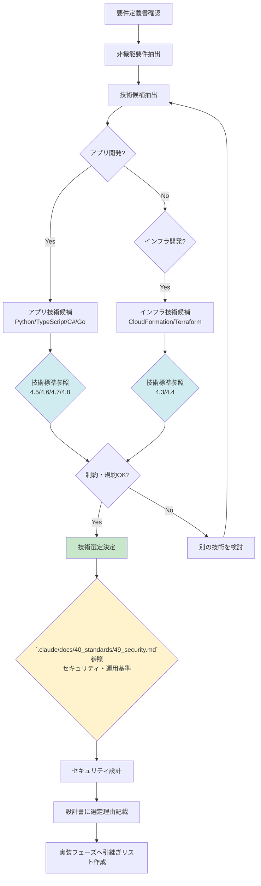

# 2.3.3 技術標準参照ガイド

## 目的

**技術標準（`.claude/docs/40_standards/`）をいつ・どう参照するかを定義します。**

このドキュメントは**設計フェーズの要**です。⭐⭐⭐

---

## 🎯 なぜ技術標準（`.claude/docs/40_standards/`）を参照するのか

### 問題: 技術標準を参照しないと

```
設計フェーズで技術選定
  ↓
実装フェーズでコード生成
  ↓
❌ 技術標準に違反したコードが生成される
  ↓
❌ 後から修正が大変
  ↓
❌ 品質低下・納期遅延
```

### 解決: 技術標準を参照すると

```
設計フェーズで技術選定
  ↓
技術標準（`.claude/docs/40_standards/`）を参照 ⭐
  ↓
規約に準拠した技術を選定
  ↓
実装フェーズで技術標準に準拠したコード生成
  ↓
✅ 品質の高いコードが生成される
  ↓
✅ 後から修正不要
  ↓
✅ スムーズな納品
```

---

## 📋 参照すべき技術標準ファイル一覧

### アプリケーション開発の場合

| 技術標準 | 選定技術 | 参照タイミング |
|-----------|---------|---------------|
| **4.5 Python規約** | Python（FastAPI/Django/Flask） | Python選定時 |
| **4.6 Node.js/TypeScript規約** | Node.js/TypeScript（Express/NestJS） | TypeScript選定時 |
| **4.7 C# .NET Core規約** | C# .NET Core | C#選定時 |
| **4.8 Go言語規約** | Go | Go選定時 |

### インフラ開発の場合

| 技術標準 | 選定技術 | 参照タイミング |
|-----------|---------|---------------|
| **4.3 CloudFormation規約** | AWS CloudFormation | CloudFormation選定時 |
| **4.4 Terraform規約** | Terraform | Terraform選定時 |

### セキュリティ（全プロジェクト必須）

| 技術標準 | 適用対象 | 参照タイミング |
|-----------|---------|---------------|
| **4.9 セキュリティ・運用基準** ⭐⭐⭐ | **全プロジェクト** | セキュリティ設計時（必須） |

---

## 🔄 技術選定フロー（技術標準参照含む）



---

## ⏰ 参照タイミング

### 1. 技術候補抽出後（設計フェーズ前半）

**やること:**
- 要件定義書から非機能要件を確認
- 技術候補を2～3つ抽出
- **技術標準（`.claude/docs/40_standards/`）を参照** ⭐

**参照例:**
```
要件: 「APIサーバーを開発する」
  ↓
技術候補: Python（FastAPI）, TypeScript（Express）
  ↓
技術標準参照: 4.5 Python規約, 4.6 TypeScript規約
  ↓
制約確認: ディレクトリ構成、linter/formatter設定
  ↓
選定: TypeScript（Express）← チーム習熟度が高い
```

---

### 2. 技術選定前（制約確認）

**やること:**
- 技術標準の制約を確認
- チーム習熟度と照らし合わせ
- 実現可能性を判断

**確認項目:**
- [ ] ディレクトリ構成が技術標準に準拠できるか
- [ ] linter/formatter設定が技術標準に準拠できるか
- [ ] 推奨ライブラリが利用可能か
- [ ] セキュリティ基準（4.9）を満たせるか

---

### 3. 設計書作成時（規約準拠確認）

**やること:**
- 設計書に技術標準準拠を明記
- 具体的な規約項目を記載

**設計書の記載例:**
```markdown
## 3.3 参照した技術標準（`.claude/docs/40_standards/`）

### 4.6 Node.js/TypeScript規約 ⭐
- TypeScript + Express を選定
- ディレクトリ構成: 技術標準に準拠（src/ → controllers/, services/, models/）
- linter: ESLint（技術標準推奨設定）
- formatter: Prettier（技術標準推奨設定）
- パッケージマネージャー: npm（技術標準推奨）

### 4.9 セキュリティ・運用基準 ⭐⭐⭐
- 認証: JWT + bcrypt（技術標準推奨）
- 暗号化: TLS 1.3（転送中）、AES-256（保管中）
- シークレット管理: AWS Secrets Manager（技術標準推奨）
- 監査ログ: CloudWatch Logs（1年間保持、技術標準推奨）
```

---

### 4. 設計レビュー時（最終確認）

**やること:**
- AIによる自己レビュー
- 技術標準（`.claude/docs/40_standards/`）準拠の最終確認
- ユーザーへの報告

**レビュー項目:**
- [ ] 選定した技術が技術標準に準拠している
- [ ] 設計書に規約参照が明記されている
- [ ] セキュリティ設計が`.claude/docs/40_standards/49_security.md`に準拠している
- [ ] 実装フェーズへの引継ぎリストに技術標準が含まれている

---

## 📝 参照方法（具体例）

### ケース1: Python（FastAPI）を選定する場合

**手順:**

1. **要件確認**
   - 非機能要件: レスポンスタイム 3秒以内、同時アクセス 100ユーザー
   - 機能要件: REST API開発

2. **技術候補抽出**
   - Python（FastAPI）
   - TypeScript（Express）

3. **`.claude/docs/40_standards/41_python.md` Python規約を参照** ⭐
   - ディレクトリ構成を確認
   - linter/formatter設定を確認（ruff, black）
   - 推奨ライブラリを確認（FastAPI, SQLAlchemy, Pydantic）

4. **`.claude/docs/40_standards/49_security.md` セキュリティ・運用基準を参照** ⭐⭐⭐
   - 認証方式を確認（JWT + bcrypt）
   - 暗号化方式を確認（TLS 1.3, AES-256）
   - シークレット管理を確認（AWS Secrets Manager）

5. **技術選定決定**
   - Python（FastAPI）を選定
   - 選定理由: 技術標準が整備済み、チーム習熟度が高い

6. **設計書に記載**
   ```markdown
   ## 参照した技術標準（`.claude/docs/40_standards/`）
   - 4.5 Python規約
   - 4.9 セキュリティ・運用基準
   ```

7. **実装フェーズへの引継ぎリスト作成**
   ```markdown
   ## 実装フェーズで参照すべき技術標準
   - 4.5 Python規約 ⭐
   - 4.9 セキュリティ・運用基準 ⭐⭐⭐
   ```

---

### ケース2: AWS CloudFormationを選定する場合

**手順:**

1. **要件確認**
   - インフラ: AWS
   - 構成: VPC + ECS + RDS

2. **技術候補抽出**
   - CloudFormation
   - Terraform

3. **`.claude/docs/40_standards/45_cloudformation.md` CloudFormation規約を参照** ⭐
   - ディレクトリ構成を確認
   - テンプレート構成を確認（ネットワーク、コンピューティング、データベース分離）
   - パラメータストア使用を確認

4. **`.claude/docs/40_standards/49_security.md` セキュリティ・運用基準を参照** ⭐⭐⭐
   - VPC設計を確認（パブリック/プライベートサブネット）
   - セキュリティグループ設計を確認
   - シークレット管理を確認（AWS Secrets Manager）

5. **技術選定決定**
   - CloudFormation を選定
   - 選定理由: AWS専用、技術標準が整備済み

6. **設計書に記載**
   ```markdown
   ## 参照した技術標準（`.claude/docs/40_standards/`）
   - 4.3 CloudFormation規約
   - 4.9 セキュリティ・運用基準
   ```

7. **実装フェーズへの引継ぎリスト作成**
   ```markdown
   ## 実装フェーズで参照すべき技術標準
   - 4.3 CloudFormation規約 ⭐
   - 4.9 セキュリティ・運用基準 ⭐⭐⭐
   ```

---

## 🔍 参照結果の記録方法

### 設計書への記載例（基本設計書）

```markdown
# 3. アーキテクチャ設計

## 3.1 アーキテクチャパターン
- レイヤードアーキテクチャ（3層）

## 3.2 技術スタック選定理由

### バックエンド
- **選定技術**: TypeScript + Express
- **選定理由**:
  - チーム習熟度が高い
  - 技術標準（`.claude/docs/40_standards/`）に準拠（4.6 Node.js/TypeScript規約）
  - エコシステムが充実
  - 非機能要件（レスポンスタイム 3秒以内）を満たせる

### データベース
- **選定技術**: PostgreSQL（AWS RDS）
- **選定理由**:
  - トランザクション要件を満たせる
  - 信頼性が高い
  - AWSマネージドサービスで運用負荷を削減

### インフラ
- **選定技術**: AWS CloudFormation
- **選定理由**:
  - AWS専用のため、CloudFormationが最適
  - 技術標準（`.claude/docs/40_standards/`）に準拠（4.3 CloudFormation規約）
  - Infrastructure as Code で再現性を確保

## 3.3 参照した技術標準（`.claude/docs/40_standards/`） ⭐

### 4.6 Node.js/TypeScript規約
- ディレクトリ構成: 技術標準に準拠
  ```
  src/
  ├── controllers/
  ├── services/
  ├── models/
  ├── middlewares/
  └── utils/
  ```
- linter: ESLint（技術標準推奨設定）
- formatter: Prettier（技術標準推奨設定）
- パッケージマネージャー: npm

### 4.3 CloudFormation規約
- テンプレート構成: ネットワーク/コンピューティング/データベース分離
- パラメータストア使用: あり
- ディレクトリ構成: 技術標準に準拠
  ```
  cloudformation/
  ├── network.yaml
  ├── compute.yaml
  ├── database.yaml
  └── parameters.json
  ```

### 4.9 セキュリティ・運用基準 ⭐⭐⭐
- 認証: JWT + bcrypt
- 暗号化: TLS 1.3（転送中）、AES-256（保管中）
- シークレット管理: AWS Secrets Manager
- 監査ログ: CloudWatch Logs（1年間保持）
- VPC設計: パブリック/プライベートサブネット分離
- セキュリティグループ: 最小権限の原則
```

---

## ❌ Bad Example: 技術標準を参照しない

```markdown
# 3. アーキテクチャ設計

## 3.2 技術スタック選定理由

### バックエンド
- **選定技術**: TypeScript + Express
- **選定理由**: チームが使い慣れている

### データベース
- **選定技術**: PostgreSQL
- **選定理由**: よく使われている

### インフラ
- **選定技術**: AWS CloudFormation
- **選定理由**: AWSだから
```

**問題点:**
- 技術標準（`.claude/docs/40_standards/`）への言及がない
- 実装フェーズで技術標準に違反したコードが生成される可能性
- 規約準拠が確認できない

---

## ✅ Good Example: 技術標準を参照

```markdown
# 3. アーキテクチャ設計

## 3.2 技術スタック選定理由

### バックエンド
- **選定技術**: TypeScript + Express
- **選定理由**:
  - チーム習熟度が高い
  - **技術標準（`.claude/docs/40_standards/`）に準拠（4.6 Node.js/TypeScript規約）** ⭐
  - エコシステムが充実
  - 非機能要件を満たせる

## 3.3 参照した技術標準（`.claude/docs/40_standards/`） ⭐

### 4.6 Node.js/TypeScript規約
- ディレクトリ構成: 技術標準に準拠（src/ → controllers/, services/, models/）
- linter: ESLint（技術標準推奨設定）
- formatter: Prettier（技術標準推奨設定）

### 4.9 セキュリティ・運用基準 ⭐⭐⭐
- 認証: JWT + bcrypt（技術標準推奨）
- 暗号化: TLS 1.3 + AES-256（技術標準推奨）
- シークレット管理: AWS Secrets Manager（技術標準推奨）
```

**改善点:**
- 技術標準（`.claude/docs/40_standards/`）への明確な言及
- 具体的な規約項目の記載
- 実装フェーズでの規約準拠が保証される

---

## 🎯 実装フェーズへの引継ぎ

### 引継ぎリストの作成

設計フェーズ完了時に、以下のリストを作成：

```markdown
# 実装フェーズへの引継ぎ事項

## 参照すべき技術標準（`.claude/docs/40_standards/`） ⭐⭐⭐

### アプリケーション開発
- **4.6 Node.js/TypeScript規約** ⭐
  - コード生成前に必ず参照
  - ディレクトリ構成、linter/formatter設定、推奨ライブラリを確認

### インフラ開発
- **4.3 CloudFormation規約** ⭐
  - テンプレート生成前に必ず参照
  - テンプレート構成、パラメータストア使用を確認

### セキュリティ（全プロジェクト必須）
- **4.9 セキュリティ・運用基準** ⭐⭐⭐
  - コード生成前に必ず参照
  - 認証、暗号化、シークレット管理、監査ログを確認
```

---

## 📚 関連ドキュメント

- [2.3.1 フェーズ概要](./2.3.1_フェーズ概要.md)
- [2.3.2 アーキテクチャ選定プロセス](./2.3.2_アーキテクチャ選定プロセス.md)
- [2.3.5 製造物_基本設計書構成](./2.3.5_製造物_基本設計書構成.md)
- [2.3.11 次フェーズへの引継ぎ事項](./2.3.11_次フェーズへの引継ぎ事項.md)

---

**作成日**: 2025-10-19
**対象フェーズ**: 設計
**重要度**: ⭐⭐⭐ 最重要（設計フェーズの要）
