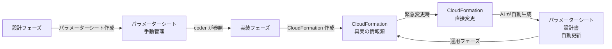

# 2.3.5 製造物 - 基本設計書構成

## 目的

**基本設計書のテンプレート・記述方法**を提供します。

---

## 📋 基本設計書の目次構成

```markdown
# 基本設計書

## 1. はじめに
### 1.1 ドキュメント概要
### 1.2 対象読者
### 1.3 関連ドキュメント

## 2. システム概要
### 2.1 システム目的
### 2.2 システム機能概要
### 2.3 対象ユーザー

## 3. 制約事項・前提条件
### 3.1 技術的制約
### 3.2 ビジネス制約（予算・納期・人員）
### 3.3 外部依存（外部API・SaaS）
### 3.4 既存システムとの連携要件

## 4. アーキテクチャ設計
### 4.1 アーキテクチャパターン
#### 4.1.1 選定したパターン
#### 4.1.2 選定理由
#### 4.1.3 検討した代替案
#### 4.1.4 トレードオフ
### 4.2 技術スタック
#### 4.2.1 選定した技術
#### 4.2.2 選定理由（要件定義書との紐付け）
#### 4.2.3 検討した代替案
### 4.3 参照した技術標準（`.claude/docs/40_standards/`） ⭐⭐⭐
### 4.4 レイヤー構成
### 4.5 データフロー

## 5. システム構成図
### 5.1 全体構成図
### 5.2 ネットワーク構成図
### 5.3 コンポーネント配置図

## 6. データベース設計
### 6.1 ER図（詳細版）
### 6.2 テーブル一覧
### 6.3 インデックス戦略
### 6.4 選定理由（RDB vs NoSQL）

## 7. API設計
### 7.1 API設計方針
### 7.2 認証・認可方式
#### 7.2.1 選定した方式
#### 7.2.2 選定理由
### 7.3 エラーハンドリング方針
### 7.4 外部連携設計
#### 7.4.1 外部API仕様
#### 7.4.2 レート制限対策
### 7.5 API バージョニング戦略

## 8. セキュリティ設計
### 8.1 認証設計
### 8.2 認可設計
### 8.3 データ暗号化
### 8.4 シークレット管理
### 8.5 監査ログ
### 8.6 `.claude/docs/40_standards/49_security.md` 準拠確認 ⭐⭐⭐

## 9. 性能設計
### 9.1 性能要件の整理
### 9.2 レスポンスタイム目標値
### 9.3 スループット設計
### 9.4 ボトルネック分析と対策
### 9.5 負荷試験計画

## 10. 運用設計
### 10.1 監視設計
### 10.2 ログ設計
### 10.3 バックアップ設計
### 10.4 障害復旧設計（RTO/RPO）
### 10.5 障害対応フロー

## 11. インフラ設計
### 11.1 クラウドベンダー選定
#### 11.1.1 選定したベンダー
#### 11.1.2 選定理由
#### 11.1.3 検討した代替案
### 11.2 ネットワーク設計
### 11.3 コンピューティング設計
### 11.4 ストレージ設計
### 11.5 コスト設計
#### 11.5.1 インフラコスト試算
#### 11.5.2 運用コスト見積もり
#### 11.5.3 コスト最適化戦略
### 11.6 `.claude/docs/40_standards/45_cloudformation.md`/4.4 準拠確認 ⭐

## 12. 開発環境・CI/CD設計
### 12.1 開発環境構成
### 12.2 CI/CDパイプライン設計
### 12.3 デプロイ戦略（Blue/Green、Canary等）
### 12.4 環境分離戦略（dev/staging/production）

## 13. テスト戦略
### 13.1 テスト方針
### 13.2 テスト環境構成
### 13.3 テストデータ戦略
### 13.4 テスト自動化方針

## 14. マイグレーション計画（既存システムがある場合）
### 14.1 データ移行方針
### 14.2 段階的移行計画
### 14.3 ロールバック戦略
### 14.4 並行稼働期間

## 15. 非機能要件への対応
### 15.1 性能要件への対応（セクション9参照）
### 15.2 可用性要件への対応
### 15.3 セキュリティ要件への対応（セクション8参照）
### 15.4 運用要件への対応（セクション10参照）
### 15.5 拡張性要件への対応
```

---

## 📝 各セクションの記述方法

### 3. 制約事項・前提条件

**記載例:**
```markdown
## 3. 制約事項・前提条件

### 3.1 技術的制約
- **既存システムとの連携**: 既存の顧客管理システム（Java製）とREST APIで連携必須
- **使用必須技術**: 社内標準としてAWS利用が必須（GCP/Azure不可）
- **データベース**: PostgreSQL 14以上（既存システムとの互換性）

### 3.2 ビジネス制約
- **予算**: インフラコスト月10万円以内
- **納期**: 2025年12月末リリース（4ヶ月）
- **人員**: 開発チーム3名（バックエンド2名、フロントエンド1名）

### 3.3 外部依存
- **決済API**: Stripe（月間トランザクション上限10,000件）
- **メール送信**: SendGrid（月間送信数50,000通まで無料）
- **SMS送信**: Twilio（従量課金）

### 3.4 既存システムとの連携要件
- 既存システムから顧客情報をREST APIで取得（レスポンスタイム<500ms）
- 認証は既存システムのOAuth 2.0を利用
```

### 4. アーキテクチャ設計（理由・背景を含む）

**記載例:**
```markdown
## 4. アーキテクチャ設計

### 4.1 アーキテクチャパターン

#### 4.1.1 選定したパターン
**レイヤードアーキテクチャ + マイクロサービス（2サービス構成）**

- ユーザー管理サービス（認証・認可）
- 決済管理サービス（注文・決済）

#### 4.1.2 選定理由

**要件定義書との紐付け:**
- 非機能要件「将来的にサービスを独立してスケールさせたい」（要件定義書 3.2節）
- ユーザー管理と決済処理で負荷特性が大きく異なる
- 決済サービスのみPCI DSS準拠が必要

**技術的根拠:**
- ユーザー管理: 読み取り多（80%）、書き込み少（20%）
- 決済処理: トランザクション重視、書き込み多（60%）
- 独立したスケーリングで月間インフラコスト30%削減見込み

#### 4.1.3 検討した代替案

| パターン | メリット | デメリット | 不採用理由 |
|---------|---------|----------|-----------|
| モノリス | 開発速度速い、運用シンプル | スケーリング柔軟性低い | 要件定義の拡張性要件を満たせない |
| フルマイクロサービス（5+） | 最大の柔軟性 | 運用複雑、チーム3名では過剰 | チーム規模に対してオーバーエンジニアリング |
| サーバーレス | インフラ管理不要 | 既存システム連携が複雑 | 既存システムとの同期処理に不向き |

#### 4.1.4 トレードオフ

**メリット:**
- ✅ サービスごとに独立したスケーリング可能
- ✅ 決済サービスのみ強固なセキュリティ適用可能
- ✅ 障害の影響範囲を限定可能

**デメリット:**
- ❌ 分散トレーシング必要（AWS X-Ray導入）
- ❌ サービス間通信のレイテンシ（+50ms程度）
- ❌ 運用複雑化（監視対象2倍）

**判断:**
将来の拡張性を優先。レイテンシはキャッシュで吸収可能と判断。

### 4.2 技術スタック

#### 4.2.1 選定した技術

| レイヤー | 技術 |
|---------|------|
| バックエンド | Node.js 20 + Express |
| データベース | PostgreSQL 15 |
| インフラ | AWS ECS Fargate |
| CI/CD | GitHub Actions |

#### 4.2.2 選定理由（要件定義書との紐付け）

**Node.js 20 + Express**

要件との紐付け:
- 性能要件: 同時接続100ユーザー、レスポンス1秒以内（要件定義書 3.1節）
- 開発期間: 4ヶ月（要件定義書 1.3節）

選定理由:
- チーム全員がJavaScript/TypeScript経験あり（学習コスト0、開発速度最大化）
- npmエコシステムが豊富（Stripe SDK、SendGrid SDK等すぐ利用可能）
- 非同期I/O で外部API連携に強い（既存システム連携要件に適合）
- 性能要件を十分満たせる（Node.js単体で1000req/sec可能）

**PostgreSQL 15**

要件との紐付け:
- データ要件: トランザクション整合性必須（決済処理）（要件定義書 2.3節）
- 将来性: 将来的にデータ分析機能追加予定（要件定義書 4.2節）

選定理由:
- ACID特性でトランザクション整合性を保証（決済処理に必須）
- JSON型でNoSQL的な使い方も可能（将来の柔軟性）
- AWS RDS でマネージド運用可能（運用コスト削減）
- PostGIS拡張で将来の位置情報機能に対応可能

制約との整合性:
- 既存システムもPostgreSQL使用（データ移行容易）（制約事項 3.1節）

#### 4.2.3 検討した代替案

**バックエンド:**

| 技術 | メリット | デメリット | 不採用理由 |
|------|---------|----------|-----------|
| Python + FastAPI | 非同期処理強い | チーム経験者1名のみ | 学習コスト高、納期4ヶ月に間に合わない |
| Go | 性能最高、並行処理強い | 学習コスト高、エコシステム小 | チーム未経験、外部SDK少ない |
| Java + Spring Boot | エンタープライズ実績豊富 | 開発速度遅い、メモリ消費大 | 納期・インフラコストで不利 |

**データベース:**

| 技術 | メリット | デメリット | 不採用理由 |
|------|---------|----------|-----------|
| MySQL | 実績豊富、情報多い | トランザクション性能で劣る | 決済処理のトランザクション性能不安 |
| DynamoDB | スケーラビリティ最高 | トランザクション弱い | 決済処理のACID要件満たせない |
| MongoDB | スキーマレス、柔軟性高い | トランザクション弱い | 決済処理に不向き |

### 4.3 参照した技術標準（`.claude/docs/40_standards/`） ⭐⭐⭐

### 4.6 Node.js/TypeScript規約
- ディレクトリ構成: 技術標準に準拠
- linter: ESLint（技術標準推奨設定）
- formatter: Prettier（技術標準推奨設定）

### 4.9 セキュリティ・運用基準 ⭐⭐⭐
- 認証: JWT + bcrypt（技術標準推奨）
- 暗号化: TLS 1.3 + AES-256（技術標準推奨）
- シークレット管理: AWS Secrets Manager（技術標準推奨）
```

### 11. インフラ設計（コスト設計を含む）

**記載例:**
```markdown
## 11. インフラ設計

### 11.1 クラウドベンダー選定

#### 11.1.1 選定したベンダー
AWS（Amazon Web Services）

#### 11.1.2 選定理由

**制約事項との整合性:**
- 社内標準としてAWS利用が必須（制約事項 3.1節）

**技術的根拠:**
- ECS Fargateでコンテナ管理不要（運用コスト削減）
- RDS、Secrets Manager等のマネージドサービスが充実
- 既存システムもAWS上で稼働（ネットワーク統合容易）

#### 11.1.3 検討した代替案

| ベンダー | メリット | デメリット | 不採用理由 |
|---------|---------|----------|-----------|
| GCP | BigQuery安価 | 社内実績なし | 制約事項により不可 |
| Azure | Microsoftとの親和性 | コスト高 | 制約事項により不可 |

### 11.5 コスト設計

#### 11.5.1 インフラコスト試算

**前提条件:**
- ユーザー数: 1,000名（初年度）
- 同時接続: 最大100ユーザー（ピーク時）
- データ量: 100GB（初年度）

**コスト内訳（月額）:**

| リソース | スペック | 月額費用 | 根拠 |
|---------|---------|---------|------|
| ECS Fargate | 0.5 vCPU, 1GB RAM × 2タスク | $36 | (0.5 * 0.04048 + 1 * 0.004445) * 720h * 2 |
| RDS PostgreSQL | db.t4g.micro (Multi-AZ) | $28 | AWS料金表 |
| ALB | 2 LCU | $24 | 固定$16 + 処理$8 |
| CloudWatch Logs | 10GB/月 | $5 | $0.50/GB |
| Secrets Manager | 5シークレット | $2 | $0.40/シークレット |
| **合計** | | **$95** | 予算$100以内 ✅ |

**スケーリング時の試算:**

| ユーザー数 | ECS | RDS | 月額合計 | 備考 |
|----------|-----|-----|---------|------|
| 1,000名 | 2タスク | db.t4g.micro | $95 | 初年度 |
| 5,000名 | 4タスク | db.t4g.small | $210 | 2年目想定 |
| 10,000名 | 8タスク | db.t4g.medium | $450 | 3年目想定 |

#### 11.5.2 運用コスト見積もり

**人件費:**
- 運用担当: 1名 × 20時間/月 × @5,000円 = 10万円/月

**外部サービス:**
- Stripe: 3.6%手数料（月間売上100万円想定 → 36,000円/月）
- SendGrid: 無料枠内（50,000通/月）
- Twilio: 1万円/月（SMS 500通想定）

**合計運用コスト: 約15万円/月**

#### 11.5.3 コスト最適化戦略

**短期施策（3ヶ月以内）:**
- CloudWatch Logs保持期間を30日→7日に短縮（$5→$1.5、70%削減）
- 開発環境を夜間・休日停止（$36→$18、50%削減）

**中期施策（6ヶ月〜1年）:**
- RDS Reserved Instance購入（年間契約で30%割引）
- S3 Intelligent-Tiering導入（アクセス頻度低いデータ自動移行）

**長期施策（1年〜）:**
- Savings Plans検討（ECS Fargate で20%割引）
- スポットインスタンス活用（バッチ処理）
```

---

## 📁 ファイル分割の方針（2025年10月更新）

### ベストプラクティス: 常にファイル分割を推奨

**基本設計書は、規模に関わらず以下の構成で複数ファイルに分割してください：**

```
docs/03_基本設計/
├── INDEX.md                                      # 目次・全体像・レビュー状況
├── 01_システムアーキテクチャ.md                   # 全体構成図、システム構成要素
├── 02_ネットワーク設計.md                        # VPC、サブネット、ルーティング（設計意図）
├── 02_(別紙)ネットワーク設計_パラメーター.md       # VPC CIDR、サブネットCIDR等の数値 ⭐
├── 03_セキュリティ設計.md                        # Security Groups、WAF、認証、暗号化（設計意図）
├── 03_(別紙)セキュリティ設計_パラメーター.md       # SG ルール、WAF設定値 ⭐
├── 04_監査・コンプライアンス設計.md                # ログ保管、証跡管理、法令準拠
├── 05_データベース設計.md                        # RDS構成、バックアップ戦略（設計意図）
├── 05_(別紙)データベース設計_パラメーター.md       # インスタンスクラス、ストレージ容量等 ⭐
├── 06_コンピュート設計.md                        # ECS、ALB、AutoScaling（設計意図）
├── 06_(別紙)コンピュート設計_パラメーター.md       # タスク数、CPU、メモリ等 ⭐
├── 07_フロントエンド設計.md                      # CloudFront、S3（該当する場合）
├── 07_(別紙)フロントエンド設計_パラメーター.md     # CloudFront設定、S3バケット設定 ⭐
├── 08_監視・アラート設計.md                      # CloudWatch、SNS、通知（設計意図）
├── 08_(別紙)監視・アラート設計_パラメーター.md     # 閾値、アラート条件等 ⭐
├── 09_CI_CD設計.md                              # パイプライン、デプロイ戦略
├── 10_CloudFormation構成方針.md                 # ファイル分割3原則、ディレクトリ構造
├── 11_非機能要件実現方針.md                      # 性能、可用性
├── 12_災害対策・BCP.md                          # DR、バックアップ
└── 13_移行計画.md                               # スケジュール、データ移行
```

### ファイル分割の理由

1. **レビューしやすさ**: 担当者が関連部分だけをレビュー可能
2. **変更しやすさ**: 一部の設計変更が他に影響しない
3. **並行作業**: 複数人で同時に異なる設計を進められる
4. **再利用性**: 次のプロジェクトでテンプレート化可能
5. **Git差分の可読性**: 変更箇所が明確

### プロジェクト特性による調整

小規模プロジェクトでも上記構成を基本としますが、該当しない項目は省略可：

- **フロントエンドなし** → `07_フロントエンド設計.md` を省略
- **既存システムなし** → `13_移行計画.md` を省略
- **Terraform使用** → `10_Terraform構成方針.md` に変更

### ディレクトリ構成の例

```
docs/
├── 01_企画書.md
├── 02_要件定義書.md
├── 03_基本設計/                                   # 常にディレクトリ化
│   ├── INDEX.md                                  # 目次・全体像・レビュー状況
│   ├── 01_システムアーキテクチャ.md
│   ├── 02_ネットワーク設計.md
│   ├── 02_(別紙)ネットワーク設計_パラメーター.md   # ⭐ 数値のみ
│   ├── 03_セキュリティ設計.md
│   ├── 03_(別紙)セキュリティ設計_パラメーター.md   # ⭐ 数値のみ
│   ├── 04_監査・コンプライアンス設計.md
│   ├── 05_データベース設計.md
│   ├── 05_(別紙)データベース設計_パラメーター.md   # ⭐ 数値のみ
│   ├── 06_コンピュート設計.md
│   ├── 06_(別紙)コンピュート設計_パラメーター.md   # ⭐ 数値のみ
│   ├── 07_フロントエンド設計.md
│   ├── 07_(別紙)フロントエンド設計_パラメーター.md # ⭐ 数値のみ
│   ├── 08_監視・アラート設計.md
│   ├── 08_(別紙)監視・アラート設計_パラメーター.md # ⭐ 数値のみ
│   ├── 09_CI_CD設計.md
│   ├── 10_CloudFormation構成方針.md              # ⭐ 重要
│   ├── 11_非機能要件実現方針.md
│   ├── 12_災害対策・BCP.md
│   └── 13_移行計画.md
└── 04_詳細設計/
    └── ...
```

### INDEX.md の例（ナビゲーション）

```markdown
# 基本設計書 INDEX

## プロジェクト概要
**プロジェクト名**: 役所設備管理システム AWS ECS 移行プロジェクト
**目的**: 既存システムのAWS ECS（Fargate）移行
**スコープ**: インフラ移行、業務API・事業者API・バッチの3サービス構成

## ドキュメント構成

| ドキュメント | 概要 | レビュー状況 |
|------------|------|-------------|
| [01_システムアーキテクチャ.md](01_システムアーキテクチャ.md) | 全体構成図、システム構成要素 | ✅ 承認済み |
| [02_ネットワーク設計.md](02_ネットワーク設計.md) | VPC、サブネット、ルーティング（設計意図） | 🔄 レビュー中 |
| └ [02_(別紙)ネットワーク設計_パラメーター.md](02_(別紙)ネットワーク設計_パラメーター.md) | CIDR等の数値 | ⏳ 未着手 |
| [03_セキュリティ設計.md](03_セキュリティ設計.md) | SG、WAF、認証、暗号化（設計意図） | ⏳ 未着手 |
| └ [03_(別紙)セキュリティ設計_パラメーター.md](03_(別紙)セキュリティ設計_パラメーター.md) | SGルール等の数値 | ⏳ 未着手 |
| [04_監査・コンプライアンス設計.md](04_監査・コンプライアンス設計.md) | ログ保管、証跡管理、ISMAP準拠 | ⏳ 未着手 |
| [05_データベース設計.md](05_データベース設計.md) | RDS構成、バックアップ戦略（設計意図） | ⏳ 未着手 |
| └ [05_(別紙)データベース設計_パラメーター.md](05_(別紙)データベース設計_パラメーター.md) | インスタンスクラス等の数値 | ⏳ 未着手 |
| [06_コンピュート設計.md](06_コンピュート設計.md) | ECS、ALB、AutoScaling（設計意図） | ⏳ 未着手 |
| └ [06_(別紙)コンピュート設計_パラメーター.md](06_(別紙)コンピュート設計_パラメーター.md) | タスク数、CPU等の数値 | ⏳ 未着手 |
| [07_フロントエンド設計.md](07_フロントエンド設計.md) | CloudFront、S3（設計意図） | ⏳ 未着手 |
| └ [07_(別紙)フロントエンド設計_パラメーター.md](07_(別紙)フロントエンド設計_パラメーター.md) | CloudFront設定等の数値 | ⏳ 未着手 |
| [08_監視・アラート設計.md](08_監視・アラート設計.md) | CloudWatch、SNS、通知（設計意図） | ⏳ 未着手 |
| └ [08_(別紙)監視・アラート設計_パラメーター.md](08_(別紙)監視・アラート設計_パラメーター.md) | 閾値等の数値 | ⏳ 未着手 |
| [09_CI_CD設計.md](09_CI_CD設計.md) | パイプライン、デプロイ戦略 | ⏳ 未着手 |
| [10_CloudFormation構成方針.md](10_CloudFormation構成方針.md) | ファイル分割3原則、ディレクトリ構造 | ⏳ 未着手 |
| [11_非機能要件実現方針.md](11_非機能要件実現方針.md) | 性能、可用性 | ⏳ 未着手 |
| [12_災害対策・BCP.md](12_災害対策・BCP.md) | DR、バックアップ | ⏳ 未着手 |
| [13_移行計画.md](13_移行計画.md) | スケジュール、データ移行 | ⏳ 未着手 |

## 重要な設計判断（ADR サマリー）

### ADR-001: ECS Fargate 採用
- **決定**: ECS Fargate でコンテナ実行
- **理由**: サーバー管理不要、運用コスト削減
- **詳細**: [01_システムアーキテクチャ.md](01_システムアーキテクチャ.md)

### ADR-002: PostgreSQL RDS 採用
- **決定**: RDS PostgreSQL 14（マルチAZ）
- **理由**: ACID保証、既存システムとの互換性
- **詳細**: [05_データベース設計.md](05_データベース設計.md)

## レビュー・承認
- レビュー担当者: [未定]
- 承認者: [未定]
- 承認日: [未定]

## 変更履歴
| 日付 | バージョン | 変更内容 | 変更者 |
|------|----------|---------|--------|
| 2025-10-24 | 1.0 | 初版作成 | architect |
```

### 重要な注意事項

1. **INDEX.md は必須**: プロジェクト全体像とレビュー状況を一元管理
2. **10_CloudFormation構成方針.md は必須**: `.claude/docs/40_standards/45_cloudformation.md` のファイル分割3原則を必ず記載
3. **(別紙)パラメーター.md は必須**: 各設計書に対応する別紙としてパラメーター値を分離管理（後述の作成方針参照）
4. **各ファイルは独立して読める**: ただし INDEX.md で相互リンク提供
5. **レビュー状況を可視化**: ✅承認済み、🔄レビュー中、⏳未着手

---

## 📊 (別紙)パラメーター.md の作成方針

### 別紙パラメーターシートとは

**設計書と数値を分離し、設定値を項番ごとに対応させて管理するドキュメント**

- **設計書（02〜08等）**: 設計意図・理由・背景を記述
- **別紙パラメーター（02_(別紙)〜08_(別紙)等）**: 対応する設計書の具体的な数値を記述

### 作成方針

#### 設計フェーズ（このフェーズ）

**パラメーターシートを手動で作成（真実の情報源）**

- architect が設計書と並行してパラメーターシートを作成
- 設計書には「なぜこの値か」、パラメーターシートには「具体的な値」を記載
- **暫定値として作成**: 性能テスト・脆弱性試験などで値が変わる可能性を明記

#### 実装フェーズ

**coder がパラメーターシートを参照して CloudFormation を作成**

- パラメーターシート → CloudFormation への一方向変換
- CloudFormation 作成後は CloudFormation が真実の情報源に移行

#### 運用フェーズ

**CloudFormation からパラメーターシートを自動生成**

- 緊急時は CloudFormation を直接変更可能（DR・障害対応）
- 変更後、AI が CloudFormation からパラメーターシート＆設計書を自動更新
- 詳細: `.claude/docs/40_standards/47_iac-import.md` 参照

### 別紙パラメーターシートの構成例

#### 例1: 02_(別紙)ネットワーク設計_パラメーター.md

```markdown
# 02_(別紙)ネットワーク設計_パラメーター

> **⚠️ 注意**: このドキュメントの値は暫定値です。
> 性能テスト・脆弱性試験・負荷テスト完了後に最終化します。

**対応する設計書**: [02_ネットワーク設計.md](02_ネットワーク設計.md)

## VPC

| パラメーター | 値 | 備考 |
|------------|---|------|
| VPC CIDR | 10.0.0.0/16 | 最大65,536 IP |
| DNS解決 | 有効 | |
| DNSホスト名 | 有効 | |

## サブネット

| サブネット名 | CIDR | AZ | タイプ |
|------------|------|----|----|
| Public Subnet 1a | 10.0.1.0/24 | ap-northeast-1a | Public |
| Public Subnet 1c | 10.0.2.0/24 | ap-northeast-1c | Public |
| Private Subnet 1a | 10.0.101.0/24 | ap-northeast-1a | Private |
| Private Subnet 1c | 10.0.102.0/24 | ap-northeast-1c | Private |

## ルートテーブル

| ルートテーブル名 | 送信先 | ターゲット |
|---------------|-------|----------|
| Public Route Table | 0.0.0.0/0 | Internet Gateway |
| Private Route Table 1a | 0.0.0.0/0 | NAT Gateway 1a |
| Private Route Table 1c | 0.0.0.0/0 | NAT Gateway 1c |

## 変更履歴

| 日付 | 変更内容 | 変更理由 | 変更者 |
|------|---------|---------|--------|
| 2025-10-24 | 初版作成 | 設計フェーズ | architect |
| (未定) | 性能テスト後の最終化 | テスト結果反映 | - |
```

#### 例2: 05_(別紙)データベース設計_パラメーター.md

```markdown
# 05_(別紙)データベース設計_パラメーター

> **⚠️ 注意**: このドキュメントの値は暫定値です。
> 性能テスト・脆弱性試験・負荷テスト完了後に最終化します。

**対応する設計書**: [05_データベース設計.md](05_データベース設計.md)

## RDS PostgreSQL

| パラメーター | 値 | 備考 |
|------------|---|------|
| インスタンスクラス | db.t4g.micro | 性能テスト後調整予定 ⚠️ |
| ストレージタイプ | gp3 | |
| ストレージ容量 | 20GB | |
| IOPS | 3000 | gp3 デフォルト |
| スループット | 125 MiB/s | gp3 デフォルト |
| マルチAZ | 有効 | 可用性要件 |
| バックアップ保持期間 | 7日 | |
| メンテナンスウィンドウ | 日曜 3:00-4:00 JST | |
| 自動マイナーバージョンアップグレード | 有効 | |

## パラメーターグループ

| パラメーター名 | 値 | 備考 |
|-------------|---|------|
| shared_buffers | {DBInstanceClassMemory/4} | |
| max_connections | 100 | 性能テスト後調整予定 ⚠️ |
| work_mem | 4MB | |

## 変更履歴

| 日付 | 変更内容 | 変更理由 | 変更者 |
|------|---------|---------|--------|
| 2025-10-24 | 初版作成 | 設計フェーズ | architect |
| (未定) | 性能テスト後の最終化 | テスト結果反映 | - |
```

#### 例3: 06_(別紙)コンピュート設計_パラメーター.md

```markdown
# 06_(別紙)コンピュート設計_パラメーター

> **⚠️ 注意**: このドキュメントの値は暫定値です。
> 性能テスト・脆弱性試験・負荷テスト完了後に最終化します。

**対応する設計書**: [06_コンピュート設計.md](06_コンピュート設計.md)

## ECS Fargate

| パラメーター | 値 | 備考 |
|------------|---|------|
| タスク数（最小） | 2 | 可用性確保 |
| タスク数（最大） | 10 | オートスケーリング上限 |
| CPU | 512 (0.5 vCPU) | 性能テスト後調整予定 ⚠️ |
| メモリ | 1024 (1GB) | 性能テスト後調整予定 ⚠️ |
| ヘルスチェック間隔 | 30秒 | |
| ヘルスチェックタイムアウト | 5秒 | |
| ヘルスチェック正常判定回数 | 2 | |
| ヘルスチェック異常判定回数 | 2 | |

## ALB

| パラメーター | 値 | 備考 |
|------------|---|------|
| アイドルタイムアウト | 60秒 | |
| 削除保護 | 有効（本番のみ） | |
| アクセスログ保持 | 30日 | |
| デレジストレーション遅延 | 30秒 | |

## Auto Scaling

| パラメーター | 値 | 備考 |
|------------|---|------|
| スケールアウト閾値（CPU） | 70% | 性能テスト後調整予定 ⚠️ |
| スケールイン閾値（CPU） | 30% | 性能テスト後調整予定 ⚠️ |
| クールダウン期間 | 300秒 | |

## 変更履歴

| 日付 | 変更内容 | 変更理由 | 変更者 |
|------|---------|---------|--------|
| 2025-10-24 | 初版作成 | 設計フェーズ | architect |
| (未定) | 性能テスト後の最終化 | テスト結果反映 | - |
```

### 設計書との関係

**設計書（例: 05_データベース設計.md）に記載する内容**:
- ✅ 「なぜ db.t4g.micro を選んだか」（理由・背景）
- ✅ 「なぜマルチAZが必要か」（要件との紐付け）
- ✅ 「検討した代替案」（db.t4g.small、db.t3.micro等）
- ✅ 「トレードオフ」（メリット・デメリット）

**別紙パラメーター（例: 05_(別紙)データベース設計_パラメーター.md）に記載する内容**:
- ✅ 「インスタンスクラス: db.t4g.micro」（具体的な値）
- ✅ 「マルチAZ: 有効」（具体的な設定）
- ✅ 「バックアップ保持期間: 7日」（具体的な数値）
- ✅ 「メンテナンスウィンドウ: 日曜 3:00-4:00 JST」（具体的な時刻）

### 項番対応の例

| 設計書 | 別紙パラメーター | 内容 |
|-------|---------------|------|
| 02_ネットワーク設計.md | 02_(別紙)ネットワーク設計_パラメーター.md | VPC、サブネット設計 |
| 05_データベース設計.md | 05_(別紙)データベース設計_パラメーター.md | RDS設計 |
| 06_コンピュート設計.md | 06_(別紙)コンピュート設計_パラメーター.md | ECS、ALB設計 |

### 真実の情報源（Single Source of Truth）の遷移



---

**作成日**: 2025-10-19
**更新日**: 2025-10-26（パラメーターシートを別紙形式に変更：項番対応で各設計書に紐付く形式に改訂）
**対象フェーズ**: 設計
**重要度**: ⭐⭐⭐ 必須
