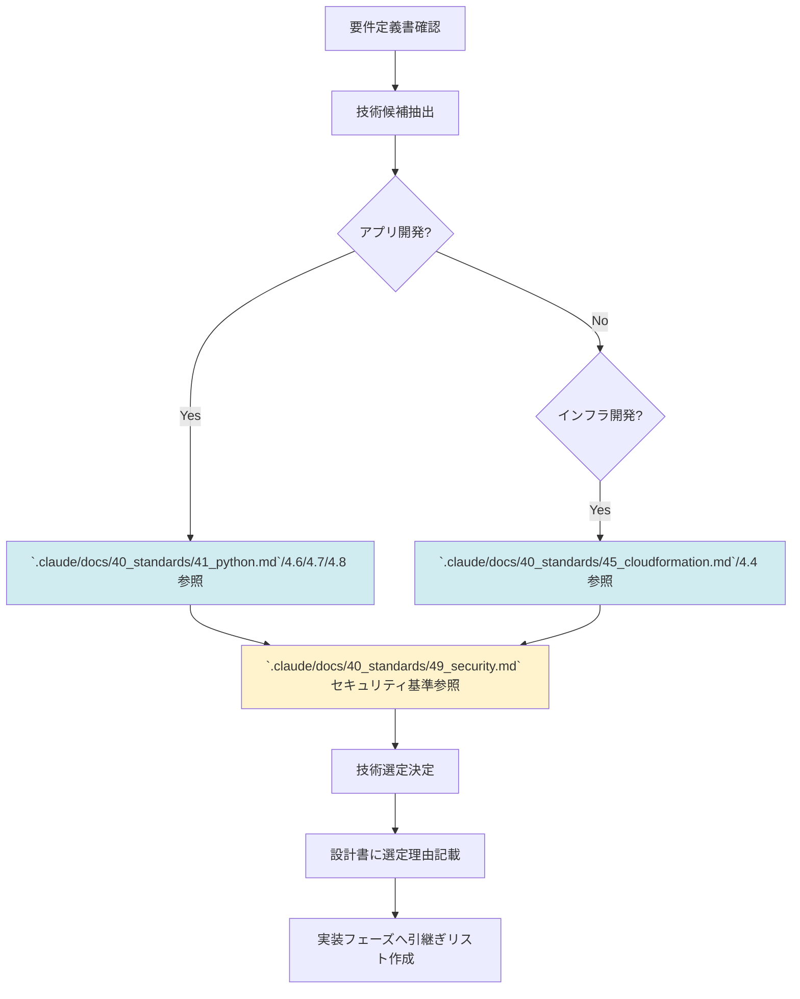

# 2.3 設計フェーズ - ファイルインデックス

## 📁 ディレクトリ構成

```
2.3_設計フェーズ/
├── 2.3.0_事前調査.md ⭐⭐⭐新規追加（AI自律実行）
├── 2.3.1_フェーズ概要.md
├── 2.3.2_アーキテクチャ選定プロセス.md
├── 2.3.3_技術標準参照ガイド.md ⭐⭐⭐最重要
├── 2.3.4_決定事項チェックリスト.md
├── 2.3.5_製造物_基本設計書構成.md
├── 2.3.6_製造物_詳細設計書構成.md
├── 2.3.7_インフラ設計パターン選定.md
├── 2.3.8_セキュリティ設計チェックリスト.md
├── 2.3.9_Mermaid図パターン/
│   ├── 2.3.9.1_システム構成図（詳細）.md
│   ├── 2.3.9.2_クラス図パターン.md
│   ├── 2.3.9.3_シーケンス図（技術詳細）.md
│   ├── 2.3.9.4_状態遷移図パターン.md
│   └── 2.3.9.5_Good_Bad_Example集.md
├── 2.3.10_フェーズ完了基準.md
└── 2.3.11_次フェーズへの引継ぎ事項.md

**ファイル数**: 18ファイル（事前調査を含む）
```

---

## 📋 各ファイルの概要

### 2.3.1_フェーズ概要.md
- **目的**: 設計フェーズの目的・ゴール・期待成果を定義
- **内容**:
  - フェーズの目的（「どう作るか」を決める）
  - インプット（要件定義書、非機能要件）
  - アウトプット（基本設計書、詳細設計書）
  - 主要活動（技術選定、アーキテクチャ設計、詳細設計）
  - **技術標準（`.claude/docs/40_standards/`）参照: あり（技術選定時に必須）** ⭐⭐⭐
  - このフェーズで決めること/次フェーズに委ねること

---

### 2.3.2_アーキテクチャ選定プロセス.md
- **目的**: 要件から技術スタック・アーキテクチャを選定する方法
- **内容**:
  - **要件から技術選定へのマッピング**
    - 非機能要件（性能、可用性）→ インフラ選定
    - データ要件 → データベース選定
    - 外部連携要件 → API設計方針
  - **アーキテクチャパターン選定**
    - モノリス vs マイクロサービス
    - サーバーレス vs コンテナ vs 仮想マシン
    - SaaS vs 自社開発
  - **言語・フレームワーク選定基準**
    - チーム習熟度
    - エコシステム
    - 性能要件
    - 保守性
  - **データベース選定基準**
    - RDB vs NoSQL
    - トランザクション要件
    - スケーラビリティ要件
  - **インフラ選定（AWS/GCP/Azure）**
    - クラウドベンダー選定基準
    - マネージドサービス vs 自前構築
  - 選定結果の記録方法

---

### 2.3.3_技術標準参照ガイド.md ⭐⭐⭐**最重要**
- **目的**: 技術標準（`.claude/docs/40_standards/`）をいつ・どう参照するか（設計フェーズの要）
- **内容**:
  - **技術選定時の参照フロー**
    ```
    1. 要件定義書から非機能要件を確認
    2. 技術候補を抽出（言語、FW、DB、インフラ）
    3. ⭐技術標準（`.claude/docs/40_standards/`）で制約・規約を確認⭐
    4. 技術選定の決定（技術標準に準拠できる技術を選択）
    5. 設計書に選定理由を記載
    ```
  - **参照すべき技術標準ファイル一覧**（技術選定時）
    - **アプリケーション開発の場合**:
      - `4.5 Python規約` → Pythonを選定する場合
      - `4.6 Node.js/TypeScript規約` → TypeScriptを選定する場合
      - `4.7 C# .NET Core規約` → C#を選定する場合
      - `4.8 Go言語規約` → Goを選定する場合
    - **インフラ開発の場合**:
      - `4.3 AWS CloudFormation規約` → CloudFormationを選定する場合
      - `4.4 Terraform規約` → Terraformを選定する場合
    - **セキュリティ（全プロジェクト必須）**:
      - `4.9 セキュリティ・運用基準` ⭐⭐⭐必ず参照
  - **参照タイミング**
    - 技術選定時（設計フェーズ前半）
    - 設計書作成時（技術標準に準拠しているか確認）
    - 設計レビュー時（規約準拠の最終確認）
  - **参照後の記録**
    - 設計書に「参照した技術標準」を明記
    - 実装フェーズへの引継ぎ事項に記載

---

### 2.3.4_決定事項チェックリスト.md
- **目的**: 設計フェーズで決定すべき事項の確認リスト
- **内容**:
  - ✅ アーキテクチャの決定（モノリス/マイクロサービス等）
  - ✅ 技術スタックの決定（言語、FW、DB、インフラ）
  - ✅ **技術標準（`.claude/docs/40_standards/`）との整合性確認** ⭐⭐⭐
  - ✅ ディレクトリ構成の決定
  - ✅ データベーススキーマの決定
  - ✅ API設計の決定（REST/GraphQL/gRPC）
  - ✅ セキュリティ設計の決定（認証、認可、暗号化）
  - ✅ 運用設計の決定（監視、ログ、バックアップ）
  - ✅ インフラ設計の決定（ネットワーク、コンピューティング、ストレージ）
  - ✅ 基本設計書・詳細設計書の作成
  - ✅ ユーザー承認の取得

---

### 2.3.5_製造物_基本設計書構成.md
- **目的**: 基本設計書のテンプレート・記述方法
- **内容**:
  - 基本設計書の目次構成（標準テンプレート）
    ```
    1. はじめに
    2. システム概要
    3. アーキテクチャ設計
       3.1 アーキテクチャパターン
       3.2 技術スタック選定理由
       3.3 参照した技術標準（`.claude/docs/40_standards/`） ⭐
    4. システム構成図
    5. データフロー図
    6. ER図（詳細版）
    7. API設計
    8. セキュリティ設計
    9. 運用設計
    10. インフラ設計
    11. 非機能要件への対応方針
    ```
  - 各セクションの記述方法
  - Good Example / Bad Example

---

### 2.3.6_製造物_詳細設計書構成.md
- **目的**: 詳細設計書のテンプレート・記述方法
- **内容**:
  - 詳細設計書の目次構成（標準テンプレート）
    ```
    1. はじめに
    2. モジュール設計
       2.1 ディレクトリ構成
       2.2 クラス/モジュール一覧
    3. クラス設計・モジュール設計
       3.1 クラス図
       3.2 各クラスの責務
    4. API仕様書
       4.1 エンドポイント一覧
       4.2 リクエスト/レスポンス仕様
    5. データベース設計
       5.1 テーブル定義
       5.2 インデックス設計
       5.3 パーティショニング戦略
    6. シーケンス図（処理フロー）
    7. 状態遷移図
    8. エラーハンドリング設計
    9. ログ設計
    ```
  - 各セクションの記述方法
  - Good Example / Bad Example

---

### 2.3.7_インフラ設計パターン選定.md
- **目的**: AWS/GCP/Azure でのインフラ設計パターン選定方法
- **内容**:
  - **CloudFormation vs Terraform の選定基準**
    - **技術標準参照**: `4.3 CloudFormation規約` / `4.4 Terraform規約`
    - AWS専用 → CloudFormation
    - マルチクラウド → Terraform
    - チーム習熟度
  - **ネットワーク設計パターン**
    - VPC設計
    - サブネット設計（パブリック/プライベート）
    - セキュリティグループ設計
  - **コンピューティング設計パターン**
    - ECS/EKS/Lambda の選定基準
    - オートスケーリング設計
  - **データベース設計パターン**
    - RDS/Aurora/DynamoDB の選定基準
    - マルチAZ/リードレプリカ設計
  - **ストレージ設計パターン**
    - S3バケット設計
    - ライフサイクルポリシー
  - **AWS Well-Architected Framework への準拠**
    - 6つの柱（運用、セキュリティ、信頼性、パフォーマンス、コスト、持続可能性）
    - 技術標準 `4.3 CloudFormation規約` に記載されたベストプラクティスの適用

---

### 2.3.8_セキュリティ設計チェックリスト.md
- **目的**: セキュリティ設計の必須確認項目
- **内容**:
  - **認証・認可設計**
    - 認証方式（ID/PW、SSO、多要素認証）
    - 認可方式（RBAC、ABAC）
    - セッション管理
  - **データ暗号化**
    - 転送中の暗号化（TLS 1.2以上）
    - 保管中の暗号化（AES-256等）
  - **シークレット管理設計**
    - AWS Secrets Manager / Parameter Store
    - 環境変数の使用方針
    - ハードコード禁止の徹底
  - **ネットワークセキュリティ設計**
    - セキュリティグループ設計
    - NACLs設計
    - WAF設定
  - **監査ログ設計**
    - CloudTrail / CloudWatch Logs
    - ログ保持期間
    - ログ分析方針
  - **技術標準参照**: `4.9 セキュリティ・運用基準` ⭐⭐⭐必須

---

## 2.3.9_Mermaid図パターン/ (5ファイル)

### 2.3.9.1_システム構成図（詳細）.md
- **目的**: システム構成図（技術詳細レベル）のMermaid記述パターン
- **内容**:
  - graph TB を使ったシステム構成図
  - 詳細レベル（具体的な技術要素を含む）
    - ECS/Lambda/RDS/S3 等の具体的なAWSサービス
    - ロードバランサー、NAT Gateway 等
  - 配置図としての表現
  - Good Example / Bad Example

### 2.3.9.2_クラス図パターン.md
- **目的**: クラス図のMermaid記述パターン
- **内容**:
  - classDiagram を使ったクラス図
  - クラスの表現（属性、メソッド）
  - 関連の表現（継承、実装、依存、集約）
  - レイヤードアーキテクチャの表現
  - Good Example / Bad Example

### 2.3.9.3_シーケンス図（技術詳細）.md
- **目的**: シーケンス図（技術詳細レベル）のMermaid記述パターン
- **内容**:
  - sequenceDiagram を使ったシーケンス図
  - 技術要素（API、DB、外部サービス）の表現
  - HTTP リクエスト/レスポンスの表現
  - トランザクション境界の表現
  - エラーハンドリングの表現
  - Good Example / Bad Example

### 2.3.9.4_状態遷移図パターン.md
- **目的**: 状態遷移図のMermaid記述パターン
- **内容**:
  - stateDiagram-v2 を使った状態遷移図
  - 状態の表現
  - 遷移条件の表現
  - 初期状態・終了状態の表現
  - Good Example / Bad Example

### 2.3.9.5_Good_Bad_Example集.md
- **目的**: 設計フェーズのMermaid図全般のGood/Bad例
- **内容**:
  - 技術詳細が適切に表現された Good Example
  - 過剰に複雑な Bad Example
  - 図の粒度の適切性

---

## 2.3.10_フェーズ完了基準.md
- **目的**: 設計フェーズを完了してよい条件
- **内容**:
  - **必須完了条件**:
    - ✅ 技術スタックが決定している
    - ✅ **技術標準（`.claude/docs/40_standards/`）との整合性を確認済み** ⭐⭐⭐
    - ✅ アーキテクチャが決定している
    - ✅ 基本設計書が作成されている
    - ✅ 詳細設計書が作成されている
    - ✅ データベーススキーマが確定している
    - ✅ API仕様が確定している
    - ✅ セキュリティ設計が完了している（技術標準 `4.9` 準拠）
    - ✅ インフラ設計が完了している
    - ✅ ユーザー承認を取得している
  - **レビュープロセス**:
    - AIによる自己レビュー
    - **技術標準（`.claude/docs/40_standards/`）準拠確認** ⭐
    - ユーザーレビュー
    - 修正・再レビュー
  - **次フェーズへの準備**:
    - 実装フェーズで参照する設計書の整理
    - **技術標準（`.claude/docs/40_standards/`）の参照先リスト作成** ⭐

---

## 2.3.11_次フェーズへの引継ぎ事項.md
- **目的**: 実装フェーズに渡すべき情報
- **内容**:
  - **引き継ぐべき情報リスト**:
    - ✅ 基本設計書
    - ✅ 詳細設計書
    - ✅ 技術スタック情報（言語、FW、DB、インフラ）
    - ✅ **参照すべき技術標準（`.claude/docs/40_standards/`）のリスト** ⭐⭐⭐
      - 例: Python選定 → `4.5 Python規約`
      - 例: CloudFormation選定 → `4.3 CloudFormation規約`
      - 例: セキュリティ → `4.9 セキュリティ・運用基準`
    - ✅ データベーススキーマ
    - ✅ API仕様書
    - ✅ ディレクトリ構成
  - **実装フェーズでの参照方法**:
    - 設計書を見ながら実装
    - **コード生成前に必ず技術標準（`.claude/docs/40_standards/`）を参照** ⭐⭐⭐
  - **実装フェーズで注意すべき点**:
    - 技術標準に準拠したコードを生成すること
    - 設計との乖離を防ぐこと

---

## 🎯 設計フェーズの重点

### このフェーズで決めること
- **技術スタック**（言語、FW、DB、インフラ）
- **アーキテクチャ**（モノリス/マイクロサービス等）
- **詳細設計**（クラス設計、API設計、DB設計）
- **セキュリティ設計**（認証、認可、暗号化）
- **インフラ設計**（ネットワーク、コンピューティング、ストレージ）

### 技術標準（`.claude/docs/40_standards/`）の参照 ⭐⭐⭐**最重要**
- **技術選定時に必ず参照**
- 参照タイミング:
  1. 技術候補抽出後
  2. 技術選定前（制約確認）
  3. 設計書作成時（規約準拠確認）
- 参照結果を設計書に明記
- 実装フェーズへの引継ぎ事項に記載

### このフェーズで決めないこと
- **実装の詳細**（具体的なコード） → 実装フェーズで決定

---

## 📊 ファイル構成サマリー

| カテゴリ | ファイル数 | 内容 |
|---------|----------|------|
| フェーズ概要 | 1 | フェーズの目的・ゴール |
| アーキテクチャ選定プロセス | 1 | 技術選定方法 |
| 技術標準参照ガイド ⭐ | 1 | 技術標準参照タイミング・方法 |
| 決定事項チェックリスト | 1 | 決定すべき事項の確認 |
| 製造物_基本設計書構成 | 1 | 基本設計書のテンプレート |
| 製造物_詳細設計書構成 | 1 | 詳細設計書のテンプレート |
| インフラ設計パターン選定 | 1 | AWS等のインフラ設計方法 |
| セキュリティ設計チェックリスト | 1 | セキュリティ設計の確認項目 |
| Mermaid図パターン | 5 | 構成図/クラス図/シーケンス図/状態遷移図/例 |
| フェーズ完了基準 | 1 | 完了条件・レビュープロセス |
| 次フェーズへの引継ぎ | 1 | 実装フェーズへの引継ぎ情報 |
| **合計** | **17** | |

---

## ⚠️ 注意事項

1. **技術標準（`.claude/docs/40_standards/`）を必ず参照する** ⭐⭐⭐
   - 技術選定時に参照しないと、実装フェーズで規約違反のコードを生成してしまう
   - `2.3.3_技術標準参照ガイド.md` を必ず確認

2. **セキュリティ設計を必ず実施する**
   - 技術標準 `4.9 セキュリティ・運用基準` を参照
   - セキュリティ設計チェックリストを完了させる

3. **実装可能なレベルまで詳細化する**
   - 詳細設計書は、実装者がそのまま実装できるレベル
   - 曖昧さを残さない

4. **ユーザー承認を必ず取得する**
   - 設計書を提示する前に会話を振り返る
   - 技術標準（`.claude/docs/40_standards/`）準拠を確認済みであることを伝える
   - ユーザーの承認を得てから次フェーズへ

---

## 🔄 技術選定フロー（技術標準参照）



---

**最終更新**: 2025-10-19
**作成者**: Claude (AI開発ファシリテーター)
