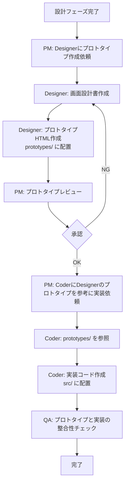
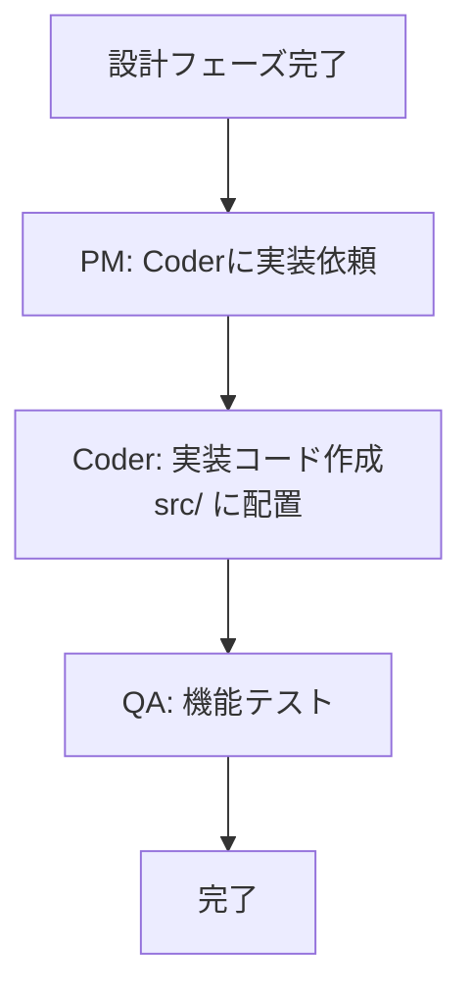

# 2.4.0.1 Designer連携フロー

## 📋 概要

**目的**: UI/UXが重要なプロジェクトにおいて、Designer と Coder の連携フローを明確化し、認識齟齬を防ぐ

**背景**:
- デザインと実装の齟齬が発生すると、大幅な手戻りが発生する
- Designerが「張りぼてHTML」プロトタイプを作成することで、実装前に視覚的な確認が可能

---

## 🎯 Designer起動判断基準

### ✅ Designer を起動すべき場合

- [ ] フロントエンド実装が含まれる（Web/モバイルアプリ）
- [ ] ユーザーインターフェースが重要（toC向けサービス、管理画面等）
- [ ] デザインの一貫性が求められる（企業ブランディング、公的機関サイト等）
- [ ] ステークホルダーへのプロトタイプ提示が必要

### ❌ Designer を起動不要な場合

- [ ] バックエンドAPIのみ
- [ ] CLIツール
- [ ] バッチ処理
- [ ] インフラ構築のみ

---

## 🔄 実装フローの2パターン

### パターン1: UI/UXが重要な場合（Designer使用）



### パターン2: UI/UXが不要な場合（Designer skip）



---

## 📁 成果物の配置場所と役割分担

### Designer の責務

**✅ できること**:
- 静的な張りぼてHTML/CSS作成（Tailwind CSS + daisyUI推奨）
- デザインシステム定義（カラー、タイポグラフィ、コンポーネント）
- ユーザビリティ検証
- アクセシビリティ対応（WCAG 2.1 AA準拠）

**❌ できないこと**:
- 実装コード（`src/`）の作成
- ロジック、状態管理、API連携の実装
- データベース設計

**成果物配置場所**:
```
prototypes/
├── README.md              # プロトタイプの使い方
├── index.html             # ダッシュボード
├── users-list.html        # ユーザー一覧
├── user-detail.html       # ユーザー詳細
└── user-edit.html         # ユーザー編集
```

### Coder の責務

**✅ できること**:
- Designerのプロトタイプを**参考に**実装
- React/Vue/Svelte等のコンポーネント化
- 状態管理、API連携、バリデーション
- ユニットテスト、統合テスト

**⚠️ 注意すること**:
- `prototypes/` は参考にするが、**直接編集しない**
- デザインの変更が必要な場合は、PMを通じてDesignerに依頼

**成果物配置場所**:
```
src/
├── components/
│   ├── UserList.tsx        # prototypes/users-list.html を参考に実装
│   ├── UserDetail.tsx      # prototypes/user-detail.html を参考に実装
│   └── UserEdit.tsx        # prototypes/user-edit.html を参考に実装
├── services/
└── utils/
```

---

## 👥 PM の役割

### 1. Designer起動判断

プロジェクトの性質に応じて、Designer を起動するか判断する。

**判断例**:
```markdown
【プロジェクト】新潟市介護サブシステム（管理画面）

【判断】Designer を起動する

【理由】
- 公的機関のシステムのためアクセシビリティが重要
- 利用者が高齢者介護施設職員のため、UIの分かりやすさが重要
- 複数の画面（ユーザー管理、施設管理、設定）があるため、デザインの一貫性が必要
```

### 2. Designer への依頼

**依頼内容のテンプレート**:
```markdown
Designer へ:

【タスク】UI/UXプロトタイプ作成

【入力情報】
- 要件定義書: docs/02_要件定義/要件定義書.md
- 画面一覧: [画面一覧表へのリンク]
- ユーザーストーリー: [ユーザーストーリーへのリンク]
- ブランドガイドライン: [あれば]

【期待する成果物】
1. prototypes/ に静的HTML（Tailwind CSS + daisyUI使用）
2. デザインシステム定義（.claude/docs/40_standards/41_app/uiux.md に準拠）
3. 画面設計書（画面遷移図、ワイヤーフレーム）

【デザイン方針】
- アクセシビリティ: WCAG 2.1 AA準拠
- レスポンシブ対応: モバイル、タブレット、デスクトップ
- ブラウザ対応: Chrome, Firefox, Safari, Edge
```

### 3. プロトタイプレビュー

Designer から提出されたプロトタイプをレビューする。

**レビュー観点**:
- [ ] 要件定義の画面一覧と整合しているか
- [ ] デザインの一貫性があるか
- [ ] アクセシビリティ基準（WCAG 2.1 AA）を満たしているか
- [ ] ユーザビリティ（操作のしやすさ）に問題ないか

### 4. Coder への依頼

**依頼内容のテンプレート**:
```markdown
Coder へ:

【タスク】フロントエンド実装

【入力情報】
- 基本設計書: docs/03_基本設計/
- プロトタイプHTML: prototypes/
- 技術標準: .claude/docs/40_standards/41_app/

【重要な注意事項】
1. ✅ prototypes/ を**参考に**実装（直接編集しない）
2. ✅ React/Vue/Svelte等でコンポーネント化
3. ✅ デザインの変更が必要な場合は、PMを通じてDesignerに依頼
4. ✅ 技術標準（.claude/docs/40_standards/41_app/）に準拠

【期待する成果物】
1. src/ に実装コード
2. tests/ にテストコード
3. README.md に実装説明
```

### 5. レビュープロセス強化

**設計書レビュー時のチェックリスト**（Architect提出時）:
- [ ] 技術標準（`.claude/docs/40_standards/`）との整合性確認
- [ ] ディレクトリ構成が明記されているか
- [ ] 環境差分管理の方針が明確か
- [ ] デプロイ再現性が担保される設計か
- [ ] CloudFormation/Terraform使用時: templates/, parameters/ の構成が明記されているか

**プロトタイプレビュー時のチェックリスト**（Designer提出時）:
- [ ] prototypes/ に配置されているか（src/ ではない）
- [ ] デザイン標準（.claude/docs/40_standards/41_app/uiux.md）に準拠しているか
- [ ] アクセシビリティ基準を満たしているか

**実装レビュー時のチェックリスト**（Coder提出時）:
- [ ] src/ に配置されているか（prototypes/ を直接編集していない）
- [ ] プロトタイプと実装に大きな乖離がないか
- [ ] 技術標準（.claude/docs/40_standards/41_app/）に準拠しているか

---

## 🚨 よくある問題と対策

### 問題1: Designer が実装コード（src/）を作成してしまう

**原因**: Designer の責務範囲が不明確

**対策**:
- Designer AGENT.md に「できないこと」を明記
- 成果物は prototypes/ のみと明記
- PM が依頼時に明確に指示

### 問題2: Coder が prototypes/ を直接編集してしまう

**原因**: Coder の責務範囲が不明確

**対策**:
- Coder AGENT.md に「prototypes/ は参考のみ、直接編集しない」を明記
- デザイン変更が必要な場合は PM 経由で Designer に依頼するフローを明記

### 問題3: プロトタイプと実装に大きな乖離が発生

**原因**: Coder がプロトタイプを無視して独自実装

**対策**:
- QA フェーズで「プロトタイプと実装の整合性チェック」を追加
- PM レビュー時に視覚的な確認を実施

---

## 📊 Designer連携のメリット

### ✅ 設計フェーズでの可視化

- ステークホルダーへの提示が容易（静的HTMLをブラウザで開くだけ）
- 要件の抜け漏れを早期発見

### ✅ 実装フェーズでの認識統一

- Coder が「どう実装すべきか」が明確
- デザインと実装の齟齬が減少

### ✅ テストフェーズでの品質向上

- プロトタイプと実装を比較することで、視覚的なテストが可能

---

## 🔗 関連ドキュメント

- [Designer AGENT.md](../../agents/designer/AGENT.md)
- [Coder AGENT.md](../../agents/coder/AGENT.md)
- [UIUX技術標準](../40_standards/41_app/uiux.md)

---

**作成日**: 2025-11-09
**対象フェーズ**: 実装フェーズ
**対象エージェント**: PM, Designer, Coder, QA
