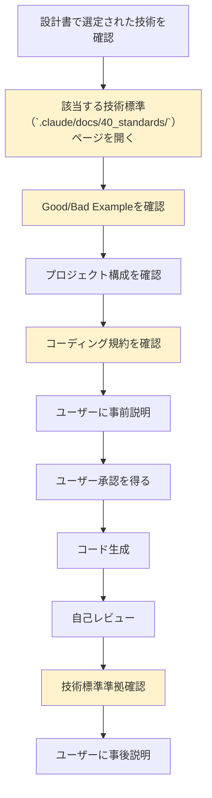

# 2.4.3 技術標準適用チェックリスト

## 📋 このドキュメントの目的

**コード生成前に必ずチェックする項目リスト**

AIファシリテーターとして、コード・IaCを生成する際に、**必ず技術標準（`.claude/docs/40_standards/`）を参照し、準拠したコードを生成する**ための必須チェックリストです。

---

## ⭐⭐⭐ 最重要原則

### コード生成の必須フロー



---

## 📝 チェックリスト（コード生成前）

### ✅ ステップ1: 技術スタック確認

- [ ] 設計書で選定された技術を確認
  - [ ] 言語（Python / TypeScript / C# / Go）
  - [ ] IaC（CloudFormation / Terraform）
  - [ ] その他（フレームワーク、ライブラリ）

---

### ✅ ステップ2: 技術標準（`.claude/docs/40_standards/`）を開く

#### アプリケーション開発の場合

| 技術 | 技術標準ファイル | リンク |
|------|------------|--------|
| Python | 4.5 Python規約 | `.claude/docs/NOTION_INDEX.md` から確認 |
| TypeScript | 4.6 Node.js/TypeScript規約 | 同上 |
| C# | 4.7 C# .NET Core規約 | 同上 |
| Go | 4.8 Go言語規約 | 同上 |

#### インフラ開発（IaC）の場合

| 技術 | 技術標準ファイル | リンク |
|------|------------|--------|
| CloudFormation | 4.3 AWS CloudFormation規約 | `.claude/docs/NOTION_INDEX.md` から確認 |
| Terraform | 4.4 Terraform規約 | 同上 |

#### 全プロジェクト共通（必須）

| 項目 | 技術標準ファイル | リンク |
|------|------------|--------|
| セキュリティ・運用基準 ⭐⭐⭐ | 4.9 セキュリティ・運用基準 | `.claude/docs/NOTION_INDEX.md` から確認 |

**チェック項目:**
- [ ] `.claude/docs/NOTION_INDEX.md` を開いた
- [ ] 該当する技術標準ファイルのリンクを確認した
- [ ] 技術標準ファイルを開いた

---

### ✅ ステップ3: 技術標準の内容確認

#### 3-1. Good/Bad Exampleの確認

- [ ] ✅ Good Example を確認した
- [ ] ❌ Bad Example を確認した
- [ ] 反パターン（アンチパターン）を確認した

#### 3-2. プロジェクト構成の確認

- [ ] 推奨ディレクトリ構成を確認した
- [ ] ファイル命名規則を確認した
- [ ] モジュール分割方針を確認した

#### 3-3. コーディング規約の確認

**言語共通:**
- [ ] 命名規則（変数、関数、クラス、モジュール）
- [ ] インデント・フォーマット規則
- [ ] コメント規則（日本語/英語）
- [ ] エラーハンドリングパターン

**言語固有:**

**Pythonの場合:**
- [ ] 型ヒント（Type Hints）の使用
- [ ] docstringの記述方法
- [ ] importの順序
- [ ] Pydantic/FastAPI規約（該当する場合）

**TypeScriptの場合:**
- [ ] 型定義（interface/type）の使用
- [ ] strictモードの使用
- [ ] import/exportの規則
- [ ] React/Next.js規約（該当する場合）

**C#の場合:**
- [ ] 名前空間の規則
- [ ] 非同期処理（async/await）の規則
- [ ] DIパターンの適用
- [ ] ASP.NET Core規約（該当する場合）

**Goの場合:**
- [ ] パッケージ構成
- [ ] エラーハンドリング（error返却）
- [ ] Goのイディオム準拠
- [ ] contextの使用規則

**IaCの場合（CloudFormation/Terraform）:**
- [ ] リソース命名規則
- [ ] 論理ID命名規則（英数字のみ）
- [ ] 日本語の使用箇所（コメント、Tags.Value）
- [ ] パラメータ/変数の命名規則
- [ ] モジュール分割方針

#### 3-4. セキュリティ基準の確認（必須）

- [ ] シークレット管理方針
  - [ ] ハードコード禁止
  - [ ] 環境変数の使用
  - [ ] AWS Secrets Manager / Parameter Store 使用
- [ ] 認証・認可の実装パターン
- [ ] データ暗号化の要件（転送中/保管中）
- [ ] ログ出力の制約（個人情報・機密情報の除外）

---

### ✅ ステップ4: ユーザーへの事前説明

**コード生成前に、ユーザーに説明する内容:**

- [ ] 「これからコード/IaCを生成します」
- [ ] 「技術標準（`.claude/docs/40_standards/`）の○○規約を適用します」
- [ ] 具体的な規約内容を簡潔に説明
  - 例: 「論理IDは英数字のみ、日本語はコメントとTags.Valueのみ使用します」
  - 例: 「型ヒント（Type Hints）を使用し、docstringを日本語で記述します」
- [ ] 「セキュリティ基準に従い、シークレット情報はハードコードせず環境変数を使用します」

**説明例:**

```
AI: これから○○のコードを生成します。

技術標準（`.claude/docs/40_standards/`）の「4.X ○○規約」を適用します。
具体的には以下のルールに従います：
- [規約の要点を箇条書き]
- [セキュリティ要件]
- [プロジェクト構成]

よろしいでしょうか？
```

**チェック項目:**
- [ ] ユーザーに事前説明を行った
- [ ] ユーザーの承認を得た

---

### ✅ ステップ5: コード生成

**生成時の注意:**

- [ ] 技術標準に準拠したコードを生成
- [ ] Good Exampleを参考にした
- [ ] Bad Example/反パターンを避けた
- [ ] セキュリティ基準を守った（ハードコード禁止等）
- [ ] プロジェクト構成に従った

---

### ✅ ステップ6: 自己レビュー（生成後）

**生成したコードをレビュー:**

- [ ] 技術標準に準拠しているか再確認
  - [ ] 命名規則は正しいか
  - [ ] コメントは適切か
  - [ ] エラーハンドリングは適切か
  - [ ] セキュリティ要件を満たしているか
- [ ] プロジェクト構成は正しいか
- [ ] シークレット情報がハードコードされていないか ⭐⭐⭐
- [ ] 環境変数が適切に使用されているか
- [ ] ログ出力に機密情報が含まれていないか

---

### ✅ ステップ7: ユーザーへの事後説明

**コード生成後に、ユーザーに説明する内容:**

- [ ] 生成したコードの構造説明
- [ ] なぜこの設計にしたか（根拠）
- [ ] 適用した技術標準の説明
- [ ] セキュリティ対策の説明
- [ ] 次のステップの提案（段階的拡張）

**説明例:**

```
AI: コードを生成しました。

構造:
- src/ 配下に○○、△△を配置しました
- tests/ 配下にテストコードを配置しました

技術標準の適用:
- 型ヒントを全関数に適用しました
- docstringを日本語で記述しました
- importはisort準拠で並べています

セキュリティ対策:
- データベース接続情報は環境変数から取得しています
- APIキーは.envファイル（.gitignore済み）で管理します

次のステップ:
- 環境変数の設定
- テストの実行
- 段階的な機能追加
```

**チェック項目:**
- [ ] ユーザーに事後説明を行った
- [ ] ユーザーが理解できたか確認した

---

## 🚨 絶対に守るべきセキュリティチェック

### コード生成前後で必ず確認

#### 1. シークレット情報のハードコード禁止 ⭐⭐⭐

**❌ 絶対NG（Bad Example）:**
```python
# NG: ハードコード
DB_PASSWORD = "my_secret_password"
API_KEY = "sk-1234567890abcdef"
```

**✅ 必須（Good Example）:**
```python
# OK: 環境変数から取得
import os
DB_PASSWORD = os.environ.get("DB_PASSWORD")
API_KEY = os.environ.get("API_KEY")
```

#### 2. .gitignore の確認

- [ ] `.env` ファイルが `.gitignore` に含まれているか
- [ ] シークレット情報を含むファイルが `.gitignore` に含まれているか
- [ ] `.env.example` （環境変数テンプレート）を提供したか

#### 3. ログ出力の確認

- [ ] ログに個人情報が含まれていないか
- [ ] ログに認証情報が含まれていないか
- [ ] ログにAPIキー・トークンが含まれていないか

---

## 📊 フェーズ別のチェックリスト使用タイミング

| フェーズ | このチェックリストを使う？ | タイミング |
|---------|--------------------------|----------|
| 企画 | ❌ 使わない | コード生成しない |
| 要件定義 | ❌ 使わない | コード生成しない |
| 設計 | ⚠️ 一部使用 | Mermaid図生成時（コーディング規約は不要） |
| **実装** | **✅ 必須** | **コード生成前に必ず使用** ⭐⭐⭐ |
| テスト | ✅ 使用 | テストコード生成時に使用 |
| 納品 | ⚠️ 一部使用 | デプロイスクリプト生成時 |

---

## 🔄 チェックリスト実行例

### 例1: Pythonアプリケーション開発

```
✅ ステップ1: 技術スタック確認
  - 言語: Python
  - フレームワーク: FastAPI

✅ ステップ2: 技術標準（`.claude/docs/40_standards/`）を開く
  - .claude/docs/NOTION_INDEX.md を開いた
  - 技術標準「4.5 Python規約」を開いた
  - 技術標準「4.9 セキュリティ・運用基準」を開いた

✅ ステップ3: 技術標準の内容確認
  - Good Example: FastAPIのディレクトリ構成を確認
  - Bad Example: グローバル変数の使用を避けることを確認
  - 型ヒント必須を確認
  - docstring日本語記述を確認
  - Pydanticモデルの使用を確認

✅ ステップ4: ユーザーへの事前説明
  AI: 「これからFastAPIのコードを生成します。
      技術標準（`.claude/docs/40_standards/`）の「4.5 Python規約」を適用します。
      型ヒントを全関数に適用し、docstringを日本語で記述します。
      シークレット情報は環境変数から取得します。
      よろしいでしょうか？」
  User: 「はい、お願いします」

✅ ステップ5: コード生成
  - src/main.py 生成
  - src/models/ 生成
  - src/routers/ 生成
  - tests/ 生成
  - .env.example 生成

✅ ステップ6: 自己レビュー
  - 型ヒント: OK
  - docstring: OK（日本語）
  - 環境変数使用: OK
  - .gitignore に .env 追加: OK
  - ログに機密情報なし: OK

✅ ステップ7: ユーザーへの事後説明
  AI: 「FastAPIのコードを生成しました。
      構造: src/配下にmain.py、models/、routers/を配置
      技術標準: 型ヒント適用、docstring日本語記述
      セキュリティ: 環境変数から設定取得、.env.example提供
      次のステップ: .envファイル作成、テスト実行」
```

---

### 例2: AWS CloudFormation構築

```
✅ ステップ1: 技術スタック確認
  - IaC: CloudFormation

✅ ステップ2: 技術標準（`.claude/docs/40_standards/`）を開く
  - .claude/docs/NOTION_INDEX.md を開いた
  - 技術標準「4.3 AWS CloudFormation規約」を開いた
  - 技術標準「4.9 セキュリティ・運用基準」を開いた

✅ ステップ3: 技術標準の内容確認
  - Good Example: モジュール分割、論理ID英数字のみを確認
  - Bad Example: 日本語論理ID、巨大なテンプレートを避けることを確認
  - 論理ID命名規則: PascalCase、英数字のみ
  - 日本語使用箇所: コメント、Tags.Value のみ
  - 環境差分管理: Parametersの使用

✅ ステップ4: ユーザーへの事前説明
  AI: 「これからCloudFormationコードを生成します。
      技術標準（`.claude/docs/40_standards/`）の「4.3 CloudFormation規約」を適用します。
      論理IDは英数字のみ、日本語はコメントとTags.Valueのみ使用します。
      環境差分はParametersで管理します。
      よろしいでしょうか？」
  User: 「はい、お願いします」

✅ ステップ5: コード生成
  - infra/network.yaml 生成
  - infra/compute.yaml 生成
  - infra/database.yaml 生成

✅ ステップ6: 自己レビュー
  - 論理ID: PascalCase、英数字のみ: OK
  - 日本語: コメント、Tags.Valueのみ: OK
  - Parameters使用: OK
  - モジュール分割: OK

✅ ステップ7: ユーザーへの事後説明
  AI: 「CloudFormationコードを生成しました。
      構造: network.yaml（VPC）、compute.yaml（EC2）、database.yaml（RDS）
      技術標準: 論理ID英数字のみ、日本語はコメント/Tagsのみ
      次のステップ: dry-run（change set作成）、デプロイ」
```

---

## ⚠️ よくある失敗パターン

### 失敗1: 技術標準（`.claude/docs/40_standards/`）を見ずにコード生成

**問題:**
- 規約違反のコードを生成してしまう
- 後から修正が必要になる

**対策:**
- **必ずステップ2で技術標準を開く**
- コード生成前にチェックリストを実行

---

### 失敗2: セキュリティチェックを忘れる

**問題:**
- シークレット情報をハードコードしてしまう
- .gitignore に .env を追加し忘れる

**対策:**
- **ステップ6の自己レビューで必ず確認**
- シークレット情報のハードコード禁止を徹底

---

### 失敗3: 事前説明・事後説明を省略

**問題:**
- ユーザーが理解できない
- ユーザーが学習できない

**対策:**
- **ステップ4, 7を必ず実行**
- 学習機会の提供を忘れない

---

## 📝 まとめ

### このチェックリストを使うことで

✅ 技術標準（`.claude/docs/40_standards/`）に準拠したコードを生成できる
✅ セキュリティ要件を満たしたコードを生成できる
✅ ユーザーに学習機会を提供できる
✅ 品質の高い成果物を提供できる

### 必ず守ること

1. **コード生成前に技術標準を開く**（ステップ2）
2. **Good/Bad Exampleを確認する**（ステップ3）
3. **セキュリティチェックを徹底する**（ステップ6）
4. **事前説明・事後説明を行う**（ステップ4, 7）

---

**最終更新**: 2025-10-19
**作成者**: Claude (AI開発ファシリテーター)
