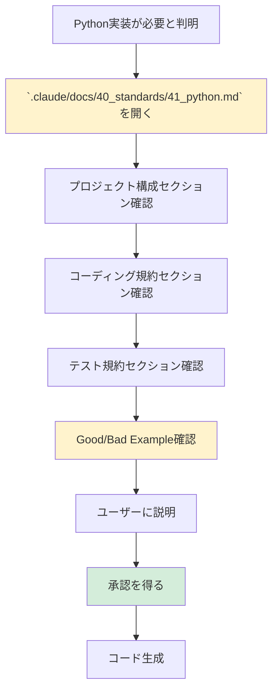

# 2.4.5.1.1 Python技術標準参照手順

## 目的

Python実装前に `.claude/docs/40_standards/41_python.md` を参照し、技術標準に準拠したコード生成を行います。

---

## 📚 参照手順フロー



---

## ✅ 確認すべきセクション

### 1. プロジェクト構成（必須） ⭐⭐⭐

`.claude/docs/40_standards/41_python.md` の「プロジェクト構成」セクションを確認：

```markdown
src/
├── __init__.py
├── main.py
├── api/
│   ├── __init__.py
│   ├── routes.py
│   └── dependencies.py
├── models/
│   ├── __init__.py
│   └── user.py
├── services/
│   ├── __init__.py
│   └── user_service.py
└── utils/
    ├── __init__.py
    └── logger.py

tests/
├── __init__.py
├── test_api/
│   └── test_routes.py
└── test_services/
    └── test_user_service.py
```

**確認ポイント**:
- ✅ `src/` ディレクトリにアプリケーションコード
- ✅ `tests/` ディレクトリにテストコード
- ✅ 各ディレクトリに `__init__.py` を配置
- ✅ 層別設計（api, models, services, utils）

---

### 2. コーディング規約（必須） ⭐⭐⭐

`.claude/docs/40_standards/41_python.md` の「コーディング規約」セクションを確認：

**確認ポイント**:
- ✅ 型ヒント（Type Hints）の使用
- ✅ docstring の記述方法（Google Style）
- ✅ 命名規則（snake_case, PascalCase）
- ✅ エラーハンドリングパターン
- ✅ ログ出力パターン

---

### 3. テスト規約（必須） ⭐⭐⭐

`.claude/docs/40_standards/41_python.md` の「テスト規約」セクションを確認：

**確認ポイント**:
- ✅ pytest の使用
- ✅ テストファイルの命名規則（`test_*.py`）
- ✅ モッキング（`unittest.mock`）
- ✅ テストカバレッジ目標（80%以上）

---

### 4. Good/Bad Example確認（重要） ⭐⭐

`.claude/docs/40_standards/41_python.md` の「Good/Bad Example」セクションを確認：

**確認ポイント**:
- ✅ よくある間違いパターンを把握
- ✅ 推奨パターンを把握
- ✅ 同じ間違いを繰り返さない

---

## 🗣️ ユーザーへの説明テンプレート

コード生成前に、以下のようにユーザーに説明してください：

```
これからPythonで○○を実装します。

【プロジェクト構成】
`.claude/docs/40_standards/41_python.md` に準拠して、以下の構成で実装します：
- src/api/ - APIエンドポイント
- src/services/ - ビジネスロジック
- src/models/ - データモデル
- tests/ - テストコード

【コーディング規約】
- 型ヒント（Type Hints）を全関数に適用
- docstring（Google Style）を記述
- エラーハンドリングは try-except + カスタム例外

【テスト】
- pytest を使用
- カバレッジ80%以上を目標

この方針で実装してよろしいでしょうか？
```

---

## ❌ Bad Example: 技術標準を参照せずに実装

```python
# ❌ 型ヒントなし
def get_user(user_id):
    return db.query(user_id)

# ❌ docstringなし
# ❌ エラーハンドリングなし
```

**問題点**:
- 技術標準に準拠していない
- 型が不明
- エラー時の挙動が不明

---

## ✅ Good Example: 技術標準に準拠して実装

```python
from typing import Optional
from src.models.user import User
from src.utils.exceptions import UserNotFoundError

def get_user(user_id: int) -> Optional[User]:
    """
    ユーザーIDからユーザー情報を取得する。

    Args:
        user_id (int): ユーザーID

    Returns:
        Optional[User]: ユーザー情報。存在しない場合はNone

    Raises:
        UserNotFoundError: ユーザーが見つからない場合
    """
    try:
        user = db.query(User).filter(User.id == user_id).first()
        if user is None:
            raise UserNotFoundError(f"User {user_id} not found")
        return user
    except Exception as e:
        logger.error(f"Failed to get user {user_id}: {e}")
        raise
```

**改善点**:
- ✅ 型ヒント（`int`, `Optional[User]`）
- ✅ docstring（Google Style）
- ✅ カスタム例外（`UserNotFoundError`）
- ✅ ログ出力
- ✅ エラーハンドリング

---

## 🔄 継続的な参照

実装中も随時 `.claude/docs/40_standards/41_python.md` を参照：

1. **新しいパターンが必要になった時**
   - 例: 非同期処理、データベース接続、外部API連携
   - 技術標準にパターンがあるか確認

2. **コードレビュー時**
   - 技術標準に準拠しているか確認
   - Good/Bad Example と照らし合わせ

3. **ユーザーからの質問時**
   - 技術標準を根拠に説明

---

**作成日**: 2025-10-19
**対象フェーズ**: 実装
**重要度**: ⭐⭐⭐ 必須
