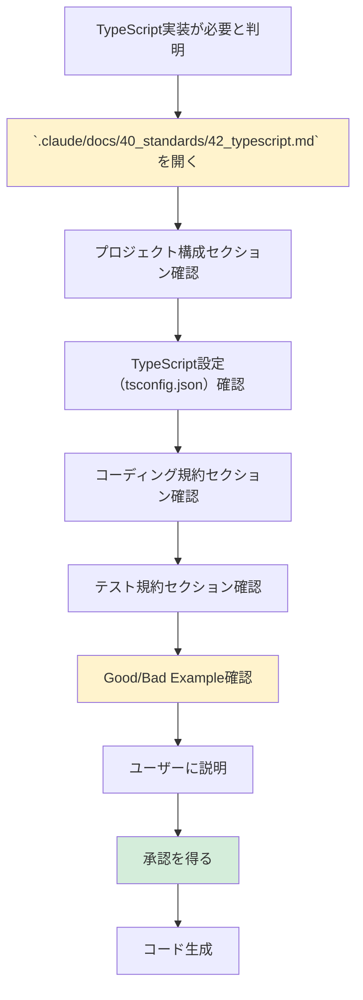

# 2.4.5.2.1 TypeScript技術標準参照手順

## 目的

TypeScript実装前に `.claude/docs/40_standards/42_typescript.md` を参照し、技術標準に準拠したコード生成を行います。

---

## 📚 参照手順フロー



---

## ✅ 確認すべきセクション

### 1. プロジェクト構成（必須） ⭐⭐⭐

`.claude/docs/40_standards/42_typescript.md` の「プロジェクト構成」セクションを確認：

```markdown
src/
├── index.ts
├── api/
│   ├── routes.ts
│   └── middleware.ts
├── models/
│   ├── user.ts
│   └── product.ts
├── services/
│   ├── userService.ts
│   └── productService.ts
└── utils/
    ├── logger.ts
    └── validators.ts

tests/
├── api/
│   └── routes.test.ts
└── services/
    └── userService.test.ts
```

**確認ポイント**:
- ✅ `src/` ディレクトリにアプリケーションコード
- ✅ `tests/` ディレクトリにテストコード
- ✅ 層別設計（api, models, services, utils）

---

### 2. tsconfig.json設定（必須） ⭐⭐⭐

`.claude/docs/40_standards/42_typescript.md` の「tsconfig.json」セクションを確認：

**確認ポイント**:
- ✅ `strict: true` の使用
- ✅ `esModuleInterop: true`
- ✅ `skipLibCheck: true`
- ✅ `moduleResolution: "node"`

---

### 3. コーディング規約（必須） ⭐⭐⭐

`.claude/docs/40_standards/42_typescript.md` の「コーディング規約」セクションを確認：

**確認ポイント**:
- ✅ 型定義（interface, type）の使用
- ✅ 非同期処理（async/await）
- ✅ エラーハンドリング（try-catch）
- ✅ 命名規則（camelCase, PascalCase）

---

### 4. テスト規約（必須） ⭐⭐⭐

`.claude/docs/40_standards/42_typescript.md` の「テスト規約」セクションを確認：

**確認ポイント**:
- ✅ Jest の使用
- ✅ テストファイルの命名規則（`*.test.ts`）
- ✅ モッキング（`jest.mock`）
- ✅ テストカバレッジ目標（80%以上）

---

### 5. Good/Bad Example確認（重要） ⭐⭐

`.claude/docs/40_standards/42_typescript.md` の「Good/Bad Example」セクションを確認：

**確認ポイント**:
- ✅ よくある間違いパターンを把握
- ✅ 推奨パターンを把握
- ✅ 同じ間違いを繰り返さない

---

## 🗣️ ユーザーへの説明テンプレート

コード生成前に、以下のようにユーザーに説明してください：

```
これからTypeScriptで○○を実装します。

【プロジェクト構成】
`.claude/docs/40_standards/42_typescript.md` に準拠して、以下の構成で実装します：
- src/api/ - APIエンドポイント（Express/Fastify）
- src/services/ - ビジネスロジック
- src/models/ - データモデル（型定義）
- tests/ - テストコード（Jest）

【TypeScript設定】
- tsconfig.json: strict モード有効
- ESLint + Prettier で静的解析・フォーマット

【コーディング規約】
- interface/type による型定義
- async/await による非同期処理
- try-catch によるエラーハンドリング

【テスト】
- Jest を使用
- カバレッジ80%以上を目標

この方針で実装してよろしいでしょうか？
```

---

## ❌ Bad Example: 技術標準を参照せずに実装

```typescript
// ❌ 型定義なし
function getUser(userId) {
  return db.query(userId);
}

// ❌ any型を使用
function processData(data: any): any {
  return data;
}
```

**問題点**:
- 技術標準に準拠していない
- 型が不明（型安全性なし）
- エラー時の挙動が不明

---

## ✅ Good Example: 技術標準に準拠して実装

```typescript
interface User {
  id: number;
  name: string;
  email: string;
}

async function getUser(userId: number): Promise<User | null> {
  /**
   * ユーザーIDからユーザー情報を取得する。
   *
   * @param userId - ユーザーID
   * @returns ユーザー情報。存在しない場合はnull
   * @throws DatabaseError - データベースエラーの場合
   */
  try {
    const user = await db.query<User>('SELECT * FROM users WHERE id = $1', [userId]);
    return user || null;
  } catch (error) {
    logger.error(`Failed to get user ${userId}:`, error);
    throw new DatabaseError(`Failed to get user ${userId}`);
  }
}
```

**改善点**:
- ✅ interface による型定義
- ✅ Promise型の戻り値
- ✅ JSDocコメント
- ✅ カスタムエラー
- ✅ エラーハンドリング

---

## 🔄 継続的な参照

実装中も随時 `.claude/docs/40_standards/42_typescript.md` を参照：

1. **新しいパターンが必要になった時**
   - 例: GraphQL、WebSocket、認証処理
   - 技術標準にパターンがあるか確認

2. **コードレビュー時**
   - 技術標準に準拠しているか確認
   - Good/Bad Example と照らし合わせ

3. **ユーザーからの質問時**
   - 技術標準を根拠に説明

---

**作成日**: 2025-10-19
**対象フェーズ**: 実装
**重要度**: ⭐⭐⭐ 必須
