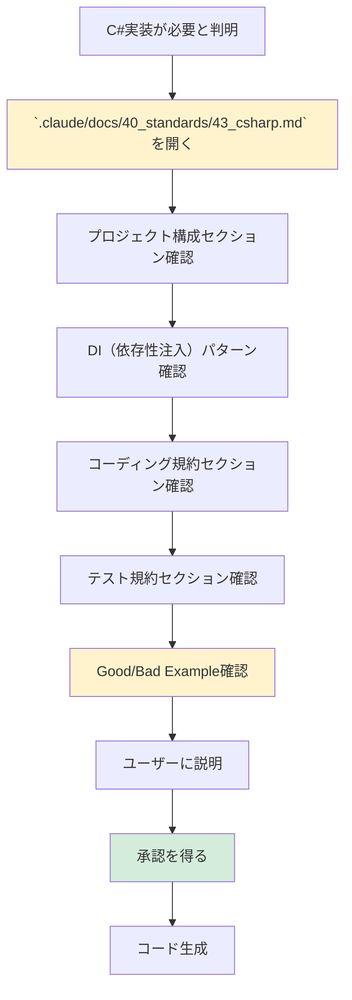

# 2.4.5.3.1 C#技術標準参照手順

## 目的

C# .NET Core実装前に `.claude/docs/40_standards/43_csharp.md` を参照し、技術標準に準拠したコード生成を行います。

---

## 📚 参照手順フロー



---

## ✅ 確認すべきセクション

### 1. プロジェクト構成（必須） ⭐⭐⭐

`.claude/docs/40_standards/43_csharp.md` の「プロジェクト構成」セクションを確認：

```
Solution/
├── src/
│   ├── MyApp.API/           # Web API層
│   ├── MyApp.Application/   # アプリケーション層
│   ├── MyApp.Domain/        # ドメイン層
│   └── MyApp.Infrastructure/  # インフラ層
└── tests/
    ├── MyApp.UnitTests/
    └── MyApp.IntegrationTests/
```

**確認ポイント**:
- ✅ 層別設計（API, Application, Domain, Infrastructure）
- ✅ Clean Architecture / Onion Architecture

---

### 2. DI（依存性注入）パターン（必須） ⭐⭐⭐

`.claude/docs/40_standards/43_csharp.md` の「DI」セクションを確認：

**確認ポイント**:
- ✅ コンストラクタインジェクション
- ✅ `IServiceCollection` での登録
- ✅ インターフェース駆動設計

---

### 3. コーディング規約（必須） ⭐⭐⭐

`.claude/docs/40_standards/43_csharp.md` の「コーディング規約」セクションを確認：

**確認ポイント**:
- ✅ PascalCase（クラス、メソッド、プロパティ）
- ✅ camelCase（ローカル変数、パラメータ）
- ✅ `async/await` による非同期処理
- ✅ 例外処理（try-catch）

---

### 4. テスト規約（必須） ⭐⭐⭐

`.claude/docs/40_standards/43_csharp.md` の「テスト規約」セクションを確認：

**確認ポイント**:
- ✅ xUnit の使用
- ✅ Moq によるモッキング
- ✅ テストカバレッジ目標（80%以上）

---

## 🗣️ ユーザーへの説明テンプレート

コード生成前に、以下のようにユーザーに説明してください：

```
これからC# .NET Coreで○○を実装します。

【プロジェクト構成】
`.claude/docs/40_standards/43_csharp.md` に準拠して、以下の構成で実装します：
- MyApp.API - Web API層（Controllers）
- MyApp.Application - アプリケーション層（Use Cases）
- MyApp.Domain - ドメイン層（エンティティ、インターフェース）
- MyApp.Infrastructure - インフラ層（DB、外部API）

【設計パターン】
- DI（依存性注入）を使用
- Clean Architecture / Onion Architecture

【テスト】
- xUnit + Moq を使用
- カバレッジ80%以上を目標

この方針で実装してよろしいでしょうか？
```

---

**作成日**: 2025-10-19
**対象フェーズ**: 実装
**重要度**: ⭐⭐⭐ 必須
