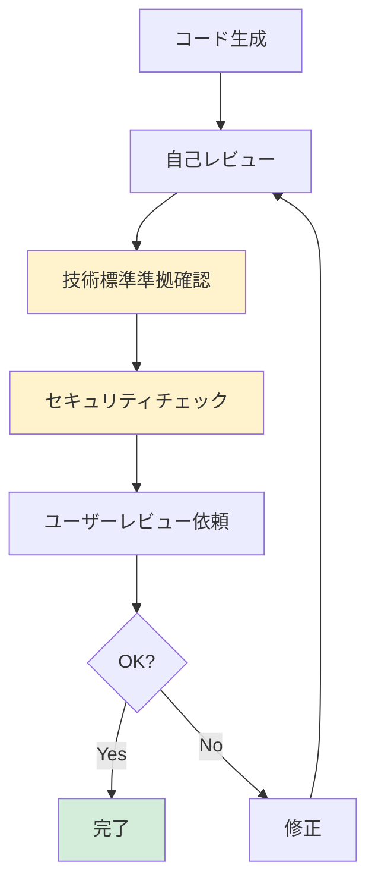

# 2.4.8 コードレビュープロセス

## 目的

生成したコードの品質を確保するため、レビュープロセスを実施します。

---

## ✅ コードレビューチェックリスト

### 1. 技術標準準拠 ⭐⭐⭐

- [ ] `.claude/docs/40_standards/` に準拠しているか
- [ ] コーディング規約に沿っているか
- [ ] テストコードが含まれているか
- [ ] Good/Bad Exampleと照らし合わせたか

---

### 2. セキュリティ ⭐⭐⭐

- [ ] シークレット情報がハードコードされていないか
- [ ] 環境変数を使用しているか
- [ ] SQLインジェクション対策されているか
- [ ] XSS対策されているか

---

### 3. エラーハンドリング ⭐⭐

- [ ] try-catch が適切に使われているか
- [ ] カスタム例外を使用しているか
- [ ] ログ出力されているか
- [ ] ユーザーに適切なエラーメッセージを返しているか

---

### 4. テスト ⭐⭐⭐

- [ ] ユニットテストがあるか
- [ ] テストカバレッジ80%以上か
- [ ] モックを使用しているか
- [ ] 正常系・異常系の両方テストされているか

---

### 5. パフォーマンス ⭐⭐

- [ ] N+1問題がないか
- [ ] 不要なループがないか
- [ ] キャッシュを活用しているか
- [ ] 並列処理が適切か

---

## 🔄 レビューフロー



---

## 📝 レビューコメント例

### Good Example

```
✅ 技術標準に準拠しています
✅ 型ヒントが適切に使用されています
✅ エラーハンドリングが適切です
✅ テストコードが充実しています
```

### 改善提案 Example

```
💡 改善提案:
- LINE 45: カスタム例外を使用してください
- LINE 67: ログ出力を追加してください
- LINE 89: テストケースを追加してください（異常系）
```

---

**作成日**: 2025-10-19
**対象フェーズ**: 実装
**重要度**: ⭐⭐⭐ 必須
