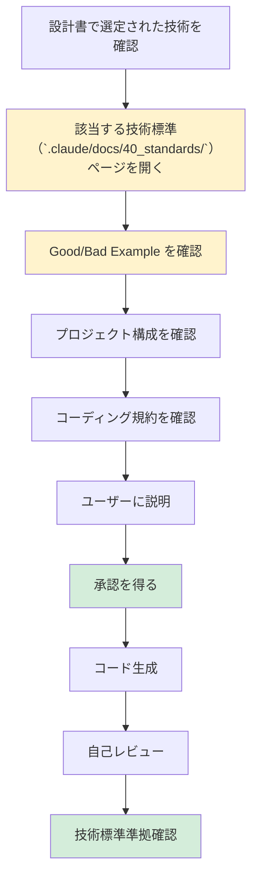

# 2.4 実装フェーズ - ファイルインデックス（v2改訂版）

## 📁 ディレクトリ構成

```
2.4_実装フェーズ/
├── 2.4.0_事前調査.md ⭐⭐⭐新規追加（AI自律実行）
├── 2.4.1_フェーズ概要.md
├── 2.4.2_コード生成前の説明プロセス.md
├── 2.4.3_技術標準適用チェックリスト.md ⭐⭐⭐最重要
├── 2.4.4_ディレクトリ構成パターン.md
├── 2.4.5_言語別コーディング規約適用/ ⭐⭐最重要（階層化）
│   ├── 2.4.5.1_Python規約適用/
│   │   ├── 2.4.5.1.1_技術標準参照手順.md
│   │   ├── 2.4.5.1.2_プロジェクト構成適用.md
│   │   ├── 2.4.5.1.3_型ヒント適用チェックリスト.md
│   │   ├── 2.4.5.1.4_エラーハンドリングパターン適用.md
│   │   ├── 2.4.5.1.5_テストコード生成（pytest）.md
│   │   └── 2.4.5.1.6_Good_Bad_Example集.md
│   ├── 2.4.5.2_TypeScript規約適用/
│   │   ├── 2.4.5.2.1_技術標準参照手順.md
│   │   ├── 2.4.5.2.2_プロジェクト構成適用.md
│   │   ├── 2.4.5.2.3_tsconfig.json設定.md
│   │   ├── 2.4.5.2.4_非同期処理パターン適用.md
│   │   ├── 2.4.5.2.5_テストコード生成（Jest）.md
│   │   └── 2.4.5.2.6_Good_Bad_Example集.md
│   ├── 2.4.5.3_C#規約適用/
│   │   ├── 2.4.5.3.1_技術標準参照手順.md
│   │   ├── 2.4.5.3.2_プロジェクト構成適用（層別設計）.md
│   │   ├── 2.4.5.3.3_DI適用チェックリスト.md
│   │   ├── 2.4.5.3.4_例外処理パターン適用.md
│   │   ├── 2.4.5.3.5_テストコード生成（xUnit）.md
│   │   └── 2.4.5.3.6_Good_Bad_Example集.md
│   └── 2.4.5.4_Go規約適用/
│       ├── 2.4.5.4.1_技術標準参照手順.md
│       ├── 2.4.5.4.2_プロジェクト構成適用.md
│       ├── 2.4.5.4.3_エラーハンドリング適用チェックリスト.md
│       ├── 2.4.5.4.4_並列処理パターン適用.md
│       ├── 2.4.5.4.5_テストコード生成（testing+testify）.md
│       └── 2.4.5.4.6_Good_Bad_Example集.md
├── 2.4.6_IaC構築プロセス/ ⭐⭐最重要（階層化）
│   ├── 2.4.6.1_CloudFormation構築/
│   │   ├── 2.4.6.1.1_技術標準参照手順.md
│   │   ├── 2.4.6.1.2_スタック設計パターン選定.md
│   │   ├── 2.4.6.1.3_Well-Architected_Framework適用.md
│   │   ├── 2.4.6.1.4_Change_Sets運用フロー.md
│   │   ├── 2.4.6.1.5_dry-run必須手順.md
│   │   └── 2.4.6.1.6_Good_Bad_Example集.md
│   └── 2.4.6.2_Terraform構築/
│       ├── 2.4.6.2.1_技術標準参照手順.md
│       ├── 2.4.6.2.2_モジュール設計パターン適用.md
│       ├── 2.4.6.2.3_State管理設定（S3+DynamoDB）.md
│       ├── 2.4.6.2.4_terraform_plan必須手順.md
│       ├── 2.4.6.2.5_ワークスペース管理.md
│       └── 2.4.6.2.6_Good_Bad_Example集.md
├── 2.4.7_シークレット管理実装.md ⭐重要
├── 2.4.8_コードレビュープロセス.md
├── 2.4.9_製造物_実装コード構成.md
├── 2.4.10_製造物_IaC構成.md
├── 2.4.11_フェーズ完了基準.md
└── 2.4.12_次フェーズへの引継ぎ事項.md
```

**ファイル数**: 45ファイル（事前調査を含む）

---

## 🎯 実装フェーズの最重要原則

### 🚨 絶対に守るべきこと

1. **技術標準（`.claude/docs/40_standards/`）を必ず参照してからコード生成** ⭐⭐⭐
2. **コード生成前にユーザーに説明・承認を得る**
3. **シークレット情報は絶対にハードコードしない**
4. **本番環境への直接操作は禁止（dry-run必須）**

---

## 📋 主要ファイルの概要

### 2.4.1_フェーズ概要.md
- **内容**:
  - 実装フェーズの目的
  - インプット（基本設計書、詳細設計書、技術選定結果）
  - アウトプット（実装コード、IaC、テストコード）
  - 主要活動
  - **技術標準（`.claude/docs/40_standards/`）参照: 必須** ⭐⭐⭐

---

### 2.4.2_コード生成前の説明プロセス.md
- **目的**: コード生成前にユーザーに説明する標準手順
- **内容**:
  - **説明すべき内容**
    - これから生成するコードの概要
    - 技術選定の理由
    - ディレクトリ構成
    - 技術標準（`.claude/docs/40_standards/`）のどの部分を適用するか
  - **説明のタイミング**: コード生成の直前
  - **ユーザーの理解度確認**: 質問を受け付け、承認を得る

---

### 2.4.3_技術標準適用チェックリスト.md ⭐⭐⭐**最重要**
- **目的**: コード生成前に必ずチェックする項目
- **内容**:
  - **必須チェック項目**
    - ✅ 技術標準（`.claude/docs/40_standards/`）の該当ページを開いたか
    - ✅ Good Example を確認したか
    - ✅ Bad Example を確認したか
    - ✅ プロジェクト構成を確認したか
    - ✅ コーディング規約を確認したか
    - ✅ テスト規約を確認したか
  - **言語別チェックリスト**
    - Python: ``.claude/docs/40_standards/41_python.md` Python規約` を確認
    - TypeScript: ``.claude/docs/40_standards/42_typescript.md` TypeScript規約` を確認
    - C#: ``.claude/docs/40_standards/43_csharp.md` C# .NET Core規約` を確認
    - Go: ``.claude/docs/40_standards/44_go.md` Go言語規約` を確認
  - **IaC チェックリスト**
    - CloudFormation: ``.claude/docs/40_standards/45_cloudformation.md` CloudFormation規約` を確認
    - Terraform: ``.claude/docs/40_standards/46_terraform.md` Terraform規約` を確認
  - **セキュリティチェックリスト**
    - ``.claude/docs/40_standards/49_security.md` セキュリティ・運用基準` を確認 ⭐必須

---

### 2.4.4_ディレクトリ構成パターン.md
- **内容**:
  - 言語別のディレクトリ構成
  - アプリケーションコードの配置
  - IaCコードの配置（`infra/`, `terraform/`, `cloudformation/`）
  - テストコードの配置
  - 設定ファイルの配置
  - **技術標準参照**: 各言語規約のプロジェクト構成セクション

---

## 🐍 2.4.5_言語別コーディング規約適用/ （階層化）

### 2.4.5.1_Python規約適用/

#### 2.4.5.1.1_技術標準参照手順.md
- **内容**:
  - ``.claude/docs/40_standards/41_python.md` Python規約` を開く手順
  - ページのどのセクションを確認するか
  - 確認すべきGood/Bad Example
  - 参照後のチェックリスト

#### 2.4.5.1.2_プロジェクト構成適用.md
- **内容**:
  - Pythonプロジェクトの標準ディレクトリ構成
  - `src/`, `tests/`, `pyproject.toml`, `requirements.txt` の配置
  - 技術標準に準拠した構成例
  - Good/Bad Example

#### 2.4.5.1.3_型ヒント適用チェックリスト.md
- **内容**:
  - ✅ 関数の引数・戻り値に型ヒント
  - ✅ クラス属性に型ヒント
  - ✅ Optional/Union/List/Dictの適切な使用
  - ✅ mypy による型チェック
  - 技術標準の該当セクション参照
  - Good/Bad Example

#### 2.4.5.1.4_エラーハンドリングパターン適用.md
- **内容**:
  - カスタム例外クラスの作成
  - try-except の適切な使用
  - ログ出力パターン
  - 技術標準の該当セクション参照
  - Good/Bad Example

#### 2.4.5.1.5_テストコード生成（pytest）.md
- **内容**:
  - pytest の基本パターン
  - モッキング（unittest.mock）
  - テストカバレッジ測定（pytest-cov）
  - 技術標準のテストセクション参照
  - Good/Bad Example

#### 2.4.5.1.6_Good_Bad_Example集.md
- **内容**:
  - 技術標準から抜粋したGood/Bad Exampleの一覧
  - よくある間違いパターン
  - 推奨パターン

---

### 2.4.5.2_TypeScript規約適用/
- **構成**: Python規約適用と同様（6ファイル）
- **技術標準参照**: `4.6 Node.js/TypeScript規約`
- **重点**: tsconfig.json設定、非同期処理パターン、Jest

---

### 2.4.5.3_C#規約適用/
- **構成**: Python規約適用と同様（6ファイル）
- **技術標準参照**: `4.7 C# .NET Core規約`
- **重点**: DI（依存性注入）、層別設計、xUnit

---

### 2.4.5.4_Go規約適用/
- **構成**: Python規約適用と同様（6ファイル）
- **技術標準参照**: `4.8 Go言語規約`
- **重点**: エラーハンドリング、並列処理、testing+testify

---

## ☁️ 2.4.6_IaC構築プロセス/ （階層化）

### 2.4.6.1_CloudFormation構築/

#### 2.4.6.1.1_技術標準参照手順.md
- **内容**:
  - ``.claude/docs/40_standards/45_cloudformation.md` CloudFormation規約` を開く手順
  - ページのどのセクションを確認するか
  - 確認すべきGood/Bad Example

#### 2.4.6.1.2_スタック設計パターン選定.md
- **内容**:
  - 層別設計（VPC/Network, Compute, Database）
  - ライフサイクル別設計
  - マイクロサービス別設計
  - 技術標準のスタック設計セクション参照
  - Good/Bad Example

#### 2.4.6.1.3_Well-Architected_Framework適用.md
- **内容**:
  - 6つの柱（運用の優秀性、セキュリティ、信頼性、パフォーマンス効率、コスト最適化、持続可能性）
  - 各柱のチェックリスト
  - 技術標準の該当セクション参照

#### 2.4.6.1.4_Change_Sets運用フロー.md
- **内容**:
  - Change Sets 作成手順
  - Change Sets レビュー手順
  - Change Sets 実行手順
  - ロールバック手順
  - 技術標準の運用フローセクション参照
  - Good/Bad Example

#### 2.4.6.1.5_dry-run必須手順.md ⭐**重要**
- **内容**:
  - Change Sets による事前確認の必須化
  - 本番環境への直接操作禁止
  - 承認プロセス
  - 技術標準のセキュリティセクション参照

#### 2.4.6.1.6_Good_Bad_Example集.md
- **内容**:
  - 技術標準から抜粋したGood/Bad Exampleの一覧
  - よくある間違いパターン
  - 推奨パターン

---

### 2.4.6.2_Terraform構築/
- **構成**: CloudFormation構築と同様（6ファイル）
- **技術標準参照**: `4.4 Terraform規約`
- **重点**: モジュール設計、State管理（S3+DynamoDB）、terraform plan必須

---

## 🔐 2.4.7_シークレット管理実装.md ⭐**重要**
- **目的**: シークレット情報の安全な管理方法
- **内容**:
  - **技術標準参照**: `4.9 セキュリティ・運用基準`
  - **シークレット管理パターン**
    - AWS Secrets Manager 使用パターン
    - Systems Manager Parameter Store 使用パターン
    - 環境変数の使用パターン
  - **禁止事項**
    - ❌ コード内ハードコード
    - ❌ .env ファイルのコミット
    - ❌ 平文での保存
  - Good/Bad Example

---

## 📝 2.4.8_コードレビュープロセス.md
- **内容**:
  - 自己レビューチェックリスト
  - 技術標準（`.claude/docs/40_standards/`）との整合性確認
  - ユーザーレビューのタイミング
  - レビュー指摘への対応

---

## 📦 2.4.9_製造物_実装コード構成.md
- **内容**:
  - ソースコードの配置（`src/`）
  - テストコードの配置（`tests/`）
  - 設定ファイルの配置（プロジェクトルート）
  - README.md の記述内容
  - .gitignore の設定

---

## ☁️ 2.4.10_製造物_IaC構成.md
- **内容**:
  - CloudFormation テンプレートの配置（`infra/cloudformation/`）
  - Terraform モジュールの配置（`infra/terraform/`）
  - 環境別設定の配置（`dev/`, `stg/`, `prd/`）
  - IaC用 README.md の記述内容

---

## ✅ 2.4.11_フェーズ完了基準.md
- **内容**:
  - **必須完了条件**
    - ✅ 技術標準（`.claude/docs/40_standards/`）に準拠している ⭐必須
    - ✅ コードレビュー完了
    - ✅ テストコード生成完了
    - ✅ シークレット管理が適切に実装されている
    - ✅ dry-run/plan で問題なし
  - ユーザー承認の取得方法

---

## 🔄 2.4.12_次フェーズへの引継ぎ事項.md
- **内容**:
  - 引き継ぐべき情報リスト
  - テスト環境の準備状況
  - テストデータの準備状況
  - 既知の制限事項

---

## 🚨 コード生成前の必須フロー



---

**実装フェーズ完了後 → 2.5 テストフェーズへ**
