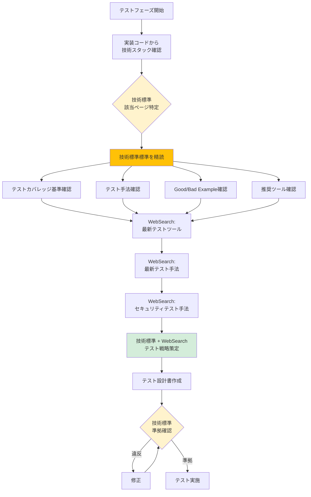

# 2.5.0 事前調査（テストフェーズ）

## 📋 このドキュメントの目的

テストフェーズ開始前に、**技術標準テスト標準を参照**し、最新のテスト手法・ツールを調査することで、高品質なテスト設計・実施を実現する。

**重要:** 実装フェーズで作成したコードに対して、**どうテストするか**を技術標準に基づいて確認する。

---

## ⭐⭐⭐ 技術標準の参照（最重要）

### テスト設計前に必ず参照すべき技術標準ファイル

テストフェーズでは、**テスト設計前に必ず技術標準（`.claude/docs/40_standards/`）を参照**する。

#### 全プロジェクト共通

1. **セキュリティ・運用基準**
   - `4.9 セキュリティ・運用基準` ⭐⭐⭐必須
   - セキュリティテスト項目
   - 負荷テスト基準
   - 運用監視項目

#### 言語・フレームワーク別テスト標準

**実装フェーズで使用した技術に応じて参照:**

1. **Python プロジェクト**
   - `4.5 Python規約` - テストセクション
   - pytest パターン、テストカバレッジ基準
   - モック・フィクスチャのベストプラクティス

2. **Node.js/TypeScript プロジェクト**
   - `4.6 Node.js/TypeScript規約` - テストセクション
   - Jest パターン、テストカバレッジ基準
   - モック・スパイのベストプラクティス

3. **C# .NET Core プロジェクト**
   - `4.7 C# .NET Core規約` - テストセクション
   - xUnit パターン、テストカバレッジ基準
   - モック・フェイクのベストプラクティス

4. **Go言語プロジェクト**
   - `4.8 Go言語規約` - テストセクション
   - testing パッケージパターン
   - テーブル駆動テスト

#### インフラテスト標準

1. **AWS CloudFormation**
   - `4.3 AWS CloudFormation規約` - テストセクション
   - cfn-lint, cfn-nag によるテスト
   - スタック作成テスト

2. **Terraform**
   - `4.4 Terraform規約` - テストセクション
   - terraform validate, terraform plan
   - Terratest によるテスト

---

## 🔍 テストフェーズの事前調査フロー



---

## 📂 事前調査の項目

### 1. 技術標準の精読 ⭐⭐⭐

#### 目的
実装フェーズで作成したコードに対して、**社内テスト標準を遵守したテスト設計**を行う。

#### 調査内容

**テストカバレッジ基準:**
```
技術標準: 4.5 Python規約 の場合
→ テストカバレッジ80%以上（ユニットテスト）
→ カバレッジ測定ツール: pytest-cov

例:
pytest --cov=src --cov-report=html --cov-report=term
→ カバレッジレポート生成
```

**テスト構成:**
```
my-project/
├── src/
│   ├── app/
│   ├── domain/
│   └── infrastructure/
├── tests/
│   ├── unit/           # ユニットテスト
│   │   ├── test_domain/
│   │   └── test_services/
│   ├── integration/    # 統合テスト
│   │   └── test_api/
│   └── e2e/            # E2Eテスト
│       └── test_scenarios/
└── pytest.ini
```

**テストパターン（Good Example）:**
```python
# 技術標準: 4.5 Python規約 の Good Example

import pytest
from unittest.mock import Mock
from src.domain.services.user_service import UserService
from src.domain.models.user import User

class TestUserService:
    """ユーザーサービスのテスト"""

    @pytest.fixture
    def mock_repository(self):
        """モックリポジトリ"""
        return Mock()

    @pytest.fixture
    def user_service(self, mock_repository):
        """テスト対象サービス"""
        return UserService(user_repository=mock_repository)

    def test_create_user_success(self, user_service, mock_repository):
        """ユーザー作成成功"""
        # Arrange
        name = "田中太郎"
        email = "tanaka@example.com"
        expected_user = User(name=name, email=email)
        mock_repository.save.return_value = expected_user

        # Act
        result = user_service.create_user(name=name, email=email)

        # Assert
        assert result.name == name
        assert result.email == email
        mock_repository.save.assert_called_once()

    def test_create_user_validation_error(self, user_service):
        """ユーザー作成バリデーションエラー"""
        # Arrange
        name = ""
        email = ""

        # Act & Assert
        with pytest.raises(ValidationError) as exc_info:
            user_service.create_user(name=name, email=email)
        assert "名前とメールアドレスは必須です" in str(exc_info.value)
```

**Bad Example の確認:**
```python
# 技術標準: 4.5 Python規約 の Bad Example

def test_user():  # ❌ テスト名が不明確
    u = UserService()  # ❌ 依存性注入なし、モックなし
    r = u.create_user("田中", "tanaka@example.com")  # ❌ Arrange/Act/Assert分離なし
    assert r  # ❌ アサーションが曖昧
```

---

### 2. 最新テストツール調査（WebSearch）

#### 目的
技術標準で推奨されているテストツールの**最新バージョン**と**新機能**を確認する。

#### WebSearch クエリ例

**Python プロジェクト:**
```
検索クエリ:
- "pytest latest version 2025"
- "pytest-cov best practices 2025"
- "pytest fixtures advanced patterns"
- "Python mocking best practices 2025"
```

**Node.js/TypeScript プロジェクト:**
```
検索クエリ:
- "Jest latest version 2025"
- "Vitest vs Jest 2025"
- "TypeScript testing best practices 2025"
- "Supertest API testing 2025"
```

**E2Eテスト:**
```
検索クエリ:
- "Playwright vs Cypress 2025"
- "Playwright best practices 2025"
- "E2E testing strategies 2025"
```

**インフラテスト:**
```
検索クエリ:
- "Terratest latest version 2025"
- "AWS CloudFormation testing 2025"
- "Infrastructure testing best practices 2025"
```

#### 記録内容

調査結果を `.claude-state/research-testing-{timestamp}.md` に記録:

```markdown
# テストフェーズ事前調査 - {プロジェクト名}

**調査日**: 2025-01-27
**対象技術**: Python (FastAPI)

## 技術標準確認

**参照ページ**: 4.5 Python規約 - テストセクション

**テストカバレッジ基準**:
- ユニットテスト: 80%以上
- 測定ツール: pytest-cov

**テスト構成**:
- tests/unit/ - ユニットテスト
- tests/integration/ - 統合テスト
- tests/e2e/ - E2Eテスト

**推奨ツール**:
- pytest (テストフレームワーク)
- pytest-cov (カバレッジ)
- pytest-mock (モック)
- httpx (API テストクライアント)

## 最新ツール調査（WebSearch）

**pytest**:
- 最新版: 8.0.0 (2025-01-10リリース)
- 新機能: パフォーマンス改善、エラーメッセージ改善
- 推奨: 8.0.x

**pytest-cov**:
- 最新版: 4.1.0
- 新機能: HTML レポート改善
- 推奨: 4.1.x

**Playwright (E2Eテスト)**:
- 最新版: 1.41.0
- 新機能: Cypressより高速、TypeScript完全サポート
- 推奨: Playwrightを採用（2025年のトレンド）

## 最新テスト手法（WebSearch）

**2025年のベストプラクティス**:
- テスト駆動開発（TDD）の再評価
- Arrange-Act-Assert パターン徹底
- モック過多を避ける（実際のDBを使う統合テストも重要）
- テストピラミッド: ユニット > 統合 > E2E

**セキュリティテスト**:
- OWASP ZAP による脆弱性スキャン
- 認証・認可のテスト強化
- SQLインジェクション・XSS対策テスト

## テスト戦略

1. ユニットテスト（pytest）でカバレッジ80%以上
2. 統合テスト（pytest + TestClient）でAPI動作確認
3. E2Eテスト（Playwright）で主要シナリオ確認
4. セキュリティテスト（OWASP ZAP）で脆弱性スキャン
5. 負荷テスト（Locust）でパフォーマンス確認
```

---

### 3. 最新テスト手法調査（WebSearch）

#### 目的
2025年時点での**モダンなテスト手法**を調査し、技術標準標準と組み合わせる。

#### WebSearch クエリ例

**テスト戦略:**
```
検索クエリ:
- "Test Pyramid vs Test Trophy 2025"
- "Testing best practices 2025"
- "Shift-left testing 2025"
```

**テスト自動化:**
```
検索クエリ:
- "CI/CD testing pipeline 2025"
- "GitHub Actions testing workflow"
- "Automated testing best practices 2025"
```

**負荷テスト:**
```
検索クエリ:
- "Load testing tools 2025"
- "Locust vs k6 2025"
- "Performance testing best practices"
```

#### Good Example

```markdown
## WebSearch結果: テストピラミッド vs テストトロフィー 2025

**テストピラミッド（従来型）**:
```
     /\
    /E2E\      ← 少ない（遅い、壊れやすい）
   /------\
  /統合テスト\   ← 中程度
 /----------\
/ユニットテスト\ ← 多い（速い、安定）
```

**テストトロフィー（モダン）**:
```
     /\
    /E2E\      ← 主要シナリオのみ
   /------\
  /統合テスト\   ← 最も重要（実際の環境に近い）
 /----------\
/静的解析    \ ← TypeScript, ESLint等
```

**2025年の推奨**:
- ユニットテスト: 重要なビジネスロジックのみ
- 統合テスト: API全体の動作確認（最も重要）
- E2Eテスト: 主要シナリオのみ（ログイン→購入など）
- 静的解析: TypeScript, mypy等で型安全性確保
```

---

### 4. セキュリティテスト調査（WebSearch + `.claude/docs/40_standards/49_security.md`）

#### 目的
最新のセキュリティテスト手法を調査し、**`.claude/docs/40_standards/49_security.md` セキュリティ基準**に準拠したテストを設計する。

#### WebSearch クエリ例

```
検索クエリ:
- "OWASP ZAP API testing 2025"
- "Security testing best practices 2025"
- "OWASP Top 10 testing guide"
- "Penetration testing tools 2025"
```

#### `.claude/docs/40_standards/49_security.md` セキュリティ基準のテスト項目

**必須テスト項目:**

1. **認証・認可テスト**
   - 未認証アクセスの拒否
   - 権限外リソースアクセスの拒否
   - JWT トークン検証

2. **入力バリデーションテスト**
   - SQLインジェクション対策
   - XSS対策
   - CSRF対策

3. **データ保護テスト**
   - TLS接続確認
   - パスワードハッシュ化確認
   - センシティブデータマスキング

4. **ログ・監視テスト**
   - エラーログ記録確認
   - アクセスログ記録確認
   - 異常検知アラート確認

#### Good Example

```python
# セキュリティテスト例（pytest）

import pytest
from fastapi.testclient import TestClient
from src.main import app

client = TestClient(app)

class TestSecurity:
    """セキュリティテスト（`.claude/docs/40_standards/49_security.md`準拠）"""

    def test_unauthorized_access_rejected(self):
        """未認証アクセスは拒否される"""
        # Act
        response = client.get("/api/users")

        # Assert
        assert response.status_code == 401
        assert "Unauthorized" in response.json()["detail"]

    def test_sql_injection_prevented(self):
        """SQLインジェクション対策"""
        # Arrange
        malicious_input = "'; DROP TABLE users; --"

        # Act
        response = client.get(f"/api/search?q={malicious_input}")

        # Assert
        assert response.status_code in [200, 400]  # エラーハンドリング済み
        # データベースが破壊されていないことを確認
        users_response = client.get("/api/users", headers={"Authorization": "Bearer valid_token"})
        assert users_response.status_code == 200

    def test_xss_prevented(self):
        """XSS対策"""
        # Arrange
        malicious_input = "<script>alert('XSS')</script>"

        # Act
        response = client.post(
            "/api/comments",
            json={"text": malicious_input},
            headers={"Authorization": "Bearer valid_token"}
        )

        # Assert
        assert response.status_code == 201
        # レスポンスがエスケープされていることを確認
        assert "<script>" not in response.json()["text"]
        assert "&lt;script&gt;" in response.json()["text"]

    def test_password_hashed(self):
        """パスワードがハッシュ化されて保存される"""
        # Arrange
        password = "MySecret123"

        # Act
        response = client.post(
            "/api/users",
            json={"name": "田中太郎", "email": "tanaka@example.com", "password": password}
        )

        # Assert
        assert response.status_code == 201
        # パスワードが平文で返されないことを確認
        assert "password" not in response.json()
```

---

## 🚀 テスト設計前のチェックリスト

### 技術標準確認

- [ ] 該当する技術標準ページを特定した
- [ ] テストカバレッジ基準を確認した
- [ ] テスト構成（ディレクトリ）を確認した
- [ ] Good/Bad Exampleを確認した
- [ ] 推奨ツールを確認した
- [ ] セキュリティテスト項目（`.claude/docs/40_standards/49_security.md`）を確認した

### 最新情報調査

- [ ] 推奨テストツールの最新バージョンを調査した
- [ ] 最新テスト手法を調査した（テストピラミッド/トロフィー等）
- [ ] セキュリティテスト手法を調査した
- [ ] E2Eテストツールを調査した（Playwright/Cypress等）

### テスト戦略策定

- [ ] ユニットテスト戦略を策定した
- [ ] 統合テスト戦略を策定した
- [ ] E2Eテスト戦略を策定した
- [ ] セキュリティテスト戦略を策定した
- [ ] 負荷テスト戦略を策定した

### 調査結果記録

- [ ] `.claude-state/research-testing-{timestamp}.md` に記録した
- [ ] 技術標準準拠ポイントを明記した
- [ ] WebSearch結果を統合した
- [ ] テスト戦略を明確にした

---

## 💡 テストフェーズ事前調査のコツ

### 1. 技術標準を基盤にする

**Good:**
```
1. 技術標準を精読
2. カバレッジ基準・テスト構成を確認
3. WebSearchで最新ツール・手法を補完
```

**Bad:**
```
1. WebSearchで最新テストツールを調査
2. 技術標準を無視してテスト設計
→ カバレッジ不足、レビュー差し戻し
```

---

### 2. セキュリティテストを必ず実施

**Good:**
```
- `.claude/docs/40_standards/49_security.md` セキュリティ基準のテスト項目を網羅
- OWASP Top 10 を考慮
- 認証・認可・入力バリデーションを徹底テスト
```

**Bad:**
```
- セキュリティテストは後回し
- 正常系のテストのみ実施
→ 本番環境で脆弱性発覚
```

---

### 3. テストピラミッド/トロフィーを意識

**Good:**
```
- ユニットテスト: ビジネスロジックのみ
- 統合テスト: API全体の動作確認（最重要）
- E2Eテスト: 主要シナリオのみ
```

**Bad:**
```
- E2Eテストばかり書く
→ 遅い、壊れやすい、メンテナンスコスト高
```

---

## 📝 まとめ

### テストフェーズ事前調査の本質

**「技術標準テスト標準を基盤に、最新テスト手法を組み合わせる」**

1. **技術標準標準を最優先** - カバレッジ・セキュリティ基準遵守
2. **WebSearchで最新ツール・手法補完** - モダンなテスト
3. **セキュリティテスト必須** - `.claude/docs/40_standards/49_security.md`準拠
4. **テスト戦略を明確化** - ピラミッド/トロフィー

これにより、**高品質で信頼性の高いシステム**を保証できる。

### AIファシリテーターとしての心構え

1. **テスト設計前に必ず技術標準参照**
2. **セキュリティテストを必ず含める**
3. **カバレッジ80%以上を確保**
4. **最新テスト手法を取り入れる**
5. **ユーザーにテスト戦略を説明してから実施**

---

**最終更新**: 2025-10-19
**作成者**: Claude (AI開発ファシリテーター)
